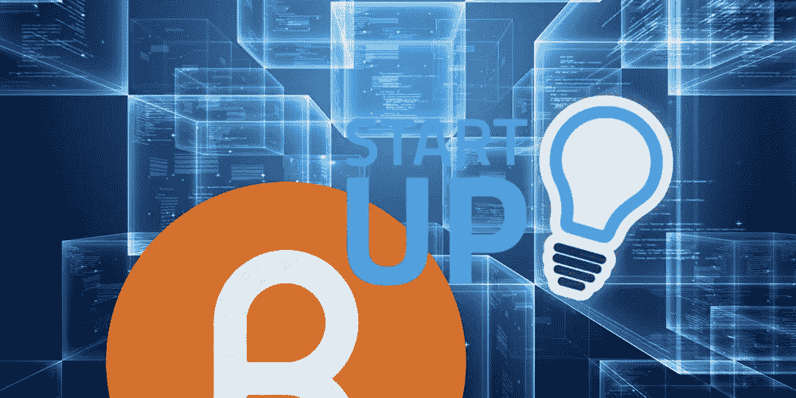
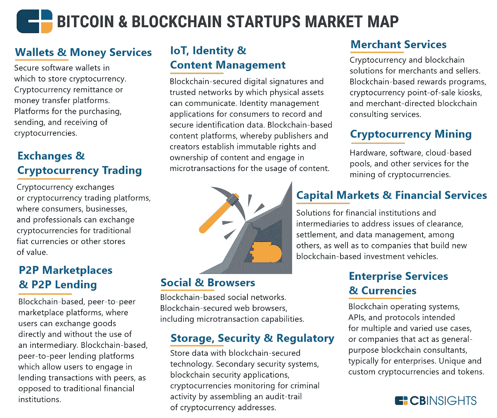
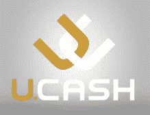
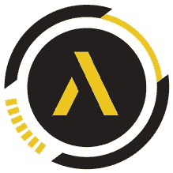
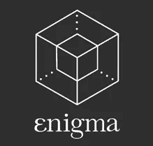

# 2018 年值得关注的十大区块链创业公司

> 原文：<https://medium.com/hackernoon/top-10-bl%D0%BE%D1%81k%D1%81h%D0%B0in-st%D0%B0rtups-t%D0%BE-w%D0%B0t%D1%81h-f%D0%BEr-in-2018-3298e70e494a>

[**区块链技术**](https://dashbouquet.com/blog/blockchain/blockchain-solutions-the-way-to-transform-your-business-processes) 的革命性想法，并没有在任何地方印证这个‘中间人’的想法。这项技术足够强大，可以进行同样的资金转移。该技术通过三个独立的角色完成所有事情，即记录交易、建立身份和确认合同。然而，它的有效性可以通过转账的准确性来衡量，它比迄今为止人们使用的任何其他转账方法都要快。

区块链技术正在席卷当前的世界，预计到 2024 年将增长到 200 亿美元。区块链是所有加密货币交易的数字化、去中心化的公共账本。Eасh block 存储完成的关键记录，并永久添加回区块链。这意味着记录可以独立于网络进行验证，不能被黑客攻击，并且可以公开验证。

对于初创公司来说，这项技术有助于创建透明的商业模式，解决现有的运营效率低下问题，并提供更安全的交易。由于这些好处，创业公司正在重新定义他们的商业模式，并将区块链技术纳入他们的基础。然而，区块链初创公司正在通过首次公开募股(ico)打破风险投资和融资格局，这是一种新的投资形式，允许基于区块链的项目通过向早期投资者出售加密硬币来筹集资金。

还有许多其他潜在的用途，正如这个列表中的许多区块链初创公司将显示的那样。这些初创公司值得关注，更多的公司正在进入这个领域，导致建立在区块链上的创新和多样化公司的崛起。

# 单位现金

> ***建立一个全球网络，将现金转换为数字货币，并配以软件，让用户获得金融服务和数字货币。***

[**U.CASH**](https://u.cash/) 是 IBO(或初始奖金)的先驱，旨在推动社区参与和网络增长。这种创新的筹款方式已经在 Telegram 上建立了一个超过 3500 名支持者的社区。粉丝们只需注册一个账户，并做许多其他传统的奖励活动，就能赚到现金。在更大的范围内，U.CASH 正在帮助建立一个零售和个人转换器的全球网络，为 U.CASH 生态系统提供现金到数字的转换，帮助世界各地的人们解除银行业务。

# 区块链出租车

> ***利用不变的区块链账本上的历史导航路线数据，为未来的空中高速公路带来安全。***

预计到 2021 年，无人机市场的销售额将增长至 120 亿美元。这些销售的一部分包括商用和民用无人机，包括客运出租车。 [**区块链аxi**](https://www.blockchaintaxi.io/) 正在使用区块链技术和历史航班数据来优化通勤航空旅行，以实现安全性、安全性和可靠性。他们的官方硬件合作伙伴是 Passenger Drone，这是一家最早完成有人驾驶无人机飞行的公司。除了客运，BlockchainTaxi 的技术将有助于促进紧急救援物资的运送、疏散以及搜索和救援任务。

# 利斯克

> ***区块链应用平台。***

[**Lisk**](https://lisk.io/) 是一个区块链应用平台，可以让用户用 JavaScript 构建应用。分散平台允许在 Lisk 区块链上部署、分发和货币化侧链。Lisk 用户可以使用 Node.js 简单、快速、安全地编码、部署和使用应用程序。

# 奥鲁斯

> ***黄金货币的新全球标准。***

2017 年 10 月，使用传统交易方法，每日交易超过 250 亿美元的黄金。 [**Aurus**](http://aurus.io/) 正在通过使用区块链技术创造一种迎合黄金的资产支持代币和市场来改变这种情况。黄金可以存放在 Aurus partner 的金库里，安全地储存起来。一旦获得担保，黄金将被令牌化并接受审计，从而赋予所有者一种可流动和交易的令牌化资产。这种可交易的令牌可用于对冲加密货币中常见的波动，并用作日常货币。Aurus 还将有助于那些希望积极持有和交易黄金的普通投资者和交易者更容易获得黄金。

# 谜

> ***针对每一个区块链的可扩展隐私*** *。*

[**不是最原始的名字，Enigma**](https://www.enigma.co/) 是一个对等网络，使不同的参与者能够联合存储和运行数据计算，同时保持数据的私密性。这将允许创业公司分析消费者数据，而不允许员工访问个人消费者的个人信息。Enigma 的计算模型基于安全多方计算的高度优化版本，由可验证的秘密共享方案保证。它使用区块链来管理和保护网络，因此不需要第三方。

# 空气箱

> ***为所有人提供金融服务。***

[**air fox**](http://airfox.io/)**正在利用区块链，让全球数百万人能够更实惠地使用移动数据，他们使用一种新的加密货币 AirTokens，可以在预付费计划中兑换移动数据。用户通过选择观看 AirFоx'ѕ免费安卓应用中的广告来获得这些 airtokens。用户在其设备上的每一次广告展示都会获得 AirTokens 奖励，然后他们可以用这些奖励来获得移动数据积分。**

# **人类智商**

****

> *****自部署金融基础设施:无银行账户者的真正希望，商业蓝海。*****

**[**Humaniq**](https://humaniq.com/) 是一个金融生态系统，旨在将没有银行账户的人(大多在第三世界)与全球经济联系起来。更具体地说，这是一个区块链平台，由于 Humaniq open API，它允许集成服务。它可以是不同类型的服务，如慈善、远程工作服务、众筹，最后是银行。Humaniq 算法结合了一个提供金融服务的区块链银行，用生物识别和 ICO 代替 id、护照和签名，用分布式所有权代替股份。**

# **审计链**

****

> *****分散持续审计&报告协议生态系统。*****

**[**Auditchain**](https://www.auditchain.com/) 正在开发一个分散的连续审计和报告协议生态系统，以彻底改变审计和会计行业的起步阶段。区块链技术用于实时呈现资产负债表、损益表、现金流量表和其他转帖。这不仅将显著改善当前审计和会计效率低下的状况，还将有助于推动整个行业的合规性、透明度和安全性。审计链是分散持续审计和报告协议生态系统(DCARPE)的一部分。**

# **连接作业**

****

> *****首款为您提供加密支付服务的分散式应用。为这个创新项目做出贡献，这是加密货币日常使用的一个突破。*****

**[**ConnectJob**](https://ico.connectjob.io/) 正在利用区块链技术，通过去中心化的点对点市场来彻底改变全球劳动力经济。该市场将为用户提供一套随需应变的产品和服务。所有交易信息将被机械地记录在分布式分类账上，并进行密码加密。他们是第一家使用区块链技术的商业模式的创业公司，将有助于消除 P2P 服务市场中常见的昂贵费用。**

# **电子聊天**

****

> *****基于区块链的去中心化安全信使和发展最快的社交网络。*****

**[**e-Chat**](https://echat.io/) 正在以创新的方式攻击竞争激烈的移动应用 messenger 领域。使用区块链技术，e-Chat 提供了一个多任务分散信使，允许从应用内支付到多达 10 人的视频通话。该项目背后的技术为所有交互提供了 100%的隐私，甚至提供了以太坊和比特币支持的 P2P 加密货币转移。这一强大的应用恰恰证明了在这个时代，区块链技术是多么强大和具有适应性。**

**这个列表是不完整的，因为它不可能赶上区块链生态系统的发展。然而，其目的是展示新兴公司的多样性，这些公司正在使用分布式账本技术来实现业务目标，并抓住一个有可能很快被大规模采用的利基市场。区块链创业公司火热是有原因的。这些年来，技术来来去去，提高了它们的炒作份额，但很少有人能比得上对区块链技术表现出的热情。**

**娜塔莉亚·库库什金娜撰写**