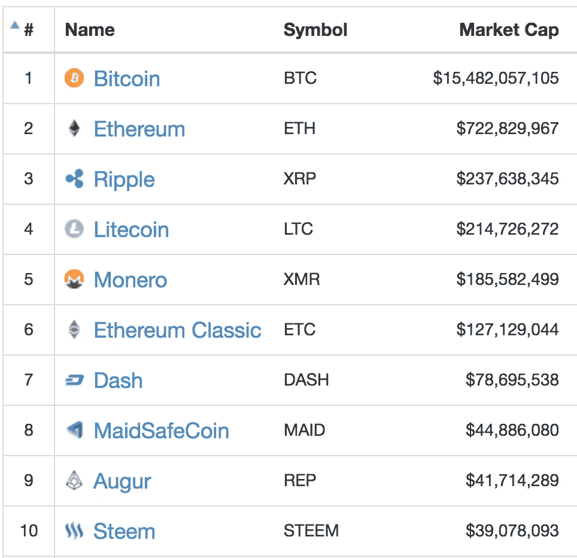
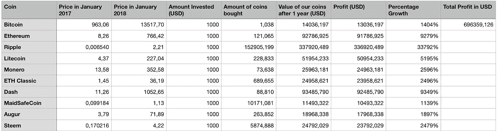
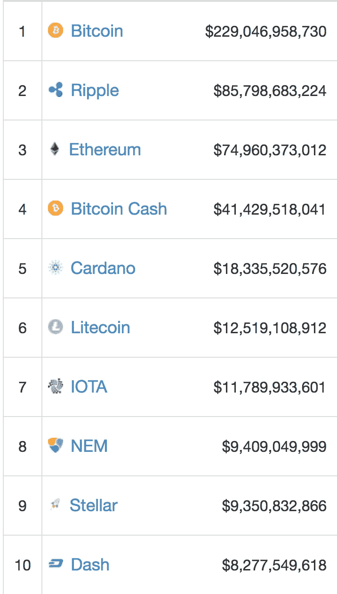
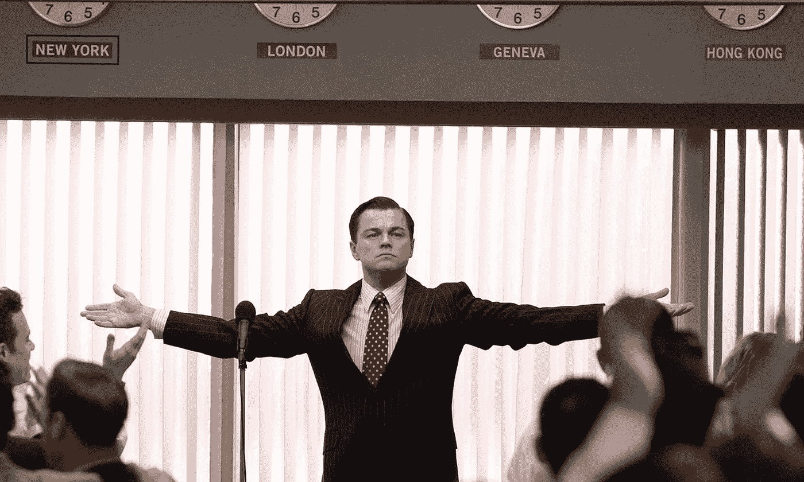
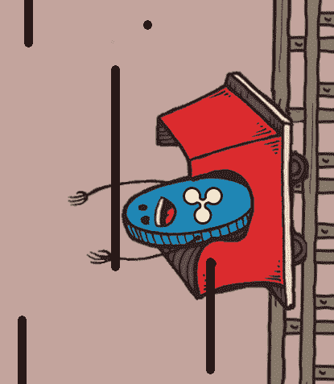
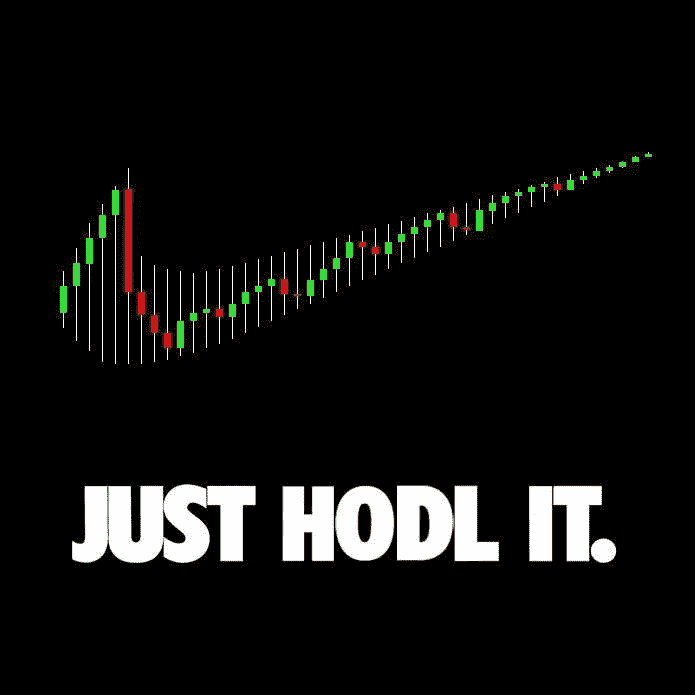

# 进入 2017 年的十大加密货币——疯狂的泡沫？

> 原文：<https://medium.com/hackernoon/top-10-cryptocurrencies-as-we-entered-2017-insane-bubble-6fec8f8133cd>

虽然我不太喜欢在谈论加密货币或区块链科技时关注金钱，但许多人对它们感兴趣主要是因为它们令人印象深刻的高收益，这通常是传统投资方法无法实现的。

假设我们在 2017 年 1 月 1 日的**将**10000 美元**投资到市值最高的 10 个硬币中(每枚 1000 美元)。很明显，我不建议在家里尝试这种策略，但是让我们看看你能得到什么样的结果。这些硬币是:**

top 10 market caps in January 2017

我们显然简化了整个操作:

*   扣除所有的转让/购买费用后，每枚硬币的价值为 1000 美元。
*   我们只关心市值——我们只购买前 10 名的硬币。
*   我们卖了( **HODL！**)今日硬币( **01/01/2018** )
*   我们不在乎硬币是在下跌还是处于历史高点，随后在 2017 年的第一天出现了修正——我们只是买了硬币，忘记了它们存在了一年。

下面你可以找到一个非常简单的电子表格，它是由 [coinmarketcap](https://coinmarketcap.com/) 提供的数据创建的。

这个策略奏效了。如你所见，利润简直是疯狂的。从我们最初的 10000 美元投资中，仅仅一年后我们就获得了 696359 美元。这意味着我们的 YOLO 投资组合给了我们大约 7000%的惊人回报。

英寸只是。一个。年！！！

这是泡沫吗？也许吧。市场会崩盘吗？也许吧(如果你知道日期，请在评论中告诉我们)。

当然，随着时间的推移，我们购买的一些硬币被踢出了前 10 名，它们都有起有落。到今天为止，我们购买的 10 个硬币中只有 5 个仍在市值最高的 10 个硬币中(比特币、Ripple、以太坊、莱特币和 Dash)。

Market caps as of 01/01/2018

一年前第 10 枚硬币的市值略高于 3900 万美元。今天，这一数字已超过 80 亿美元。这显示了自那以来有多少新资金进入了加密货币市场。

The Wolf of Wall Street

但是我们的硬币呢？哪一个被证明是最好的投资？

reddit.com/r/ripple /u/h4ckluserr

我们的赢家是[Ripple(XRP)](https://ripple.com/)——市值增长了 330 多倍，给了我们几乎一半的利润。在过去的几周里，XRP 的价值已经从不到 1 美元上升到超过 2 美元。
荣誉提及:[以太坊](https://www.ethereum.org/)(数值几乎增加了 93 倍)[破折号](https://www.dash.org/)(数值增加了 93.5 倍)。

我们投资组合中表现最差的硬币是 [MaidSafeCoin](https://maidsafe.net/) (价值增加了约 11 倍…唷！)和… [比特币](https://bitcoin.org/en/)(价值增长 14 倍)。然而，一年前，比特币本身的价格接近 1000 美元——它无法像其他硬币那样大幅升值。

我们的投资没有一项是亏损的。

2017 年对于加密货币来说确实是疯狂的一年。类似于上述的结果现在可能是不可能的，但也可能被超越。我们明年会检查。

HODL 是正确的选择吗？

遗憾的是，这只是一种假设的情况。然而，看到这些数字，我并不惊讶许多人将加密货币视为金融泡沫。

会爆吗？截至目前，我们只能猜测。