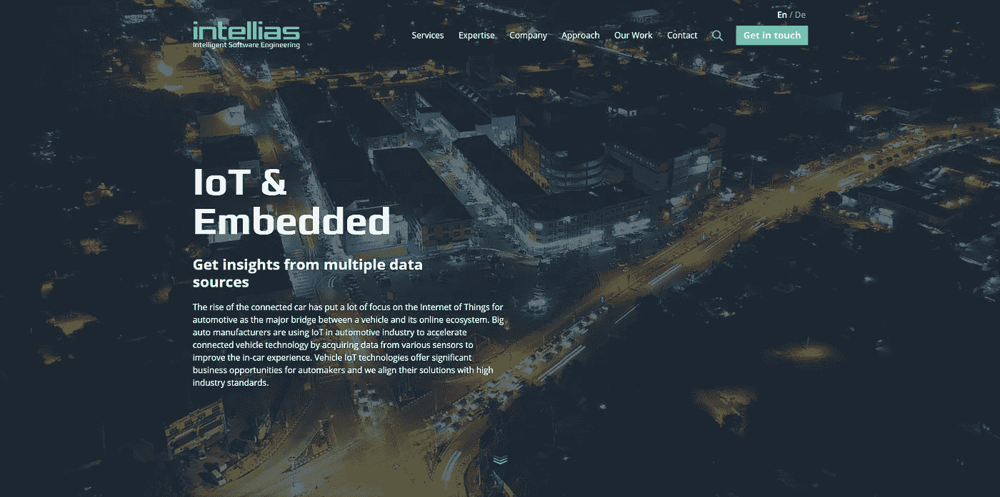
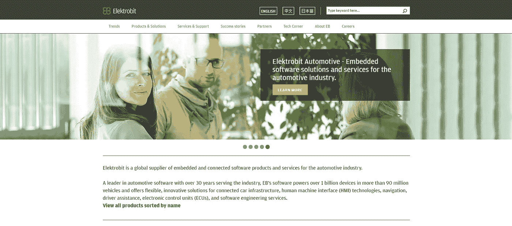
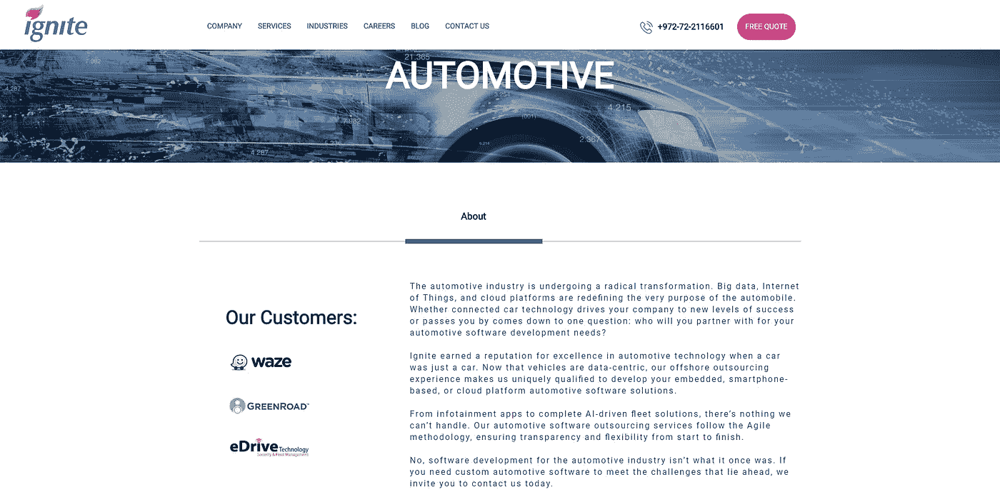
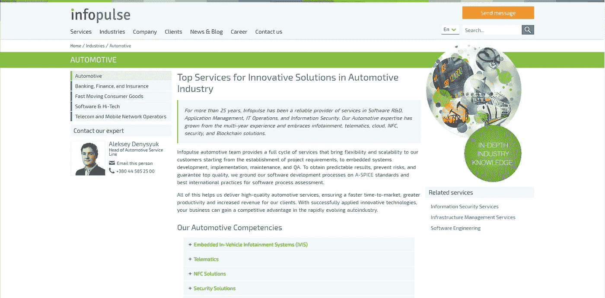
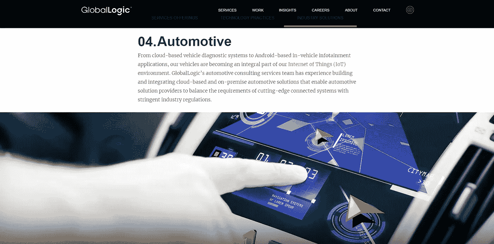
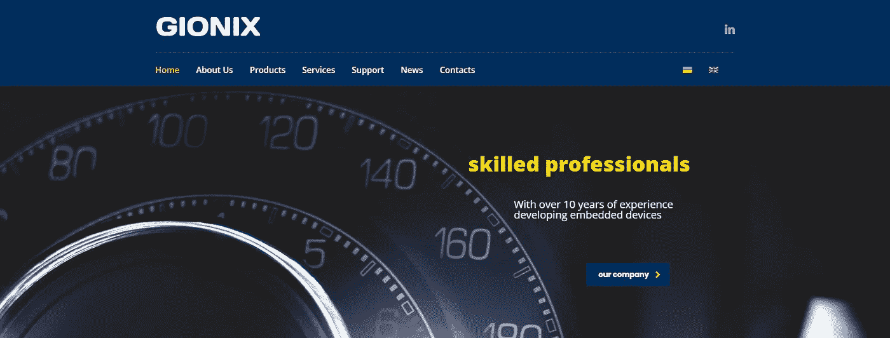
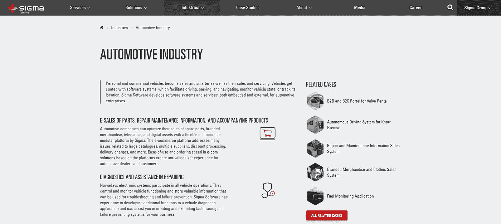
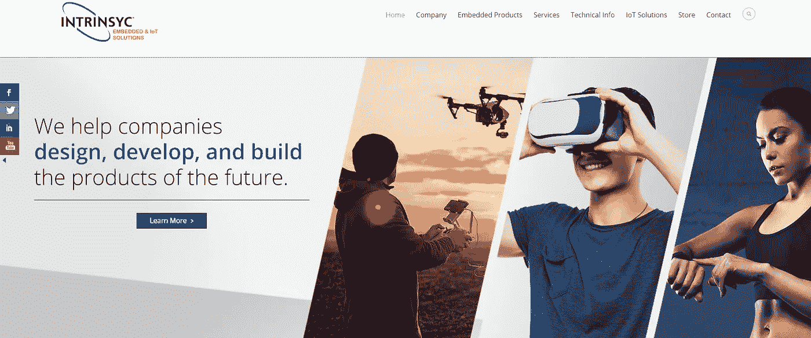
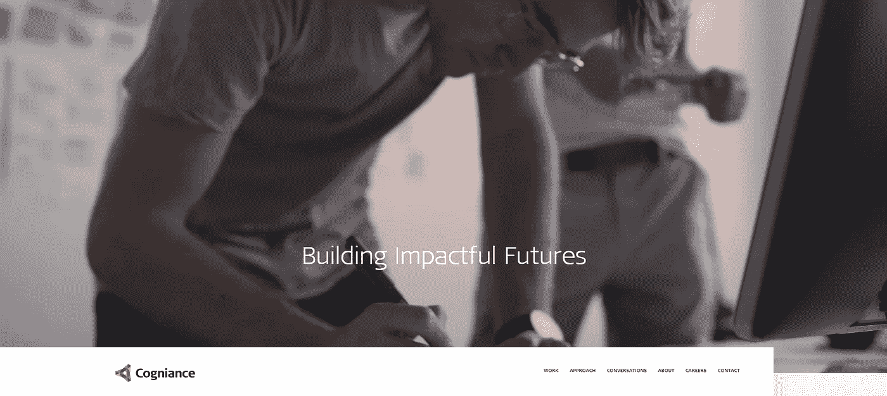
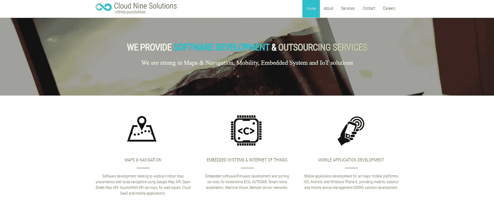

# 汽车行业十大嵌入式软件外包公司

> 原文：<https://medium.com/hackernoon/top-10-embedded-software-outsourcing-companies-for-automotive-1c609b25057c>

汽车工业在过去十年经历了显著的变化。自动驾驶技术、汽车互联和乘车共享是塑造行业未来的主要趋势。

今天，汽车本身正在成为一种商品，而软件将汽车区分开来。物联网和嵌入式解决方案已经成为汽车连接和汽车行业的自然组成部分。原始设备制造商(OEM)、一级供应商和汽车行业顶级嵌入式软件外包公司之间的合作是释放市场未来潜力的关键。

大公司和原始设备制造商一直在寻找能够以最佳方式满足其嵌入式编程解决方案需求的外包合作伙伴。以下是 2018 年排名靠前的 IT 外包公司名单。

# **1。智能系统**

https://www.intellias.com/

**地点:**柏林(德国)；利沃夫、基辅和敖德萨(乌克兰)

**成立于:** 2002 年

公司规模: 1300 人

Intellias 的客户来自欧洲和北美，因其汽车物联网和嵌入式系统专业知识以及建立和管理能够解决最复杂技术挑战的世界级工程团队的能力，赢得了乌克兰外包公司的广泛认可。

快速提升、完美的文化匹配、高生产率和高质量是 Intellias 经营的特点。2017 年，Intellias 被 Inc. 5000 评为欧洲发展最快的私营公司之一。Intellias 还被列入全球外包 100 强名单。

**服务:** Intellias 在开发数据驱动的物联网软件解决方案方面拥有深厚的专业知识，这些解决方案可增强全自动化技术和汽车连接。它们提供复杂的服务，使汽车和相关行业的企业能够从收集实时环境数据中受益，同时保持固件不断无线更新。

此外，Intellias 使用 V2V、V2I 和 V2C 软件提供能耗控制解决方案和车对车通信服务。

**主要客户:**西门子、微软、诺基亚、罗氏、RTL 集团、Playbuzz、EveryMatrix、BrainStorm、Alphary、AdsWizz

# 2.伊莱比特

[https://www.elektrobit.com/](https://www.elektrobit.com/)

**地点:**德国埃尔兰根

**成立于:** 1985 年

伊莱比特专注于复杂的汽车软件开发服务和硬件解决方案，同时也开发无线技术。该公司的核心竞争力包括汽车级软件、无线技术和软件架构。伊莱比特汽车业务部门提供广泛的标准软件产品以及支持车载软件开发整个生命周期的专业工具。

**服务**:伊莱比特提供复杂的功能安全咨询，包括基于 IEC 61508、ISO 26262 和 SPICE 的差距分析；关于实现硬件/软件分离的战略的软件咨询；和精益软件开发，包括基于敏捷合作模型的解决方案。

**主要客户:**福特、大众、奥迪、戴姆勒、大陆、德尔福

# 3.燃烧

[https://igniteoutsourcing.com/](https://igniteoutsourcing.com/)

**地点:**内坦亚(以色列)

**成立:** 2006 年

**公司规模:**301–500 人

以色列-乌克兰公司 Ignite 为汽车、金融科技、媒体和娱乐行业提供定制软件开发解决方案。该公司使用敏捷方法并依靠位于东欧的一批开发人员，将复杂的项目变得生动起来。Ignite 拥有广泛的产品组合，包括大数据、物联网和云平台。

服务:Ignite 构建的产品从信息娱乐应用到完整的人工智能驱动的车队解决方案。敏捷方法、透明度和灵活性是该公司商业模式的核心。

**主要客户:**华泽、绿道、eDrive 科技

# 4.信息脉冲

[https://www.infopulse.com/](https://www.infopulse.com/)

**地点:**基辅(乌克兰)

**成立于:** 1991 年

公司规模:1001–5000 人

凭借超过 26 年的 IT 经验，Infopulse 已成为东欧领先的软件开发商之一。如今，该公司业务遍及全球，在汽车、金融科技、消费品、电信和移动网络领域开展了广泛的项目。Infopulse 有八个国际办事处，与来自 20 多个国家的客户合作。

服务: Infopulse 负责软件研发、应用管理、IT 运营和信息安全。该公司主要以其信息娱乐、远程信息处理、云、NFC、安全和区块链解决方案而闻名。

**主要客户:**环礁控股公司、微软乌克兰公司、Audials AG

# 5.全球逻辑

[https://www.globallogic.com/](https://www.globallogic.com/)

**地点:**圣何塞(加州)；基辅、利沃夫、哈尔科夫和米克莱夫(乌克兰)

**成立:** 1991 年

**公司规模:**10001 人以上

GlobalLogic 凭借芯片到云软件工程专业知识和垂直行业经验，提供全生命周期产品开发服务。通过整合设计、复杂工程和敏捷交付能力，GlobalLogic 为电信、汽车、医疗保健、技术、媒体和娱乐、制造和半导体行业的客户开发卓越的业务解决方案。

**服务:** GlobalLogic 在提供虚拟化和连接服务、资产管理、远程操作、远程信息数据服务、车载信息娱乐(IVI)系统以及汽车和驾驶辅助系统方面拥有丰富的经验。

**主要客户:**甲骨文、斯普林特、思科

# 6.吉奥尼克斯

[https://www.gionix.com/](https://www.gionix.com/)

**地点:**扎波里日什亚(乌克兰)

**成立:** 2006 年

**公司规模:**10-50 人

凭借 10 多年为汽车行业开发嵌入式电子产品的经验，Gionix 巩固了其作为能够解决最复杂任务的公司的声誉。Gionix 的商业模式是基于提供可负担得起的解决方案，提供卓越的发动机性能、驾驶性能、可靠性和质量。

**服务:** Gionix 为汽车制造商提供完整的交钥匙解决方案，包括发动机控制单元、校准系统、车载校准服务和高级诊断软件。这家总部位于乌克兰的公司还为大型企业和小型初创企业提供广泛的咨询服务，为消费者、工业和汽车市场设计、开发和制造电子设备。

**主要客户:** ZAZ、波格丹一世、乌克兰、伊夫琴科进展

# 7.适马软件公司

[https://sigma.software/](https://sigma.software/)

地点:哈尔科夫(乌克兰)、斯德哥尔摩(瑞典)、纽约市(美国)

**成立于:** 2002 年

**公司规模:**501–1000 人

适马软件公司为许多行业提供一流的软件开发服务，包括政府、电信、媒体、广告、航空航天、汽车、游戏、银行和金融服务、房地产、旅游和娱乐。该公司主要因其在嵌入式软件开发服务方面的专业知识而得到认可，这些服务面向由连续创业者和原始设备制造商领导的技术初创公司。

**服务:**适马软件公司为维修和维护、现场服务、紧急引导和视觉导航提供复杂的增强和虚拟现实解决方案。此外，该公司使用 OpenCar、Android Auto、OpenXC 和 QNX 平台提供车载信息娱乐服务。

**主要客户:**沃尔沃、北欧航空、斯堪尼亚、克诺尔

# 8.Intrinsyc

【https://www.intrinsyc.com/ 

**地点:**加拿大温哥华

**成立于:** 1992 年

**公司规模:**51–200 人

Intrinsyc 是一家上市产品开发公司，专注于高质量的嵌入式系统编程和物联网解决方案。他们将生产就绪型计算引擎与无与伦比的产品开发专业知识相结合，以确保嵌入式和物联网产品的快速商业化。Intrinsyc Open-Q System on Modules(SOM)和单板计算机(SBC)采用了业界最先进的处理器技术，将与世界领先原始设备制造商共同开发的一些最大胆的概念变为现实。

**服务:** Intrinsyc 提供一系列嵌入式产品，包括单板计算机、开发套件、系统级模块和垂直开发平台。除了产品开发服务，该公司还提供复杂的软件、硬件和机械工程服务。

**主要客户:**波音、福特、塞拉无线、约翰迪尔

# 9.认知

[https://cogniance.com/](https://cogniance.com/)

**地点:**桑尼维尔(加利福尼亚州)

**成立:** 2008 年

公司规模:251-500 人

自 2008 年成立以来，Cogniance 已迅速成为国际公认的商业领域复杂软件解决方案开发商，包括数据科学、汽车、消费电子和物联网。认知专注于物联网和嵌入式编程解决方案。未来五年，他们计划花费 60 亿美元开发物联网解决方案。

**服务:**cognition 软件设计者在 M2M 和 M2C 的连接中为大型设备制造商和小型创业公司提供专业知识和 IT 外包服务；云、移动和嵌入式系统；以及机器学习和基于人工智能的技术。

**主要客户:**麦哲伦、威卢克斯、Xtime、CloudMade、Fetch Robotics

# 10.云 9 解决方案

【https://www.cloud9-solutions.com/ 

**地点:**越南胡志明市

**成立日期:** 2015 年

**公司规模:**51–150 人

Cloud9 Solutions 是亚洲发展最快的汽车公司嵌入式软件外包提供商之一。他们专注于提供最优、经济、稳健的解决方案。Cloud9 Solutions 专注于地图和导航、嵌入式系统和移动应用开发。

**服务:** Cloud9 Solutions 提供定制软件开发解决方案，主要依靠 C 编程、RTOS、事件驱动系统、MISRA-C 规则、AUTOSAR 规范和建模(UML)。

**主要客户:** M & C 控股、MBase、Arksquare

物联网已经是汽车行业必不可少的一部分。嵌入式软件和物联网解决方案带来了智能路径规划、先进的车队管理项目和前所未有的道路安全计划。与拥有强大嵌入式系统软件开发组合的近岸或离岸外包公司合作，是让您的企业在这个发展最快的市场之一成为游戏规则改变者的第一步。