# 2018 年十大 Erlang & Elixir 事件

> 原文：<https://medium.com/hackernoon/top-10-erlang-elixir-events-of-2018-969b2dc770be>

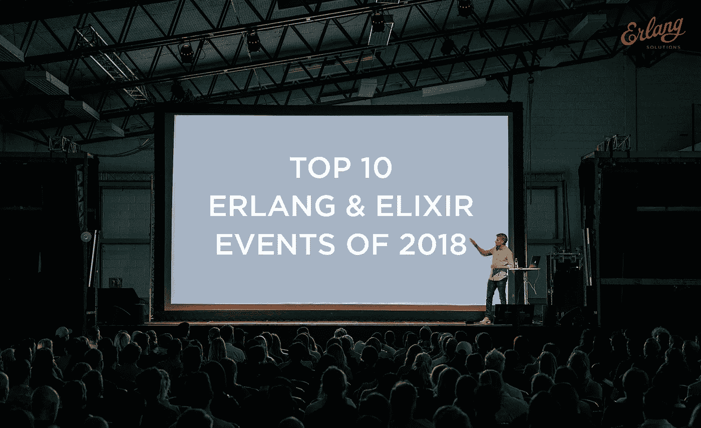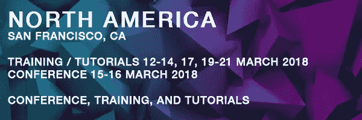

# 编码波束 SF —加利福尼亚州旧金山

今年 3 月，光束以编码光束 SF 在旧金山着陆。还记得[二郎&仙丹厂](https://www.youtube.com/playlist?list=PLWbHc_FXPo2jtviHbf3fbBRWcaGDBC2u0)吗？2018 年，我们重新思考了一些事情，并将其重新命名为 Code BEAM SF。点击了解更多关于过渡[的信息。前两个主题演讲](http://www2.erlang-solutions.com/l/23452/2017-12-06/56s5p3) [Kostis Sagonas](http://codesync.global/speaker/kostis-sagonas1/) 和 [Richard Cook](http://codesync.global/speaker/richard-cook/) 已经确定！

**您需要了解的内容
地点:**旧金山海军陆战队纪念俱乐部&酒店
**日期:**2018 年 3 月 15 日星期四—16 日星期五
**售票活动:** [早鸟票](http://www2.erlang-solutions.com/l/23452/2018-01-18/58xq75)已发售

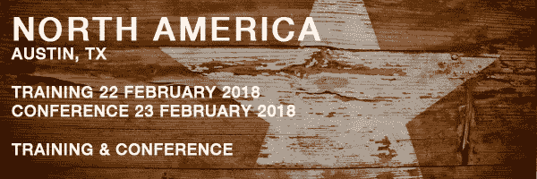

# Lonestar ElixirConf 2018 德克萨斯州奥斯汀

今年二月，长生不老药带着 Lonestar ElixirConf 来到德克萨斯州。第二年，《孤独之星》的主题演讲来自[凤凰框架](http://phoenixframework.org/)炼金术士[克里斯·麦考德](https://twitter.com/chris_mccord)、[神经](http://nerves-project.org/)核心团队成员[蒂姆·梅克莱姆](https://github.com/tmecklem)和[亚伦·帕特森](https://github.com/tenderlove)、[鲁比](https://www.ruby-lang.org/en/)核心团队成员。

**你需要知道的**
**地点:**德克萨斯州奥斯汀诺里斯会议中心
**日期:**2018 年 2 月 22 日星期四—23 日星期五
**售票活动:** [标准票](http://www2.erlang-solutions.com/l/23452/2018-01-18/58xmkp)有效期至 2 月 3 日

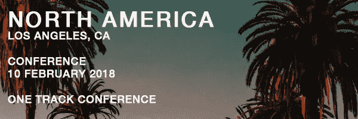

# 2018 年洛杉矶展——加利福尼亚州洛杉矶

EMPEX 是在洛杉矶举行的关于 Elixir 编程语言和生态系统的复杂会议系列。今年，EMPEX 将在洛杉矶市中心的一个娱乐场所举办一场技术讲座，包括艾玛·坎宁安和 T2·莎拉·格雷的主题演讲。

**你需要知道的事情
地点:**加州洛杉矶南希望街 1827 号 90015
**时间&日期:**太平洋标准时间 2018 年 2 月 10 日星期六
**购票活动:**获取门票[此处](https://ti.to/crevalle/empex-la-2018)

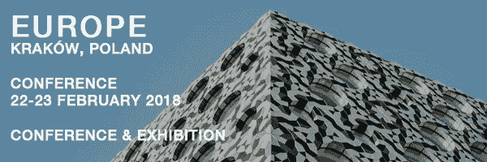

# Lambda Days —波兰克拉科夫

Lambda Days 是函数式编程世界中独一无二的体验。主题演讲 [Mary Sheeran](http://www.lambdadays.org/lambdadays2018/mary-sheeran) 和 [Philip Wadler](http://www.lambdadays.org/lambdadays2018/philip-wadler) 将与 [Heather Miller](http://www.lambdadays.org/lambdadays2018/heather-miller) 和 [José Valim](http://www.lambdadays.org/lambdadays2018/jose-valim) 一起参加今年二月的 Lambda Days，为期两天，共分六场。

**你需要知道的事情**
**地点:**礼堂最大 UJ、克拉科夫
**日期:**2018 年 2 月 22 日星期四—2 月 23 日星期五
**售票活动:** [普通票](http://bit.ly/2ge1MfZ)仍有

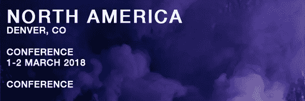

# ElixirDaze 2018 —科罗拉多州丹佛市

ElixirDaze 是一个建立 Elixir 社区的会议，提供顶级演讲和有用的黑客技术。根据新闻报道，今年的主题演讲将会是[罗布·科内瑞](https://twitter.com/robconery)和[弗雷德·赫伯特](https://twitter.com/mononcqc)

**你需要知道的事情
地点:**丹佛 20 街 1215 号奥菲利娅电动肥皂盒
**日期:**2018 年 3 月 1 日星期四—3 月 2 日星期五
**售票活动:**只剩[标准票](https://ti.to/elixirdaze/elixirdaze-2018)了！

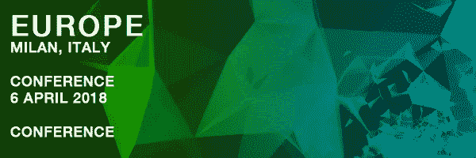

# Code BEAM Lite —意大利米兰

今年 4 月，Code BEAM Lite 在米兰举办了 Code Sync 与 [Coders51](http://www.coders51.com/) 的见面会。呼吁谈判仍然开放！本次活动将围绕工具、BEAM、框架、分发、并发和多核等主题，由 [Francesco Cesarini](https://codesync.global/speaker/francesco-cesarini/) 、 [Gabriele Santomaggio](https://codesync.global/speaker/gabriele-santomaggio/) 、 [Gianluca Randazzo](https://codesync.global/speaker/gianluca-randazzo/) 和 [Paolo Laurenti](https://codesync.global/speaker/paolo-laurenti/) 组成的恒星计划委员会策划，带来许多精彩的演讲想法。已经确认的有[Erlang 的共同发明人 Mike Williams](https://codesync.global/speaker/mike-williams/) 和[软件顾问 Georgina McFadyen](https://codesync.global/speaker/georgina-mcfadyen/) 。

**你需要知道的事情
地点:**维尼尼 42，Via Giulio e Corrado Venini，米兰
**日期:**2018 年 4 月 6 日星期五
**已出票活动:** [早鸟票](http://www2.erlang-solutions.com/l/23452/2018-01-03/57xmdw)可得

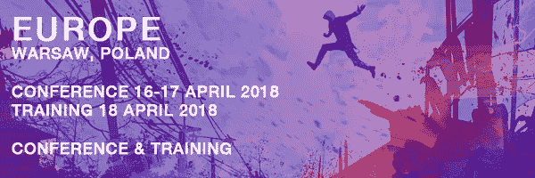

# ElixirConf 欧盟—波兰华沙

继去年在巴塞罗那举办的 ElixirConf EU 2017 大获成功之后， [ElixirConf EU](http://bit.ly/2geXftH) 今年又重返欧洲大陆，这次是在华沙！ElixirConf EU 的主题演讲人包括 José Valim、Chris McCord 和 Wu。还提供培训。

**你需要知道的事情
地点:**华沙希尔顿酒店&华沙会议中心
**日期:**2018 年 4 月 16 日星期一—18 日星期三
**已出票会议:** [早鸟票](http://bit.ly/2geXftH)仍有

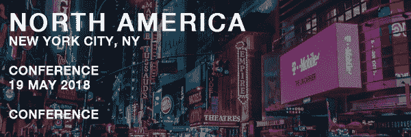

# EMPEX NYC 2018 —纽约州纽约市

为好奇的程序员举办的为期一天的纽约市 2018 年帝国城会议将于今年 5 月回归！Brooklyn Zelenka 已经被宣布为主题演讲人。想参与进来吗？[征文](http://www2.erlang-solutions.com/l/23452/2018-01-18/58y8rk)还在开！

**你需要知道的
地点:**亚文化，纽约市布里克街 45 号
**日期:【2018 年 5 月 19 日星期六
**售票发布会:**睁大眼睛等待[售票](http://www2.erlang-solutions.com/l/23452/2018-01-18/58y8rk)**

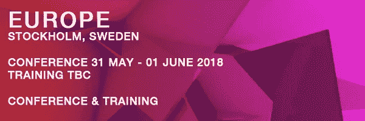

# 编码波束 STO —瑞典斯德哥尔摩

今年 5 月标志着 Code BEAM STO 会议(以前称为 [Erlang 用户会议](http://www.erlang-factory.com/euc2017))的首届会议，现在属于 Code Sync 技术会议家族。请密切关注第一轮演讲人公告！

**你需要知道的事情
地点:** Munchenbryggeriet 活动&会议，斯德哥尔摩
T21【日期:2018 年 5 月 31 日星期四
6 月 1 日星期五**已出票会议—** [**早鸟票仍有**](https://www.eventbrite.co.uk/e/code-beam-sto-2018-tickets-40183345468)

# 将于 2018 年晚些时候推出

**Code Elixir 2018——英国伦敦**

ElixirLDN 在 8 月 16 日以一个新名字回归:代号 Elixir。

[**了解更多→**](http://www2.erlang-solutions.com/l/23452/2018-01-19/592f1r)

**ElixirConf US 2018 —华盛顿州贝尔维尤**

兴奋起来！ElixirConf 将于 9 月 4 日至 7 日返回贝尔维尤！

[**ElixirConf 位点→**](http://bit.ly/2gGYkNK)

**吉格城 ElixirConf——田纳西州查塔努加**

10 月 26 日至 27 日由克里斯·麦考德、迪夫·托马斯、布鲁斯·泰特和詹姆斯·爱德华·格雷二世主演。

网站即将推出

**Code Mesh 2018 —英国伦敦**

伦敦领先的另类编程会议。2018 年 11 月 8 日至 9 日

[**了解更多→**](http://www2.erlang-solutions.com/l/23452/2018-01-19/592cth)

想从函数式编程的世界中获得更多吗？我们在 [**码梁 SF 2018**](http://www2.erlang-solutions.com/l/23452/2018-01-30/59cjkk) **三月！**

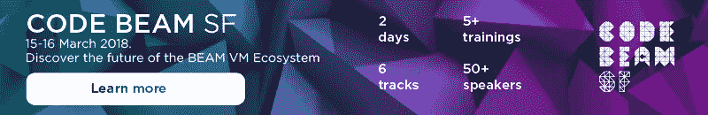

*最初发表于*[*www.erlang-solutions.com*](https://www.erlang-solutions.com/blog/top-10-erlang-elixir-events-of-2018.html?utm_source=ESL&utm_medium=Medium&utm_campaign=Code%20BEAM%20SF)*。*