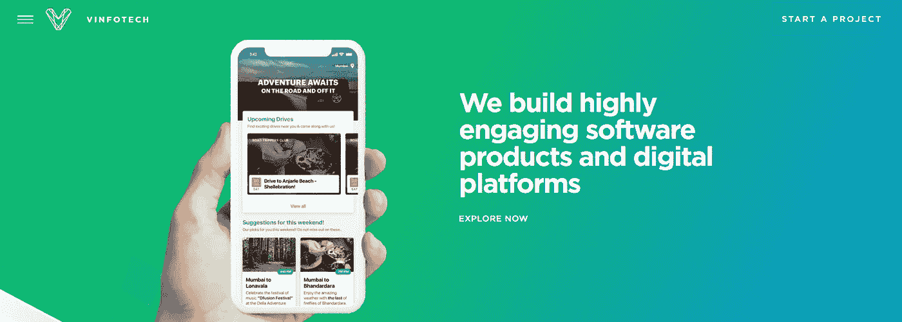
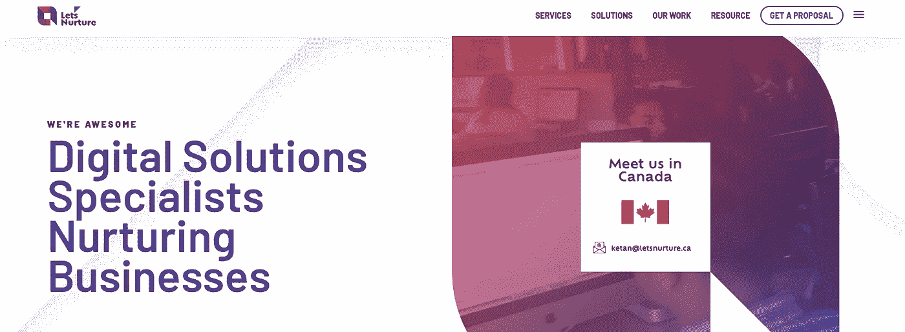
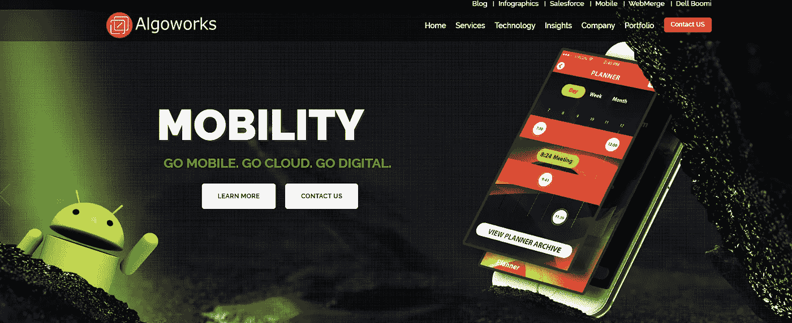

# 十大梦幻运动应用开发公司

> 原文：<https://medium.com/hackernoon/top-10-fantasy-sports-app-development-companies-927d508fe532>

全世界的奇幻运动 app 爱好者增量出现了一个高潮波。对于一个想要以任何方式参与运动的运动爱好者来说，幻想运动应用程序可以被视为一个完美的合作伙伴。

# **那么，到底什么是奇幻运动 app 呢？**

> *梦幻体育应该被描述为更多的在线游戏，在这种游戏中，参与者召集虚拟的或更多的想象中的职业选手团队，这些职业选手实际上在那个时间或大约那个时间参加体育比赛。由用户创建的团队基于虚拟团队中所选玩家给出的实际表现进行表演。*

这些表现被转换成点数，这些点数是根据每一个特定的幻想队的创造者设计的点数花名册来合计的。这个积分系统对于管理联盟和整体协调联盟的人来说并不难理解。一场特定比赛的分数也可以用计算机系统来计算，这些系统可以监视一场职业比赛的实际涨跌情况。在一个特定的幻想体育项目中，球队老板在现实体育项目中交易、选秀和挑选球员。

# **梦幻体育市场如何显著增长？**

Fantasy sports 应用程序可能是从一群朋友之间的一个有趣活动开始的，但它的受欢迎程度让它在全球范围内一夜成名。

> 根据梦幻体育贸易协会的数据，今年美国和加拿大将有大约 5680 万人玩梦幻体育。据说这比一年前增加了 37%,而之前三年的总和只增加了 16%。就实际支出而言，梦幻体育贸易协会估计，3200 万美国人每人花费 467 美元，或总计约 150 亿美元。

据说大约有 110 亿英镑流向足球。与虚拟主机网站相关的广告收入没有计算在上图中。 ***梦幻体育据说在美国拥有约€230 亿的产业，在美国和加拿大拥有约 5700 万梦幻体育玩家。*** 可以说，只有少数传统玩家会每天玩梦幻运动。

> 但是 Eilers 的研究显示，今年这项比赛每天将产生约 23 亿€的入场费，并继续以每年 41%的速度增长，这样到 2020 年将达到庞大的€128 亿。

# **梦幻体育在印度次大陆兴起**

随着印度经济的上升，kabbadi 上的梦幻运动，板球和足球据说在不断发展的技术的帮助下获得了超过预期的速度。因此，可以说印度正在与日俱增，在未来的日子里，预计 2017 年将有大约 5 亿互联网用户，其中 4 亿通过手机访问互联网，印度是梦幻体育运营商的一个充满机遇的市场。

> *据说印度有大约 700 万玩家定期玩梦幻体育游戏。这些数字包括各种运动，如曲棍球、卡巴迪、板球和足球。就百分比而言，增长率估计在每年 30-50%左右。相关数据预测，该国可以轻松预测自己在未来三年内达到约 5000 万爱好者的数字。*

随着所有因素的结合，包括技术的发展，高质量的可用性，功能更好的 android 和 iOS 手机，梦幻体育市场将快速增长，这一点毋庸置疑，有了这样的统计数据，可以说这只会在梦幻体育的不同领域创造大量的机会，世界各地的体育公司正在不断努力**开发专用于不同体育和人口统计的梦幻体育移动应用**。

# **顶级梦幻运动应用开发商**

让我们来了解一下梦幻体育竞技场中的顶级应用程序开发人员。

[**八进制 IT 解**](https://www.goodfirms.co/company/octal-it-solution) **:-**

这家领先的软件开发公司成立于 2007 年。从那时起，他们已经为全球 700 多个客户开发了 1，100 多个移动和网络应用。他们拥有一支由 150 多名经验丰富的专业人员组成的团队，通过完善的开发中心和现场工作环境为客户提供最佳的创新解决方案。

凭借高质量和经济实惠的解决方案，该公司赢得了技术领导者的显著地位，如 NASSCOM、微软、亚马逊网络服务、STPI、Acquia、D&B 和许多其他公司。他们还受到了 Clutch、GoodFirms、AppFutura、AppLancer、Appdexa 和 Extract 上数百名客户的称赞和关注，并一直位列这些平台的前 10 名移动应用开发者。

## **Arka 软件—**[www.arkasoftwares.com](https://www.arkasoftwares.com/fantasy-sports-app-development)

Arkasoftware 是梦幻体育移动应用和软件开发解决方案的领先公司之一。该公司成立于 2010 年，拥有一支由 100 多名经验丰富的专业人员组成的经验丰富的团队，一直致力于多种技术，并为全球 400 多家客户提供服务。

Arka Softwares 提供高质量和高性价比的移动应用解决方案。凭借一支由经验丰富的开发人员和设计师组成的团队，他们在[**梦幻体育应用开发**](https://www.arkasoftwares.com/fantasy-sports-app-development.html) 领域赢得了盛名。该公司深受各种知名研究公司的推崇，如 Clutch、Extract、Goodfirms、Appdexa、Skilled 和 Appfutura。

他们经验丰富的主题专家和开发人员非常了解虚拟体育领域。Arka Softwares 为您的整个梦幻体育应用和移动应用相关需求提供一站式解决方案，从定制的梦幻移动应用到在梦幻应用中集成加密货币，他们已经涵盖了梦幻应用所需的一切。

[**Mobiwebtech.com**](https://www.mobiwebtech.com/fantasy-sports-website-development/)

Mobiwebtech.com

Mobiweb technologies 是另一家专业和最值得信赖的幻想体育网站开发公司，以提供完全定制、充满活力、响应迅速、卓越、激烈的幻想体育软件和幻想体育开发工具而闻名。他们有一个技术高超、经验丰富的专业团队，可以开发任何类型的体育相关网站，因为他们拥有丰富的专业知识，所以他们知道如何构建一个高功能的体育网站。随着梦幻体育市场出现新的浪潮，有一个相当健康的竞争，这反过来要求你每天都变得更好，并记住这一点，他们总是在他们的新技能和方法中工作，这将使他们比他们的竞争对手领先一步。

[**Visvero.com**](http://www.visvero.com)**:-**

Visvero 是最专业的梦幻体育网站开发公司之一，为全球所有客户提供几乎所有类型的梦幻体育解决方案。他们有一个非常团结的开发团队，在为多种游戏和运动提供应用程序开发领域的想法和解决方案方面拥有丰富的经验。他们以提供定制的、反应灵敏的、健壮的、非常出色的梦幻体育应用和网站而闻名。他们已经发布了相当多的梦幻体育应用和网站，所以他们很清楚其中的过程和努力。他们是一家可靠的应用程序开发公司，致力于成功网站开发的三个相关方面，即期限、质量和纪律。今天在梦幻体育市场上有很多竞争，所以为了在竞争中生存，他们依靠这些方面。

****:-****

****

**总部位于孟买的专注于体育的解决方案公司 Sportz Interactive 一直在推动体育事业向前发展。该公司成立于 2002 年，提供幻想游戏、体育移动应用等产品，以及直播比分、新闻、统计和球员记录数据等服务。随着分析和其他广播解决方案的推出，他们也开始为用户提供参与功能。公司拥有板球、足球、一级方程式赛车、摩托 GP、奥运会等所有大型运动的记录数据库，这是其他体育组织所不具备的。此外，Sportz Interactive 的客户包括 Star Sports、Yahoo、NDTV、ESPNcricinfo、Pro Kabaddi、德里夜魔侠、Wisden India、Sony Six、Web18、印度超级联赛、Fairfax Media 和国际板球理事会等。**

**[**Vinfotech.com**](https://www.vinfotech.com)**:-****

****

**他们是最新类型的产品开发组织，他们提出了创造性的设计思想，并着眼于高水平的用户参与。他们知道在日益嘈杂的世界中建立成功的数字体验需要什么，提供客户坚持并不断回来的解决方案。他们在持续的基础上，通过在体育之外的领域创造出开箱即用的梦幻体育解决方案，树立了一种趋势。他们的**梦幻体育应用开发**是独一无二的，已经帮助了政治、电影、音乐、股票等行业的许多品牌。他们为客户的销售团队或员工、青少年和老年人、业余社区或特定的专家群体开发迷人的应用程序。**

******:-******

********

****这家公司成立于 2010 年，总部位于美国。他们拥有满足您开发需求的所有必要解决方案。他们构建了从定制 web 应用程序开发和移动应用程序到平滑网站开发以及电子商务 web 开发的所有内容。****

****提供世界顶级的用户体验是他们的基本优势之一。他们有一个由专家组成的团队，开发梦幻体育软件解决方案，其中包含一长串的体育和游戏，如板球、足球、篮球、曲棍球、足球、棒球、橄榄球等。他们的专长在于幻想体育 app 开发、体育联盟网站开发、每天和整个赛季的幻想体育网页开发、体育博彩软件开发、白标幻想体育软件开发、幻想足球网站和移动 app 开发。****

****[**Krify.com**](http://Krify.com)****

********

****Krify 是一家值得信赖和可靠的幻想体育应用程序和网站开发公司，它向客户提供他们所想的东西。他们拥有现代的开发技术，这使得他们能够培育和创建与桌面、移动和平板电脑兼容的定制响应型网页设计。他们的专家团队总是随时准备为那些正在寻找待开发响应网站的客户提供服务。****

****[**让我们培育**](https://www.letsnurture.com) **:******

********

****Let 'sNurture 可以被视为在全球范围内提供梦幻体育网站设计和移动应用程序开发服务领域的全球领导者。他们有一个技术高超的团队，为联盟、团队和梦幻体育部门开发和设计梦幻体育应用程序。他们的创新功能可以集成到幻想体育应用程序开发中。他们是一家著名的区块链应用程序开发公司，他们帮助建立一个分散平台，以照看一个人的幻想体育商业模式的交易。****

****[**Dreamco 设计**](https://www.dreamcodesign.com) **:******

********

****Dream co design 是一家高度专业的运动 app 设计公司，值得信赖。十多年来，他们一直在提供顶级的移动解决方案。他们与数据提供商、团队、联盟、梦幻体育运营商、运动员等合作。每个要开发的移动设备都是定制的，在 android 和 iOS 手机上都受支持。他们还为大多数知名公司设计、开发和整合体育数据。****

****[**蓝黄传媒**](http://www.blueyellowmedia.com) **:******

********

****他们可以为体育协会、体育赛事或体育品牌创建、设计和运行一款经济高效的梦幻游戏。他们与公司和品牌合作，为足球世界杯、狮子橄榄球联盟巡回赛和橄榄球世界杯等赛事建立品牌化的梦幻体育网站。他们根据您的订单为您构建一个完全定制的、移动优化的、完全托管的网站，具有适当的整体外观来点亮您的品牌。他们为包括板球、足球、橄榄球、篮球、手球和曲棍球在内的相当多的运动开发游戏。****

****[**Algoworks**](http://www.algoworks.com\)****

********

****Algoworks 是一家 IT 服务提供商公司，也以开发体育网站和应用程序为荣，是全球公认的技术专家，其根基在桑尼维尔、诺伊达和加利福尼亚。他们在企业内容管理解决方案(CMS)、企业移动应用程序开发、客户关系管理(CRM)和软件产品工程(SPE)等重要领域提供服务。****

****所以这是顶级的 [**梦幻运动应用和软件开发公司的列表** s](/@alexmorgan7/top-10-fantasy-sports-app-development-companies-4ba76a1709a2) 将帮助你满足你的确切需求。如果你打算进入一个幻想不断增长的世界，那么去仔细看看这些巨人的前景，然后选择一个符合你胃口的。****