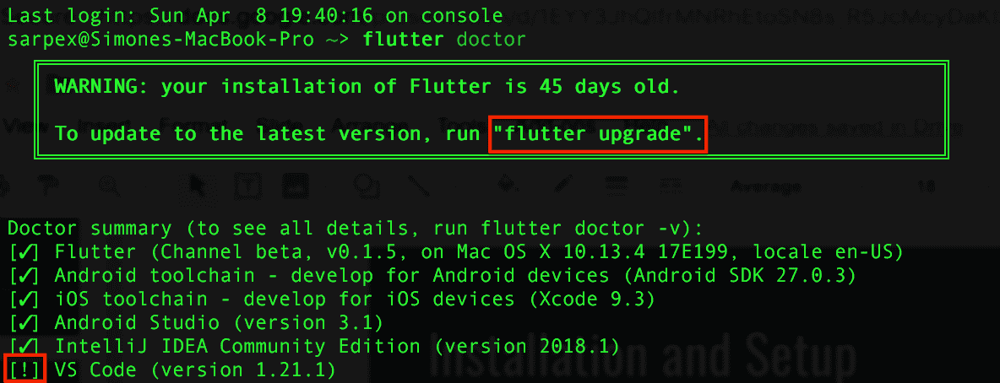
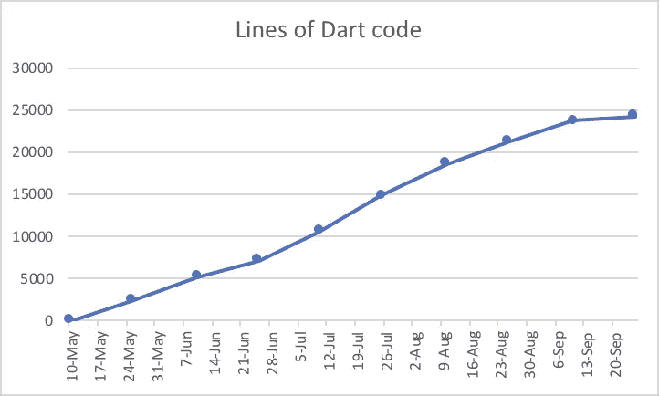
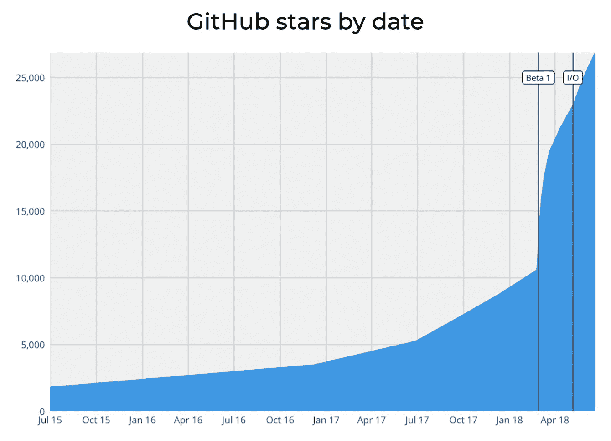
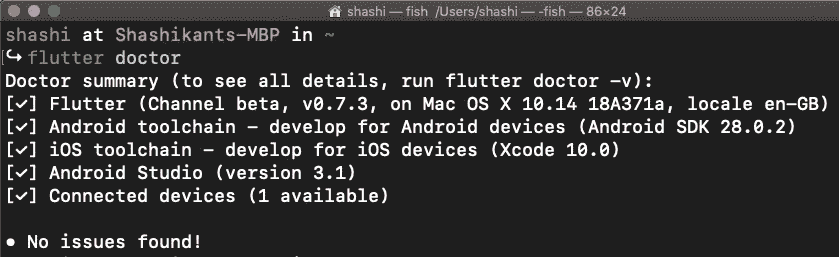

# 过去一个月的十大颤振文章(2018 年 9 月)

> 原文：<https://medium.com/hackernoon/top-10-flutter-articles-of-the-past-month-sep-2018-95fa9a921cd8>

[Flutter](http://flutter.io) 是谷歌的新移动应用工具包，用于在创纪录的时间内在 iOS 和 Android 上制作漂亮的原生界面。

9 月初，Flutter 公布了 **Flutter 发布预告 2** ，这是 Flutter 1.0 之前的最后一个重大里程碑。12 月 4 日，Flutter 将在[举办一场直播秀](https://developers.google.com/events/flutter-live/)，展示混合移动应用是如何构建的。

移动应用开发者列出了他们上个月的 10 大阅读，这将帮助你掌握你的技巧。作为专业人士的移动 CI/CD，我们非常重视质量，并确保您阅读的每篇文章都很棒。如果我们错过了一些有价值的阅读，请在评论中分享你的想法。

# **#1 颤振释放预览 2**

甚至在 1.0 发布之前，Flutter 就是 GitHub 上的**前 50 个活跃软件库之一。许多开发人员继续发现 Flutter，这是一个很好的理由来看看 Google Flutter 团队一直在做什么，以及如何升级到 Flutter Release Preview 2。**

**—>**[颤振发布预告 iOS 上的像素完美](https://developers.googleblog.com/2018/09/flutter-release-preview-2-pixel-perfect.html)

> “Flutter 从第一天起就开源了。那是故意的。我们的目标是公开我们的进展，并鼓励与我们一样渴望在所有平台上看到美好用户体验的个人和其他公司做出贡献。”

# **#2 为何飘起**

谷歌的颤动是新的酷小子！所以，既感兴趣又谨慎，也无可厚非。贝拉特里克斯软件公司总裁兼联合创始人亚历克斯·罗比奥采访了一些决定冒险一试的企业。

***—>***[*谷歌飘起:为什么 CTO 要重视它*](https://www.forbes.com/sites/forbestechcouncil/2018/09/25/google-flutter-why-ctos-should-pay-attention-to-it/#6ec5914469c7)*by**Alex Robbio**《福布斯》*

> *“特别是对于初创公司，使用 Flutter 的价值主张非常有吸引力，因为它解决了他们面临的许多棘手问题，尤其是在处理有限的时间和预算以将您的软件产品推向市场的时候。”*

# ***#3 如何入门***

*如果你忍不住想看看 Flutter 周围的嗡嗡声，你需要自己带着 Flutter 去兜一圈。幸运的是，Flutter 在其[文档](https://flutter.io/technical-overview/)中声称用 Flutter 编程是如此简单，以至于**不需要任何编程知识**。(顺便说一句，93%的 [Flutter 用户调查](/flutter-io/what-weve-learned-from-the-july-2018-flutter-user-survey-cbbf1e04370c)受访者认为 Flutter 文档的质量很好、非常好或非常好。)*

**

***—>**[我是如何开始与旋舞的，](https://pspdfkit.com/blog/2018/starting-with-flutter/)作者**西蒙·阿尔佩，**pspdfkit.com*

> *“Flutter 团队在升级过程上做得很棒，每次运行都很顺利；即使经过很长一段时间，它被证明是坚如磐石，运行颤振升级没有任何问题的工作。虽然对 Flutter 做出任何明确的断言还为时过早，但我喜欢与它一起工作，并将密切关注它，看看接下来会发生什么。”*

# ***#4 切换到颤振***

*加里·亨特读了一篇令人惊叹的文章，他把简易饮食日记应用程序移植到 Flutter 上。将大型应用移植到 Flutter 意味着什么，结果有多令人满意？*

**

***—>**[移植一个 75000 行原生 iOS app 到 Flutter](/flutter-community/porting-a-75-000-line-native-ios-app-to-flutter-57c6571c57b4) ，作者**加里·亨特***

> *“当我登上港口时，我估计需要 6 个人月的时间。嗯，项目提前了！对我来说，这很不寻常。”*

# ***#5 正在生产的颤振应用***

*最后一些现实生活中的场景。了解汉密尔顿应用程序是如何投入生产的，2M 安装了 20 多个版本后，维护颤振生产应用程序 14 个多月的关键步骤是什么。*

***—>**[与旋舞](https://docs.google.com/presentation/d/1f6z6hmdlgrRhaHGA7EZwDjEa_7h7hXpChULwcrPs7-g/edit#slide=id.g435293481c_0_100)一起直播，由**非常好的风投***

# ***#6 不同平台使用单一代码库***

*混合应用的优势是能够使用单一代码库为 iOS 和 Android 开发高质量的应用。因此，从理论上讲，人们可以节省大量的时间和金钱。真的是这样吗？佩德罗·莫雷诺与 Flutter 分享了他们的 EntrenaPro 之旅，并激励其他科技公司选择 Flutter 作为他们的下一个项目。*

**

***—>**[我们如何在 4 个月内用 Flutter 构建了一个很棒的应用](https://www.linkedin.com/pulse/how-we-built-awesome-app-flutter-4-months-pedro-moreno/?published=t)，作者 **Pedro Moreno***

> **“当你管理一个项目，你需要在能给用户带来相同含义的强大编程语言之间做出选择时，逻辑告诉你应该选择更成熟的语言，一种你能找到更多开发人员的语言，一种你的团队有更多经验的语言。当你知道这一点，并且你仍然喜欢选择你的团队想要学习的全新技术来看看我们能走多远时，你要么有点疯狂，要么指望像 Ahmed 这样的人在移动端挑战 logic"**

# ****#7 颤振利弊****

*Flutter 获得了相当多的赞誉。它一举两得，预计可以节省大量的时间和金钱。然而，在带你的业务应用程序使用 Flutter 之前，这里有一个全面的概述，介绍一下你应该考虑的 Flutter 的优点和缺点。*

**

***—>**[【Flutter:无缝跨平台开发的利与弊】](https://steelkiwi.com/blog/flutter-pros-and-cons-for-seamless-cross-platform-development/)，作者 **Angela Beklemysheva***

> *“在 Flutter 中开发一个可以在 iOS 和 Android 上运行的普通应用程序需要大约 250 个小时，而为 iOS 开发这样一个应用程序需要大约 400 个小时，为 Android 开发一个普通应用程序需要 250 个小时。”*

# ****# 8 飘起& CI/CD****

*测试是任何移动项目不可或缺的一部分，因此这篇文章将向您全面介绍为什么您需要实现 CI/CD，以及如何为您的 Flutter 项目设置它。*

**

***—>**[持续集成和交付颤振应用](https://nevercode.io/blog/continuous-integration-and-delivery-ci-cd-for-flutter-apps-with-nevercode/)，由 **Shashikant Jagtap***

> *“我们可以用 Flutter 构建出色的应用，但我们还需要使用最佳开发运维及 CI/CD 实践来有效地构建、测试和发布 Flutter 应用。”*

# ***# 9 颤振和部件测试***

*Flutter 是关于小部件的。如何成功测试 widgets 并交付健康的 Flutter 应用？*

***—>**[测试花絮#2 —为什么使用 Image.network 崩溃小部件测试？](https://iirokrankka.com/2018/09/16/image-network-widget-tests/)，由 **Iiro Krankka***

> *“在没有任何模拟器或仿真器的情况下，盲目地运行小部件测试是非常愚蠢的”*

# ***# 10 颤振 UI 挑战***

*一个全面的代码示例如何实现约翰尼维诺的[身体质量指数计算器](https://dribbble.com/shots/3558444-BMI-Calculator)在颤振。性别，*

**

***——>——**[MBI《颤振》中的计算器](https://marcinszalek.pl/tag/flutter/) **，**作者**马尔钦·萨泽克***

> *“这一次我将通过使用手势检测器实现高度选择器。让我们看看情况如何。”*

*如果你注意到一些我们错过的有用的关于 Flutter 的阅读，请在评论中分享它们。👏*

*[*never code*](http://nevercode.io)*加入了 Flutter 革命，为你的 Flutter 项目提供免费 CI/CD 服务，换取产品反馈。**

* [## 颤振-黑客正午

### 阅读黑客正午中关于 Flutter 的文章。黑客如何开始他们的下午？

hackernoon.com](https://hackernoon.com/tagged/flutter)*