# 紧跟最新移动健康趋势的印度十大健康和健身应用开发商

> 原文：<https://medium.com/hackernoon/top-10-health-fitness-app-developers-in-india-that-follow-latest-mhealth-trends-21382aa5bef9>

智能手机已经在医疗服务提供商和患者之间形成了一个新的通信网络。随着硬件进步和创新应用的出现，智能手机实现了更好的协调、诊断准确性和建立信心。

在像印度这样的发展中国家，人们越来越多地使用医疗保健移动应用程序来实现他们的健康和健身目标。紧跟潮流，印度医疗行业从未落后，并为更好的患者护理和协调良好的医疗保健提供商提供从健身应用到医疗援助应用的创新移动医疗解决方案。从测量你的身体质量指数，到激励你多走一英里，提醒你吃药，这些健康和健身应用程序对改善你的健康大有帮助。

【2014 年至 2020 年印度移动医疗设备和服务市场的预计规模(百万美元) [***来源***](https://www.statista.com/statistics/628210/mhealth-services-and-devices-market-size-in-india/)

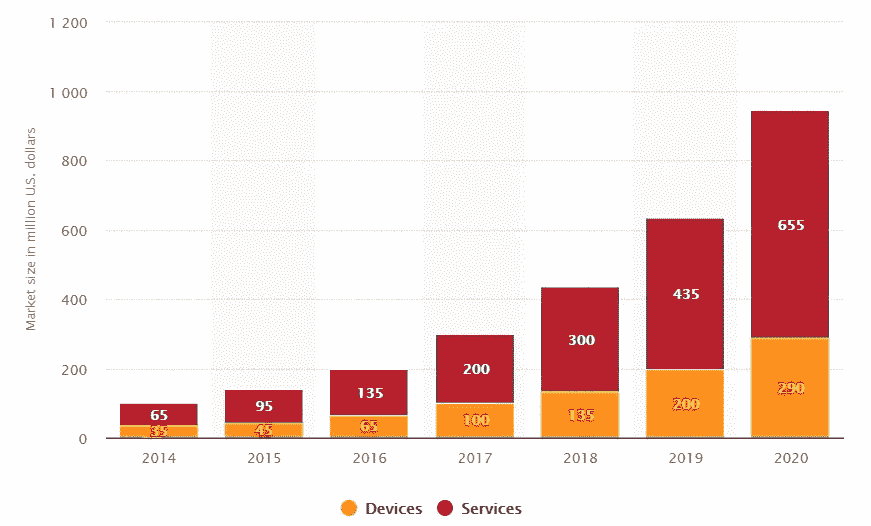

> ***预计到 2020 年，印度的移动医疗服务市场价值将达到 6.55 亿美元。***

## ***印度移动医疗相关搜索排名前五-*** [**来源**](https://www.pwc.in/assets/pdfs/publications/2017/how-mhealth-can-revolutionise-the-indian-healthcare-industry.pdf)

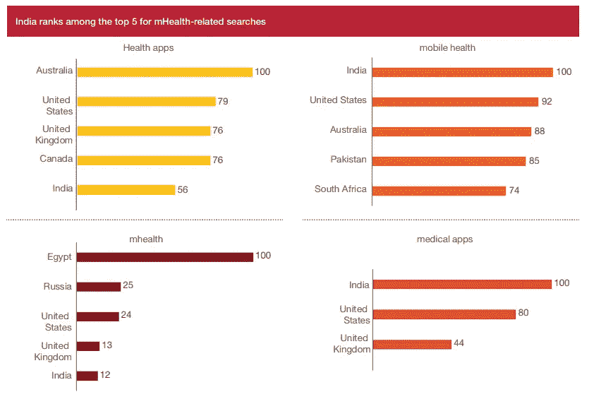

[Source](https://www.pwc.in/assets/pdfs/publications/2017/how-mhealth-can-revolutionise-the-indian-healthcare-industry.pdf)

## **促使患者和提供者采用移动医疗解决方案的驱动因素**

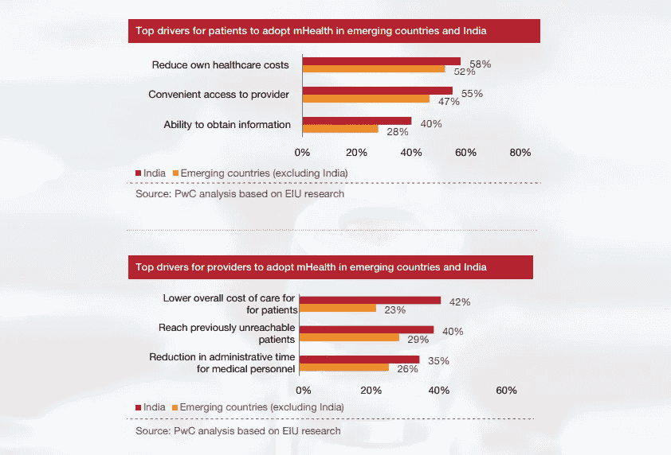

[Source](https://www.pwc.in/assets/pdfs/publications/2017/how-mhealth-can-revolutionise-the-indian-healthcare-industry.pdf)

考虑到印度健康和健身应用程序的使用量激增，印度科技巨头和医疗保健组织正在不断开发医疗保健应用程序，以确保他们在不断增长的印度移动医疗市场中占有很大份额。为了推出功能丰富的移动应用程序，您需要一个经验丰富的**移动应用程序开发团队**，对该领域和人口统计学方面的医疗法规合规性有深入的了解。

## **医疗保健和医疗移动应用解决方案的热门类别**

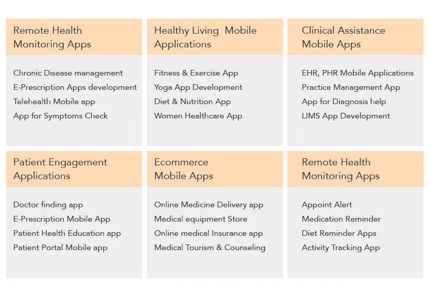

**Source**

## **以下是印度十大健康和健身移动应用开发商**

## [八进制 IT 解决方案](https://www.goodfirms.co/company/octal-it-solution)

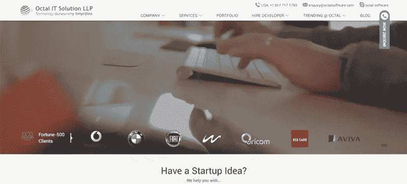

谈到该国的健康和健身移动应用程序开发人员，Octal IT 解决方案独占鳌头。他们采用敏捷开发过程来确保在承诺的时间框架内完成高质量的工作。这些解决方案符合 HIPPA 标准，并根据行业需求进行定制。该公司开发的医疗保健和医疗应用程序可以帮助您简化业务工作流程，并提供最大的准确性，以改善整体患者护理。他们有一个健康和健身行业成功应用程序的优秀列表，以证明他们在该领域的优势。

***专长:*** IOT 健康解决方案、健康健身 app、饮食规划师 App、可穿戴 App、营养 App、HIMS、LIMS、ePrescription App、慢病移动 App、远程医疗 App、EHR App、患者沟通 App 等等…

## [心灵盘点](https://www.mindinventory.com)

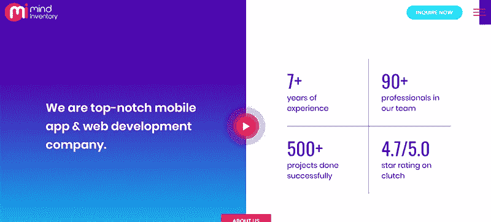

Mind Inventory 是一家领先的健康和健身应用程序开发解决方案提供商。Mind Inventory 提供的移动解决方案可以让您的医疗保健和健身业务受益匪浅。从医院管理应用程序到健身应用程序，无论您是拥有一家多专业医院，还是拥有一个小型病理实验室，或者您是一名健康顾问，您都可以开发功能丰富的应用程序来简化您的工作，并提高您的整体工作效率。

***总部***——印度艾哈迈达巴德

***专长:*** 健康&健身 App，面向外科医生的 AR&VR App，面向医院、养老院、小诊所、儿科中心的移动 App，面向医生&患者的日程管理 App。

## 

**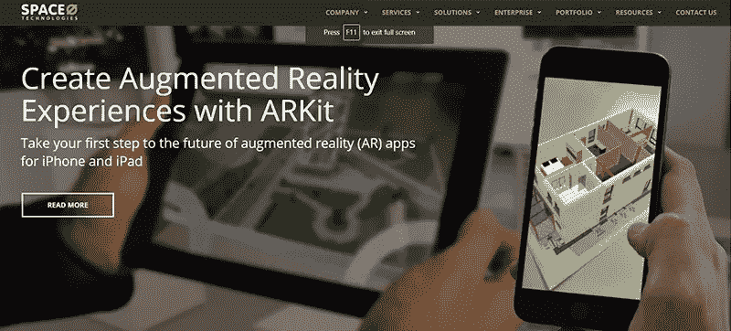**

**Space-O-Technologies 为您的健康和健身业务提供完整的应用程序开发解决方案。从面向 Android 和 iPhones 的未来增强现实和虚拟健康和健身应用程序，到雇佣开发人员来满足您的所有独特需求，Space-O-Technologies 提供了无与伦比的高效移动应用程序解决方案。他们经验丰富的应用程序开发团队根据医疗保健行业的定制需求提供强大的应用程序解决方案。基本上，健康和健身行业的增长推动了对创新的需求，这导致了世界级应用程序的开发。**

*****总部***——印度艾哈迈达巴德**

*****专长:*** 多功能健康&健身应用、减肥应用、健身训练日志应用、运动提示应用、健身业务营销应用、社交网络健身社区应用**

## **[**Appinventiv**](https://appinventiv.com)**

**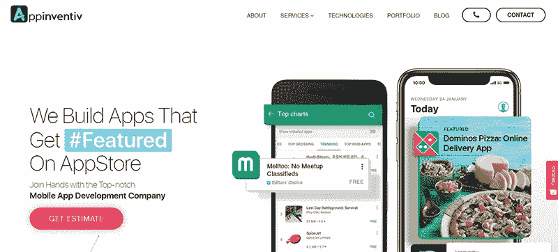**

**Appinventiv 是一家顶尖的移动应用程序开发公司，它将根据您的预算和需求为您提供最先进的健康和健身移动应用程序。由于其在健康和健身行业领域的深入技术知识和经验，它能够在开发应用程序之前为客户提供一个估计。从小型创业公司到大型巨头，Appinventiv 提供卓越的应用解决方案，以扩大您的投资回报率和品牌知名度。**

*****总部***–印度诺伊达**

*****专长:*** IOT、AR-VR、健康和健身应用、IOT 应用开发、医疗保险索赔应用、实验室管理应用、电子健康信息交换应用、电子处方应用、EHR 应用**

## ****

****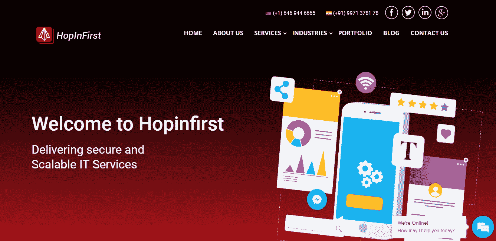****

****Hopinfirst 是一家领先的定制医疗保健软件和移动 [**应用程序开发公司**](http://hopinfirst.com/mobile-application/) 为医疗行业提供网站开发、移动应用程序、AR/AR 开发、数字营销服务。****

****Hopinfirst 声称，基于该公司在健康领域的经验，将开发具有吸引力和竞争力的独一无二的医疗保健移动应用程序。****

*******总部***–印度古尔冈****

*******专长:*** 健康&Android 和 ios 的健身 app、医疗 App、AR 和 Vr App 开发、健康保险 App、药房 App 开发****

## ****[**削球**](https://www.peerbits.com)****

****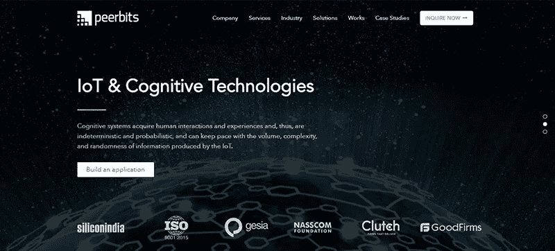****

****Peerbits 提供卓越的应用解决方案，以提供更好的医疗护理和患者服务。Peerbits 开发的健康和健身应用程序运行良好，外观漂亮，并提供令人惊叹的功能。Peerbits 拥有一支经验丰富的应用程序开发团队，他们特别擅长健康和健身应用程序。这些应用程序的开发完全符合当地以及国际规则和法规。应用程序用户的保密性得到妥善维护。Peerbits 促进了应用程序用户和医疗保健提供商之间的无缝连接。****

*******总部***——印度艾哈迈达巴德****

*******专长:*** 远程医疗保健、健康&Android 和 iPhone 平台的健身应用、HIPPA 投诉应用、健康应用、可穿戴应用、锻炼应用、活动跟踪应用、营养应用****

## ****[**mobisft Infotech**](https://mobisoftinfotech.com)****

****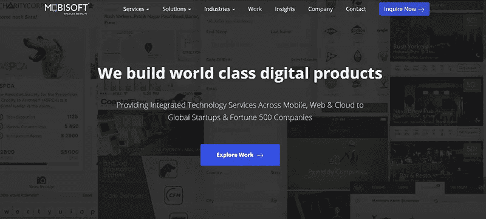****

****MobiSoft Infotech 专注于符合 HIPPA 标准的医疗保健应用程序，这些应用程序旨在将健康和健身行业完全数字化。Mobisoft Infotech 的专家团队正在迅速使其成为医疗保健巨头的首选技术合作伙伴。公司在其应用程序开发工作中遵循以患者为中心的方法。由于与 JLABs 和 TMCx 等医疗保健技术开发加速器的合作，Mobisoft 确保了更快的产品发布。他们甚至以使用 Cerner 和 Epic 等复杂的 EHR 系统为荣。****

*******总部***——印度浦那****

*******专长:*** 健康&健身应用、实时数据同步、医疗传感器集成、可穿戴设备应用开发****

## ****[**Mobibiz**](https://www.mobibiz.in)****

****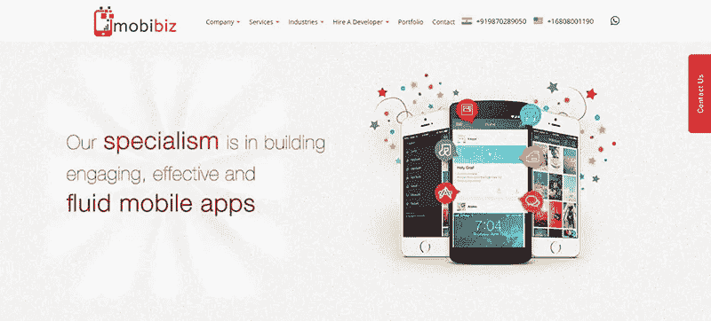****

****Mobibiz 是健康和健身应用程序开发领域的知名品牌。它构建应用程序来提高患者护理水平，不受时间和地点的限制。应用程序面向行业中的所有参与者，如临床实验室、医院、药房、患者、保险提供商等。Mobibiz 高度专业的团队确保将移动性融入医疗保健，并根据客户的特定需求构建应用解决方案。该应用程序丰富了所有与行业相关的正确功能。Mobibiz 制作的应用程序专注于医疗行业的不同元素，如患者教育、协作护理交付、虚拟咨询、虚拟预约、患者记录维护等。****

*******总部***–印度古尔冈****

*******专长:*** 健康&健身应用、剂量计算器、患者转诊计划、基于位置的跟踪、远程咨询、远程健康监控****

## ****[**Mobiwebtech**](https://www.mobiwebtech.com)****

****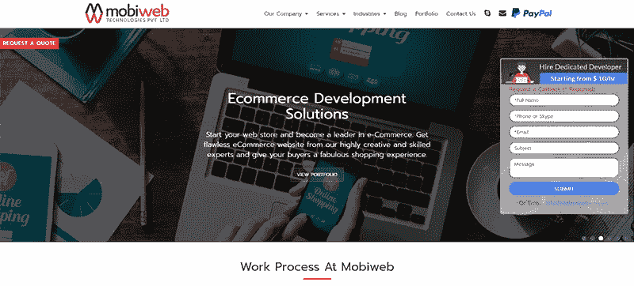****

****对于定制医疗保健应用程序的开发，Mobiwebtech 是一个值得考虑的名字。迄今为止，它已经完成了 450 多个项目。拥有卓越的客户群，Mobiwebtech 提供以患者为中心、集成和基于结果的医疗保健解决方案。他们对法规遵从性有着全面深入的了解，如 CCHIT、HIPAA 和 MU 等。此外，解决方案是根据 ICD-10、HL7 和 XDS-I 等医疗标准制定的。从医疗应用程序开发到患者参与应用程序、心率跟踪应用程序、瑜伽应用程序和医疗软件开发，Mobiweb 将为您提供一切。****

*******总部***——印度印多尔****

*******专长:*** 健康&健身应用、移动健康解决方案、瑜伽应用、患者参与应用、心率追踪应用****

## ****[**感知系统**](https://www.perceptionsystem.com)****

****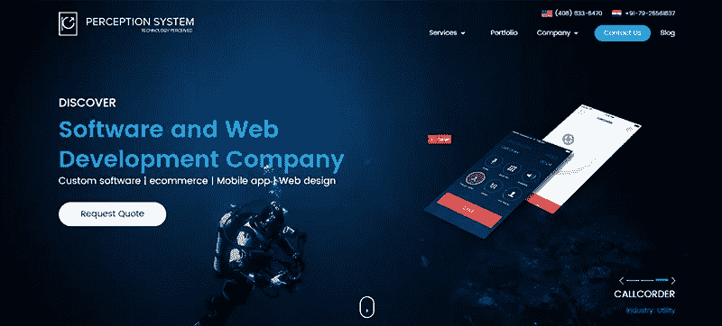****

****对于负担得起的健康和健身应用程序解决方案，Perceptionsystem 是您的最佳选择。该公司以其创新的解决方案和广泛的领域专业知识而闻名。感知系统提供的触摸技术解决方案正在将基于数量的医疗保健转变为基于价值的医疗保健。医疗保健领域非常关注患者的个性化和高端治疗需求。该公司了解您的所有需求，并提供相应的解决方案，无论您是需要企业应用程序还是普通应用程序。****

*******总部***——印度艾哈迈达巴德****

*******专长:*** 健身追踪应用、医疗教育应用、医疗账单管理应用、医疗应用维护和支持、临床成像解决方案、健康保险应用、医药管理解决方案。****

****[**Scnsoft**](https://www.scnsoft.com)****

****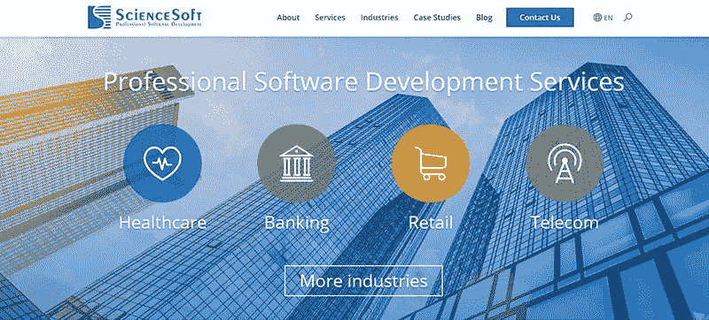****

****凭借 13 年的移动医疗解决方案经验，Scnsoft 专注于为您提供任务驱动的健康和健身移动应用。您可以使用应用程序来自动化您的日常临床工作，以监控员工的表现。他们开发应用程序来节省医疗任务的时间。简化诊断、治疗和后续护理的移动应用程序是 ScienceSoft 产品组合的一部分。数据保护是 ScienceSoft 开发的医疗保健移动应用程序的一个不可或缺的功能****

*******总部***–印度诺伊达****

*******专长:*** 疾病检测和医疗不相容应用、护理协调应用、慢性病管理应用、健身应用、e-Rx 移动应用、HIMS 应用****

*******结论*******

****这些是全国十大领先的**医疗保健移动应用开发商**。如果你把你的健康和健身应用程序开发任务交给这些供应商中的任何一个，你可以确保根据你的需要得到一个优秀的产品。****