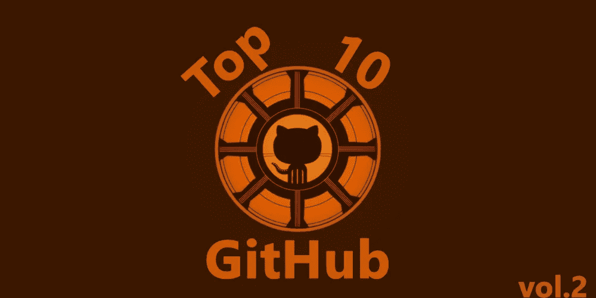
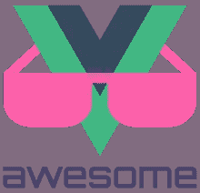
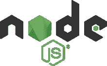
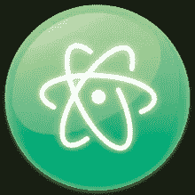
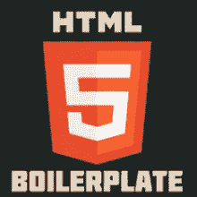
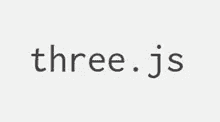

# 2017 年 GitHub 十大 Javascript 项目

> 原文：<https://medium.com/hackernoon/top-10-javascript-projects-on-github-by-2017-1230211a92c6>

万维网已经发展了多年，在过去的十年里，技术有了很大的改进。众所周知，JavaScript 只用于开发 web 页面的客户端，随着新的框架被开发用于服务器端，JavaScript 成为当今世界上最流行的编程语言也就不足为奇了。

随着学习用 JavaScript 编程的程序员数量的增加，大型项目的开发平均也在增加。

Github 上托管了大量的 JavaScript 项目，其中一些非常突出。去年我已经观察了 2016 年的 [**十大项目。**](https://dashbouquet.com/blog/web-development/top-10-most-popular-javascript-projects-on-github)现在，让我们看看我们是如何结束 2017 年的。

# 1.反应 JS

## 88 356 ★

众所周知，JavaScript 主要用于客户端工作，React JS 是开发优秀前端设计和交互的框架的一个例子。React JS 由脸书创建，是一个用于创建强大的可重用 UI 组件的库。

使用 React 的一个好处是，它通过使用虚拟 DOM 隐藏了复杂性，这有助于提高应用程序的性能。React JS 的特性包括 JavaScript 语法扩展、单向数据流、组件等等。

如果您很好地掌握了 JavaScript，学习 React 相当容易。可以从 [React JS 网站](https://reactjs.org/tutorial/tutorial.html)访问教程。React 的安装和设置非常简单。

`*npm install -gcreate-react-app*`

`*create-react-app my-app*`

`*cd my-app*`

`*npm start*`

# 2.Vue JS

## 83 742 ★

就像 React 一样，Vue 是另一个构建可爱用户界面的框架。这个渐进的框架被设计成易于适应久而久之，这使得该库易于与其他项目集成并随时使用。

Vue JS 因其简单性而广为人知，此外，它是轻量级的，有很好的文档记录，并允许开发过程中的灵活性。Vue 鼓励开发者编写“简单的 JavaScript ”,因此初学者很容易掌握。

找导游？[这里的](https://vuejs.org/v2/guide/)是开发者自己出的一个。Vue 很容易安装和设置。

`*npm install -g vue-cli*`

`*vue init webpack my-app*`

`*cd my-app*`

`*npm install*`

`*npm run dev*`

# 3.节点 JS

## 45 478 ★

这是有史以来最好的服务器端开发框架之一，它让 JavaScript 在服务器端脚本项目中广受欢迎。

NodeJS 带来了包管理工具 NPM，它让许多开发者的生活变得更加轻松。开发人员也很喜欢它，因为它提供了一个非阻塞的 I/O 模型，可以用来开发实时 web 应用程序，易于学习，并且有一个很大的社区。

在 Windows 和 Linux 上，节点的安装过程是不同的。对于 Windows，简单下载并安装 NodeJS [可执行应用程序](https://nodejs.org/en/download/) 就足够了。

对于 Linux，以下 Linux 终端命令将安装它:

`*sudo apt-get update*`

`*sudo apt-get install nodejs*`

安装后，应运行以下命令来确认安装成功。

`*node -v*`

# 4.原子

## 43 368 ★

这是你能找到的最好的文本编辑器之一。与 sublime text 和 visual studio 竞争，因为它功能强大，带有智能自动完成功能，集成了拼写检查功能，并且非常易于使用。

然而，开始使用 Atom 是相当困难的，这是因为安装有助于获得良好体验的插件需要时间。

在 Linux 上安装 Atom 并不困难，运行下面的命令就可以了。

`*curl -L https://packagecloud.io/AtomEditor/atom/gpgkey | sudo apt-key add -*`

`*sudo sh -c 'echo "deb [arch=amd64] https://packagecloud.io/AtomEditor/atom/any/ any main" > /etc/apt/sources.list.d/atom.list'*`

`*sudo apt-get update*`

`*sudo apt-get install atom*`

在 Windows 上安装也不难，可执行文件可以从 [GitHub 页面](https://github.com/atom/atom/releases)下载。

# 5.HTML5 样板文件

## 39 744 ★

随着时间的推移，网页的开发变得越来越复杂。在生产力受到威胁的情况下，减少日常任务是非常重要的。

有了 HTML5 样板项目，开发变成了一个更愉快的过程。这是你会发现的最流行的前端样板框架，因为它有助于构建快速、健壮和适应性强的 web 应用程序。

它包括 Normalize.css，jQuery，Modernizr 人脸检测库的定制版本，并提供了高性能。

HTML5 样板框架可以从[网站](https://github.com/h5bp/html5-boilerplate/releases/download/6.0.1/html5-boilerplate_v6.0.1.zip)下载。

# 6.三个 j

## 39 297 ★

3D 计算机图形框架有几个，Three JS 就是其中之一。通过利用 WebGL 引擎，Three JS 用于在 web 浏览器中创建漂亮的 3D 计算机图形。

三个 j 附带了一堆特性。诸如效果和场景、摄像机、动画(如 skinnedmesh 和 morphblendmesh)、灯光等功能。帮助它获得了知名度。

其庞大的开发者和用户社区是一个巨大的积极因素，所以你可以期待这个项目的稳定改进。

三 JS 很容易安装，可以从 [GitHub 页面](https://github.com/mrdoob/three.js/)下载。

# 7.流星 JS

## 39 213 ★

说到为所有平台构建应用程序的框架，Meteor JS 是你能找到的最好的框架之一。

Meteor JS 允许实时 web 开发，使得客户端、服务器端和应用程序数据库的开发变得更加容易，它易于初学者编写和学习，并且拥有一个庞大的开发人员社区。

找导游？[这里的](https://www.meteor.com/tutorials)是来自开发者的一个。

Meteor 很容易安装，运行下面的终端命令就可以了。

`*sudo curl https://install.meteor.com/ | sh*`

这将安装流星 JS。要检查安装是否成功，请使用以下命令:

`*meteor --version*`

# 8.快递 JS

## 36 624 ★

在文章的前面，我们讨论了 Node JS 框架，这是一个建立在这个框架之上的框架。

[Express JS](https://expressjs.com/) 是一个灵活的 Node JS web 应用框架，用于开发高质量的 web 和移动应用。

Express JS 主要用于构建 web 应用程序和 API，在 JavaScript 社区中非常流行。如果你已经在这个系统中呆了一段时间，你很可能听说过 MEAN 栈，Express 构成了这个栈的后端部分。

Express JS 使开发过程更快，易于配置和定制，可以与大量模板引擎集成，并且不会使数据库连接成为一个麻烦。

因为 Express 构建在节点 JS 上，所以您可以猜测它可以使用 NPM 工具安装。

`*npm init*`

然后安装 Express 并将其添加到依赖项列表中:

`*npm install express --save*`

或者安装时不将 Express 添加到依赖项列表中:

`*npm install express --no-save*`

# 9.图表 JS

## 35 151 ★

在这个大数据的世界里，数据的可视化变得非常重要，不仅对统计人员如此，对 web 开发人员也是如此。

使用 [**Chart JS**](https://dashbouquet.com/blog/frontend-development/9-best-javascript-charting-libraries) ，您可以在网页上显示漂亮的图表，确保您在可视化数据之前不必经历环境的变化。

Chart JS 是轻量级和快速的，有利于创建响应图表，有一个非常清晰的文档，并支持多达 8 种图表类型。如果这还不够，Chart JS 有一个很大的用户社区，所以你可以很快找到问题。

这个[图表库](http://www.chartjs.org)可以使用 npm 工具安装，只需使用下面的命令:

`*npm install chart.js --save*`

# 10.故事

## 30 168 ★

这是一个 JavaScript 包管理工具，有助于简化开发过程。

就像 React 一样， [Yarn](https://yarnpkg.com/en/) 是由脸书开发的，可以被认为是对 npm 工具的改进，因为它并行化了 NPM 没有的操作，并更有效地利用了网络。

Yarn 受欢迎的部分原因是它的执行速度、健壮的工作系统、许可证检查的可用性以及它与 NPM 和鲍尔软件包管理工具令人难以置信的兼容性。

可以使用 npm 工具安装纱线:

`*npm install yarn --global*`

在 Linux 上，也可以使用以下命令安装它:

`*curl - sS https: //dl.yarnpkg.com/debian/pubkey.gpg | sudo apt-key add -*`

`*echo "deb https://dl.yarnpkg.com/debian/ stable main" | sudo tee / etc / apt / sources.list.d / yarn.list*`

然后:

`*sudo apt-get update && sudo apt-get install yarn*`

值得注意的是，本文中讨论的项目在过去的一年中广受欢迎，但是，这并不一定意味着它们在所有情况下都是用来解决问题的最佳解决方案。

你认为什么项目应该被列入名单？2017 年你用的最多的项目是什么？让我们知道你的观点。

由 Dmitry Budko 撰写