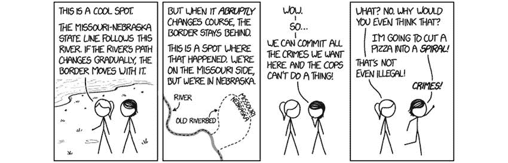
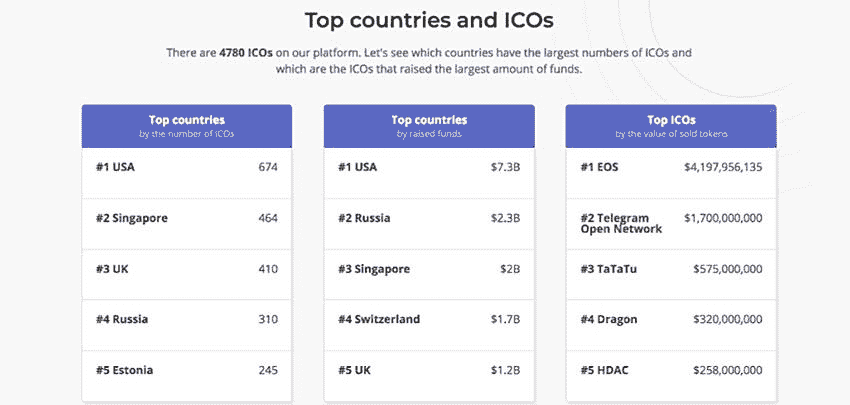
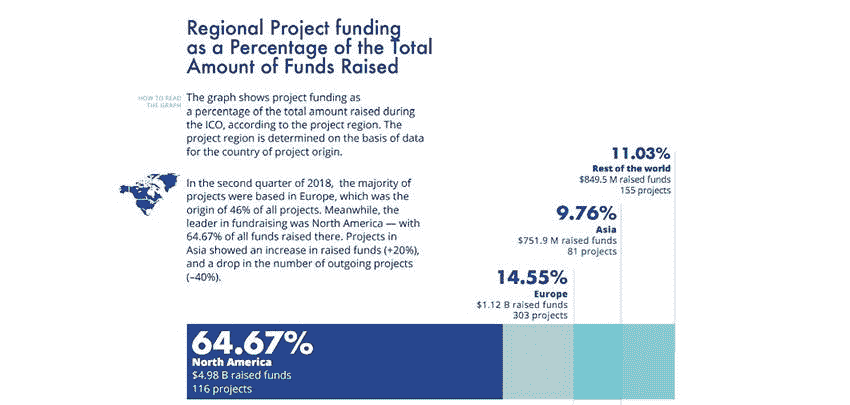
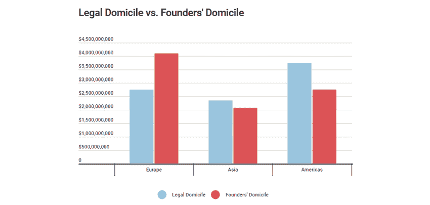
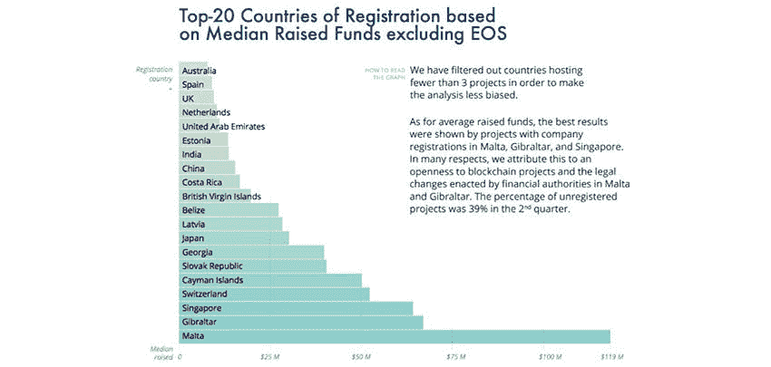
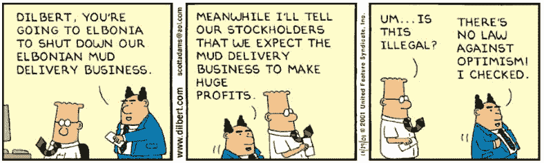

# 在当前监管环境下，十大无忧 ICO 辖区

> 原文：<https://medium.com/hackernoon/top-10-jurisdictions-for-a-worry-free-ico-in-the-current-regulatory-climate-40bb04661454>

随着当今世界不断变化的 ICO 立法，很难确定哪个司法管辖区的规则和法规对您的公司最有利。穿越这个法律迷宫可能会非常困难，如果你不小心违反了任何规则，你可能会面临[惩罚，甚至完全关闭](https://www.financemagnates.com/cryptocurrency/icos/sec-shuts-down-blockvest-ico-over-false-regulation-claims/)，这取决于司法管辖区。即使你在法律上游刃有余，如果你在像日本这样的国家经营，你可能仍然要缴纳超过你收入一半的税。为了帮助您选择主办 ICO 的最佳国家，我们根据当前的监管条件，恭敬地向您展示我们的 10 大管辖区。每个管辖区都根据一套特定的标准进行评判，包括:

*   ICO 与行业合作的能力
*   接触法律和行业代表
*   消费者和投资者保护条例
*   各司法管辖区对加密货币/ico 的法律定义
*   行业倡导团体的存在(越多越好)
*   以及法律允许的公司组织形式

**注意:**大多数司法管辖区在推出 ICO 时都有类似的流程(该流程通常包括向当地政府金融机构注册、提交白皮书、满足 KYC/反洗钱要求，并在 ICO 之前支付相关费用，之后支付税款。我们在辖区内提供了连接到更详细说明的链接，我们将突出显示辖区需要特殊流程的任何案例。

## **1。瑞士**

瑞士很快被称为[密码谷](https://www.businessinsider.com/what-its-like-in-zug-switzerlands-crypto-valley-2018-6)，在监管安全、投资者保护、合理税率和支持 ICO 的立法者之间取得了巨大的平衡。ico 在瑞士是合法的，只要公司[在瑞士金融市场监管局(FINMA)](https://www.finma.ch/en/news/2018/02/20180216-mm-ico-wegleitung/) 注册，每一项申请都将根据其价值(无论你的代币是支付、公用事业还是资产)被单独裁定。瑞士是以太坊基金会的所在地，以太坊的创始人。

*   需要在瑞士金融市场监管局(FINMA)注册。
*   [更多详情可点击此处](https://www.altenburger.ch/current/newsletter/how-to-launch-your-ico-in-switzerland/?utm_source=Altenburger%20Ltd%20legal%20%2B%20tax&utm_campaign=46175690fe-Banking_Financial_Services_February_17_COPY_02&utm_medium=email&utm_term=0_59e4af9c02-46175690fe-)。
*   税率取决于 ICO 的分类，但税率范围从 1%(强制资本税)到 35%(公司税)不等(T2)。
*   缺点:[目前昂贵的 KYC 手续](https://news.bitcoin.com/swiss-regulations-are-driving-icos-away/)(每张支票高达 25 美元，而其他地方平均为 2 美元)。FINMA 也保留改变其对法规的想法的权利。

## **2。新加坡**

简而言之，新加坡金融管理局(T8)更关注监管 ico 相关活动，而不是监管 ico 本身；这大大降低了合规性和运营成本。为了在新加坡推出 ICO[，您需要建立一个基金会](https://ressos.com/downloads/Ressos%20-%20How%20to%20do%20an%20ICO%20in%20Singapore.pdf)(链接中的说明和详细信息)，之后新加坡将允许您声明您的代币将被如何处理。

*   税率为 17%的公司税，没有额外的资本收益税。
*   反对意见:新加坡金融管理局过去曾通过禁止不严格遵守规则的 ICO 发行者(通过错误标记其代币)进行干预，他们可能会在未来改变他们的规定。

[https://icobench.com/stats](https://icobench.com/stats)

## **3。直布罗陀**

直布罗陀金融公司基于其对市场友好的规定，因此他们[宣布](http://gibraltarfinance.gi/20180309-token-regulation---policy-document-v2.1-final.pdf)“在许多情况下，[代币]代表产品的预售，使持有者有权访问未来的网络或消费未来的服务。”这实质上意味着他们认为代币是商业产品(这些不受直布罗陀现有证券法的管辖)，这对投资者来说是个好消息。直布罗陀仍在改变他们的立法，但所有迹象表明，他们仍然是友好的。直布罗陀金融服务委员会在其网站[上列出了注册、费用和整个 ICO 流程的详细信息。](http://www.gfsc.gi/dlt)

*   税率为 10%的公司税率，并有额外的低税和零税优惠。
*   缺点:国内普遍缺乏资金和区块链专家；一些英国银行拒绝与直布罗陀的 ico 做生意。

## **4。美国**

即使监管更加严格，美国仍然拥有数量最多的 ICO，这些 ICO 占据了全球 ICO 收入的很大一部分。各州的法律各不相同，但如果 ico 提供被视为证券的代币，预计它们将在 SEC 注册。美国的 ico 受益于保护投资者的 KYC/反洗钱法规，以及资金充足的投资者群体。由于美国证券交易委员会的规定，美国公民经常被禁止向海外 ICO 捐款，因此在美国托管你的 ICO(并通过美国证券交易委员会的要求)可以利用通常被遗忘的投资者群体。

*   用流程图[可以更好地解释如何在 SEC 监管迷宫中穿行的信息。](https://www.wsgr.com/WSGR/Display.aspx?SectionName=publications/PDFSearch/wsgralert-initial-coin-offerings.htm)
*   如果在有限责任公司下登记，税率为 21%。然而，有[种方法可以减少这种情况。](https://www.cpapracticeadvisor.com/article/12401493/taxation-and-initial-coin-offerings)
*   缺点:SEC 有严格的规定，而且[不怕关闭 ico](https://finance.yahoo.com/news/sec-tightens-noose-ico-funded-startups-145827742.html)。

[https://icorating.com/report/ico-market-research-q2-2018/](https://icorating.com/report/ico-market-research-q2-2018/)

## **5。泰国**

泰国政府正在努力使 ICO 和 ICO 门户网站合法化，确保 ICO 能够以最低的费用合法运营。目前，公司必须[在 SEC](https://www.bangkokpost.com/business/news/1510938/the-state-of-ico-regulation-in-thailand) 注册；这里的流程与其他司法管辖区稍有不同。首先，产品由 [ICO 门户](https://www.newsbtc.com/2018/11/08/thailand-readies-first-ico-portal-junta-wants-more-control/)筛选，然后他们必须准备并发布[招股说明书](http://market.sec.or.th/public/idisc/en/Product/Filing)(详细说明商业计划、代币、销售和其他信息的文件)，之后 SEC 将在 60 天内做出裁决，ICO 必须向公众披露硬币的相关信息。申请的[成本约为 2000 美元。](https://www.bakermckenzie.com/-/media/files/insight/publications/2018/09/bk_thailand_completeguidecryptoicos_sep18.pdf?la=en)

*   税率为 [5% — 35%](https://www.bakermckenzie.com/-/media/files/insight/publications/2018/09/bk_thailand_completeguidecryptoicos_sep18.pdf?la=en) ，取决于 ICO 收益(收益越大=税收越高)。
*   反对意见:泰国可能会对 ICO 门户网站实施更严格的规定，从而使 ICO 在未来更难获得批准。

## **6。以色列**

作为大量风投的所在地，低监管和适中的税收使以色列成为主办 ICO 的好选择。以色列银行还没有专门在 ICOs 上运行，这意味着目前没有束缚或繁文缛节。目前，以色列没有注册 ico 的程序，因为它们在法律上是允许的，但尚未受到监管；不过，[开公司还是有必要的。](http://www.mfa.gov.il/mfa/innovativeisrael/doingbusiness/pages/guide-to-starting-a-business-in-israel-30-dec-2009.aspx)

*   税率为 [23%](https://www.ey.com/Publication/vwLUAssets/Israeli_Tax_Authorities_address_issues_regarding_issuance_of_Utility_Tokens_blockchain_technologies_and_cryptocurrencies_including_related_tax_benefits/$FILE/2018G_011157-18Gbl_Israel%20-%20Guidance%20on%20issuance%20of%20virtual%20currency.pdf) ，但视 ICOs 出口计划而定。
*   反对意见:以色列可能很快就会像 T2 一样提高税率和 T4 的法规，因为他们宽松的法规，投资者无法获得 KYC/反洗钱的保证。

[https://static1.squarespace.com/static/5a19eca6c027d8615635f801/t/5bc72f94a4222f9ca0750b0e/1539780519641/State+of+the+Token+Market+2+FINAL.pdf](https://static1.squarespace.com/static/5a19eca6c027d8615635f801/t/5bc72f94a4222f9ca0750b0e/1539780519641/State+of+the+Token+Market+2+FINAL.pdf)

## **7。法国**

由于法国政府一直在努力推动有利于 ICO 的法规、庞大的投资者群体以及合法经营的安全性，法国是一个可靠的选择。为了在法国开展业务，公司必须将其白皮书提交给[AMF 金融管理局](https://www.amf-france.org/en_US/?langSwitch=true)审查。必须包含[具体细节](https://bitnewstoday.com/news/regulation/france-shifts-views-on-dlt-becoming-1-startup-home-in-europe/):与 ICO 相关的项目描述及其路线图、代币所赋予的权利、发生纠纷时的立法法院、ICO 期间所募集资金的经济目的和用途。

*   公司的税率为 15% — 33%，而代币交易的税率最近被降至 19%。
*   反对意见:法国正在努力成为一个 ICO 中心，他们将在 2020 年再次更新法规(在此期间，另一个司法管辖区可能会将他们从这个列表中删除)。

## 8。马尔他

作为币安(全球最大的加密货币交易所之一)的所在地，马尔他提供了极具吸引力的一揽子潜在对等出资、员工工资援助、办公场所和税收抵免激励措施。简而言之，马耳他不监管公用事业代币，只要你的代币是公用事业，那么你就可以在马耳他不受监管地自由经营 ICO。
法律情况[因其他令牌类型](https://icomalta.com/ico-regulation/)而异，无论哪种方式，最好[向](https://registry.mfsa.com.mt/ROC/index.jsp#freeForms.do?action=viewPublishedTemplates) [MFSA](https://www.mfsa.com.mt/) 注册以确保顺利运行。

*   标准税率是 35%，但可以通过退税降低到 0%。
*   缺点:[许多 ICO 平台](https://kintu.co/crypto-companies-malta/)已经垄断了马耳他市场，这意味着你要么必须通过它们(和它们的费用)，要么发现自己遇到一个又一个路障。

[https://icorating.com/report/ico-market-research-q2-2018/](https://icorating.com/report/ico-market-research-q2-2018/)

## **9。俄罗斯**

[没有任何官方规定](https://cointelegraph.com/news/russias-disappointing-cryptocurrency-legislation-why-experts-consider-the-bill-a-failure)(至今)，俄罗斯仍然是 ICOs 的“蛮荒西部”——但请记住，没有规定就意味着没有安全。在俄罗斯创办一家公司并不困难，也不昂贵(不到 200 美元)，公司仍然可以随心所欲。投资者有责任核实公司声明的真实性。这既美妙又危险，所以如果你想成功，请确保在俄罗斯推出 ICO 之前建立社区信任。

*   公司的税率是 20%,尽管俄国只对秘密投资者征收 13%。
*   反对:预计未来会有严厉的监管，因为计划中的严格的加密货币监管法案对俄罗斯政府来说太过分了。

## 10。爱沙尼亚/立陶宛

波罗的海国家经常在 ICO 法规中相互效仿，因此立陶宛广泛的 ICO 指南有望为该地区开创先例。ico 的早期成功帮助该地区成为关注的焦点，政府对 ico 的持续支持、易于操作的法规和有竞争力的税率使其处于理想司法管辖区的前列。组织 ICO 不受监管，但鼓励联系立陶宛/爱沙尼亚银行，并在启动之前使用此信息进行[注册。](http://finmin.lrv.lt/uploads/finmin/documents/files/ICO%20Guidelines%20Lithuania.pdf)

*   T2 公司的税率是 15%。
*   缺点:根据你的代币是否作为证券发行，你可能会受到更严厉的法规和法律的约束。在[引入一个 ICO 监管机构](https://ethereumworldnews.com/lithuania-icos-cryptocurrency-2018/)可能会导致更严格的法律。

## **关闭思路**

首先，在做出任何明确的选择之前，一定要联系律师以获得更详细的信息。一些律师事务所是国际性的，但是最好找一个你感兴趣的特定司法管辖区的律师。理想的管辖区可能会在未来发生变化，但请记住要寻找的关键因素:有竞争力的税率、有利于 ICO 的法规和消费者保护。

未来的市场确实不确定，但从整体来看，那些创建最实用的 ICO 门户网站以简化 ICO 流程并提供竞争性费用的国家似乎将主导市场。我们仍处于一种新型融资的初级阶段，因此预计未来几年将会出现许多变化和市场转移。

*感谢*[*how to token Agency*](http://agency.howtotoken.com/)*专家为本专题提供的信息和意见。*

## 关于作者:

[基里尔·希洛夫](http://twitter.com/kirills4ilov)——geek forge . io 和 Howtotoken.com 的创始人。采访全球 10，000 名顶尖专家，他们揭示了通往技术奇点的道路上最大的问题。加入我的**# 10k QA challenge:**[geek forge 公式](https://formula.geekforge.io/)。