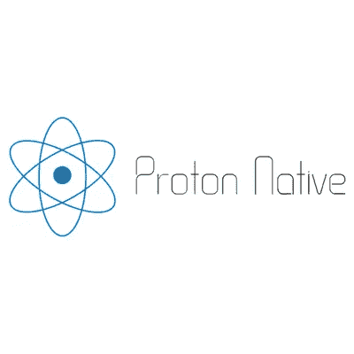

# 二月份十大新开发工具

> 原文：<https://medium.com/hackernoon/top-10-new-developer-tools-of-february-ff7999977e84>

我们最喜欢做的事情是找到最热门、最令人兴奋的新开发工具，并与您分享。如果你[订阅我们的每周时事通讯](https://stackshare.io/weekly)，你每周都会得到内幕消息！但是，让我们在另一个月末花点时间来庆祝一下在整个二月份添加的最受欢迎的新工具。

这些是 2018 年 2 月添加到 StackShare 数据库的 10 大新工具。

# #1: [俳句](https://stackshare.io/haiku)

*构建和设计跨平台的用户界面和动画*

“俳句让你设计和建造互动的，视觉上令人惊叹的用户界面，”创作者扎克·布朗说。“俳句与 After Effects 和 Flash 有很多共同之处:它是一个时间轴驱动的动画工具，支持通过代码进行交互——但与 After Effects 不同，它旨在设计用户界面，也与 Flash 不同，它建立在开放标准和开源、可黑客攻击的渲染器&文件格式上。俳句就是让设计和代码更紧密地结合在一起。”

[查看网站](https://www.haiku.ai/) | [查看工具简介](https://stackshare.io/haiku)

# #2: [重设密钥](https://stackshare.io/rekit)

*使用 React、Redux 和 React-router 构建可扩展 web 应用的工具包*

Nate Wang 创建了 Rekit，因为他觉得创建 React Redux 应用程序需要太多冗长的样板代码。“Rekit 有助于自动生成它们，并且很容易重构它们，”他说。“当 web 应用程序项目扩展时，保持其可读性、可理解性和可维护性非常重要。Rekit 提出了一种自以为是的模式，以可伸缩的方式组织文件和文件夹，并提供 IDE/工具来帮助您始终遵循这种方法。”

Rekit 与类似工具相比如何，它如何更好？王说“Rekit studio 是一个理解你的 web 项目的 IDE 它知道特性、组件、动作和路由规则，所以它可以以有意义的方式显示和管理它们，而其他 ide 更像是只知道文件夹、文件的代码编辑器。”

[查看网站](http://rekit.js.org/) | [查看工具简介](https://stackshare.io/rekit)

# #3: [帝王龙](https://stackshare.io/docusaurus)

*易于维护的开源文档网站*

脸书工程师 Joel Marcey [说](https://docusaurus.io/blog/2017/12/14/introducing-docusaurus.html)他的团队创造 Docusaurus 有几个原因:

*   把重点放在编写好的文档上，而不是担心网站的基础设施。
*   提供我们许多开源网站需要的功能，如博客支持、搜索和版本控制。
*   使向每个人一次推送更新、新特性和错误修复变得容易。
*   最后，为我们所有的开源项目提供一致的外观和感觉。

“在脸书，”Marcey 说，“Docusaurus 让我们能够快速启动不同的项目，并通过文档网站运行，特别是对于那些没有太多 web 开发经验的团队，或者主要想要一个基本的网站来展示他们的项目。”

[查看网站](https://docusaurus.io/) | [查看工具简介](https://stackshare.io/docusaurus)

# #4: [质子原生](https://stackshare.io/proton-native)

*跨平台原生桌面应用的 React 环境*

古斯塔夫·汉森最初创建 Proton Native“是因为我必须为另一个项目创建一个复杂的 GUI，我不明白为什么这么简单的事情会变得如此困难。我有将近 1K 行代码，是重复的，也不太复杂。我试图在 PyQt 中创建它，但它变得一团糟。”Hansen 已经使用了 React 很多次，并且很喜欢这个工作流，所以“我决定看看是否有人为桌面做了类似的事情。什么都找不到，就自己做了。它很快演变成对电子产品膨胀和桌面开发分裂的回应。”

[查看网站](https://proton-native.js.org/#/?ref=stackshare) | [查看工具简介](https://stackshare.io/proton-native)

# #5: [Apache OpenWhisk](https://stackshare.io/apache-openwhisk)

*无服务器的开源云平台*

Apache 的 OpenWhisk 主页是这样描述这个工具的:“作为开发人员，没有必要管理运行代码的服务器。Apache OpenWhisk 为您操作和扩展您的应用程序。花时间创新，而不是配置基础设施。此外，您只需为您的应用目前使用和需要的内容付费。”

[查看网站](https://openwhisk.apache.org/) | [查看工具简介](https://stackshare.io/apache-openwhisk)

# #6: [迷宫](https://stackshare.io/maze)

*创建测试人员将在你的 InVision 原型上执行的任务，并学习如何用零线代码改进你的产品设计。*

“太多的企业浪费了大量的时间和金钱来构建功能，只是意识到设计根本不起作用，”迷宫的创造者乔纳森·威达克斯基说。“这导致了沮丧，因为团队最终重建了新的功能，而不是实现新的功能。

“我们意识到有一种方法可以在过程的更早阶段收集数据:在原型阶段进行定量用户测试，快速有效地迭代，直到你的设计得到验证。这就是我们创建 Maze 的原因:基于您的 InVision 原型构建的经济实惠的分析和测试解决方案。”

此外，他说，“Maze 基于设计者已经使用的工具(InVision)，不需要测试人员安装任何东西。”

[访问网站](https://maze.design/) | [访问工具简介](https://stackshare.io/maze)

# #7: [布拉索](https://stackshare.io/blazor)

*使用 C#/Razor 和 HTML 的实验性 web UI 框架，通过 WebAssembly 在浏览器中运行*

Blazor 的创建者微软的 Steve Sanderson 将 Blazor 构建成一个 web 框架，利用 Web 组装来运行。NET 在任何浏览器。“Blazor 目前是一个实验项目，处于开发的早期阶段……目前还没有可供下载的版本。”但“如果你感兴趣，你可以克隆回购协议，构建它，并运行测试。”

[查看网站](https://github.com/aspnet/Blazor) | [查看工具简介](https://stackshare.io/blazor)

# #8: [点网格](https://stackshare.io/dotmesh)

*使用类似 git 的 CLI 捕获、组织和共享应用程序状态*

创建者 Luke Marsden 表示:“我们创建 dotmesh 是因为数据在控制圈中缺失:虽然使用版本控制、自动化测试和 CI 来管理代码更改对现代开发人员来说是显而易见的，使用 Terraform 等声明性工具来管理云资源对现代开发人员来说也是显而易见的，但您应用程序中的数据却无人问津。借助 dotmesh，您可以在一次提交和分支中捕获多个微服务数据存储的状态，并在软件生命周期的各个阶段(如开发、CI、试运行和(即将)生产)之间推/拉它们。"

虽然在交互模式和命令方面有意与 Git 相似(以确保开发人员熟悉它)，但 Marsden 表示 dotmesh 在三个重要方面有所不同。“首先，它支持高效地拍摄大型数据库(例如 Postgres 数据库)的快照，而 Git 并不支持这一点；其次，它支持一个名为 subdots 的功能，该功能允许在一次提交中捕获多个数据存储，以便您可以一次性捕获整个应用程序的状态，即使它是一个具有多语言持久性的微服务应用程序；第三，它支持开箱即用的集群，这意味着它可以在单个 docker 主机(例如笔记本电脑上的 Docker for Mac)上运行，一直到您的生产 Kubernetes 集群(例如 GKE)。”

在 dotmesh 的[文档](https://docs.dotmesh.com/)和“请给我们关于时差的反馈；作为一家新的创业公司，我们非常渴望听到用户的反馈！”

[查看网站](https://dotmesh.com/) | [查看工具简介](https://stackshare.io/dotmesh)

# #9: [弹出通知](https://stackshare.io/popcorn-notify)

*从一个 API 发送简单的电子邮件和短信*

PopcornNotify 的创建者 Jason Strauss 说:“开发人员希望从他们的代码中发送通知是很常见的。“有发送电子邮件和短信的工具，但它们需要一些配置:购买电话号码、验证域名等。

“这些配置在与用户交流时非常重要，但对于内部消息来说并不重要，比如‘服务器已关闭’或‘您的长脚本已完成运行’。”我构建了 PopcornNotify，因为我有几个小项目和内部工具，我想要一种简单、自动化的方式从它们向自己发送消息。"

[查看网站](https://popcornnotify.com/) | [查看工具简介](https://stackshare.io/popcorn-notify)

# #10: [Airtap](https://stackshare.io/airtap)

*在 800 多种浏览器中测试您的 JavaScript*

“Airtap 与其他跨浏览器测试程序的不同之处在于它的简单性和在许多浏览器中轻松运行测试套件的能力，而无需在本地安装它们。它让您可以在开发过程中快速迭代，并在发布前提供良好的浏览器覆盖，而不必担心错过受支持的浏览器。”

[查看网站](https://github.com/airtap/airtap) | [查看工具简介](https://stackshare.io/airtap)

如果您使用并喜欢这些新工具，请务必将它们添加到您的堆栈和您的 [News](https://stackshare.io/news) feed 中！现在让我们为下一个月的新工具做好准备！

*最初发表于*[*stack share . io*](https://stackshare.io/posts/dev-tools-roundup-3)*。*