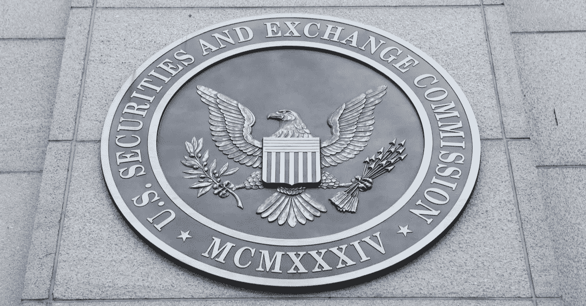

# 美国证券交易委员会和 CFTC 国会关于加密货币证词的 10 大要点

> 原文：<https://medium.com/hackernoon/top-10-points-made-by-the-sec-and-cftc-congress-testimony-on-cryptocurrencies-f4c71712624c>

今天，SEC 主席 Jay Clayton 和 CFTC 主席 Christopher Giancarlo 在国会就加密货币作证。以下是杰伊·克莱顿评论中最重要的 10 点:

1.比特币和以太不一定是货币。“简单地称某种东西为货币或基于货币的产品，并不意味着它不是一种证券。”

2.大多数公用代币都是证券。“仅仅将令牌称为‘实用’令牌或对其进行结构化以提供某种实用功能，并不妨碍令牌成为一种证券。”

3.所以大部分 ico 都是证券的买卖。“总的来说，我所看到的 ico 结构涉及证券的发行和销售，并直接涉及证券登记要求。”

4.投资者交易代币的交易所实际上不是交易所，因为它们没有在美国证券交易委员会注册。“许多交易平台甚至被称为‘交易所’我担心这种外表具有欺骗性。在现实中，在这些交易平台上交易的投资者无法获得他们在注册交易所或替代交易系统上通过经纪自营商交易时所能获得的许多市场保护。"

5.没有 ico 在 SEC 注册，SEC 也没有批准任何交易所交易基金或其他与加密货币相关的资产。"如果今天有人说不是这样，投资者应该特别警惕."

6.迄今为止，ico 一直容易受到数字黑客的攻击。“ICOs 产生的 10%的收益——或近 4 亿美元——在这类攻击中损失殆尽。”

7.必须实施反洗钱和了解客户的法律。“市场参与者应该将加密货币的支付和其他交易视为现金从一方转移到另一方。”

8.平台、营销代理等 ICO 推广人应注意不要从事销售未注册证券。"从事证券销售业务通常需要许可证."

9.市场已经成熟，可以进行各种各样的欺诈。“经验表明，在交易清淡、波动剧烈的市场中，过度吹捧可能是倒卖、泵送和倾销以及其他操纵和欺诈行为的一个迹象。”

10.执法司新成立的网络部门将更加积极地对违法者采取执法行动。“我已经要求证交会执法部门继续大力监管这些市场，并建议对那些违反联邦证券法进行 ico 或从事其他与加密货币有关的行为的人采取执法行动。”

很明显，美国证券交易委员会正在确保投资者得到保护，那些藐视证券法的人被绳之以法。