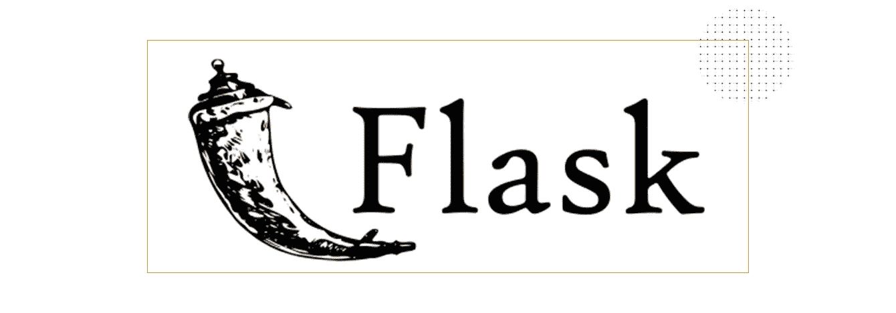
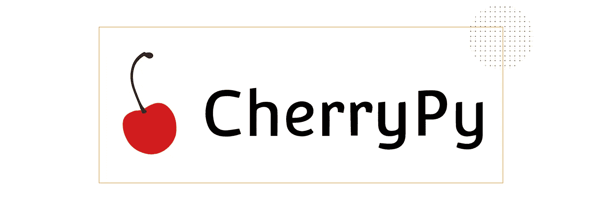
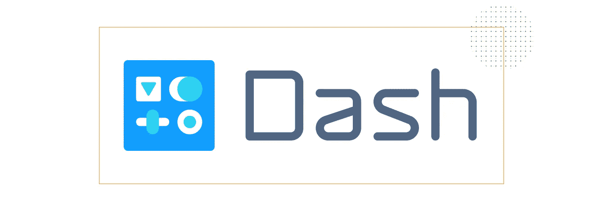

# 2018 年要学习的 10 大 Python Web 框架

> 原文：<https://medium.com/hackernoon/top-10-python-web-frameworks-to-learn-in-2018-b2ebab969d1a>

框架通过为应用程序开发提供一种结构，使开发人员的生活变得更加轻松。它们自动化了通用解决方案的实现，减少了开发时间，并允许开发人员更多地关注应用程序逻辑，而不是常规元素。

在这篇文章中，我们分享了我们自己的十大 Python web 框架列表，我们相信这些框架会对你成为专业后端开发人员和提高现有技能有所帮助。请记住，这些框架的列出没有特定的顺序:我们关注的是展示你能够做什么，而不是告诉你应该做什么。

# 一些需要考虑的事情

在决定使用哪个框架时，要考虑项目的规模和复杂性。如果你要开发的是一个包含各种特性和需求的大型系统，那么全栈框架可能是正确的选择。如果你的应用程序更小更简单，你也许应该考虑微框架。

你可以在这里找到关于一些框架[的类型和焦点的信息。然而，最终的决定应该来自于你对你的项目和你想要简化的任务的理解。](https://wiki.python.org/moin/WebFrameworks)

然而，框架也可能阻碍开发。当选择全栈框架时，您通常会受到一系列限制。当然，你可以找到解决它们的方法，但是要小心，你不要花比用纯 [Python](https://hackernoon.com/tagged/python) 编写应用程序更多的时间来争取你自己的自由。

# 全栈框架

# 姜戈

[官网](https://www.djangoproject.com/)|[GitHub](https://github.com/django)|[PyPI](https://pypi.python.org/pypi/Django/1.11.1)|[牛逼](https://github.com/rosarior/awesome-django)

GitHub Stars:31592 | GitHub Forks:13361

Django 是一个免费的开源全栈 Python 框架。默认情况下，它试图包含所有必要的特性，而不是将它们作为单独的库提供。

Django 的一些典型特性是它的[认证](https://docs.djangoproject.com/en/dev/topics/auth/)、 [URL 路由、](https://docs.djangoproject.com/en/dev/topics/http/urls/)、[模板引擎](https://www.fullstackpython.com/django-templates.html)、[对象关系映射器](https://www.fullstackpython.com/object-relational-mappers-orms.html) (ORM)和[数据库模式迁移](https://docs.djangoproject.com/en/dev/topics/migrations/) (Django v.1.7+)。

Django 使用它的 ORM 将对象映射到数据库表。相同的代码适用于不同的数据库，从一个数据库转移到另一个数据库并不困难。Django 使用的主要数据库是 [PostgreSQL](https://www.postgresql.org/) 、 [MySQL](https://www.mysql.com/) 、 [SQLite](https://www.sqlite.org//index.html) 和 [Oracle](https://www.oracle.com/index.html) ，但是第三方驱动程序也允许您使用其他数据库。

在 SteelKiwi，我们使用 Django 作为后端开发的主要框架。如果你想看看我们已经用 Django 开发的令人惊叹的应用，请访问我们的[项目页面。](https://steelkiwi.com/projects/)

# 金字塔

[官网](https://trypyramid.com/)|[GitHub](https://github.com/Pylons/pyramid)|[PyPI](https://pypi.python.org/pypi/pyramid)|[牛逼](https://github.com/uralbash/awesome-pyramid)

GitHub Stars:2640 | GitHub Forks:782

Pyramid 是一个开源的基于 Python 的 web 应用框架。它的主要目标是以最小的复杂度做尽可能多的事情。

Pyramid 最显著的特点是它能够很好地处理小型和大型应用程序。金字塔的一些重要功能包括:

*   单文件应用程序
*   [网址生成](https://docs.pylonsproject.org/projects/pyramid/en/latest/api/url.html)
*   [可扩展配置](https://trypyramid.com/resources-extending-pyramid.html)
*   包罗万象的[模板](https://docs.pylonsproject.org/projects/pyramid/en/latest/narr/templates.html)和[资产规格](https://docs.pylonsproject.org/projects/pyramid/en/latest/narr/assets.html)
*   灵活的[认证](https://docs.pylonsproject.org/projects/pyramid/en/latest/api/authentication.html)和[授权](https://docs.pylonsproject.org/projects/pyramid/en/latest/api/authorization.html)
*   [测试](https://docs.pylonsproject.org/projects/pyramid/en/latest/narr/testing.html)，支持和[综合数据文档](https://docs.pylonsproject.org/projects/pyramid/en/latest/narr/introduction.html)
*   [视图谓词](https://docs.pylonsproject.org/projects/pyramid/en/latest/narr/viewconfig.html)和许多每条路线视图
*   [功能装饰者](https://docs.pylonsproject.org/projects/pyramid/en/latest/narr/viewconfig.html#mapping-views-using-a-decorator-section)
*   [谓词](https://docs.pylonsproject.org/projects/pyramid/en/latest/narr/viewconfig.html#view-configuration-parameters)
*   [渲染器](https://docs.pylonsproject.org/projects/pyramid/en/latest/narr/renderers.html)

# 涡轮齿轮

[官网](http://www.turbogears.org/)|[GitHub](https://github.com/TurboGears/tg2/)|[PyPI](https://pypi.python.org/pypi/TurboGears2/2.3.11)

GitHub 星级:230 | GitHub 分叉:56

TurboGears 是一个开源的、数据驱动的全栈 web 应用框架。

它允许您快速开发可扩展的数据驱动的 web 应用程序。TurboGears 附带了用户友好的模板和强大灵活的 ORM。

涡轮齿轮公司的一些显著特征包括:

*   多数据库支持
*   MVC 风格的架构
*   支持 [SQLObject](https://pypi.python.org/pypi/SQLObject) 和 [SQLAlchemy](https://www.sqlalchemy.org/)
*   首选模板语言中包含的 [Kid](http://www.kid-templating.org/) 和[石根](https://genshi.edgewall.org/)
*   用 [FormEncode](http://www.formencode.org/en/latest/) 验证
*   作为网络服务器的挂架
*   [ToscaWidgets，](http://www.toscawidgets.org/)简化前端设计和服务器开发协调的应用程序库
*   [粘贴脚本](https://pypi.python.org/pypi/PasteScript)模板
*   基于 WSGI 的前端服务器([粘贴 HTTP 服务器](http://paste.readthedocs.io/en/latest/paste-httpserver-threadpool.html)、 [CherryPy WSGI/HTTP 服务器、](http://cherrypy.org/)等。)
*   命令行工具
*   [MochiKit JavaScript 库](https://mochi.github.io/mochikit/)集成
*   所有功能都作为函数装饰器实现

# Web2py

[官网](http://www.web2py.com/)|[GitHub](https://github.com/web2py)|[PyPI](https://pypi.python.org/pypi/web2py)

GitHub 星级:1，536 | GitHub 分叉:742

Web2py 是一个可扩展的开源全栈 Python 框架。但是，在进一步阅读之前，您应该知道 Web2py 不支持 Python 3。

然而，Web2py 的伟大之处在于它自带基于 Web 的 idea，其中包括代码编辑器、调试器和一键部署。

其他有价值的 Web2py 特性包括:

*   对安装和配置没有要求
*   能够在 Windows、Mac、Linux/Unix、 [Google App Engine](https://cloud.google.com/appengine/docs/) 、 [Amazon EC2](https://aws.amazon.com/ec2/) 以及任何支持 Python 2.5–2.7 或 Java+Python 的虚拟主机上运行
*   多种协议的可读性
*   防止跨站点脚本、注入缺陷和恶意文件执行等漏洞的数据安全性
*   成功运用软件工程实践，使代码易于阅读和维护
*   错误跟踪、彻底的错误记录和标签
*   [基于角色的访问控制](http://web2py.com/books/default/chapter/29/09/access-control)
*   支持[国际化](http://web2py.com/books/default/chapter/29/04/the-core#Internationalization--and-Pluralization-with-T)
*   向后兼容，确保面向用户的进步，而不需要失去与早期版本的联系

# 微框架

# 瓶

[官网](http://flask.pocoo.org/)|[GitHub](https://github.com/pallets/flask/)|[PyPI](https://pypi.python.org/pypi/Flask/0.12)|[牛逼](https://github.com/humiaozuzu/awesome-flask)

Github 星级:32，959 | GitHub 分叉:10，254

Flask 是一个在 BSD 许可下可用的 Python 框架。它的灵感来自于 Sinatra Ruby 框架。Flask 依赖于 [Werkzeug WSGI 工具包](http://werkzeug.pocoo.org/)和 [Jinja2](http://quintagroup.com/cms/python/jinja2) 模板。

Flask 背后的主要思想是帮助构建一个坚实的 web 应用程序基础。从那里，您可以使用您可能需要的任何扩展。

Flask 的轻量级和模块化设计使它很容易适应开发人员的需求。它包括许多有用的开箱即用功能:

*   内置的开发服务器和快速调试器
*   对[单元测试](http://flask.pocoo.org/docs/0.12/testing/)的集成支持
*   [RESTful 请求调度](http://flask-restful.readthedocs.io/en/0.3.5/quickstart.html)
*   [Jinja2 模板](http://flask.pocoo.org/docs/0.12/templating/)
*   安全 cookies 支持(客户端会话)
*   符合 WSGI 1.0
*   基于 Unicode 的
*   能够插入任何 ORM
*   HTTP 请求处理

# 瓶子

[官网](http://bottlepy.org/docs/dev/index.html)|[GitHub](https://github.com/bottlepy/bottle)|[PyPI](https://pypi.python.org/pypi/bottle/0.12.13)

GitHub Stars:5198 | GitHub Forks:1065

瓶子是一个微型框架。最初是为了构建 API，Bottle 实现了单个源文件中的所有内容。除了 [Python 标准库之外，它没有任何依赖项。](https://docs.python.org/3/library/)用 Bottle 编码比用任何全栈框架编码更接近金属。

它的默认特性包括路由、模板、实用程序，以及对 [WSGI](http://wsgi.readthedocs.io/en/latest/) 标准的基本抽象。

*   路由—支持对函数调用映射的请求，允许您获得干净的动态 URL
*   模板——一个快速且灵活的模板引擎,完全支持 [mako](http://www.makotemplates.org/) 、 [jinja2](http://jinja.pocoo.org/) 和 [cheetah](http://cheetahtemplate.org/)
*   实用程序—轻松访问表单数据、文件上传、cookies、标题和其他与 HTTP 相关的元数据
*   服务器——一个内置的 HTTP 开发服务器，支持 [fapws3](https://github.com/william-os4y/fapws3) 、 [bjoern](https://github.com/jonashaag/bjoern) 、 [GAE](https://cloud.google.com/appengine/docs/) 、[сherry py](http://cherrypy.org/)以及任何其他支持 WSGI 的 HTTP 服务器

Bottle 是构建原型、学习 web 框架的组织以及构建简单的个人应用程序的完美解决方案。

# 樱桃派

[官网](http://cherrypy.org/)|[GitHub](https://github.com/cherrypy/cherrypy)|[PyPI](https://pypi.python.org/pypi/CherryPy)

GitHub 星级:595 | GitHub 分叉:161

CherryPy 是一个开源的、极简主义的 web 框架。这使得构建 Python web 应用程序与构建任何其他面向对象的程序没有什么不同。

事实上，CherryPy 支持的 web 应用程序是一个独立的 Python 应用程序，它嵌入了自己的多线程 web 服务器。CherryPy 应用可以在任何支持 Python 的操作系统上运行(Windows、macOS、Linux 等。).它们可以部署在任何可以运行普通 Python 应用程序的地方。对于 CherryPy 应用程序，你不需要 [Apache](https://www.apache.org/) ，但是你可以在 Apache 后面运行 CherryPy 应用程序，就像你可以在 [Lighttpd](https://www.lighttpd.net/) 或 [IIS](https://www.iis.net/) 后面运行它一样。

CherryPy 不是一个限制性很强的框架，因为它允许您使用任何类型的技术进行模板化、数据访问等等。然而，它仍然能够处理会话、静态数据、cookies、文件上传以及 web 框架通常可以处理的所有事情。

## 一些默认的 CherryPy 特性包括:

*   一个符合 HTTP/1.1 的 WSGI 线程池 web 服务器
*   一次运行多个 HTTP 服务器的简单性
*   一个[强大的配置系统](http://docs.cherrypy.org/en/latest/basics.html#config)
*   一个[灵活的插件系统](http://docs.cherrypy.org/en/latest/extend.html#server-wide-functions)
*   用于[缓存](http://docs.cherrypy.org/en/latest/pkg/cherrypy.lib.html#module-cherrypy.lib.caching)、[编码](http://docs.cherrypy.org/en/latest/_modules/cherrypy/lib/encoding.html)、[会话](http://docs.cherrypy.org/en/latest/basics.html#using-sessions)、[认证](http://docs.cherrypy.org/en/latest/basics.html#authentication)、[静态内容](http://docs.cherrypy.org/en/latest/basics.html#static-content-serving)、[等等](http://docs.cherrypy.org/en/latest/extend.html#per-request-functions)的现成工具
*   内置对[剖析](http://docs.cherrypy.org/en/latest/pkg/cherrypy.lib.html?highlight=profiler#module-cherrypy.lib.profiler)、[覆盖](http://docs.cherrypy.org/en/latest/pkg/cherrypy.lib.html?highlight=cover#module-cherrypy.lib.covercp)和[测试](http://docs.cherrypy.org/en/latest/advanced.html#testing-your-application)的支持
*   能够在 [Python 2.7+](https://www.python.org/download/releases/2.7/) 、 [Python 3.1+](https://www.python.org/download/releases/3.1/) 、[pypypy](https://pypy.org/)、 [Jython](http://www.jython.org/) 和 [Android](http://www.defuze.org/archives/228-running-cherrypy-on-android-with-sl4a.html) 上运行

# 异步框架

# 萨尼奇

[官网](http://sanic.readthedocs.io/en/latest/)|[GitHub](https://github.com/channelcat/sanic)|[PyPI](https://pypi.python.org/pypi/Sanic)

GitHub 星级:8，488 | GitHub 分叉:776

Sanic 是一个 Python web 框架，构建在 [uvloop](https://github.com/MagicStack/uvloop) 之上，专门为通过异步请求处理实现快速 HTTP 响应而创建。

它运行在 [Python 3.5+上。Sanic 支持异步请求处理程序，这使得它与 Python 3.5 的异步/等待功能兼容。这提高了它的速度，提供了无阻塞能力。](https://www.python.org/downloads/release/python-350/)

在一个有一个进程和 100 个连接的基准测试中，Sanic 每秒能够处理 33，342 个请求。

# 龙卷风

[官网](http://www.tornadoweb.org/en/latest/)|[GitHub](https://github.com/tornadoweb/tornado)|[PyPI](https://pypi.python.org/pypi/tornado)

GitHub 星级:15，126 | GitHub 分叉:4，432

Tornado 是一个 Python web 框架和异步网络库。它使用非阻塞网络 I/O，并解决了 C10k 问题(这意味着，如果配置正确，它可以处理 10，000 多个并发连接)。

这使得它成为构建需要高性能和成千上万并发用户的应用程序的绝佳工具。

龙卷风的主要特征是:

*   内置支持[用户认证](http://www.tornadoweb.org/en/stable/guide/security.html)
*   实时服务
*   高质量性能
*   基于 Python 的 [web 模板化](http://www.tornadoweb.org/en/stable/guide/templates.html)语言
*   无阻塞 [HTTP 客户端](http://www.tornadoweb.org/en/stable/httpclient.html)
*   实施[第三方认证和授权](http://www.tornadoweb.org/en/stable/auth.html)方案( [Google OpenID/OAuth](https://developers.google.com/identity/protocols/OpenIDConnect) 、脸书登录、[雅虎 BBAuth](https://developer.yahoo.com/auth/) 、FriendFeed OpenID/OAuth、 [Twitter OAuth](https://developer.twitter.com/en/docs/basics/authentication/overview/oauth) )
*   支持[翻译和本地化](http://www.tornadoweb.org/en/stable/locale.html)

# 其他的

# 破折号

[官网](https://plot.ly/products/dash/)|[GitHub](https://github.com/plotly/dash/)|[PyPI](https://pypi.python.org/pypi/dash)|[牛逼](https://github.com/Acrotrend/awesome-dash)

GitHub 星级:3,903 | GitHub 分叉:360

Dash 是一个开源 Python 框架，用于构建分析性 web 应用程序。这对于不太熟悉 web 开发的 Python 数据科学家来说尤其有用。

Dash 应用程序是运行 Flask 的 web 服务器，通过 HTTP 请求与 JSON 包通信。他们的前端用 [React.js.](https://reactjs.org/) 渲染组件

用 Dash 开发的应用程序呈现在 web 浏览器中，可以部署到服务器上。这也意味着 Dash 应用天生就是跨平台和移动就绪的。

Dash 开发人员可以访问底层 Flask 实例及其所有可配置的属性。为了扩展 Dash 应用程序的功能，开发人员还可以使用丰富的 [Flask 插件。](http://flask.pocoo.org/extensions/)

# 选择 Python web 框架

开发一个成功的项目可能只需要一个合适的框架。我们真的希望你在这篇文章中找到了一个有趣的框架。[我们还有另一个，2017 年 17 个最佳 Python web 框架，](https://steelkiwi.com/blog/best-python-web-frameworks-to-learn/)如果你有兴趣探索更多选项。

我们希望您访问我们的[公司 GitHub 页面](https://github.com/steelkiwi)。我们的开发人员正努力在科技领域创新，参与的人越多越好。