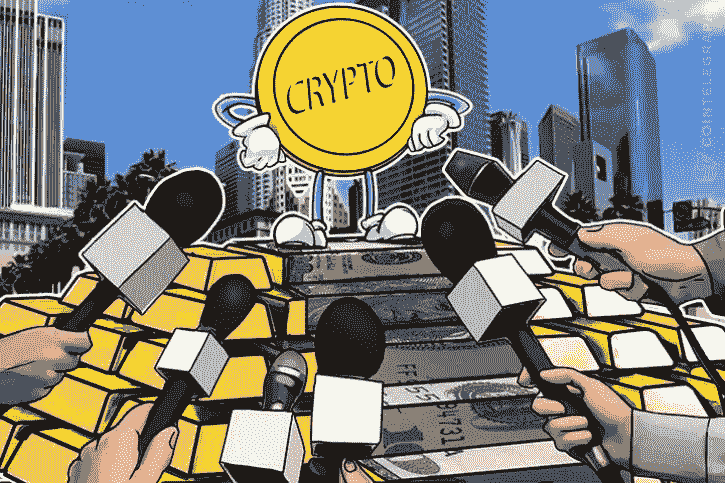

# 你的 ICO 社区会问的 10 大问题

> 原文：<https://medium.com/hackernoon/top-10-questions-your-ico-community-will-ask-3a8ffe7f978e>

你应该准备好回答。

Community Needs Answers To Invest With Confidence

这些天来，ICO 社区或者说整个区块链空间变得更加智能。如果是在 2016 年或更早的时候，你可以通过提出一个伟大的想法并为其编写一份有吸引力且易于理解的白皮书来获得数百万美元。

2017 年，除了想法和白皮书，成功很大程度上取决于你能让[加入](https://hackernoon.com/tagged/onboard)成为顾问或团队成员的行业资深人士的数量和姓名(我称之为面值资本化)。

然而，这是 2018 年。这个时候，社区变得更加聪明，对[区块链](https://hackernoon.com/tagged/blockchain)有了更好的理解，并准备好了你需要回答的问题**如果你想让你的项目有机会筹集资金并达到上限。**

这些问题通常会让最有经验的人感到惊讶，也可能会让你成功或失败。虽然人们会问很多这样的问题，但以下是如今最常被问到的 10 个问题:

**10。你的赏金/空投需要 KYC 吗？**

**9。我什么时候可以得到我的(赏金/空投/购买)代币？**

**8** 。你的平台(或其特定功能)将如何工作？

**7。为什么你在(任何评级网站)上的评级这么低？**

6。 **你已经募集了多少资金？**

**5。** **你比 X 怎么样(X 是你的竞争对手)？**

**4。你的赏金/空投需要 KYC 吗？**

**3。你的代币什么时候上市？**

**2。ico 在我的国家不合法，我还能参加吗？**

1.  **为什么这个项目不是骗局？**

这些问题没有“正确”的答案。这个列表只是让你了解你应该有答案的问题类型。

然而，最后一个问题是最近出现在大多数 ICO 社区团体中的一个问题，即使是老手也觉得很难回答。

就像古老的招聘问题“我们为什么要雇用你？”，如果回答正确足以让你得到梦想中的工作，那么“为什么你的项目不是骗局”这个问题可以鼓励你的社区和投资者充满信心地投资。

如果你也面临任何这样的问题，让你思考，让我和社区知道他们在下面。