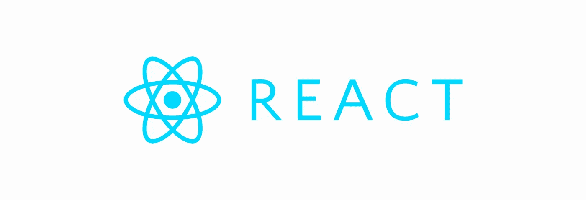
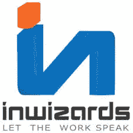
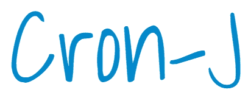
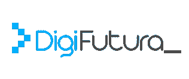
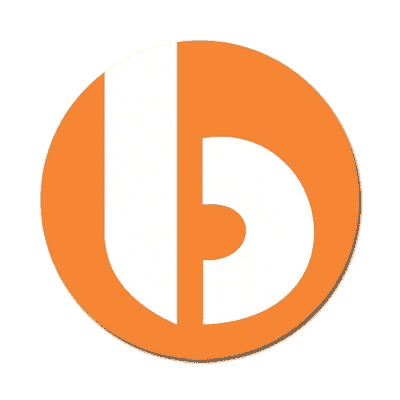
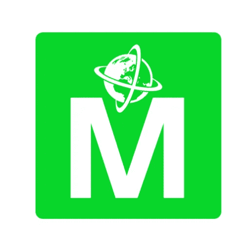
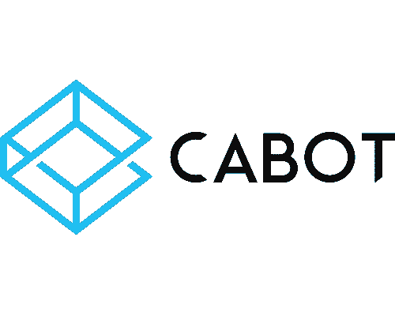
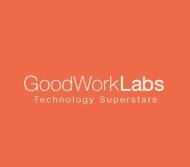

# 印度十大 React 开发公司

> 原文：<https://medium.com/hackernoon/top-10-react-development-companies-in-india-a7d65b4e8fdd>

React 是由脸书创建的用于构建用户界面的开源 JavaScript 库。通过使用 React 进行 web 开发，开发人员可以轻松地管理网站的内容和数据。

根据最近的一项统计，React 目前在互联网上超过 45%的网站中使用。主要品牌如网飞、脸书、Instagram 等。由 React 提供动力。

这还不是全部！2015 年，脸书宣布推出 React Native，这是一个新的 JavaScript 库，将 React 架构引入原生 Android、iOS 和 UWP 应用。

在这篇文章中，我将谈论印度十大 React 开发公司。

# 1.[极客](https://goo.gl/gP9wDt)

[GeekyAnts](https://goo.gl/gP9wDt) 成立于 2006 年，是一家位于班加罗尔的技术公司，专注于网络和移动应用开发。

[GeekyAnts](https://goo.gl/gP9wDt) 以使用 Node、React、React Native、Angular、Firebase、GraphQL 和许多其他技术创建 web 和移动应用程序而闻名。他们总是兴奋地尝试新技术，并且是谷歌的 Flutter、Vue 和 Kotlin 的早期采用者之一。

GeekyAnts 致力于构建行业领先的软件产品，取悦他们的客户，并回馈开发者社区。GeekyAnts 因其开源贡献而闻名，如[Native base](https://nativebase.io)—React Native 的 UI 组件库。他们的产品总是有一个开箱即用的特点。 [BuilderX](https://builderx.io) ，是 [GeekyAnts](https://goo.gl/gP9wDt) 的另一款产品，是一款会为你编写 React 原生代码的设计工具！

[GeekyAnts](https://goo.gl/gP9wDt) 还在 [NativeBase 市场](https://market.nativebase.io/)上销售优质内容，如入门套件、完整应用、UI 主题和动画。

**网站**:[https://goo.gl/gP9wDt](https://goo.gl/gP9wDt)

# 2. [WebClues Infotech](https://www.webcluesinfotech.com/)

[WebClues Infotech](https://www.webcluesinfotech.com/) 是一家提供有效和成功解决方案的 web 和移动应用程序设计和开发公司。众所周知，他们提供各种服务，如 web 开发、品牌、云计算、web 设计和移动应用程序开发。

自 2014 年成立以来， [WebClues Infotech](https://www.webcluesinfotech.com/) 致力于成为您在网站开发、网页设计、虚拟主机、企业解决方案、Android 和 iOS 技术方面需求的最佳解决方案。

【https://www.webcluesinfotech.com/】网站 : [网站](https://www.webcluesinfotech.com/)

# [Inwizards](https://inwizards.com/)

[Inwizards](https://inwizards.com/) 是一个高度结构化、以绩效为导向和以客户为中心的组织。 [Inwizards](https://inwizards.com/) 遵循发展和可持续的理念，带来服务和业务质量的改变。

[Inwizards](https://inwizards.com/) 成立于 2009 年，专业从事网站&移动应用开发、电子商务解决方案、React、React Native、Phonegap、Titanium 等。

**网站**:[https://inwizards.com/](https://inwizards.com/)

# 4.克朗吉

作为其早期采用者之一，CronJ 是该国最重要的 React 开发公司之一。CronJ 的开发人员非常有能力和毅力。他们精通最新技术，能够在需要时提供最佳服务和解决方案。

**网站**:[https://www.cronj.com/](https://www.cronj.com/)

# 5. [DigiFutura](https://www.digifutura.com/)

DigiFutura 是一家位于班加罗尔的应用程序开发公司，专门为初创公司开发 MVP。它专注于创造引人注目用户体验，设计数字体验，为初创公司和中小企业构建一流高度可扩展 web 和移动应用程序。

DigiFutura 已经能够使用 React、React Native、Node、Ruby on Rails、Python 和 Meteor 成功交付出色的可扩展应用。

**网站**:【https://www.digifutura.com/】T4

# 6. [Bacancy](https://www.bacancytechnology.com/)

[Bacancy Technology](https://www.bacancytechnology.com/) 拥有 130 多名开发人员，分布在 7 个不同的国家，致力于在产品开发的每个阶段(从规划到交付)提供价值和高性能。

**网站**:[https://www.bacancytechnology.com/](https://www.bacancytechnology.com/)

# 7.[移动电话](https://www.mobiloitte.com/)

工作了十多年， [Mobiloitte](https://www.mobiloitte.com/) 是一个提供全面服务的移动和 web 应用程序开发团队。 [Mobiloitte](https://www.mobiloitte.com/) 善于在早期采用新技术，始终保持领先地位。

**网站**:https://www.mobiloitte.com/

# 8.[卡伯特](https://www.cabotsolutions.com/)

[Cabot](https://www.cabotsolutions.com/)technology Solutions 是一家基于价值的产品工程 IT 公司，使用最先进的技术提供高价值和稳健的解决方案。

成立于 2006 年， [Cabot](https://www.cabotsolutions.com/) 已经为多个行业领域的不同客户交付了 500 多个项目。今天 [Cabot](https://www.cabotsolutions.com/) 拥有 3 个全球办事处(印度、阿联酋、美国)和 100 多名员工。

**网站**:[https://www.cabotsolutions.com/](https://www.cabotsolutions.com/)

# 9.[云种子](https://www.cloudseed.technology/)

[Cloudseed](https://www.cloudseed.technology/) Technologies 成立于 2015 年，是一家专注于云、移动、物联网中间件集成和用户体验的软件开发&服务公司。

**网站**:【https://www.cloudseed.technology/】T4

# 10. [GoodWorkLabs](https://www.goodworklabs.com/)

[GoodWorkLabs](https://www.goodworklabs.com/) 是一个新时代的精品软件实验室，提供尖端产品和解决方案。它成立于 2013 年，目前有大约 200 名开发人员和 UI/UX 设计师。

[GoodWorkLabs](https://www.goodworklabs.com/) 因其在以下领域的工作而闻名:

*   移动应用和网络/云/SaaS 产品
*   企业解决方案
*   UX/用户界面设计
*   游戏开发

**网站**:[https://www.goodworklabs.com/](https://www.goodworklabs.com/)

# 包扎

我根据以下参数筛选出了这些公司:

*   关键词分析
*   第三方网站
*   客户满意度评级
*   玻璃门评级
*   公司投资组合

感谢您的阅读！请👏如果你喜欢这篇文章。