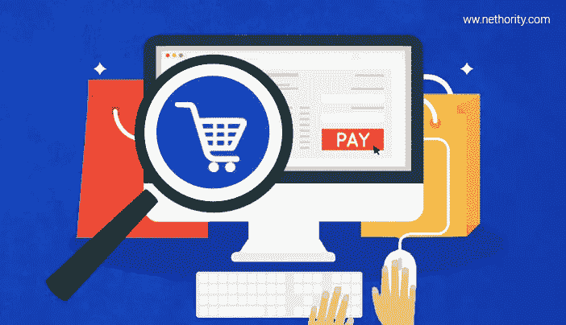
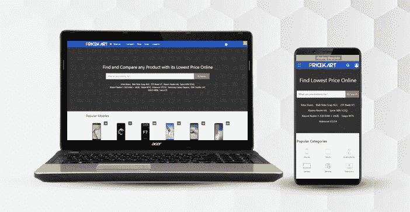

# 2018 年电子商务网站十大搜索引擎优化技巧

> 原文：<https://medium.com/hackernoon/top-10-seo-tips-for-ecommerce-websites-2018-6e926b484032>

如果你拥有一个电子商务网站，并希望优化搜索引擎优化，那么！这篇文章是你的指南。如果你的客户在网上找不到你，你将如何销售？在搜索引擎上获得可见性和更高的搜索排名对销售非常重要。

电子商务网站的 SEO 不同于其他类型网站的 SEO。我们将帮助您接触潜在客户，同时提高收入和品牌知名度。如果你有一个电子商务商店，那么你会同意:

*   你有很多页。
*   每天都有许多自动生成的 URL 添加到您的网站中。
*   你的网站上可能会有很多内容相同的页面。
*   你不能去优化每一个页面，因为这可能会成为一个无休止的任务。

不要担心，我们这里有一些惊人的技巧，将帮助您优化您的电子商务网站的搜索引擎优化，并增加您的流量和转化率。你也可以让专家来做。查看 [**电商 SEO 包**](http://www.nethority.com/packages/e-commerce-seo-packages/)

我们开始吧，

# 1)清理不需要的页面。

你的网上商店可能有很多产品页面，这些页面肯定已经断货很长时间了。如果你知道它们再也不会有货了，那么最好把这些页面从你的站点地图和列表页面中删除。不要删除这些页面，因为这可能会导致页面错误。您可以将 URL 重定向到其他类似的页面，或者将它们放入无索引标签中。重点是；我们不希望谷歌爬虫抓取这些不必要的页面，避开其他重要的页面。

# 2)所有页面的唯一标题和元标签。

现在，你已经有了大量的页面，你不能手动为每个页面编写标题和 Meta 标签。因此，解决方案是使用静态和动态文本组合来为所有产品页面设置唯一的标题和元标签。例如，你有“耐克运动鞋”和“耐克休闲鞋”作为产品。
标题标签可以是:“耐克运动鞋最优惠”。购买耐克休闲鞋的最低价格和最佳报价。
这里的静态文字是‘最低价’。“以最低价格购买”和动态文本是产品名称本身。因此，通过结合静态和动态文本，你可以为你所有的产品页面创建唯一的 Title & Meta 标签。

# 3)类别页面应该有一个单独的主页。

如果你已经把你的产品分成了不同的类别，比如小玩意，时尚，等等。然后，为小工具、时尚和生活方式等建立单独的主页。不要在一页上混合不同类别的产品，因为这会影响你的 UX。如果你发现很难优化你的电子商务商店，让专家来处理。查看我们的 [**电子商务 SEO 服务**](http://www.nethority.com/services/e-commerce-seo-services/)

# 4)使用规范的标签。

作为一个电子商务网站，你的网站可能有类似内容的网页。例如:如果你有一个红色、蓝色和粉红色的产品，那么你可能有三个不同的页面，它们的内容相似，只是颜色略有不同。因此，你需要告诉谷歌，这些页面可能看起来相似，但属于不同的产品。使用 rel 规范标签将帮助您管理您的重复内容。

# 5)针对谷歌的移动优先索引进行优化。

2018 年，谷歌已经决定先看看你网站的移动版，决定你的排名，然后再为你的网站检查桌面版。随着越来越多的人喜欢手机，你的大部分流量将来自移动设备。因此，你需要有一个能在手机上流畅运行的网站。让你的网上商店反应灵敏，方便移动。

以下是网站截图:**。这是你的网站在桌面和移动视图中的外观。**

****

# **6)优化你正在销售的产品的形象。**

**你的网上商店的每个产品页面都有许多你正在销售的产品的图片，对吗？确保你使用的每张图片都必须有一个“替代”文本。如果任何图像损坏，请小心移除或更换。此外，避免使用许多沉重的图像，这可能会增加您的网站的加载时间。在所有产品页面上保持相同的图像尺寸。**

# **7)区分 Sitemap.xml 中 URL 的优先级**

**因为你的网站有太多的页面，你需要优先排序你想首先被索引的 URL 或页面。将站点地图中的所有页面相加永远不会给你想要的结果，因为爬虫可能会抓取许多低优先级的页面，而不是你真正想要排名高的页面。明智地选择你想添加到站点地图中的页面。**

# **8)优化主页。**

**确保你的主页有链接到你的产品页面和分类页面。不要在主页上添加过多的链接。让它简单而有吸引力。使用吸引人的横幅和滑块来炫耀你的产品、优惠和折扣。在您主页的页脚添加“关于我们”和“联系我们”页面。使用一个经常出现的搜索框，这样你的买家可以很容易地搜索他们正在寻找的产品。优化您的搜索框，使您的产品易于访问。**

# **9)为主页使用吸引人的元描述。**

**试着在你的主页元描述中包含像“免费送货”、“货到付款”、“巨大折扣”、“返现”这样的词。记住；如果您不提供返现服务，请不要使用“返现”等词语误导您的客户。购物时，要对顾客真诚，因为信任很重要。尝试在你的元标签中加入长尾关键词。**

# **10)添加产品描述和评论。**

**你必须对你销售的所有产品有正确的产品描述。描述应该包括买家在购买产品前寻找的所有东西。为产品添加专家评论和用户评论也是有益的。让你的用户评价他们从你的网站上购买的产品。这为你的网站建立了信任。此外，如果评论是坏的，那么你知道要做什么改变。为了提高网上商店的 UX，也要考虑用户的反馈。**

**搜索引擎优化是一个缓慢的过程，因此，它需要时间来看到结果。然而，相信我，等待是值得的。遵循上面的提示，你会看到你的收入和排名上升。**