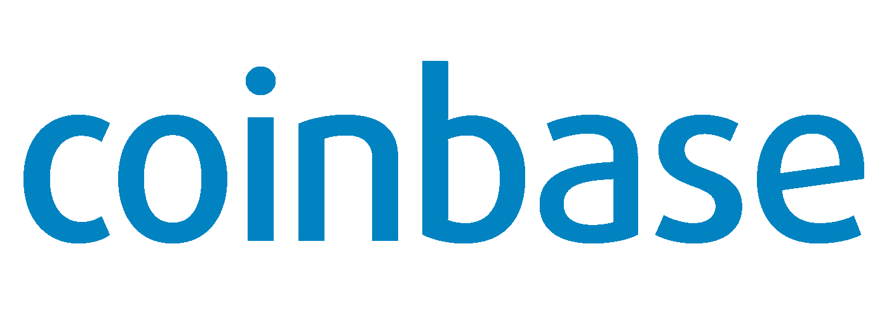

# 增加加密令牌经济和生态系统的十大支持业务

> 原文：<https://medium.com/hackernoon/top-10-supporting-business-that-increases-the-crypto-token-economy-and-ecosystem-5aac8ef0185a>

随着区块链的先驱应用(即加密货币比特币)的兴起，世界开始关注区块链技术。

然而，区块链是一项庞大的技术，不仅限于比特币和其他新兴的替代货币；这项革命性的技术是一种跟踪交易的方法，尽管它仍处于初级阶段，但不同的行业和企业已经开始采用区块链技术，未来该技术可能会有更广泛的用途。

加密革命引起了对货币概念的重新思考，并促进了分布式账本系统(区块链)的采用，使数字货币变得可行。

与此同时，与区块链相关的公司和企业也在增加。预计区块链技术市场将经历爆炸式增长(尽管目前加密市场正在经历下滑)，专家预测，到 2021 年，区块链技术市场上限将达到 23 亿美元。

区块链技术正在兴起，尤其是银行和金融机构采用该技术的速度比预期快得多。

当然，加密货币仍然是区块链技术最受欢迎的应用，然而，将该技术局限于比特币和替代币将是愚蠢的。区块链技术可以用于任何事情，并且已经被不同的行业用于从数据管理到监管合规的各种用途。

未来是区块链，该技术的全部潜力仍远未得到充分利用。该技术为企业和投资者带来了大量的机会，区块链技术市值预计到 2021 年将达到 23 亿美元，这一目标有望实现。

然而，这篇文章将专注于新兴的区块链技术业务，这些业务增加了代币经济和整个加密货币生态系统。

1.  **瑞波(市值:约 300 亿美元)**

Ripple 由雅虎前高级副总裁布拉德·加林豪斯和合伙人斯蒂芬·托马斯于 2012 年 10 月创建，是一个实时支付结算和货币兑换平台。该平台完全致力于资金转账，即银行之间的实时交易。

在撰写本文时，Ripple 已经与全球超过 75 家银行合作，该公司在 2017 年 12 月宣布，日本和韩国的银行已经启动了区块链测试，以降低国际银行间支付的成本。

**2。** **IOTA(市值:~ 150 亿美元)**

IOTA 于 2016 年 7 月由连续创业者大卫·索恩斯特博和他的合作伙伴张秀坤·希内尔推出，是一个专注于物联网(物联网)的开源分布式账本。IOTA 系统免除了交易费用，确认时间短，并且通过使用其创新的“纠结”共识模型，无论正在执行的交易量有多大，都能提供稳定性。

IOTA 模型没有传统的块、链和矿工，我们已经开始将它们与块链技术联系起来。相反，要进行交易，用户必须批准系统分配的前两个交易。这些动作确立了所有节点具有相同当前状态的事实。与以太坊，尤其是比特币相比，IOTA 每秒能够处理更多的交易。事实上，人们可以说 IOTA 是在一个完全不同的联盟中比赛。

随着时间的推移，IOTA 已经与 Bosch Group、Deutsche Telekom、Microsoft、PwC 等大型公司合作开展数据货币化计划。

**3。** **Qtum(市值:50 亿美元)**

Qtum 由 Patrick Dai、Neil Mahi 和 Jordan 厄尔斯三人组于 2017 年 3 月推出，是第一个基于 UTXO 的智能合约系统，具有利益相关共识模型。

它使用 AAL(账户吸引层)结合了比特币核心和以太坊虚拟机。Qtum 的利益证明模型限制了计算难度，同时增加了扩展的可能性。

Qtum 于 2017 年 12 月宣布与中国最大的视频托管公司宝丰合作，双方希望改变电影和音乐行业。

**4。** **比特币基地/GDAX(市值约 20 亿美元)**

比特币基地由 Brain Armstrong 和高盛于 2011 年 7 月推出，是著名的加密钱包和交易平台之一。该平台于 2016 年转型为全球数字资产交易所(GDAX)，是获得纽约州金融服务局颁发的商业许可证(BitLicense)的 3 个区块链项目之一。

GDAX 目前拥有超过 1400 万平台用户。

在这一类别中，我们还可以增加与比特币基地的其他交流。其中之一，实际上有可能超过比特币基地的是位于直布罗陀的直布罗陀区块链交易所(GB ),它也提供了申请分布式账本技术许可证(Dlt 许可证)的可能性，这意味着上市公司将获得经营业务的许可。仅这一点就可能是 GBX 能够接管全球领先交易所的原因。除此之外，GBX 可能会列出更多比特币基地可用的代币，这一事实可能会导致 GBX 成为首选的交易地点，因为有人抱怨比特币基地上市的代币很少。我可以肯定地说，比特币基地可能会失去其行业领导者的地位。

由于有几个国家正在成为加密友好的国家，是在这个行业运营的公司的天堂，可以预计在这个类别中会有更多的竞争者。

**5。** **【奥米塞戈(市值约 17 亿美元)**

OmiseGO 由 Donnie Harinsut 和合伙人 Jun Hasewaga 推出，是一种用于加密交换和支付服务的去中心化金融技术。

OmiseGO 是一个基于以太坊区块链的平台，连接支付系统、网关和金融机构。OmiseGO 拥有一个高知名度的顾问团队，其中包括以太坊创始人；Vitalik Buterin，Gavin Wood，Joseph Poon，Roger Ver 等人，同时得到泰国财政部长的支持。

2017 年 8 月，OmiseGO 的市值超过 10 亿美元，成为第一个实现这一壮举的以太坊令牌。

**6。** **预兆(市值:～10 亿美元)**

由杰克·彼得森(Jack Peterson)和合伙人乔伊·克鲁格(Joey Krug)于 2014 年 8 月创立的 Augur 是一个针对真实事件的预测市场平台。

用户为真实事件的预测结果购买股票，一旦做出预测并为选择的结果购买股票，就不能改变，因为这些预测在“公共”区块链上工作。基于以太坊的平台确保使用智能合约处理支付。

**7。****【Steem(市值:~ 8.5 亿美元)**

Steem 由内德·斯科特(Ned Scott)和 BitShares 创始人丹·拉里默(Dan Larimer)于 2016 年 3 月创立，是一个去中心化的社交出版和奖励网络。用户根据发布内容获得的“喜欢”数量获得发布内容的奖励。

还有一个额外的功能，用户可以在 Steem 网络中创建新的代币用于筹款。

**8。** **假人(市值约 5 亿美元)**

假人由 Julian Zawistowski 和合作伙伴 Piotr Janiuk 于 2016 年 11 月推出，是第一台开源的分散式超级计算机。

假人网络由平台用户的计算机提供动力。

许多行业需要巨大的计算能力来处理大数据、加密、DNA 分析、离散对数、机器学习等，假人提供了这种所需的计算能力。

在撰写本文时，该系统拥有 400 多万用户。

**9。** **【勇敢(市值:~ 3.4 亿美元)**

由 JavaScript 编程语言创作者和 Mozilla 联合创始人布伦丹·艾希(Brendan Eich)和他的合伙人布莱恩·r·邦迪(Brian R. Bondy)于 2017 年 5 月创建的 Brave 是一款安全的网络浏览器，可以阻止广告和追踪器。

这导致网站运行速度更快，同时导致流量大幅下降。Brave 为用户节省了时间和金钱，并且在意外点击广告的情况下保护他们免受恶意软件的攻击。

Brave 拥有最快的 ICO 众筹，仅用 27 秒就筹集了 3500 万美元！在撰写本文时，该浏览器大约有 300 万用户(包括我自己)。

10。盐(市值约 1.5 亿美元)

由首席执行官肖恩·欧文(Shawn Owen)领导的 SALT(安全自动借贷技术)最初成立于 2016 年，在 2017 年 8 月拥有成功的 ICO 之前。

Salt 是一个会员制借贷网络，用户可以使用他们的加密资产作为抵押获得法定货币贷款。

SALT 平台非常受欢迎，因为加密资产持有者希望拥有法定货币来满足他们的需求，而不必出售他们的加密货币资产。

在这种情况下，您只需加入 SALT network，并使用您的数字货币作为抵押申请贷款。

虽然盐在这个列表中排在第十位。很难不提到另一家名为 Lendo 的公司。起初，我以为伦多是最佳选择，但由于他们即将推出他们的前 ICO 盐得到了头条新闻。Lendo 是区块链贷款平台的另一个例子，该平台将彻底改变“法定贷款换加密抵押品”行业。Lendo 增加了一些功能，使其成为一个完整的密码银行。盐明显缺少的那些附加功能是 Lendo 的一个关键因素。有了 Lendo，您可以在一个地方获得所有银行服务。还有几个原因让人们选择伦多而不是绍特。随着银行服务的增加，Lendo 的令牌肯定会受到加密投资者和爱好者的欢迎。在这个有这么多 ICO 推出的时刻，很难找到像 Lendo 这样的宝石。由于 SALT 和 Lendo 都是效用令牌，它赋予 Lendo 更大的效用值，因为令牌可以用来支付平台中更多的费用。令牌可用于更多用途的事实为 Lendo 带来了两大优势，1。它为公司带来了更多的代币，如果管理得当，可以大幅减少业务的供应，这又可以导致代币价值的良好增长。2.代币投资者可以选择使用代币。(事实上，你可以用它来支付一些有价值的东西，不像许多代币那样被创造出来)。

SALT 有一些限制，这给了 Lendo 一些东西来增加他们竞争优势。Lendo 贷款面向全球，而 SALT 仅限于美国银行账户持有人。

根据 SALT 最近的声明，SALT 目前有 2300 万美元的贷款组合。率先行动通常会带来很大的优势。然而，在这种情况下，它不太可能成为伦多的劣势。来自 salt 州的报告称，他们无法促成 13 亿美元的积压贷款。除此之外，有更多的抵押品可以用来获得贷款。(即加密货币的总市值或多或少是这些贷款业务的市场可能性。)

最后，值得一提的是，Lendo 与 FCA 监管的有贷款许可证的贷款人的协议可能会为他们提供比 SALT 目前更多的贷款资本。由于 Lendo 的系统设置为连接任何持牌贷款人，通过 Lendo 的平台提供贷款，因此敲开 Lendo 大门的贷款人名单可能会很长。加密贷款很可能会比法定贷款利息更高。SALT 已经证明，加密人不介意这种贷款的高利率。

这并不是说我不相信盐，也不是说它有什么不好的地方。他们已经有了一个很好的业务，这一点是看起来 Lendo 有潜力成为行业领导者，如果他们提供计划中的东西。也就是说，盐和伦多在市场上显然都有市场空间，或许还有更多。

如果这是一份需要提防的 ICO 名单，或者是一份 ICO 投资建议，那么毫无疑问，Lendo 将是名单上的第一名。

注意:Lendo 的 Pre-ICO 将于 2018 年 3 月 28 日发布。您可以通过以下链接找到 ICO:www . lendo . io

# Lendo # Salt #比特币基地#勇者#假人# Steem #奥格# OmniseGO # Ripple # Qtum # IOTA # Lendo #比特币#区块链#以太坊#NEO