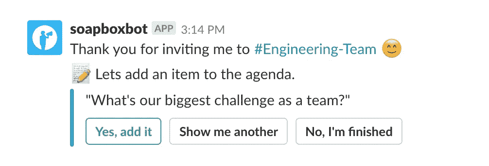

# 经理在真实的团队会议中会问的 10 个问题🚀生产率

> 原文：<https://medium.com/hackernoon/top-10-team-meeting-questions-to-boost-productivity-ce4fc49fa980>

## 基于我们 slack bot 的数据(奖金:最避免的 Q)

我的团队会议是至关重要的。我让每个人都在一个房间里，从他们身上得到我需要的一切——团队同步的额外奖励，对吗？不对。事实证明，经理们看不到这个会议对其他人有多重要。只有[4–9%的问题](https://bobbyalbert.com/iceberg-of-ignorance/)为经理所知...**一饮而尽**

这也是我们创建 [**SoapBox 机器人的原因之一——这是一个帮助人们进行更高效的一对一和团队会议的机器人。**](https://soapboxhq.com/slack?utm_source=hackernoon&utm_medium=referral&utm_campaign=team-meeting-questions) 反应是惊人的:来自世界上 1000 多家最好的公司的经理们 *(Adobe、Intercom、Wayfair 等)* 正在他们的团队中使用它。

人们最喜欢的功能之一是我们的机器人的问题建议器——如果他们被困在内容中，它会建议一些久经考验的问题。

我挖掘数据，看看哪些问题对团队最有吸引力……*(*[*我对 1:1*](https://hackernoon.com/top-10-questions-managers-are-asking-during-1-1-meetings-c2c9ee8ad201)*也做了同样的事情)。*所以，下面是现实生活中的管理者们评出的 10 大！

# #1.作为一个团队，我们面临的最大挑战是什么？

毫不奇怪，当机器人向经理们提出这个问题时，他们会立即将它添加到下一个议程中。这是我们在团队会议中增加最多的问题。

我认为，我们所得到的一点是对无知冰山的微妙意识，[它指出](https://bobbyalbert.com/iceberg-of-ignorance/)，“一个组织的一线问题只有 4%被高层管理人员所知，9%被中层管理人员所知，74%被主管人员所知，100%被员工所知……”

# #2.你觉得你的工作得到了足够的反馈吗？如果不是，您希望从哪里获得更多反馈？

在过去的几年里，我们都听说过两件事:1)员工想要更多的反馈。一直都是。2) [员工想要更多自主权](https://qz.com/676144/why-its-your-call-is-the-best-thing-you-can-say-to-keep-employees-happy/)。一直都是。

这两种可能都有吗？是的，但是你的团队需要一种邀请反馈的文化。如果他们不邀请你，那么你需要强迫他们……所以给他们空间，让他们尽可能多地邀请你。

# #3.什么时候是对你的工作给出反馈的最佳时机？

如果我们谈论的是基于项目的反馈，那么就我个人而言，我会试着遵循 T2 写的 99/50/1 框架。

理想情况下，反馈邀请落在他们身上，否则你将在错误的时间给出正确的反馈。在这种情况下，你的反馈会被视为批评，我们的[大脑会将其视为对我们生存的威胁。😱](https://open.buffer.com/how-to-give-receive-feedback-work/)

# #4.我能为您带来哪些有助于我们团队更好表现的信息？👌

结果只有 14%的员工了解他们公司的战略和方向。首先，确保你不断地让你的团队了解这方面的最新情况，然后展开讨论。

你是那 86%不明白的那一部分吗？没关系。让团队提前写下问题，然后去寻找答案。这是值得的。

# #5.影响我们发挥最大能力的最大障碍是什么？

对我来说，管理者手中最重要的工具之一就是杠杆。如果我们可以删除流程中浪费团队时间的一个步骤，那么生产率的提高将是巨大的。布拉德·菲尔德称之为 2%的变化。

这个问题是找到那 2 %的核心。

# #6.我怎样才能更好地支持你？

我发现这个问题和第五个问题都围绕着同一个问题:经理可以做哪些不同的事情来提高团队的生产力？在前一个案例中，它是关于移除任何使团队慢下来的东西，这个问题变得更加个人化了。不要指望人们会马上敞开心扉…让对话进行一会儿。

听到蟋蟀的叫声？那就是脆弱的[时刻](https://www.fastcompany.com/3001319/why-doing-awesome-work-means-making-yourself-vulnerable)。

# #7.作为一个团队，我们应该开始做些什么吗？

如果你听说过[开始、停止、继续团队回顾技术](https://www.forbes.com/sites/groupthink/2016/02/02/start-stop-continue-tutorial/#2a74ea112798)，这是一个显而易见的问题。大多数人都把这个问题复杂化了……问问你的团队我们是否应该开始做什么(或者尝试做什么)。

这让你的团队有时间摆脱他们内部的 [F.U.D.](https://en.wikipedia.org/wiki/Fear,_uncertainty_and_doubt) +挫折。

# #8.上周你赢了什么？

当团队专注于从成功和失败中学习时，他们的学习效率会更高。这有助于开发他们工作的更丰富的心智模型。

# #9.作为一个团队，有什么是我们应该停止做的吗？

另外 33.3%的[开始、停止、继续团队回顾技术](https://www.forbes.com/sites/groupthink/2016/02/02/start-stop-continue-tutorial/#2a74ea112798)。我最喜欢 STOP 的一点是，在这里你不需要任何预算或计划外的工作就能获得成功。

# #10.🎉谁值得大声喊出来？他们做了什么？

78%的员工表示，如果他们的工作得到认可，他们会更加努力工作。你想知道让人们更加努力工作的简单方法吗？在你的团队会议上有一个重复出现的主题，以便进行点对点的宣传。有时候他们甚至会喊你出来…感觉很好吧？

**我的建议是:**给员工一个提前写下大喊的地方。无论是团队会议前的[到机器人](https://soapboxhq.com/slack)(*咳咳*那是我们)还是[公司范围的松弛渠道](https://www.justdisco.com/)。

# 奖金！第一个回避的建议问题:

“我们能做些什么来改善我们的办公环境？”

他们为什么要回避？这是我最好的猜测:虽然有大量的文章滔滔不绝地说着废话，比如提高生产力和工作场所幸福感的最好方法是办公室设计。事实是，办公环境并不能做很多事情。

办公空间是体验的附加因素，但不是工作中的差异制造者。你可以这样想:你可以拥有世界上最好的办公室、5 星级厨师、小狗和弹球机……但如果你有一个糟糕的经理，那也没关系。工作会很糟糕。周日会有压力。星期一将是最糟糕的。

我的建议？专注于问一些在工作中与众不同的问题。比如如何提高团队内部的协作、生产率和认可度。办公室可能很糟糕，但至少你的团队会很棒。

你坚持到了最后！我很好奇你:团队会议上你爱/讨厌聊什么？你最喜欢的关键问题是什么？

感谢阅读，
布伦南

另外，你应该至少每两周和你的团队进行一次这样的对话。**如果你的谈话陈腐、不一致、或者没有条理，你现在应该试试** [**肥皂盒**](https://soapboxhq.com/?utm_source=hackernoon&utm_medium=referral&utm_campaign=team-meeting-questions) **。**

## 布伦南是加拿大最佳工作场所 [SoapBox](https://soapboxhq.com/?utm_source=hackernoon&utm_medium=referral&utm_campaign=team-meeting-questions) 的首席执行官兼联合创始人。他们的应用程序 [SoapBox](https://soapboxhq.com/?utm_source=hackernoon&utm_medium=referral&utm_campaign=team-meeting-questions) ，是关于那些你应该和你的员工进行的对话…但是目前还没有。

如果你喜欢这篇文章，你应该给它 3👏s 帮助别人找到它！👇