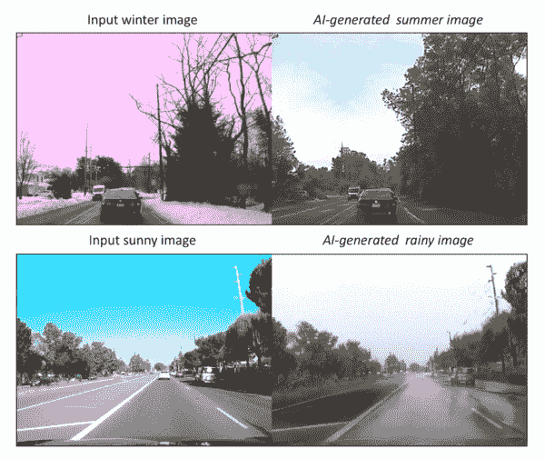

# 2018 年 dTop 十大技术趋势

> 原文：<https://medium.com/hackernoon/top-10-tech-trends-in-2018-issue-3-8aac70d68ece>

随着世界上最强的火箭 SpaceX Falcon Heavy 以特斯拉 Roadster 作为有效载荷进入太空，2018 年有了一个良好的开端。这是一个技术奇迹，也是建造更强大的可重复使用火箭将人类送上火星的垫脚石。

好吧，你问一个人如何预测未来。这里有一句简单的话可以回答你的问题:

> 预测未来的最好方式是创造未来。

你猜对了，埃隆·马斯克就是这么做的:

1.  [特斯拉](http://www.tesla.com)(电动汽车)
2.  [SpaceX](http://www.spacex.com/) (可重复使用的火箭)
3.  [OpenAI](https://openai.com/) (人工通用智能)
4.  [无聊公司](http://www.boringcompany.com)(解决道路拥堵)
5.  [Neuralink](https://www.neuralink.com/) (脑机接口)。

但是，预测未来最简单的方法是什么？

> 预测未来最简单的方法是寻找现在创造未来的人。

运用这个原则，你会发现趋势！

(剧透预警)未来你看到的几乎所有趋势都将由[深度学习](https://hackernoon.com/tagged/deep-learning) [技术](https://hackernoon.com/tagged/technology)提供动力；)

以下是 2018 年十大科技趋势:

## 更新:增加了初始安全产品，并删除了热门趋势列表中的私人硬币。

**#1 自动驾驶**

2018 年将是自动驾驶行业伟大的一年。

> 自动驾驶汽车和无人驾驶地面车辆是一种能够感知环境并在没有人类输入的情况下导航的车辆——维基百科

在过去的几年里，自动驾驶技术从“你怎么能想象？”到“这是一个玩具”到“非常可能”到“所有汽车制造商宣布他们的自动驾驶汽车计划”。这就是技术将如何影响个人和公司。

如果您使用过驾驶员辅助、车道控制辅助或取消受控停车辅助，那么您已经体验到了初级水平的自动驾驶。

事实上，自动驾驶正好有五个级别。第一级是驾驶员辅助；第二级提供类似车道控制辅助的半自动驾驶辅助系统；第三级是高度自动驾驶，只在特定条件下工作，如高速公路；第四级是完全自动驾驶，你的车可以处理最复杂的驾驶情况；第五级自治(也称为全自动化)意味着，车辆可以在所有场景中完全自动驾驶，无需任何人为干预。其实到了那个点就不需要驾照了。

自动驾驶技术是强大而有影响力的，因为它可能会从事故中拯救数百万人的生命，每年还可以节省 2.5 亿多小时的通勤时间。它使城市节省了停车空间，因为车辆可以自动驾驶，随时将人或物从一个地方转移到另一个地方。

自动驾驶市场如此巨大(到 2025 年约 830 亿美元，到 2035 年约 3 万亿美元)，以至于每个汽车制造商、打车公司和大型科技公司都想进入。你可以在这里看到投资这个领域的公司名单[。](http://www.driverless-future.com/?page_id=384)

自动驾驶技术使用激光雷达、雷达和摄像头的组合来感应和跟踪车辆周围的物体，以进行导航。在引擎盖下，你有安装在车辆上的 GPU 上运行的深度学习算法，使用从这些传感器收集的数据进行分析和决策。

**#2 增强现实**

> 增强现实是一种将计算机生成的图像叠加在用户的真实世界视图上的技术，从而提供一种复合视图。

增强现实(AR)是科技行业最热门的领域之一，它已经准备好供数亿消费者使用和体验。 [Snapchat 镜头](https://lensstudio.snapchat.com/)、[口袋妖怪 Go](https://itunes.apple.com/us/app/pokemon-go/id1094591345?mt=8) 是第一个向世界介绍工作增强现实的镜头。

去年 9 月，苹果宣布计划通过发布 ARKit 将 AR 带到世界各地，ARKit 是一个面向 iOS 开发者的软件开发工具包。在苹果宣布之后，谷歌宣布了类似的计划，通过 arCore dev kit 将 AR 带入 Android 设备。这使得世界各地的开发人员能够为每个人带来基于 AR 的新体验。

> ARKit 将数字对象和信息与你周围的环境融合在一起，让应用程序远离屏幕，让它们以全新的方式与现实世界互动——苹果

AR 需要你周围的精确地图来放置数字对象。视觉惯性里程计(VIO)技术使应用程序能够准确跟踪你周围的世界。VIO *融合*现场摄像机数据和运动数据(加速度计、陀螺仪等)。，)以高精度感测用户如何在房间内移动。所有这一切都是因为计算机视觉的进步和高性能移动 CPU 和 GPU 的可用性，以实时分析和渲染 3D 数字对象到您的手机上。

虽然移动 AR 对消费者和开发者来说很棒，但它还不能提供持久、协作和沉浸式的体验。像 [Magic Leap](https://www.magicleap.com/) 、[微软](https://www.microsoft.com/en-us/hololens)和 [MetaVision](http://www.metavision.com/) 这样的公司正在建立特殊的硬件和全息技术，通过头戴设备提供身临其境和真实世界融合的体验。

如果你想知道我们在未来如何计算，请查看来自最热门的 AR 公司 Magic Leap 的创作者版本 [Magic Leap One](https://www.magicleap.com/) 。

**#3 机器人顾问**

> 机器人顾问或机器人顾问是一类金融顾问，提供在线金融建议或投资管理，只需适度或最少的人工干预

如果你正在使用 [Wealthfront](https://www.wealthfront.com/) 或[improvement](https://www.betterment.com)，那么你已经知道或正在使用机器人顾问。机器人顾问帮助你处理复杂的任务，如税收损失收获，投资选择和退休计划。机器人顾问是一个爆炸式增长的巨大产业。据估计，到 2015 年底，robo-advisors 管理的客户资产达到 600 亿美元，预计到 2020 年将达到 2 万亿美元。

与人类顾问不同，机器人顾问是可扩展的，全天候可用，并为每一位希望更好地优化和投资的消费者服务。机器人顾问可以利用人工智能技术在几毫秒内分析你的投资组合的趋势、数据和新闻。

有了 robo-advisors，您可以为您的投资配置风险偏好，并在投资组合变绿时放松下来🤑🤑🤑

**#4 首次证券发行**

ICO(首次发行硬币)已经是旧闻了，如果你在美国发行 ICO，而没有在他们那里注册为证券发行，美国证券交易委员会就会来找你:[https://www.sec.gov/ICO](https://www.sec.gov/ICO)

这对☠️ ☠️的骗子来说是个坏消息，但对那些注册了初始安全产品(iso——是的，这是我创造的一个新术语)并遵守现有安全法律和与 SEC 合作的人来说是个好消息。

> 2018 年已经过去了 3 个月，对于加密货币的采用和认可来说，这将是一个伟大的一年。SEC、CFTC、国会、G20 成员和许多政府机构。

事情发展得如此之快，以至于一家知名酒店可能通过以太坊智能合约，以 4 亿美元向合格投资者出售其纽约酒店所有权。如果您购买了他们的安全令牌，那么您就拥有了该物业/公司的一部分。这是由不动产等实物资产支持的初始证券发行(ISO)的一个例子。

 [## 凯文·奥利里:纽约酒店希望用 4 亿美元的加密硬币出售所有权，就像…

### 凯文·奥利里周一告诉美国消费者新闻与商业频道，他正在处理一笔交易，允许纽约一家“非常有声望的品牌酒店”出售…

www.cnbc.com](https://www.cnbc.com/2018/03/19/kevin-oleary-new-york-city-hotel-hopes-to-launch-400-million-dollar-coin-offering.html) 

如果这个实验不是一场灾难，那么我们将在 2018 年看到越来越多的房地产公司出售其所有权并非常迅速地清算。

iso 不仅限于销售房地产，实际上任何东西都可以被令牌化，包括:

1.  债券—【https://www.trusttoken.com/ 
2.  债务— [https://dharma.io](https://dharma.io/)
3.  房地产资产—[https://harbor.com/](https://harbor.com/)
4.  风险投资—[https://www . polymath . network/](https://www.polymath.network/)
5.  equities—[https://www.tzero.com/](https://www.tzero.com/)

将实物资产令牌化将为市场带来大量流动性，增加采用率，减少欺诈，降低费用(无中间商)，进入全球市场等。,

 [## 美国城市计划在“首次社区发行”中出售令牌化债券

### 面对联邦资金的大幅削减，加州伯克利正转向加密令牌作为远离…

www.coindesk.com](https://www.coindesk.com/us-city-plans-to-sell-tokenized-bonds-in-initial-community-offering/) 

**#5 AI 医生**

由于最近在深度学习和计算机视觉方面的进步，[人工智能软件](http://www.dailymail.co.uk/sciencetech/article-5231555/AI-doctor-automatically-diagnose-heart-disease.html)能够比最好的人类医生更好地检测和诊断多种疾病。

在写这篇文章的时候，Alphabet 的 Verily [宣布](https://www.theverge.com/2018/2/19/17027902/google-verily-ai-algorithm-eye-scan-heart-disease-cardiovascular-risk)他们已经开发了一种新的人工智能算法，可以通过*查看*患者眼睛的扫描图，准确推断出一个人的年龄、血压以及他们是否吸烟。医生可能会利用这些数据来分析患者的心血管风险，而无需验血。

你应该认为人工智能医生是医生的个人人工智能助手，帮助他们节省时间，更快地分析，在诊断病人时减少错误。例如， [Arterys](https://arterys.com/) 是**第一款** FDA 批准的 AI cloud 软件，将用于临床设置，用于*肝脏*、*肺部*和*心脏 MR* 图像分析。

许多私人和公共公司正在努力使用人工智能解决健康问题，并使每个人都可以使用带摄像头的移动设备。[医学未来学家](http://medicalfuturist.com/top-artificial-intelligence-companies-in-healthcare/)很好地列出了大多数从事人工智能健康的科技公司。

如果你对这个领域感兴趣，看看最近来自杰森咨询集团(为美国政府提供建议的精英科学家)的人工智能健康报告。

**#6 语音编辑**

任何技术的目标都应该是让事情变得便宜、高效，并且人人都可以使用。声音编辑就是这样一种技术。你可以把语音编辑想象成“ [Photoshop-for-Voice](http://www.bbc.com/news/technology-37899902) ”。它将允许您立即改变语音记录，以包含原说话者从未说过的单词或短语，听起来像他们的声音。

我们即将创造出与真人声音完全不同的计算机生成音频。这对社会、新闻业、法庭上音频证据的真实性、语音识别等等都有巨大的影响。

这项由深度生成神经网络驱动的技术(见此 quora [帖子](https://www.quora.com/What-is-a-deep-generative-model)以简单的术语理解它是什么)为配音艺术家、播客创作者和有声图书录制者节省了大量花费在纠正和重做音频记录上的人工时间。

采用语音编辑技术的产品: [Lyrebird](https://lyrebird.ai/) (测试版)、Deepmind 的 [WaveNet](https://deepmind.com/blog/wavenet-generative-model-raw-audio/) (并非人人都能使用)和 Adobe 的 Voco(可能在 2018 年发布)。

**#7 照片合成**

这不是我们都知道的光合作用(即植物和其他生物将光能转化为化学能的过程)。

我们在这里讨论的照片合成是从一个文本描述中人工生成高质量的图像/照片。你可以认为这是谷歌图片搜索，除了显示给你的不是一个由相机拍摄的“真实”图像，而是一个对你的眼睛来说足够真实的图像。

它由被称为 GANs 或生成对抗网络的生成式人工智能算法提供支持。gan 用于从真实数据中生成“假但真实”的数据。脸书的人工智能研究主任 Yann LeCun 称 GANs 为“过去 10 年中最有趣的想法”

这里有一个由 [GANs](https://arxiv.org/pdf/1612.03242.pdf) 根据文本描述生成的逼真的假图像:

A flower with overlapping pink petals surrounding a ring of yellow filaments

零售业为每一批新服装的拍摄花费了大量的金钱。这包括雇佣专业摄影师、模特和工作室。有了这项技术，零售商可以自动生成任何身材、形状或穿着任何鞋子的人的服装图像，只需给出一张放在平面上的服装照片。Vue.ai 是一家由红杉支持的印度人工智能公司，已经向梅西百货和李维斯等零售商出售这项技术。如果你从事模特行业，你应该担心你的工作！

**#8 假视频&恶意程序**

到现在为止，你一定已经意识到了生成学习(也就是生成对抗网络)的力量。现在，使用同样的基础技术，我们可以生成*逼真的*假视频和图像。而这只是“假新闻”的开始，你应该担心。

Unsupervised Image-to-Image Translation Networks from Nvidia

这是人工智能生成的奥巴马的假视频

> 科技很可怕。你会有负面的后果。但是积极的潜力远远大于消极的。

例如，一家名为 Pinscreen 的公司创造了一种技术(类似于 iPhone X Animoji)，可以从一张静态自拍图像中生成你的 3D 人脸。同样的技术可以用在 CGI(计算机生成图像)中，以削减巨大的动画和制作成本。

**#9 AI 建筑 AI**

由于人工智能专家短缺(只有 10，000 人可供雇佣)，谷歌、脸书和 OpenAI 等科技公司正在投资和押注一种名为 AutoML 的技术。

这项技术使没有人工智能经验和/或背景的非科技公司和个人能够在没有人工智能科学家太多帮助的情况下，轻松建立机器学习模型(参见来自谷歌云的 [AutoML](https://cloud.google.com/automl/) )。我们日常使用的几乎所有产品都是由机器学习(ML)驱动的:谷歌的搜索，脸书的[人脸检测](https://www.facebook.com/help/122175507864081?helpref=faq_content)，苹果的 Siri 等等。，这些产品背后的机器学习模型是由顶级人工智能科学家构建的。目前大多数机器学习模型都是基于[神经网络](http://news.mit.edu/2017/explained-neural-networks-deep-learning-0414)架构。人工智能构建人工智能(或 [learning to learn](http://bair.berkeley.edu/blog/2017/07/18/learning-to-learn/) )技术运行神经网络算法来扫描最佳神经网络，以构建适用于您的数据的定制模型。

这就是人工智能技术将如何被大众化。

**#10** **分散加密交换机**

加密交易所允许你用一种加密货币交易另一种。几乎所有现存的加密交换都是集中的。集中交易提供流动性，维护订单簿，根据管辖范围对客户执行 AML(反洗钱)和 KYC(了解您的客户)规则。

集中式交易所易于访问和使用，并提供先进的工具和交易功能，如保证金交易、止损和借贷。

然而，集中交易会给你的资金带来风险，因为你没有自己资金/钱包的私钥。由于黑客攻击，人们已经损失了价值数百万美元的比特币等加密货币。就在上个月，黑客从 Coincheck exchange(日本)入侵了价值 5 亿美元的加密货币。

欢迎来到分散交易所，这些交易所没有中央权威，因此没有审查(即，没有人能冻结你的资金)，并且本质上是不可信的(你保持对你的钱的控制)。分散式交易所允许用户进行点对点(P2P)交易，因此这些交易通过类似比特币的区块链在用户之间直接发生，因此任何人都可以在区块链上查找和验证交易。

分散交易是密码交易的未来。 [0xproject](https://0xproject.com/) ， [OmiseGo](https://omisego.network/) ， [AirSwap](https://www.airswap.io/) 都是一些建造它的。

**【移除】#11 私币**

“比特币是匿名的”，“比特币只被犯罪分子使用，用于非法活动”都是神话。比特币提供了和你在没人认识你的商店里用现金买东西一样的隐私。在这种情况下，您的交易是匿名的，但交易金额很容易被跟踪。如果有人能够确定你的身份，所有的隐私很快就会消失。所以比特币本质上是伪匿名的。

> 所有的比特币交易都是在网络上公开永久存储的，这意味着任何人都可以看到任何比特币地址的余额和交易。然而，地址背后的用户身份仍然是未知的，直到信息在购买或其他情况下被披露。这就是为什么比特币地址应该只使用一次的原因之一。永远记住，采用良好的实践来保护你的隐私是你的责任—[bitcoin.org](https://bitcoin.org/en/you-need-to-know#anonymous)

如果你是一名企业主，并考虑使用比特币/莱特币作为支付方式，你应该重新考虑，因为你的竞争对手或任何人都可以在比特币的公共账本上使用你的比特币公共地址看到你的账户余额和交易。

斯坦福大学的应用密码学小组正在研究一项名为 [Bulletproofs](https://news.bitcoin.com/stanfords-applied-cryptography-group-aims-to-bulletproof-bitcoin/) 的新提案，旨在使比特币交易匿名且保密。研究人员和比特币开发者在比特币上实现这项技术还需要一段时间。如果没有[硬分叉](https://en.bitcoin.it/wiki/Hardfork)，比特币社区可能需要更长时间才能达成共识(如果那时有硬分叉的机会，那将是值得观看比特币升级的爆米花)。当比特币的大多数矿工不同意协议升级(类似比特币现金)时，就会发生硬分叉。

私有/匿名硬币是一种加密货币，具有公共分类账，但交易信息在不同程度上被模糊化，以保护用户的隐私。

你可能听说过一些网站正在使用用户的电脑来挖掘名为 Monero 的加密货币。在撰写本文时，人们发现一名黑客向洛杉矶时报网站注入了一个加密脚本(又名 cryptojacking)来挖掘 Monero。

[Monero](https://getmonero.org/) 是最受欢迎的私人硬币之一。

> Monero 使用环签名使追踪参与交易的各方变得困难，因为交易签名由一大群人共享；因此，将特定用户与事务相关联非常困难。它还通过隐藏交易金额来提供额外的隐私。

[Zcash](http://z.cash) 是一种相对较新的(创建于 2016 年)加密货币，可以使用零知识加密技术充分保护交易隐私。

由于不可追踪性的特性，没有人可以因为货币单位在以前的交易中的关联而将其列入黑名单。它的一个缺点是:如果一个交易所遭到黑客攻击，黑客窃取了私人加密货币，那么没有什么可以阻止黑客出售或转移。

私人硬币已经被音乐家、Shopify、WooCommerce 等接受。,

这篇博文比我预想的要长。如果你正在读这一行，我的使命就完成了！对未来保持兴奋；)

## [*原载于理工大融合*](https://www.thetechfusion.com/issues/top-10-tech-trends-in-2018-issue-3-92539)