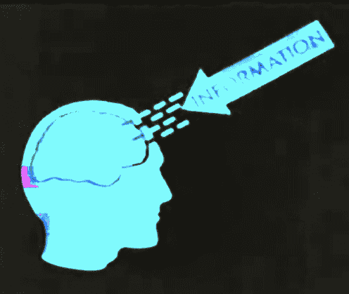
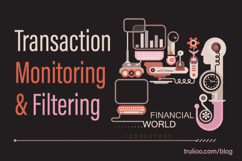

# 十大交易挑战

> 原文：<https://medium.com/hackernoon/top-10-trading-challenges-f4f40ff2e65c>

从外部的角度来看，交易似乎非常容易:你只需要一台电脑，舒舒服服地坐在沙发上就能致富。
然而不幸的是，现实并不十分符合这种理想的景色。交易活动隐含了很多日常的挣扎和痛苦，我们为你总结了 10 大。

## **1。交易在开始前需要很多准备**

事实是，你不能只是坐在沙发上等着钱进入你的钱包。在你开始看到一些回报之前，你需要做一些投资，不仅是在金钱方面，而且主要是在你的时间和努力方面。

你需要仔细研究市场，选择你的目标公司，分析历史数据的趋势，并试图预测未来会发生什么。

## **2。要收集和消化的信息量是巨大的**

然而，你的分析不能局限于你的公司，需要扩展到整个市场。

这意味着你还需要研究你公司的竞争对手，主要的竞争对手以及新进入这个领域的公司。

## **3。市场需要持续监控，有时您的策略可能需要进行重大调整**

就在我们说话的时候，市场可能会发生变化，我们可能需要当场改变我们的计划。

初步研究极其重要，但不幸的是，这还不够。你收集的信息必须更新，你主要必须保持你的眼睛在任何地方，以了解正在发生的事情。

## **4。等待正确的信号需要很大的耐心**

你可能想要跟随你的直觉，你可能在开始的时候这样做，因为这似乎是最简单的方法。

但是一旦你意识到，如果你把策略建立在对未来的信念上，你的交易生涯不会持续很久，会发生什么呢？

## **5。对失败的恐惧会极大地影响你的决定**

损失很难接受，也更难克服。当你过去犯下的错误在你脑海中挥之不去，并影响你未来解读信号的方式时，如何自由地做出决定？

## **6。对未来的不确定性是最影响交易者心态的感觉**

在交易中，你的每一步都可能是你一生中最好或最差的决定。

每笔交易要么给你带来一大笔钱，要么带来可怕的损失。

交易成功需要你有最冷静的神经，但同时也给你的肩膀带来了很大的压力。你开始意识到这并不像你想象的那么简单，对吗？

## **7。你可以考虑向第三方寻求帮助，比如经纪人。但是选哪个呢？**

你可能会发现很多人主动提供帮助。但是怎么选择合适的人呢？这个选择比投资正确的公司更容易吗？

## **8。骗局、假大师和不专业的经纪人**

有人可能会骗你，拿走你所有的钱。其他人可能有良好的意图，但在这个问题上没有这么好的专业知识。

## **9。连续的失败会对你的心理产生负面影响**

你可能会对失去的金钱和时间感到压力和紧张。再一次，如何保持你的紧张，知道你可能会再次失败

## **10。承认你错了，然后继续前进，这可能是所有挑战中最困难的一个**

随着时间的推移，一个好的交易者需要学会如何控制自己的感情，继续前进。他需要忘记自己的错误，但也要从中吸取教训，以免再犯。

特别是最后一点，对我们的人性来说是一个巨大的挑战，实际上，这比获得交易者的所有知识和技能还要难。

我们真的不能隐藏我们的人性，并“关闭”我们的恐惧和悲伤的感觉，因为我们不是机器。

我们不是一套算法，但好消息是，我们可以很好地利用一些。

## 机器学习是人工智能的一个分支，致力于训练机器从它们收集的信息中学习，并为未来自主行动。

## AITrading 将利用这项技术，让你的交易者生活变得更轻松。

# 交易链接

## [网站](https://aitrading.com)

## [路线图](https://aitrading.com/#s_time)

## [白皮书](https://aitrading.com/pdf/AITrading_WP_EN.pdf)

## [媒体博客](https://medium.com/aitrading)

## [电报社区](https://t.me/aitrading_com)

## [电报通道](https://t.me/aitrading_en)

## [推特](https://twitter.com/aitrading_com)

## [脸书](https://facebook.com/aitrading.official)

## [Insta](https://instagram.com/aitrading_official)

## [Bitcointalk 安](https://bit.ly/2It3Dd2)

## [钢模](https://steemit.com/@aitrading.com)

## [子纬度](https://www.reddit.com/r/aitrading_official)