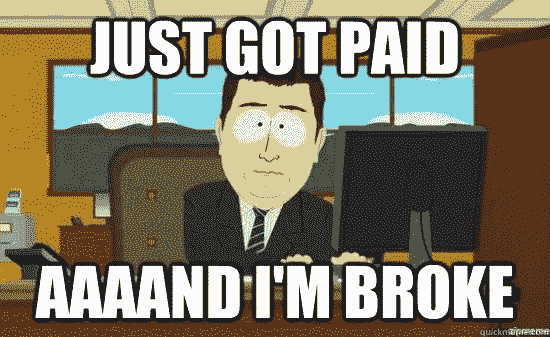
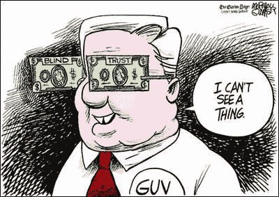
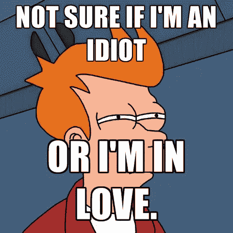
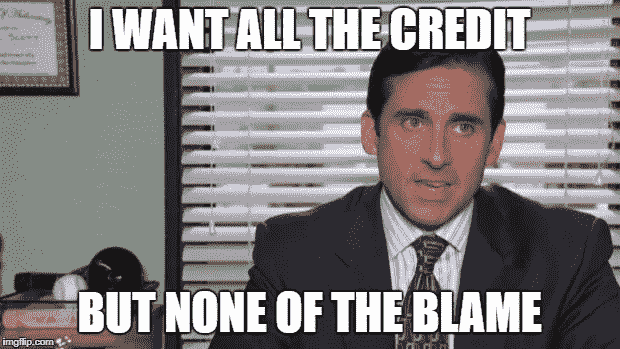

# 十大交易错误

> 原文：<https://medium.com/hackernoon/top-10-trading-mistakes-942bf8276ee9>

在过去的两年里，由于加密技术的繁荣，[交易](https://hackernoon.com/tagged/trading)比以往任何时候都更受欢迎，吸引了大众的兴趣。

社交媒体开始充斥着技术分析图片，被各种花哨的指标所修饰，宣传最新颖和奇怪的策略。特别是，由于“ [Twitter](https://hackernoon.com/tagged/twitter) ”加上“加密”组合，Twitter 在使交易流行起来方面发挥了至关重要的作用。

在这个仍被视为高进入门槛的领域，观察到这样的增长真是太棒了，其中最直接的表现就是许多人要求更多与交易相关的教育内容。然而，CryptoTwitter 的 feed 也充斥着笑话、迷因和任何类型的夸张，可能会给菜鸟交易者灌输一种过度兴奋、过度自信的感觉，最终与现实和感知的风险脱节，将交易更多地转变为一场游戏，而不是一项严肃的业务。与许多其他资产不同，加密货币缺乏实物等价物，这使得这个问题变得更加糟糕，因为更难识别数字令牌的实际价值。

然而，交易的风险和困难仍然存在，无论加密货币的背景有多缥缈，在一个新的丹麦迷因和你最喜欢的交易所的下一个蓝宝赠品之间。即使是一个小小的错误也会让你在几分钟内损失一大笔资金。

简单介绍完之后，我们来看看菜鸟交易者最常犯的错误有哪些，以及如何改正:

简单介绍完之后，我们来看看菜鸟交易者最常犯的错误有哪些，以及如何改正:

# 错误 1:将加密货币交易视为解决财务问题的方法。

加密市场是有风险的——与 Twitter 上普遍认为的相反——盈利并不容易。你必须记住，大多数人最终都会因为交易而赔钱。为了能够做出正确的决定，理性和情感分离是这个领域中必须具备的特征。

如果你的交易资金和你用于生活必需品的银行账户之间没有一个有限的界限，你的交易将完全受到你情绪的不利影响。

如果你有财务问题，但你真的对交易密码或任何其他资产充满热情，找一份 9/5 的工作，开始存钱，把你想花在交易上的时间用来学习新材料，练习纸上交易和回溯测试策略。投资你能承受的损失，并保持耐心！

# 错误 2:盲目相信 Twitter 电话、电报信号、YouTube 技巧等。

你只对你的交易负责。这一行就是你对抗市场。你需要学习如何研究与你投资相关的有用信息；意识到你的目标，考虑你做准备的时间。

社交媒体可以成为一个很好的信息来源，但是请记住，这也是人们试图传播与他们的兴趣相关的信息的地方。和你一样，很多其他玩家也在玩这个“游戏”，它的性质是严格竞争的。所以，不管某人看起来有多成功，你都必须依靠你的图表，你的技术分析，对未来的事件和基本面保持警惕。这样做，你就能管理你的交易。最终，你是唯一对你的交易结果负责的人。

# 错误 3:停止学习过程。

类似于其他专业领域(特别是科技领域)，交易需要你不断更新知识，保持学习的努力。说到学习，没有终点。你知道的越多，你就越会意识到你仍然忽略了多少，或者用苏格拉底的话说:“唯一真正的智慧是知道自己一无所知。”

重要的是要明白加密货币的生态系统是快节奏的:它移动、变化和演变非常快！全新的交换、新的协议、新的安全威胁、新的机会、新的子市场，如果您不跟上，您将会落后。

# 错误 4:没有考虑 FA 事件。

即使交易者过去主要依靠技术分析，对基本面有一个适当的了解也能增强交易者的视角。然而，仅限于对资产进行严格的基本面分析是不够的；同样重要的是，监控可能对你的未平仓交易产生影响的事件，并最终相应地重新评估风险/回报。以下是您应该注意的一些关键事件类别:

*   象征性空投；
*   ICO 后令牌解锁
*   监管事件
*   福克斯。

# 错误 5:爱上你的包包。

每个人都经历过这种事情(时不时地，现在仍然会发生)。勤奋的交易者/投资者会自己努力(眨眨眼，或者至少他们应该这样做)，然后，最终，他们会找到一个有坚实想法、专业团队和雄心勃勃但现实的路线图支持的项目。此外，锦上添花的是，一个充满活力的社区消除了与项目潜力相关的任何疑问，并使我们相信所有的优点。

当情绪超过你的理性分析和一定程度的怀疑时，你必须小心，因为你有可能意外地成为社区成员，或者换句话说，成为“包夹”。

# 错误 6:变得傲慢和过于自信。

不要把个人成功和牛市趋势混为一谈:通常，当一个新手成功地连续交易时，会产生一种过度自信的感觉，以傲慢的态度结束，这很可能导致低估潜在未来交易的实际风险。

交易是一种个人和竞争的技能。交易者的游戏计划的结果要么在所有的点击都达到最佳时让他兴奋，要么在亏损时让他沮丧；这是成功和失败的重量级，与交易者的业务可持续性的所有可能的相关后果。

这就是为什么有必要尽可能保持理性和“冷静”的心态，应用适当的风险管理计划。在一些成功的交易后，过多的风险和过度的暴露是人们倾向于烧掉大部分利润的主要原因。这里的关键交易原则是一致性。交易者的情绪不能左右他的策略和风险敞口。

# 错误 7:没有计划或者背叛了你最初的计划

因为你有计划，对吗？你没有 FOMO 会(害怕错过)到你在电报上看到的第一个设置，不是吗？

不错！所以在设计好你的策略之后，行动或者说大胆的部分来了:坚持你的计划！

你想控制交易的时间和价格的每一步，但是事情不会完全按照计划进行:一些无法预测的波动会让你失望，造成压力，埋下怀疑的种子。当你在游戏中露脸时，它就在那里，你执行你的计划:要么通过减少损失来接受失败，要么通过在太晚之前获利来享受胜利。

## 这里有一些额外的建议，可能对你成为更好的交易者有用，也可以防止坏习惯的出现:

*   **与朋友分享你的交易想法**

几乎在每个学科中，与第三方分享和比较你的想法是一个好习惯。然而，有必要记住一个关键点:在你可以信任的有限的朋友群中做总是更好。这样你就能减少人群的噪音、不良意图和无知的制图。

记住这个简单的概念很重要，因为许多人倾向于通过查看 Twitter 上的“现金标签”来支持他们的分析，这并不是可靠的信息来源。

另一方面，一群可靠的朋友会帮助你检查最新的信息并冷静分析，同时能够聊天、解释、评论和面对那些构成每个图表基础的细节和想法。

*   **呼吸、行走、阅读、旅行**

根据我的经验，痴迷于连续工作几十个小时的经典“勤奋者”观点已经过时了。已经有科学证明，我们的注意力和表现指数在 45 分钟后会显著下降，所以当谈到注意力持续时间时，我们人类更像短跑运动员而不是马拉松运动员。我们倾向于在“专注”工作的小会议之间短暂休息，以达到最佳状态([来源 1](https://www.sciencedaily.com/releases/2011/02/110208131529.htm) 、[来源 2](https://www.quora.com/What-is-the-fastest-and-most-effective-learning-process) 、[来源 3](https://www.ncbi.nlm.nih.gov/pmc/articles/PMC5126970/) )。当你的注意力不在顶部(一场游戏)时，继续交易是没有效率的。这就是为什么我总是建议把交易时段和其他任务混合在一起。

有时候，我会花大量的时间研究其他投资，比如 ETF、指数基金、资助本地公司的商业计划等等。

或者，如果我想完全脱离和摆脱任何压力，我喜欢打网球，划船，看书或研究论文。哲学材料一直是我的精神风景。这是我一直在读的最后一本书(已经是第二次了)，我全心全意地推荐它:《正义:该做什么是正确的事情》

此外，从一个更重要的时间框架来看，我建议偶尔休息几天，完全脱离。在这期间，我喜欢在世界各地旅行和尝试餐馆。

到目前为止，我已经访问了大约 36 个国家，我不愿意停下来。旅行是你能做的最好的投资之一，可以丰富你的思想和灵魂。

*   **我将保持最后一点简单:**

*“拒绝思想和理性责任的人，只能作为寄生在别人思想上的寄生虫而存在。”*

安·兰德，《自私的美德:利己主义的新概念》

谢谢你的时间

在 [Crypto Rand Group](https://cryptorandgroup.com/) 加入我，获得关于加密货币的详细分析、技术分析、完整课程、信号、辩论、工作机会…等等。

中国国家铁路（China Railway）