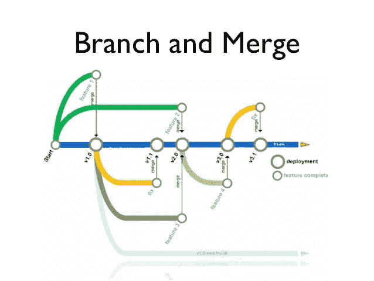

# 十大版本控制系统

> 原文：<https://medium.com/hackernoon/top-10-version-control-systems-4d314cf7adea>

## 版本控制系统对于跟踪变更的重要性不能被夸大，公司应该选择最适合他们需求的一个。

Version Control System- Image [Source](https://www.slideshare.net/alanstevens/distributed-version-control-with-mercurial)

如果你计划从事一个大型的软件开发项目，这个项目由技术概念组成，需要不同团队成员的合作，并且需要频繁的修改，那么你需要使用一个版本控制系统。

# 什么是版本控制系统？

版本控制系统允许用户跟踪软件开发项目中的变更，并使他们能够在这些项目中进行协作。使用它，开发人员可以一起处理代码，并通过分支分离他们的任务。

根据合作者的数量，在一个版本控制系统中可以有几个分支。当代码变更保留在指定的分支中时，分支保持了独立性。

开发人员可以在需要时组合代码更改。此外，他们可以查看变更的历史，回到以前的版本，并以期望的方式使用/管理代码。

# 使用版本控制系统的好处

使用版本控制系统的主要优势包括简化开发过程、管理多个项目的代码以及保存代码中所有更改的历史记录。

版本控制软件将所有的变更保存在一个存储库中。因此，如果开发人员犯了错误，他们可以撤销它。同时，他们可以将新代码与以前的版本进行比较，以解决他们的不满。这可以在很大程度上减少人为错误和意外后果。非常适合全球任何网络开发公司。

此外，它可以与一些软件开发工具集成，如 PaaS 提供商、集成开发环境(IDE)和构建自动化工具。

# 最佳版本控制系统

市场上有很多选择。因此，我们创建了一个 10 个最佳版本控制软件的列表，以缩小选择范围，使事情变得更容易。

## 1.开源代码库

GitHub 帮助软件团队协作并维护代码变更的整个历史。您可以跟踪代码中的变化，返回时钟以撤销错误，并与其他团队成员分享您的成果。

它是托管 Git 项目的存储库。对于那些想知道什么是 Git 的人来说？它是一个开源版本控制系统，具有本地分支、多个工作流和方便的暂存区。Git 版本控制是一个简单易学的选项，提供了更快的操作速度。

## 2.GitLab

GitLab 附带了许多方便的功能，如集成项目、项目网站等。使用 GitLab 的持续集成(CI)功能，您可以自动测试和交付代码。

您可以访问项目的所有方面，查看代码，拉请求，并组合冲突解决方案。

## 3.豆茎

Beanstalk 是那些需要在偏远地方工作的人的理想选择。该软件基于浏览器和云，允许用户使用浏览器进行编码、提交、审查和部署。

它可以与消息传递和电子邮件平台集成，以实现与代码和更新相关的高效协作。它支持 Git 和 SVN，并带有内置的分析功能。

为了安全起见，它利用了加密、双因素身份验证和密码保护功能。

## 4.不得已

Perforce 通过其 HelixCore 提供版本控制功能。HelixCore 提供了一个无缝团队协作的单一平台，并支持集中式和分布式开发工作流。

这是一个保护最有价值资产的安全解决方案。HelixCore 允许您准确地跟踪代码变更，并促进一个完整的 Git 生态系统。

## 5.Apache Subversion

Apache Subversion 是另一个开源版本控制系统，由 CollabNet 在几十年前创建。开源领域和企业都认为它是有价值数据的可靠选择。

Subversion 的关键特性包括库存管理、安全管理、历史跟踪、用户访问控制、廉价的本地分支和工作流管理。

## 6.AWS 代码提交

AWS CodeCommit 是一个托管的版本控制系统，它托管安全且可伸缩的私有 Git 存储库。它与 Amazon Web Services (AWS)的其他产品无缝连接，并将代码托管在安全的 AWS 环境中。因此，它非常适合 AWS 的现有用户。

AWS 集成还提供了对来自 AWS 合作伙伴的几个有用插件的访问，这有助于软件开发。

## 7.Microsoft Team Foundation Server

由微软开发的 Team Foundation Server 是一个企业级工具，用于管理源代码和其他需要版本控制的服务。它可以跟踪工作项，以发现项目中的缺陷、需求和场景。

它具有几个独特的功能，如团队构建、数据收集和报告、团队项目门户、Team Foundation 共享服务等。

## 8.水银的

Mercurial 以处理各种规模项目的效率而闻名。这是一个免费的分布式控制管理服务，提供了一个简单而直观的用户界面。

开发人员和企业喜欢 Mercurial 的备份系统、搜索功能、项目跟踪和管理、数据导入和导出以及数据迁移工具。它还具有工作流管理、历史跟踪、安全管理、访问控制等功能。

## 9.CVS 版本控制(并行版本系统)

CVS 是最古老的版本控制系统之一，也是商业和开源开发者中的一个著名工具。它允许您检出您计划处理的代码，并检入变更。

它有能力处理具有多个分支的项目，以便团队可以合并他们的代码更改，并为项目贡献独特的功能。

由于 CVS 现在已经存在很久了，是最成熟的版本控制软件。

## 10.比特桶

Bitbucket 是 Atlassian 软件套件的一部分，因此它可以与其他 Atlassian 服务集成，包括 HipChat、吉拉和 Bamboo。Bitbucket 的主要特性是代码分支、内嵌评论和讨论以及拉请求。

它可以部署在本地服务器、公司的数据中心以及云上。Bitbucket 允许你免费连接最多五个用户。这很好，因为你可以在决定购买之前免费试用这个平台。

# 包扎

这些是最好的版本控制系统，一个网站开发公司应该根据需求考虑使用。选择 VCS 时，您必须考虑目的、可负担性、评估流程和使用案例。

经 Vaibhav Shah 许可，在 DZone 出版。[在 Dzone](https://dzone.com/articles/top-10-version-control-systems) 看原文