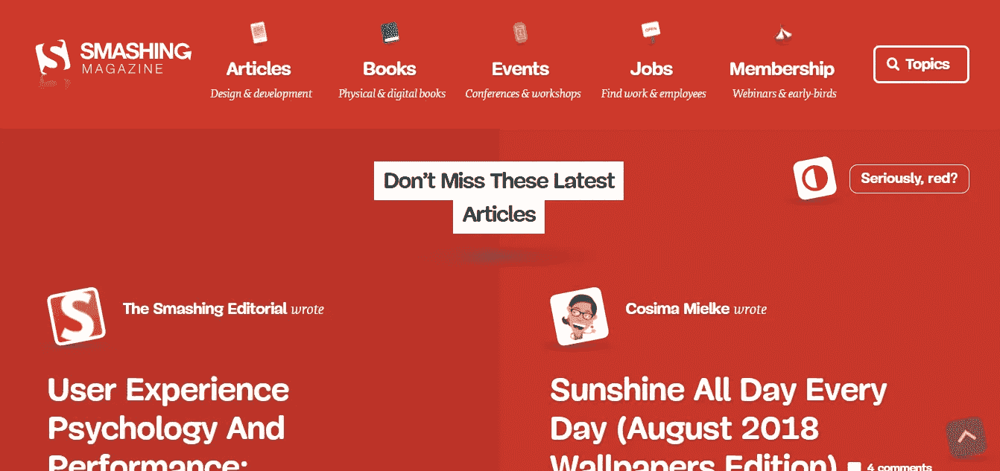
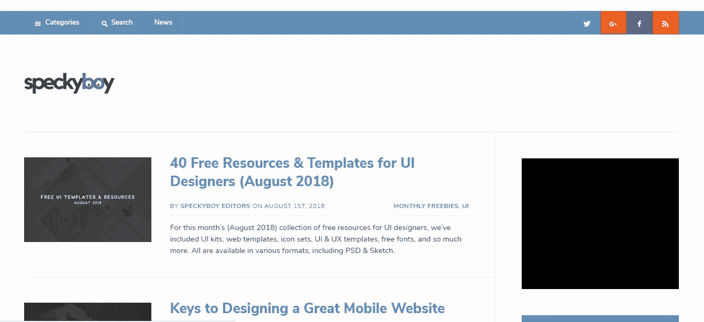
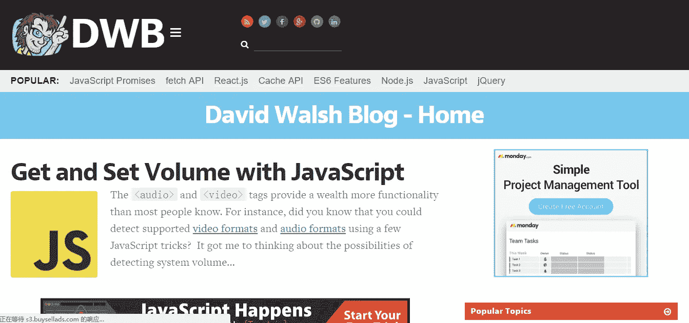
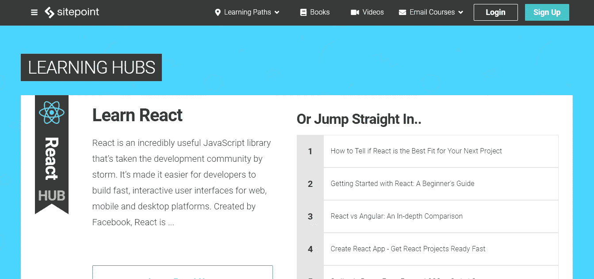
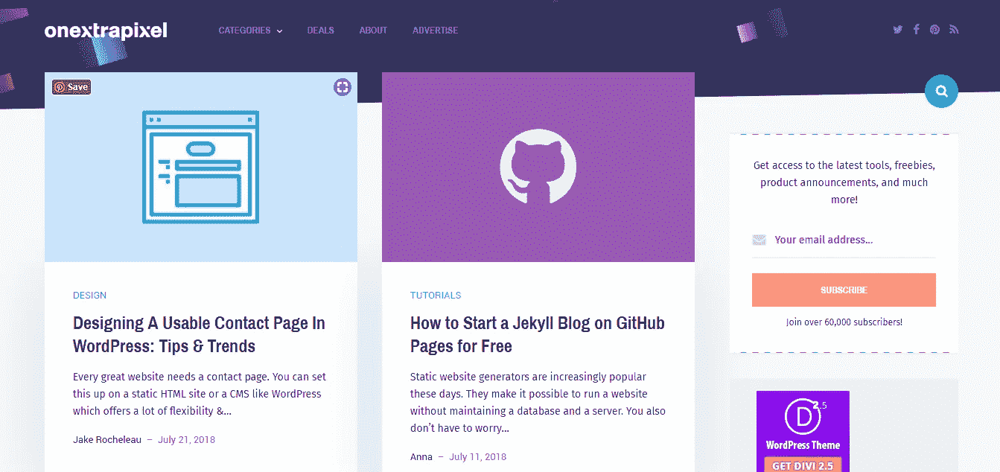
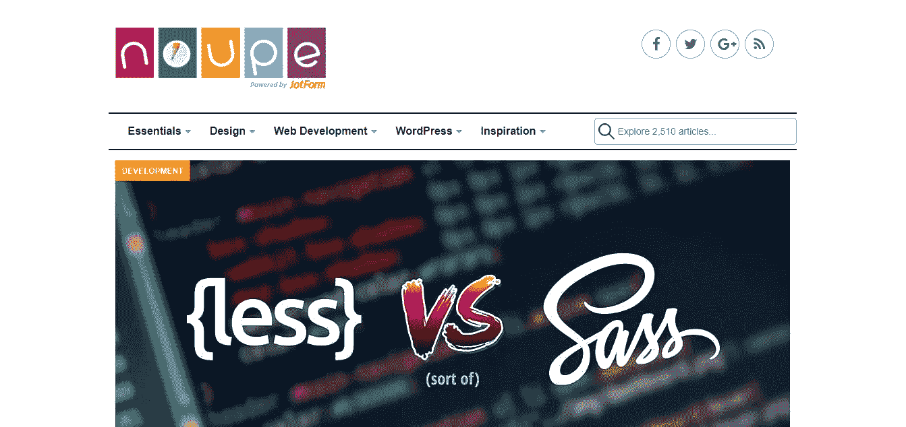
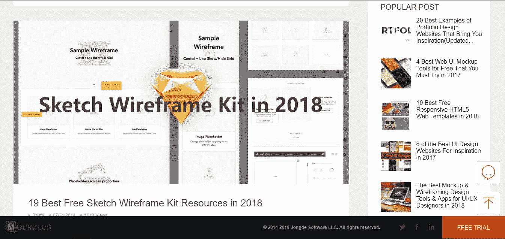
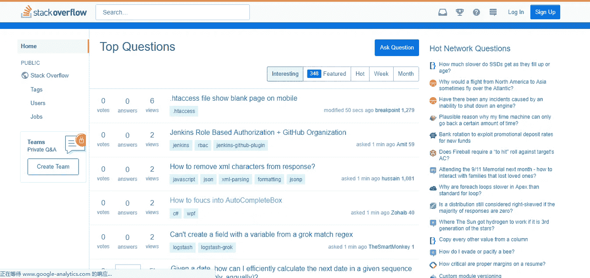
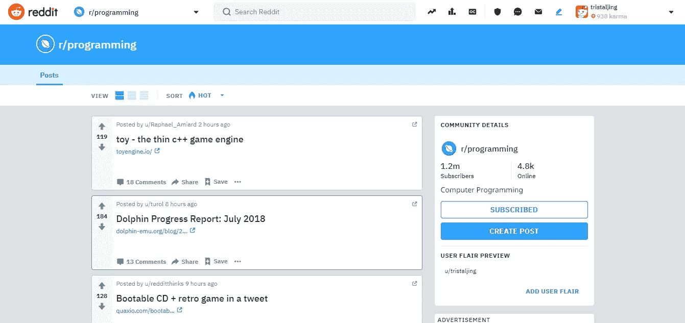
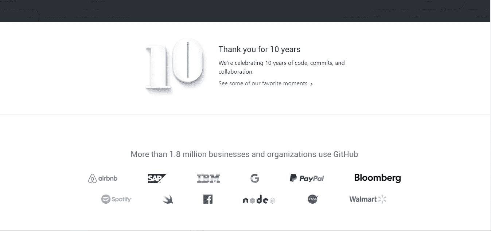

# 2018 年网页开发和设计的 11 大网页开发者博客

> 原文：<https://medium.com/hackernoon/top-11-web-developer-blogs-for-web-development-and-design-in-2018-a83389b3048c>

以下是 2018 年 11 个最适合开发者的 web 开发者博客。不仅是面向初学者的顶级 web 开发者博客，也是前端 web 开发博客的资源。

开源网络和技术进步使得 web 开发领域成为一个不断变化、不断发展的领域。而且速度很快。在这个“网络时代”，所谓的 web 开发专家实际上是那些优秀的学习者，乐于吸收和应用新信息。如果你想作为一个 web 开发人员保持竞争力，你必须跟上你所在领域的最新发展新闻和趋势。

幸运的是，您可以很容易地找到关于最新的 web 开发人员/开发新闻和技术的信息——无论您是在学习新的 UX 设计应用程序，还是仅仅跟踪最新的 web 开发趋势。

今天，Mockplus 团队已经为你收集了 11 个最好的网络开发博客,为你做了大量的调查工作。出于本文的目的，博客被分为两个不同的类别，但是请注意，其中一些可能同时属于这两个类别。

# 最佳网络开发博客

# 1.粉碎杂志

**关注:UI/UX 设计、网页设计、网页开发新闻、HTML**

**Smashing Magazine 是一本面向专业** [**网页设计师和开发者**](https://www.mockplus.com/blog/post/web-designer-vs-web-developer) **的在线杂志。**是一个非常著名的 web 开发新闻网站，专业人士不容忽视。它每两天发布一篇文章，提供大量关于 HTML、CSS 和 Java 相关主题的资源。对于那些想要掌握前端 web 开发技术的人来说，这是一个很好的资源。您可以使用关键字搜索博客，发现新的主题，如设计、编码、图形、用户体验、移动开发和 CMS 框架。

# 2.六次修订(网页 fx)

**专注:网站设计、网站开发、SEO**

Six Revisions 现在更名为 Webpagefx，是一个面向设计师和网络开发者的网站。有许多[针对网络专业人士的网页设计和开发教程和资源](https://www.mockplus.com/blog/post/web-design-and-development-tutorials)。SixRevisions 成立于 2008 年 2 月，不断更新由专业 web 开发人员和设计人员创作的最新材料。世界各地的作家每隔 2-5 天就会发布新内容。内容可读性强，信息量大。

# 3.斑点男孩

**关注:CSS、JavaScript、iQuery、线框设计**

Speckyboy 设计杂志是一个关于 CSS、JavaScript、UX 设计和其他技术的面向设计的博客。该网站还涵盖了设计师和用户之间的商业关系。此外，它还提供了对工作流的深入了解，有助于您的原型开发和部署周期。Specky Boy 的出版商 Paul Andrew 不仅关注设计资源，还对最新的网络技术有着深刻的见解。这个网站对于想要关注行业最新消息的前端开发人员特别有用。

# 4.大卫·沃尔什

**关注:Web 开发教程、功能、演示和 Web 开发博客**

**David Walsh 是一个个人博客，发表关于各种 web 开发前端和后端技术**的文章，如 AJAX、Canvas & SVG、CSS、Dojo、Firefox OS、HTML5、JavaScript、jQuery、Node.js 等。如果你对软件开发特别有热情，你一定会喜欢大卫·沃尔什的博客。虽然内容不是很详细，但它确实解决了许多常见的开发问题，使这个博客非常值得您花费时间。

# 5.站点点

**关注:HTML 和 CSS，Javascript 教程，付费电子书和视频**

与榜单上的其他人相比， **SitePoint 更像是一个在线学习平台，而不是一个网络开发博客。它的论坛也是我们最喜欢的在线开发社区之一。SitePoint 的主要目标是帮助初学者理解他们选择的编程语言和技术，并进一步提高他们的知识。其他学习领域包括网页开发、网页设计、技术写作和用户体验。**

# 6.Onextrapixel

**专注:网页设计，网页开发**

网页设计和网页开发的内容通常是互补的，最终，他们有着相同的目标——创建一个好的网站。从这个角度来看， **OXP 既可以是网页开发博客，也可以是网页设计博客。它提供了许多资源、文章和教程。主题包括设计、图形、WordPress、CSS、社交媒体、开发、赠品、工具包和活动。教程包括编写代码、在 Photoshop 中修改图像等的分步说明。无论您是在寻找有用的 HTML5 技巧还是新 jQuery 库中的文章，您都可以在这里找到它们。**

# 7.诺佩

**关注:独立网页开发版块、开发语言、教程分类**

Noupe 是一家来自德国的网站，提供网站设计和网站开发资源。该网站为网页设计者和网页开发者提供了广泛的最新工具和教程，以及相关的动态新闻。这个网站涵盖了设计的所有方面:CSS，在不牺牲流行浏览器兼容性(Ajax)的情况下创建交互式 web 应用程序，Java 脚本，网站设计，网站图形和图标，网页布局，广告，等等。网站的目标是帮助用户通过网站的功能界面与其他用户进行有效的交流。

# 8.Mockplus 博客

**专注:网页设计，优秀网页开发案例资源**

**Mockplus 是一个原型开发工具网站。**但是除了提供原型之外，它还非常注重设计原型的规范到实现开发过程的过程。其博客提供了丰富的设计资源，包括[优秀的网页设计模板和与优秀网页开发案例相关的资源](https://www.mockplus.com/blog/post/free-responsive-html5-web-design-templates)。虽然不是专门的 web 开发博客，但是提供的内容也能给开发者带来一些启发。阅读博客将从最初的原型设计开始，为优秀的 web 开发打下坚实的基础。

# Web 开发社区网站

# 1.堆栈溢出

**关注:Q &一个社区，简单的设计，没有广告，没有弹出窗口**

**StackOverflow 可能是世界上最活跃的程序员社区。**用户可以提交问题，浏览问题，索引相关内容，创建主页时使用简单的 HTML。在问题页面，没有广告，销售信息，JavaScript 窗口等。会弹出来。网站右侧还展示招聘信息，为全球开发者提供优质就业渠道。

# 2.Reddit

**关注:Q &一个社区，多开发板**

虽然 Reddit 不是一个专门的开发者信息网站，但是你可以订阅专注于 web 开发的 subReddits。作为 subReddit 的成员，您可以关注和发起主题线程，以及加入讨论。随着一些最敏锐的头脑活跃在 Reddit 上，你会从你的同龄人那里学到很多东西。

# 3.开源代码库

**关注:开源代码网站**

Github 是一个代码托管平台。你可以选择与公众分享你的代码，让每个人都参与进来。同时，GitHub 也是一个非常有用的版本管理工具。开发者提交他们自己的代码，你可以分享工作成果。更著名的开源软件开发商也将通过该平台发布他们自己的代码。可以互相学习，借鉴别人的代码，想法，共同进步。

# 摘要

作为一名开发人员，保持开放的学习心态会让你成为专家。无论你是初学者还是经验丰富的开发者，上面列出的 11 个 web 开发博客都非常值得你关注。

关于网站博客的更多信息:

[学习网页开发要多久才能找到工作？](https://www.mockplus.com/blog/post/how-long-does-it-take-to-learn-web-development)

[2018 年你应该关注的 20 大 UX 设计博客和资源(更新)](https://www.mockplus.com/blog/post/146-top-20-ux-design-blogs-and-resources-you-should-follow-in-2016)

[2018 年 10 大免费响应 HTML5 网页模板](https://www.mockplus.com/blog/post/free-responsive-html5-web-design-templates)