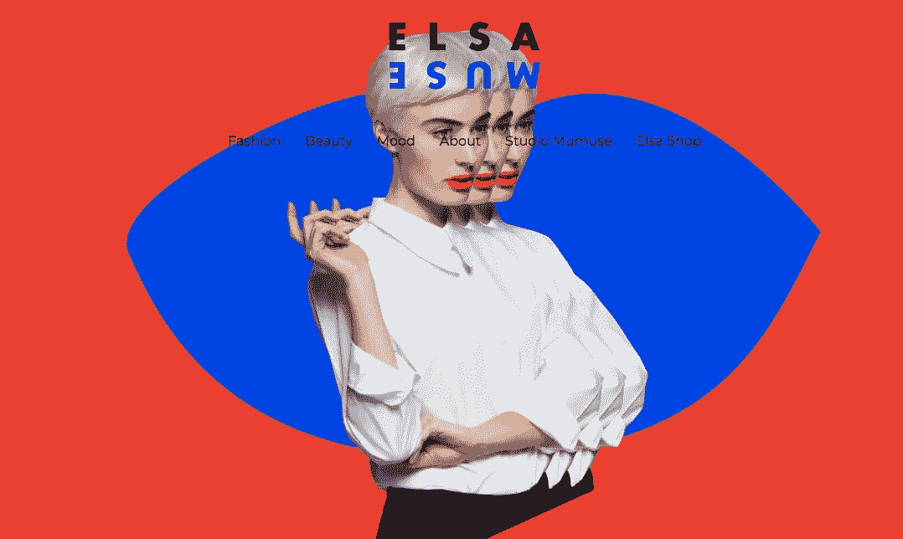

# 获得灵感的 12 大网络开发者组合

> 原文：<https://medium.com/hackernoon/top-12-web-developer-portfolios-to-get-inspirations-b1a54247329e>

制作一个令人惊叹的网站开发者作品集并不容易，这里有 12 个最好的网站开发者作品集网站供你参考。

作为一名新的开发者，最难做的事情之一是制作一份个人的**网络开发者作品集**，这有助于在过度拥挤的就业市场中获得潜在雇主的注意。毫无疑问，一个出色的在线作品集不仅可以向即将到来的访问者展示你的设计作品，还可以反映你的成就和专业知识，给别人留下深刻的印象。因为它不仅仅是工作样本的集合，所以在创建一个 web 开发人员作品集网站时，这里有一些值得注意的方面:

*   有没有一个清晰的号召按钮，让别人快速了解你？
*   对于网站布局有没有什么混乱的地方？
*   在展示个人才华或专业素养时是否过于啰嗦？
*   加载需要相当长的时间吗？页面加载慢相当于面试迟到，要想方设法避免？
*   网页显示的是用户关心的核心问题，还是仅仅包括一个毫无意义的个人成就的问题？
*   网页在手机上能正常加载显示吗？

相比商业网站，web 开发者个人网站会更注重个性和独立思考。在下面，你会发现 **12 个来自全球个人设计师和创意工作室的最佳网页开发者作品集**。向下滚动，获得灵感。

# 12 个 Web 开发人员组合示例

**1。**[**http://www.rleonardi.com/**](http://www.rleonardi.com/)

**制作人——罗比·莱昂纳迪**

**背景信息:**多学科设计师，科技爱好者，NBA 球迷。

**特别之处:**融合了我们小时候的互动体验和视频游戏。

正如你所看到的，这个网站看起来像一个在线视频游戏，当你滚动鼠标了解 Robby 的工作经验和专业技能时，你会感觉像在玩游戏。如果你正在寻找一种新颖的方式向人们展示一条看似无聊却很重要的信息，那么这个网站就是一个完美的例子。

**2。**[**http://findmatthew.com/**](http://findmatthew.com/)

**马修·威廉姆斯制造**

**背景信息:**热爱 UI 特效、动画、动态用户体验的前端开发工程师。

特别之处:单页，黑色背景，界面简洁。

如果你想做一个具有创造力和漂亮界面的前端开发人员组合，那么你不能错过它。它采用黑色作为背景，使网站看起来既时尚又干净。加载页面上有一个简明的自我介绍，并将在页面向下滚动时加载不同的部分，包括:专业技能，博客帖子，投资组合以及联系方式。

**3。**

****由 DRIES VAN BROECK** 制作**

****背景资料:**一个动作设计师。**

****特别之处:**看似走神却巧妙地突出了重要的东西。**

****

**根据程序员组合网站的一般规则，动态效果很容易让人分心。但是你会发现网站设计得很好，包括漂亮的旋转木马，明亮的提示文本来突出作者信息，以及动画小图标来吸引用户对网页最重要部分的注意。我们可以看到他先进的开发和设计技能。**

****4。**[**http://www.maltegruhl.com/**](http://www.maltegruhl.com/)**

****由—马尔特·格鲁制造****

**背景信息:自由设计师。**

****特别之处:**这是一个包罗万象的设计师，给人一种深深的神秘感。**

****

**这个站点给人一种神秘感，就像作者名字给人的感觉一样。无论是极简主义、艺术还是抽象，似乎都不足以准确描述他的设计特点。随着页面向下滚动，我们会发现许多物理和化学的反映。**

****5。**[**https://benbate.com/**](https://benbate.com/)**

****制作人—本·贝特****

****背景信息:**一名产品设计师，经常与初创公司和大公司合作，以创造有影响力的电子产品。**

****特别之处:**文案和内容会给你留下深刻的印象。**

****

**好像是 Bootstrap 做的。虽然视觉设计不是特别出色，但看它的内容和文案很有趣。**

****6。**[**http://www.elsamuse.com/en/**](http://www.elsamuse.com/en/)**

****由艾尔莎·缪斯制作****

****背景信息:**法国时尚博主。**

****特别之处:**大胆的配色，教科书般的极简主义。**

****

**不得不说 Elsa Muse 的设计作品是有一些艺术性格的，从网站上我们也可以看到。参考教材的配色和极简设计，是开阔视野的好方法。**

****7。****

******制作人— Legworkstudio******

******背景信息:**位于科罗拉多州的个人工作室。****

******特别之处:**你从未见过的动画和互动体验。****

********

****动画和互动效果一起使这个网站脱颖而出。很多人会对它首页独特的手绘动画印象深刻。关键是这些动画不像我们以前见过的任何东西。****

******8。**[**https://www.loungelizard.com/**](https://www.loungelizard.com/)****

******由——蜥蜴制成******

******背景信息:**纽约的一家网页设计公司。****

******有什么特别的:**这个站点看起来很专业但又不落俗套，给人一种放松的感觉。****

********

****让一个网站看起来专业但不落俗套并不容易，但 Lounge Lizard company 做到了。从品牌案例和职场照片展示来看，这个酒吧主题网站在树立品牌和提升公司口碑方面做得很好。****

****9。[**https://www.wokine.com/**](https://www.wokine.com/)****

******由—沃金制作******

******背景信息:**一家位于巴黎的网页设计公司。****

******特别之处:**分屏视觉设计。****

********

****这个网站遵循一种非常流行的视觉设计方法——分屏。这个站点的整体设计非常简洁，结合大量的间距和简单的[配色](https://www.mockplus.com/blog/post/ui-color-schemes)。这也给了一个很好的视觉层次。****

******10。**【http://www.danielspatzek.com/Home】****

********制作人——丹尼尔·斯派泽克********

******背景信息:**一名自由职业的图形和网页设计师。****

******特别之处:**大量的图形和动画技术。****

********

****这个网站使用了大量的 CSS 技术和动画来创造惊人的动态体验。与许多长页面设计不同，这个网站的导航被分布在四个方向，这与传统的排列方式有很大不同。****

******11。******

********制作人—肖恩·哈尔平********

******背景信息:**来自多伦多的网页设计师和开发者。****

******特别之处:**这是个性的小世界。****

********

****这是一个完美的例子，展示了作者的技能和个性。整个网站看起来像一个设计师的小绿色世界，肖恩还帮助其他人建立个人网站。****

******12。**[**https://www.denisechandler.com/**](https://www.denisechandler.com/)****

****丹尼斯·钱德勒制作****

******背景资料:**对编程有很深研究的女设计师。****

******特别之处:**将网页设计的 4 个基本原则与个性化元素完美融合。****

********

****这份自由网络开发者作品集完美地诠释了设计的 4 个基本原则:对齐、重复、对比和亲密。此外，它有许多个性化的元素，这些元素引人注目，并且是在网络上留住人的独特元素。****

# ****结束语****

****以上是精心挑选的网页开发者作品集，可以激发你的灵感。然而，要做出一个优秀的设计，仅有灵感或天赋是不够的。一个有用的设计工具是帮助你更快更好地完成工作的必备工具。如果你在寻找功能性和易用性的结合，那么 [Mockplus](https://www.mockplus.com/download) 是个不错的选择。它不仅提供了丰富的 web 设计示例，还包括现成的组件/UI 元素，可以让您轻松开始设计。****