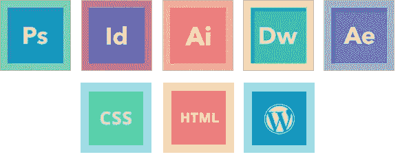
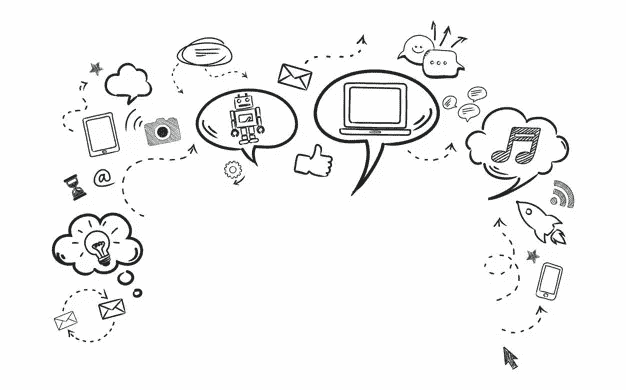

# 2018 年你必须具备的 14 大网页设计师技能

> 原文：<https://medium.com/hackernoon/top-14-web-designer-skills-you-must-have-in-2018-a0d440490e01>

这份榜单总结了 2018 年你必须具备的 14 大网页设计师技能。你可以学习和提高你的网页设计技能，变得更好。

随着互联网的快速发展，网页设计师和网页开发者近年来变得相当热门。然而，伴随着流行而来的是竞争，提出了一个问题，如何提高他们的网页设计和开发技能以保持竞争力？

[网页设计师 vs 网页开发者](https://www.mockplus.com/blog/post/web-designer-vs-web-developer)，显然，他们在职业角色上有着明确的界限和分工。随着技术的发展和产品设计的变化，网页设计师的技能不再局限于设计，而是蚕食成为“[全栈设计师](https://www.mockplus.com/blog/post/full-stack-designer)”。

[如何成为一名网页设计师？](https://www.mockplus.com/blog/post/how-to-become-a-web-designer)网页设计师需要哪些技能？一个人如何在这个领域最大化他们的薪水？你可以在这篇文章中找到所有这些问题的答案。Mockplus 总结了一份 2018 年网页设计师技能清单，供大家参考。我们希望它能帮助你成为一名优秀的高薪网页设计师。

在查看网页设计师技能列表之前，让我们先弄清楚网页设计师在一家公司做什么，需要什么样的技能。以下是网页设计师职位描述模板:

**网页设计师职位描述来自** [**可操作性**](https://resources.workable.com/web-designer-job-description)

*此网页设计师职位描述模板经过优化，适合发布在在线职位公告板或职业页面上。很容易为您的公司和特定的设计人员或开发人员的职责和责任进行定制。立即在工作公告板上发布*

**网页设计师职责**

*包括:*

*   *执行从概念到最终交付到工程的所有视觉设计阶段*
*   *概念化原创网站设计理念，为复杂的路障带来简单和用户友好*

**工作简介**

我们正在寻找一个有才华的网页设计师来创造惊人的用户体验。理想的候选人应该有一个干净和巧妙的网页设计的眼睛。他们还应该有高超的用户界面设计技能。

成功的候选人将能够将高层次的需求转化为交互流和工件。他们将能够把它们转化成漂亮、直观、实用的设计。

**职责**

*   *执行从概念到最终交付再到工程的所有视觉设计阶段*
*   将原创的网站设计理念概念化，为复杂的障碍带来简单和用户友好
*   *创建线框、故事板、用户流、流程图和网站地图，以交流互动和设计理念*
*   *向同事和管理层利益相关者展示设计和关键交付成果并进行辩护*
*   *建立并推广设计指南、最佳实践和标准*

**要求**

*   *网页设计师的工作经验*
*   *可展示的平面设计技能和强大的组合*
*   在创建线框、故事板、用户流、过程流和网站地图方面有丰富的经验
*   *精通 Photoshop、Illustrator 或其他视觉设计和线框工具*
*   *精通用于快速原型制作的 HTML、CSS 和 JavaScript*
*   在敏捷/Scrum 开发过程中工作的经验
*   *优秀的视觉设计技能，对用户-系统交互敏感*
*   *创造性地有效解决问题的能力*
*   *了解最新的网络趋势、技巧和技术*
*   *人机交互、交互设计或视觉艺术专业学士/硕士*

通过上面职位模板中对所需技能的描述，我们可以大致了解一个网页设计师是做什么的。它提供了大量关于需要什么技能、应该掌握哪些设计工具以及需要哪些技术技能的信息。

为了更好地理解和帮助指导新的网页设计师，Mockplus 将网页设计师技能分为三类:专业技能、技术技能和软技能。

# 网页设计师的专业技能

那么从专业技能方面来说，网页设计师必备的素养如下:

# 1.设计工具

工匠总是有一套工具。正如上面列出的工作描述，网页设计师必须使用几个基本的设计软件应用程序。虽然现在可以在网络浏览器中设计网站，但 Photoshop、Sketch 和 Mockplus 等工具对于图像处理、图标设计和原型制作来说是非常有用的工具。在正确的阶段使用正确的工具会使你的工作更有效。

**PS (Photoshop)** :图形和网页设计的强大图像处理。

**Adobe Illustrator** :简称“AI”，是一款非常优秀的矢量图形处理工具，主要用于字体设计、平面设计、产品包装设计、书籍/杂志排版、插画设计。

**Adobe After Effects** :简称“AE”，是 Adobe 推出的一款图形视频处理软件。简单来说就是 PS 的动态版，功能很强大，操作很复杂。

**Mockplus** :一个强大的[交互式原型/线框工具](http://www.mockplus.com/)，免费下载。

[Mockplus iDoc](https://idoc.mockplus.com/) :面向数字产品团队的在线设计协作工具，包括设计师和工程师。它将您的设计工作从设计连接到开发，并帮助团队进行设计移交。

# 2.设计感

对于网页设计师来说，拥有良好的设计感是非常重要的。网页设计不仅仅是做一个好看的网站。你必须了解排版、图像等设计元素，以及布局原则、[表单设计原则](https://www.mockplus.com/blog/post/mobile-form-design-examples)等基本设计原则。

# 3.UX 设计

UX 代表用户体验，或者说人们使用网站时的感受。为了提供一个好的 UX，你需要研究你的用户来帮助创建用户角色( [18 个免费的优秀用户角色模板以获得灵感](https://www.mockplus.com/blog/post/user-persona-template))并使用网站地图来布局页面和内容。这有助于您了解用户在实际站点访问过程中的路径。通过反复测试，网站的设计可以得到改进，改善用户体验，从而提高用户转化率。

# 4.响应式设计

随着智能手机、平板电脑和其他移动设备的增长，越来越多的人使用小屏幕来查看和阅读网页信息。作为一名网页设计师，你应该了解响应式网页设计的原则，以保持你的网页在小屏幕上的可读性。( [12 个最佳响应网页设计教程让你入门！](https://www.mockplus.com/blog/post/responsive-web-design-tutorials))

# 5.装帧设计艺术

[网页设计不同于平面设计](https://www.mockplus.com/blog/post/web-design-vs-graphic-design)。如果你是一个有平面设计技能的网页设计师，这将提高你的市场竞争力。

# 6.Adobe 动画

动画可以使枯燥的网页充满活力。一个合适的动画会让你的网站更有吸引力。尤其是对于名牌服装、汽车、电影、电视网站来说，一部动画尤为重要。视觉冲击将有助于品牌识别和认可。

# 网页设计师的技能

随着网页开发技术的飞速发展，对网页设计师的要求也越来越高。除了精通专业技能，了解必要的 web 开发语言对你来说会有更长远的好处。

# 1.超文本标记语言

有些人可能不认为网页设计师应该掌握 HTML，但是，不管你是不是开发人员，你都应该知道基本的 HTML/CSS。这将帮助你更容易地阅读、编辑和解决问题。但是，根据你作为设计师/开发者的实际工作情况，你需要了解的层次和范围可能会更广。在任何情况下，您都应该知道代码是如何控制和调整样式和颜色的。从长远来看，这些技能非常有用。

# 2.半铸钢ˌ钢性铸铁(Cast Semi-Steel)

CSS 和 HTML 是网站开发的伙伴，是网页结构和风格的基本构建块。HTML 决定网站的结构，CSS 处理视觉外观。例如，CSS 可以让你调整颜色，改变字体，或添加惊人的背景。

# 3.Java Script 语言

有了用 HTML 和 CSS 编写设计代码的能力，你可以通过学习用 JavaScript 编程来帮助自己变得更有竞争力。作为一个网页设计师，你知道 JavaScript，这可能会帮助你解决实际工作中的大问题。另外，根据 StackOverflow 的调查，JS 是最受[全栈开发者](https://www.mockplus.com/blog/post/how-to-become-a-full-stack-developer)欢迎的编程语言。

# 4.Web 服务器管理

大多数 web 设计者认为他们可以忽略服务器，但是 web 服务器和停机问题是不可避免的。您不需要成为后端专家，但是了解 web 服务器及其基本功能如何工作将有助于您更快地解决问题。

# 网页设计师的软技能

既然我们已经讨论了专业和技术技能，我们应该看看添加一些软技能，以帮助我们的网页设计工作更有条理。

# 1.时间管理

无论你是自由职业者还是为公司工作，时间管理技巧都很重要。项目迭代的快速更新意味着设计也必须时常更新。优秀的网页设计师需要管理他们的时间表，并跟进项目需求。

# 2.项目管理

项目管理几乎在每个行业都是一项关键的工作技能，网页设计也不例外。良好的项目管理技能不仅有利于项目，也有利于你的职业生涯。

# 3.搜索引擎优化

SEO(搜索引擎优化)对于任何一个建立网站的人都是有用的。网页设计师和网页开发人员至少应该了解 SEO 的基本知识，这将为你的工作加分。

许多因素会影响网站在搜索引擎中的排名，从网站的内容到它的入站链接，再到它的下载速度、性能和它的移动友好性。这些都是网页设计师在设计时要注意的因素。一旦你知道了 SEO，你就可以利用这些因素让网站对搜索引擎更有吸引力，从而让客户更容易找到。

# 4.客户服务

虽然客服不是一门技术活，但是一个好的网页设计师要想赢得客户，取得更好的效果，提供优秀的客服是必须的。即使是最好的网页设计师/开发者也可能失败。

# 总结:

这份榜单总结了 2018 年你必须具备的 14 大网页设计师技能。如你所见，成为一名网页设计师并不神秘。这些技能构成了所需知识的基础。不断学习和提高你的网页设计师技能，这是成为一名优秀网页设计师的唯一秘诀。

为网页设计师提供更多资源:

[2018 年 UI/UX 设计师最佳模型&线框设计工具&应用](https://www.mockplus.com/blog/post/the-best-mockup-wireframing-design-tools-apps-for-uiux-designers)

[成为网页设计师的 10 个最佳步骤指南](https://www.mockplus.com/blog/post/how-to-become-a-web-designer)

[最佳 UI/UX 设计书籍&设计师资源(更新)](https://www.mockplus.com/blog/post/the-best-uiux-design-books-resources-for-designers)