# 你应该阅读的 15 大自动驾驶技术博客

> 原文：<https://medium.com/hackernoon/top-15-autonomous-driving-technology-blogs-you-should-be-reading-adff8e8af174>

如果你必须选择一项已经从根本上改变了城市交通的技术，那会是什么？

自动驾驶技术前景广阔，发展迅速，是汽车、智能城市、交通和其他相关领域的真正变革者。不出所料，自动驾驶汽车已经成为专门研究自动驾驶技术的企业博客和汽车杂志上的热门话题。

如果你想发展你的业务，并从最令人鼓舞的未来技术中受益，请查看这些**2018 年要关注的 15 大自动驾驶汽车博客和网站。**

# 1.公元 2025 年

www.2025ad.com

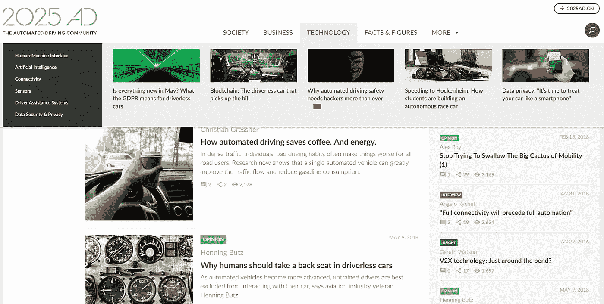

[2025AD](https://www.2025ad.com/sdb/) 对于那些对自动驾驶汽车技术的技术和基于研究的证据感兴趣的人来说，是一个完美的博客。它提供了无数关于自动驾驶的调查、研究和研究论文。

## 收藏夹:

[自动驾驶如何节省咖啡。能源](https://www.2025ad.com/latest/automated-vehicles-can-reduce-the-risk-of-traffic-jams/)——一项关于无人驾驶汽车不仅可以调节交通流量和减少汽油消耗，还可以改善司机健康和福祉的引人注目的研究。

[信息图:自动驾驶的经济影响](https://www.2025ad.com/latest/economic-impact-infographic/)——令人信服的可视化展示了自动驾驶技术的深远财务影响。

[人情味:提高无人驾驶技术的社会接受度](https://www.2025ad.com/latest/2018-05/humanizing-driverless-car-technology/) —这是一项关于自动驾驶汽车的人性化如何帮助克服对该技术的恐惧的深刻研究。

# 2.这里

[360.here.com](https://360.here.com/)

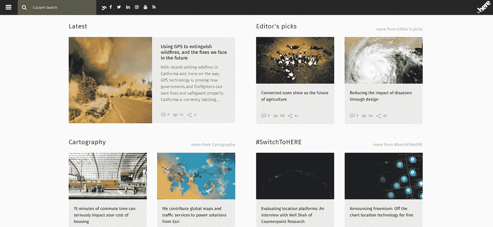

360.here 是关于自动驾驶汽车的最佳博客之一，对于那些想要了解汽车供应商和相关企业即将发布的技术的人来说，这是一篇必读的文章。

## 收藏夹:

[制作和维护精确到厘米的地图；自动化需要它](https://360.here.com/making-and-maintaining-maps-accurate-to-the-centimeter-automation-demands-it) —一篇精彩的文章揭示了高清地图制作在当今汽车行业中的巨大作用。

自动驾驶汽车上了一堂伦理课——以德国为例，对自动化的伦理方面进行了平衡的观察。

[确保自动驾驶汽车的安全](https://360.here.com/ensuring-safety-in-autonomous-cars)——无人驾驶汽车主要安全要素的全面概述。

# 3.Intellias

【intellias.com/blog 

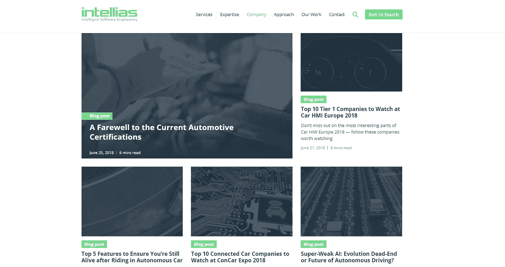

Intellias 是东欧发展最快的汽车软件开发公司之一。Intellias 公司博客对于深入了解行业中最新的软件开发是不可或缺的。

## 收藏夹:

[超弱 AI:进化的死胡同还是自动驾驶的未来？](https://www.intellias.com/super-weak-ai-evolution-dead-end-or-future-of-autonomous-driving/?utm_source=medium.com&utm_medium=referral&utm_campaign=CM&utm_content=automotive%20blogs) —人工智能在各种应用程序中的复杂应用，包括与自动驾驶相关的应用。

[用于自动驾驶的计算机视觉:关注道路](https://www.intellias.com/computer-vision-keep-sharp-eye-road/?utm_source=medium.com&utm_medium=referral&utm_campaign=CM&utm_content=automotive%20blogs) —这是一个关于计算机视觉不可或缺的组成部分的引人入胜的概述，它可以让自动驾驶汽车看到并理解世界。

[自动驾驶的新兴未来](https://www.intellias.com/the-emerging-future-of-autonomus-driving/?utm_source=medium.com&utm_medium=referral&utm_campaign=CM&utm_content=automotive%20blogs) —令人信服的研究表明自动驾驶汽车将如何成为我们日常生活的一部分。

# 4.汽车世界

[www.automotiveworld.com](https://www.automotiveworld.com/connected-autonomous/)

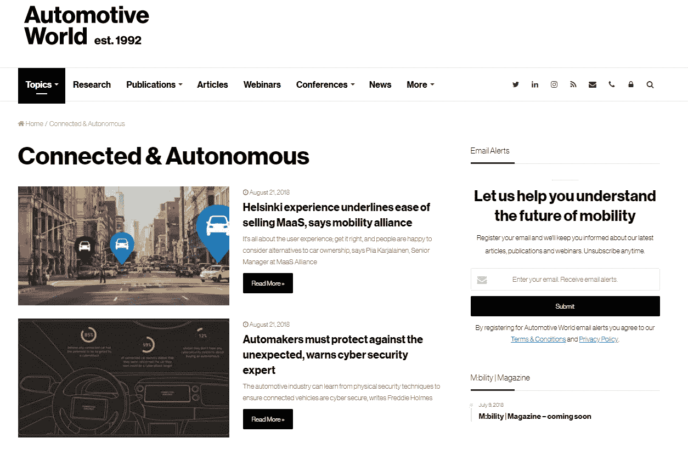

[汽车世界](https://www.automotiveworld.com/connected-autonomous/)是顶级自动驾驶汽车博客名单上的另一个资源。自 1992 年以来，这个门户网站一直在揭示汽车世界的最新新闻、趋势和话题。

## 收藏夹:

专家敦促说，现代仪表板必须是一个数字堡垒。

[汽车数据管理的主要趋势](https://www.automotiveworld.com/articles/key-trends-in-automotive-data-management/) —明确阐述了数据中心对未来自动驾驶的至关重要性。

[行业期待 ADAS 成功故事的下一步](https://www.automotiveworld.com/articles/industry-looks-to-next-steps-in-adas-success-story/)——成功驾驶辅助系统和不断寻求新的整体方法的典范展示。

# 5.汽车新闻

[www.autonews.com](http://www.autonews.com/)

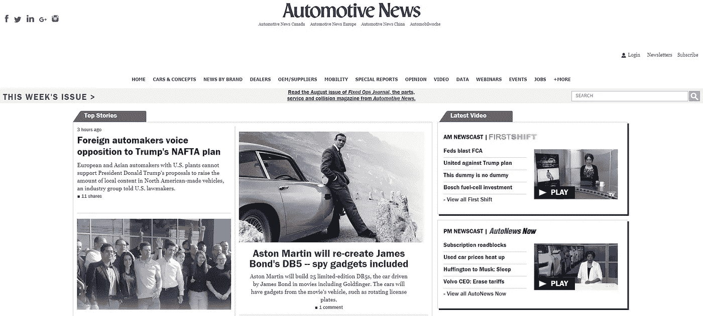

[汽车新闻](http://www.autonews.com/section/podcast)是一本流行杂志的在线版本，提供面向汽车专业人士和爱好者的各种媒体内容。

## 收藏夹:

[自动驾驶将支持，而不是取代卡车司机](http://www.autonews.com/article/20180808/MOBILITY/180809776/autonomous-driving-will-support-not-displace-truckers-study-says) —关于自动驾驶技术可能对卡车运输产生的真实影响的神话破灭材料。

[行业竞相为下一件大事提供资金](http://www.autonews.com/article/20180730/OEM06/180739987/high-tech-auto-industry-venture-capital) —这是一篇很好的文章，揭示了大企业投资汽车初创公司的原因和动机。

[承诺安全测试自动驾驶汽车](http://www.autonews.com/article/20180723/OEM11/180729972/michigan-council-future-mobility-self-driving-vehicles-testing)——对于那些想找出自动汽车测试的问题以及如何改进的人来说，这是一本必读的书。

# 6.介质上的 drive.ai

[medium.com/@drive.ai](/@drive.ai)

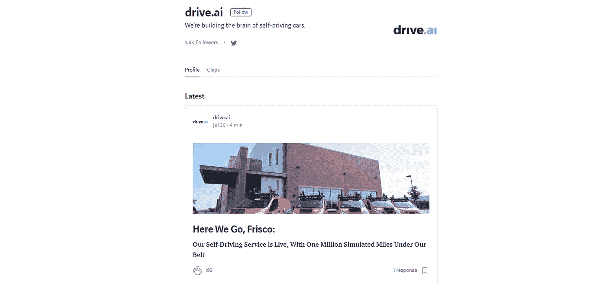

[这篇博客](/@drive.ai)来自开发无人驾驶汽车软件的最受好评的初创公司之一 drive.ai。对于那些想了解高科技自动化技术幕后的人来说，这是必要的阅读材料。

## 收藏夹:

[我们的看法](/@drive.ai/the-way-we-see-it-bd4458fc6809) —对高级可视化工具可用于自动驾驶人工智能(AI)系统的分析、模拟和训练的方式进行了明确的检查。

[我们连续 24 小时驾驶自动驾驶汽车学到了什么](/@drive.ai/what-we-learned-driving-an-autonomous-vehicle-for-24-hours-straight-587defe151bd)——深入了解 drive.at 的 24 小时马拉松比赛，这是一项耐力赛，旨在了解如何在小规模情况下实现自动驾驶汽车的最大正常运行时间。

[首先看看 Drive.ai 的自动驾驶技术](/@drive.ai/a-first-look-at-drive-ais-self-driving-technology-42b5ac007c9)——如果你从未听说过 drive.ai，你应该从观看 drive.ai 汽车在加利福尼亚州山景城的夜晚街道上行驶的这段迷人视频开始。

# 7.电动汽车安全充电

[evsafecharge.com](https://evsafecharge.com/category/ev-safe-charge-press/)

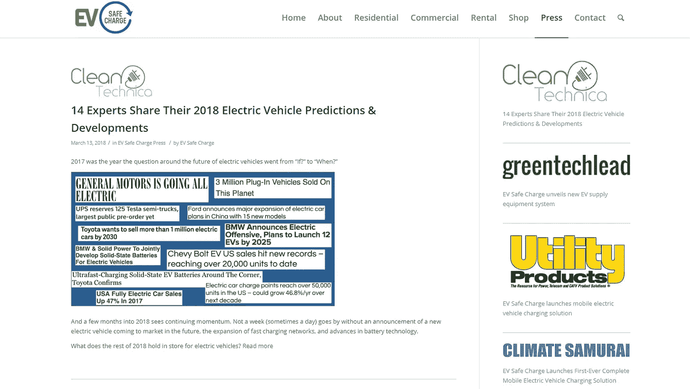

来自美国电动汽车充电安装和服务公司的博客。

## 收藏夹:

[EV Safe Charge 推出移动电动汽车充电解决方案](https://evsafecharge.com/ev-safe-charge-launches-mobile-electric-vehicle-charging-solution/) —对便携式二级和 DC 快速充电技术的回顾，该技术可在 20 至 30 分钟内将大多数电动汽车充电至 80%的容量。

[电动汽车安全充电如何从帮助少数人成长为成熟的公司](https://evsafecharge.com/ev-safe-charge-went-helping-becoming-full-fledged-company/) —电动汽车安全充电的典型案例。

[由 Motiv 动力系统驱动的两辆电动校车在加利福尼亚州投入使用](https://evsafecharge.com/two-electric-school-buses-powered-motiv-power-systems-go-service-california/)——一篇展示顶尖汽车技术如何成为现实的说明性文章。

# 8.介质上的 Waymo

[medium.com/waymo](https://medium.com/waymo)

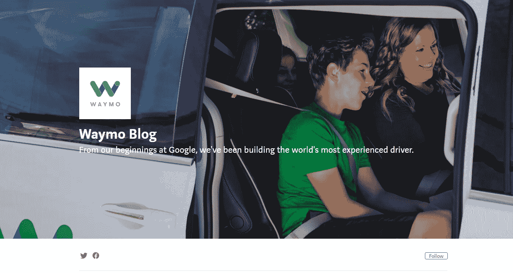

Waymo 博客强调了这家公司的最新发展，这家公司是谷歌的自动驾驶汽车初创公司。

## 收藏夹:

[Waymo 早期骑手计划，在](/waymo/waymos-early-rider-program-one-year-in-3a788f995a9c)一年——回顾 Waymo 早期骑手计划的成果和经验教训，该计划旨在测试现实生活中的自动化技术。

[相同的司机，不同的车辆:将 Waymo 自动驾驶技术引入卡车](/waymo/same-driver-different-vehicle-bringing-waymo-self-driving-technology-to-trucks-e55824b55b8f) —另一份关于卡车运输行业自动化技术前景的深刻报告。

[重现自驾体验:Waymo 360 视频的制作](/waymo/recreating-the-self-driving-experience-the-making-of-the-waymo-360-video-37a80466af49) —一个视觉展示，提供自驾体验的全部细节。

# 9.英伟达

【blogs.nvidia.com 

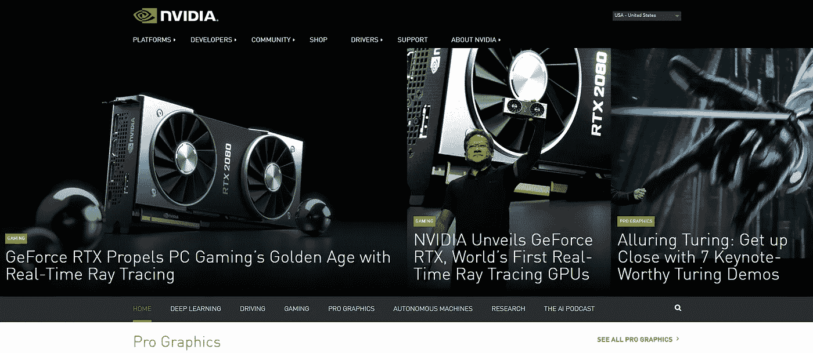

无人驾驶汽车人工智能(AI)软件先驱的博客。

## 收藏夹:

[AI Think I Can:为什么 GPU 可以成为引领我们走向自动驾驶火车的引擎](https://blogs.nvidia.com/blog/2018/08/15/autonomous-trains-deep-learning-dgx-drive/) —这是一份开创性的材料，展示了自动化技术如何应用于火车。

[机器人看，机器人做:机器人通过观察人类行为来学习](https://blogs.nvidia.com/blog/2018/04/03/robots-learning-gtc/)——一篇有趣的博客文章，扩展了关于机器学习的常识范围。

[智能描绘城市:NVIDIA 推出 Metropolis 软件合作伙伴计划](https://blogs.nvidia.com/blog/2017/09/19/metropolis-software-partner-program/) —概述该公司通过先进的交通信号控制来管理城市交通拥堵的计划。

# 10.NNG

[blog.nng.com](https://blog.nng.com/)

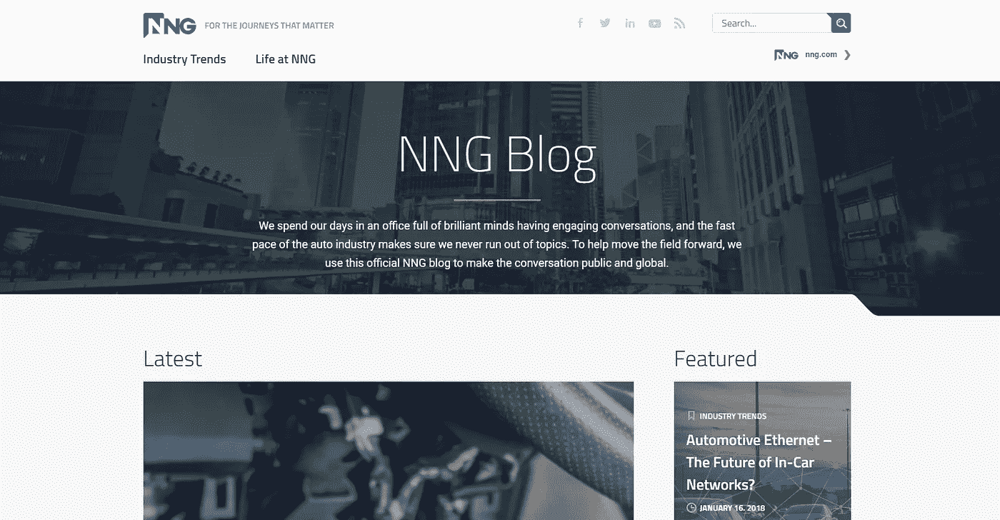

NNG，一家拥有关于自动驾驶的顶级博客之一的公司，专注于使汽车创业社区的趋势公开化和全球化。

## 收藏夹:

[汽车以太网——车内网络的未来？](https://blog.nng.com/automotive-ethernet-future-car-networks/) —对于那些想知道为什么以太网比目前的网络好得多，以及它如何改善自动驾驶技术的人来说，这是一本必读的书。

[了解汽车网络安全——电子控制单元](https://blog.nng.com/understanding-automotive-cyber-security-electronic-control-units-ecu/) —对自动驾驶汽车安全常见问题的综合分析解答。

[车辆是如何被黑客攻击的——以及如何防止它的发生](https://blog.nng.com/vehicles-hacked-prevent/) —这是对网络安全问题和解决方案的又一次彻底审视。

# **11。埃森哲**

【accenture.com 

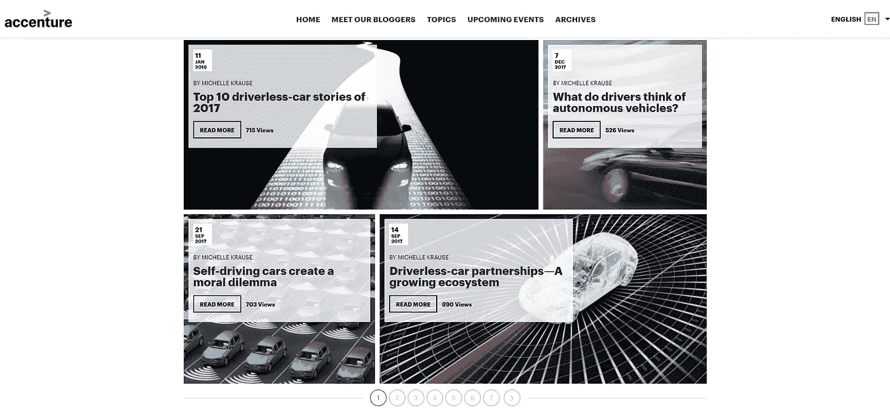

埃森哲博客吸引了非汽车行业的读者，他们希望为无人驾驶解决方案做好准备并从中受益。

## 收藏夹:

[所有业务领域的保险机会都已经成熟](https://insuranceblog.accenture.com/opportunities-are-ripe-for-insurers-across-all-lines-of-business) —这是一个信息丰富的案例研究，展示了保险业务如何从不断增加的无人驾驶汽车中受益。

[无人驾驶汽车合作伙伴关系——一个不断增长的生态系统](https://insuranceblog.accenture.com/driverless-car-partnerships-a-growing-ecosystem)——令人信服的文章揭示了为什么非汽车企业再也不能忽视无人驾驶汽车的原因。

[解决无人驾驶汽车中的大数据问题](https://insuranceblog.accenture.com/addressing-big-data-in-driverless-cars) —对行业未来的非传统看法，其中大数据解决方案将发挥关键作用。

# 12.科技世界

[www.techworld.com/automotive](https://www.techworld.com/automotive/)

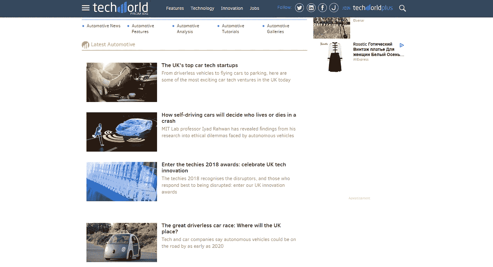

Techworld 博客的汽车部分为读者提供了最新的行业新闻以及针对特定问题的长篇阅读。

## 收藏夹:

[无人驾驶汽车将如何决定车祸中谁生谁死](https://www.techworld.com/tech-innovation/how-self-driving-cars-will-decide-who-lives-or-dies-in-crash-3673999/)——对无人驾驶现实中可能出现的伦理困境的最新研究进展的异常有趣的见解。

黑客能远程控制你的汽车吗？ —数字安全仍然是自动化技术中争论最激烈的问题之一。

[现代为数据驱动的航行建造智能船只](https://www.techworld.com/news/data/enter-era-of-smart-connected-ships-3619851/) —这是一篇关于自动化和非汽车业务连接机会的吸引人的文章。

# 13.Almotive

aimotive.com/news

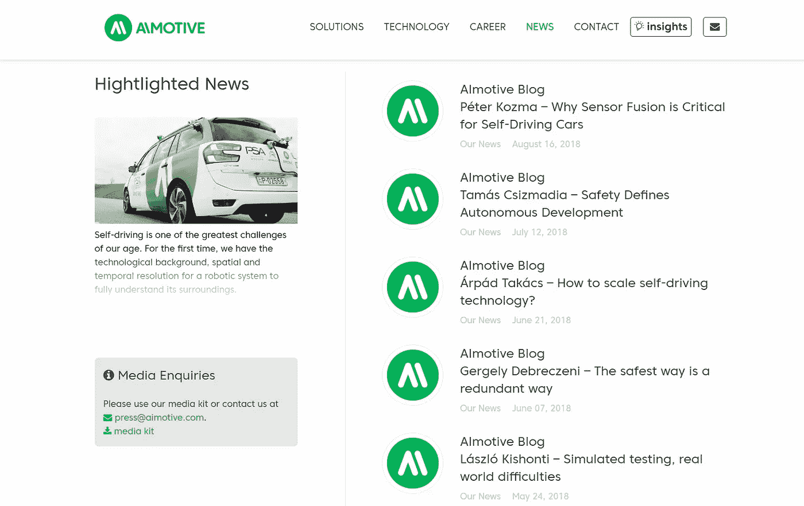

[Almotive 博客](https://aimotive.com/news/)属于主要的汽车行业博客，对于希望与顶级汽车硬件和软件公司保持同步的专业人士尤其有用。

## 收藏夹:

[传感器融合实现更安全的自动驾驶汽车](https://aimotive.com/news/index.jsp?news=875) —详细回顾先进的完整传感器融合解决方案，使汽车能够完全了解周围环境。

[安全定义自主开发](https://aimotive.com/news/index.jsp?news=699) —对于那些想要全面了解当今汽车行业安全问题的人来说，这是一本完美的读物。

[模拟测试，现实世界的困难](https://aimotive.com/news/index.jsp?news=490) —这是对那些声称在受控环境中进行模拟足以使无人驾驶汽车安全的人的合理回应。

# 14.尼奥

[www.nio.io/blog](https://www.nio.io/blog)

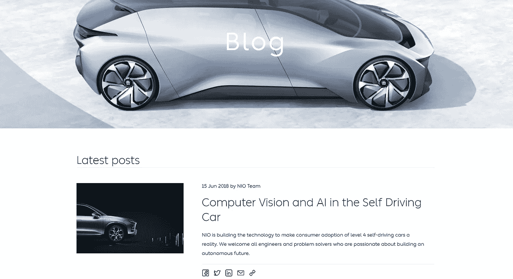

NIO 专注于开发智能和高性能的电动汽车。阅读[公司的自动驾驶汽车博客](https://www.nio.io/blog)，了解这位创新领导者的最新动态。

## 收藏夹:

[全新环境下的移动设计](https://www.nio.io/blog/mobile-design-radically-new-environment) —探索无人驾驶技术如何改变汽车设计。

[雨中的 ES8](https://www.nio.io/blog/es8-rain)——阅读 NIO 的 ES8 电动汽车的最新测试，并找出为什么它被认为是特斯拉未来的竞争对手。

自动驾驶汽车中的计算机视觉和人工智能 —了解机器人技术的最新成就如何融入自动驾驶汽车。

# 15.博施

[www.bosch-presse.de](https://www.bosch-presse.de/pressportal/de/en/news/automated-mobility/?topic=connected-mobility&topic=commercial-vehicles)

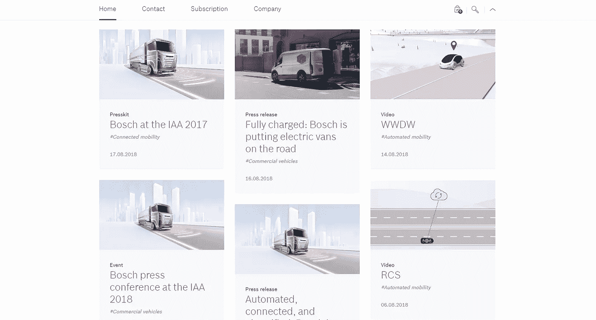

博世媒体博客将帮助您了解汽车电子设备领域的最新发展。

## 收藏夹:

[在自动驾驶汽车中，凭直觉的感觉来自博世云](https://www.bosch-presse.de/pressportal/de/en/in-automated-vehicles-the-seat-of-the-pants-feel-comes-from-the-bosch-cloud-166272.html)——对最先进的预测路况服务的洞察。

[充满电:博世正在让电动货车上路](https://www.bosch-presse.de/pressportal/de/en/fully-charged-bosch-is-putting-electric-vans-on-the-road-167936.html)——这是一个说明性的案例研究，展示了如何利用顶尖技术提高运输车辆的效率。

[博世和戴姆勒:加州大都市将成为自动驾驶的试点城市](https://www.bosch-presse.de/pressportal/de/en/bosch-and-daimler-metropolis-in-california-to-become-a-pilot-city-for-automated-driving-165072.html) —一篇揭示汽车行业合作伙伴关系是双赢选择的文章。

# 结论

自动驾驶技术是真正的游戏规则改变者，吸引了各行各业的杰出人才。原始设备制造商、T1 供应商、软件开发商和媒体都在塑造汽车行业的未来。

追踪自动化技术的最佳资源，找到你在无人驾驶世界中的位置。