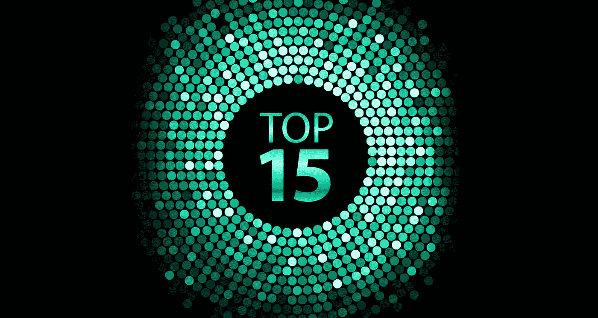

# 前 15 名 STO 机构和资源

> 原文：<https://medium.com/hackernoon/top-15-sto-agencies-and-resources-f8b592b0ec77>

毫无疑问，首次公开募股(ico)改变了全球的投资格局。这种更开放的投资形式给众筹运动带来了巨大的震动，反过来，自 2014 年以来，已经筹集了近 140 亿美元，分布在数千家公司。ico 正是区块链世界进入主流所需要的，但它不需要的是伴随 ico 而来的所有负面影响:欺诈、抽水和倾倒计划、赤裸裸的盗窃。

由于 ico 很少或根本没有向令牌持有者提供权利，政府很难介入并控制局面。除此之外，ico 错过了风险投资基金和天使投资公司的主要投资机会([本质上是因为法律规定风险投资只能投资证券](https://content.next.westlaw.com/Document/Ieb4a24ed1cb511e38578f7ccc38dcbee/View/FullText.html?contextData=(sc.Default)&transitionType=Default&firstPage=true&bhcp=1))。这些问题的解决方案以安全令牌的形式出现。sto 关注散户和机构投资者，同时遵守所有法律法规和限制。由于这种法律合规性，sto 打开了以前仅限于特定群体的风险投资机会之门。

正如我们在 2017 年的繁荣时期看到 ICO 代理机构一夜之间冒出来一样，随着 STO 代理机构越来越受欢迎，我们也会看到它们一夜之间冒出来。然而，要小心那些曾经提供 ICO 服务的机构，它们现在突然变成了“STO 专家”。请记住，仅仅因为一家公司在过去提供了 ICO 服务，并不意味着他们也可以提供 STO 服务，因为流程是非常不同的(不仅在法律上，而且在营销策略、投资者外联协议等方面)。重要的是要看一家公司的历史记录，并调查他们计划如何提供 STO 服务；如果他们正在积极改变以适应这种新的产品类型，那么我们会将他们列入下面提供的列表中。

# **第一节**

这些机构就是众所周知的 ICO 机构，现在正朝着成为 STO 机构的方向努力。他们正在改善他们的营销，推广和法律服务，以提供 s to 服务与他们的 ICO 同行一样的效率。随着时间的推移，这些公司肯定会有所改善，它们过去在 ico 方面的记录保证了它们在市场上的合法性。

## [优先令牌](http://ptoken.io/)

筹资、投资者关系、法律框架、符号化/STO 仪表板和公司指南、公关和营销

Priority Token 已经用许多成功的项目( [Faceter](https://faceter.io/) 、[moduletrade](https://market.modultrade.com/)、 [PlayKey](https://playkey.io/en) 、 [BitRewards](https://bitrewards.network/) 、 [SharPay](https://sharpay.io/) 、 [SkyfChain](https://www.skyfchain.io/) 、 [EiraCube](https://eiracube.io/) 、 [LipChain](https://www.lipchain.io/) )、强大的投资者网络、大量的社区参与和良好的评论证明了他们在 ICO 市场的可靠性。他们在远东、中东和欧洲管理着一个庞大的投资者和基金链，并且与可信的交易所有合作关系，例如 Coinsuper。随着他们进军 STO 市场，他们更加关注筹资，并适当地迎合他们在 STO 的服务。创始人可以期待 Priority Token 为适应这一新市场而特别设计的全套 STO 服务。他们的法律框架是市场上最强的服务之一。

## [X10 机构](http://x10.agency/)

STO 启动平台、法律框架、投资组合、营销/公关、社区管理、筹款、后 ICO 和交流援助

X10 机构过去成功合作过的一些客户包括 Faceter、Securix.io、电信领域的区块链(BubbleTone)、CGCX、Paygine 等等。由于他们的主要重点是一般的市场营销，他们的 STO 服务面向市场营销，但也包括特殊的投资包，公关，和交流援助。X10 已经证明了其投资组合中 s to 的成功，并计划在 2019 年期间通过他们的“从零开始”方法专注于 STO 利基，这涉及到与强大的法律团队一起创建法律框架，通过他们的投资者网络、投资者仪表板等提供融资援助。

## [区块链 App 工厂](https://www.blockchainappfactory.com/)

交易所上市、令牌化、交钥匙 STO 服务、咨询、营销、区块链开发

区块链 App Factory 之前的一些客户有[壳牌](https://www.shell.com/)、[麦当劳](https://www.mcdonalds.com/us/en-us.html)、 [Dash](https://www.dash.org/) 、 [DasCoin](https://dascoin.com/) 。区块链应用工厂拥有丰富的行业经验，提供广泛的服务套件，并与许多声誉良好的公司合作。他们对 STO 法律服务、STO 特定营销和 STO 资产管理的重视，使他们在一个许多 ICO 公司在没有必要经验的情况下涉足 STO 服务的市场中具有优势。

## [AmaZix](https://www.amazix.com/)

社区管理、翻译、咨询、社区奖励、交钥匙解决方案

AmaZix 的投资组合主要专注于社区管理，客户包括[巴布](https://getbabb.com/)、[班科尔](https://www.bancor.network/)、 [GBX](https://gbx.gi/) 、 [Hdac](https://www.hdactech.com/) 、 [WePower](https://wepower.network/) 和 [GoChain](https://gochain.io/) 。他们拥有丰富的行业经验，尽管他们的主要重点是面向社区管理(这是他们喜欢炫耀的)，但在咨询咨询服务时，他们也关注 sto。AmaZix”专门帮助客户构建安全令牌销售，同时应对快速变化的监管环境。满足并超越对您即将推出的安全令牌产品的严格审查。”

## [TokenAsia](https://tokenasia.com/)

营销、咨询、投资者外联、社区管理、智能合同、KYC/反洗钱、安全审计

TokenAsia 有点像混合体，既提供各种服务，也提供平台创建服务，创始人可以在上面托管他们的 STO。他们过去的客户包括 [Zagg](https://www.zagg.com/us/en_us/) 、 [GeoMain](https://geomain.com/) 、[goureka](https://goeureka.io/)、 [JustPowerIt](https://www.linkedin.com/company/justpowerit) 、 [DigitalBits](https://www.digitalbits.io/) 等等。TokenAsia 在全球范围内工作，自 2016 年以来一直从事该行业。他们通过 ico 在市场上取得了一席之地，随着趋势开始转变，他们也开始专注于 s to，利用他们在 STO 的特定平台帮助创始人遵守法规和法律限制。

## [TSM 全球](https://www.tsm.global/)

投资者关系、咨询、内容创作、广告管理、代币上市

因为 TSM Global 监管许多较小的公司，它不直接列出客户。然而，他们与[顶级 ICO 榜](https://topicolist.com/)、 [Coindesk](https://www.coindesk.com/) 、 [Tech Racers](https://www.techracers.com/) 、 [Bitraffic](https://bitraffic.com/) 、[德勤](https://www2.deloitte.com/us/en.html)和[区块链营销亚洲](http://blockchainmarketing.asia/)有行业合作关系。TSM Global 及其前身已经在该行业工作了八年多，为 80 多家客户提供了服务。他们本质上是一个中间人，根据需要将创始人与全球合适的服务机构联系起来。正因为如此，他们对 sto 很有用，因为他们可以根据当地法律为创始人提供适当的法律指导。

## [Indiegogo](https://blockchain.indiegogo.com/launchico/)

上市和营销平台，KYC 审查，投资者外联

作为一个家喻户晓的名字，Indiegogo 已经进入了风投、ICO 以及现在的 STO 市场。他们成功地与[圣里吉斯阿斯彭度假村](https://www.stregisaspen.com/)(通过 STO 筹集了 1800 万美元)合作，并拥有大量的市场信誉。他们提供合规服务，以确保 s to 符合法律要求(STO 的最难部分)，他们积极审查申请上市的公司。他们还通过与 [Templum](https://templuminc.com/) 合作，提供了一个全球平台(已经筹集了超过 10 亿美元)。

# **第二节**

以下是风险投资公司、鲜为人知的 STO 机构和其他咨询公司，它们为寻求构建、启动或交易股票的公司提供解决方案。

## [新炼金术](https://newalchemy.io/)

代币设计，代币发行平台，筹集资金

由于规模较小，New Alchemy 的媒体报道可能不如上面的条目，但他们仍然有一个令人印象深刻的客户名单: [Bittrex](https://bittrex.com/) 、 [AirToken](https://airfox.com/airtoken) 、 [OvCode](https://ovcode.com/) 、 [Agorai](https://agorai.ai/) 、 [Xriba](https://xriba.com/) 等等。New Alchemy 由 [Peter Vessenes](https://vessenes.com/about/) 创立，他是[区块链基金会](https://worldblockchain.foundation/)的联合创始人，这有助于提高该机构的可信度。新炼金术植根于风险投资基金，这是他们的关键服务之一，这确保他们了解证券法的内部运作。

## [萨迪斯集团](https://satisgroup.io/)

代币和发行结构化、法律、税务和会计建议、代币/智能合同创建、投资者拓展和营销

Satis 集团声称拥有超过 1 亿美元的代币发行经验，当你把它与团队的经验结合起来时，这是一个双赢的局面。Emma Channing 是 Satis Group 的创始人兼首席执行官，她在公司内部以及一些领先的全国性律师事务所拥有超过 15 年的工作经验。萨迪斯集团专注于证券法，与风投合作多年，是咨询服务的绝佳选择。

## [DLT 首都](https://dlt-capital.com/)

投资者关系、研究、咨询、企业融资

成为直布罗陀区块链交易所的官方赞助商，可以确保 DLT 资本了解他们在安全令牌产品方面的业务。GBX 受欧盟监管，必须保持与直布罗陀证券交易所相同的监管标准。DLT 资本曾与 [iampass](https://iampass.io/) 、 [Hycon](https://hycon.io/) 、 [Vreo](https://vreo.io/) 、 [Arxum](https://arxum.com/) 、 [CoinMirror](https://www.coinmirror.co/) 等客户合作。除此之外，DLT 资本还提供投资者匹配服务，帮助 s to 获得更多成功。

## [证券经济](https://securitonomy.com/)

交钥匙令牌解决方案、交易所上市协助、法律咨询和战略合作伙伴关系

安全经济总部设在马耳他，但考虑到马耳他是世界上对 ICO/STO 最友好的政府之一，这绝不是一件坏事。Securitonomy 与 [TokenBackers](https://tokenbackers.com/) 、 [Cryptovest](https://cryptovest.com/) 和 [Krypton Capital](https://krypton.capital/) 合作，为客户提供符合马耳他法规的全方位服务。凭借六年多的区块链发展和 35 次成功发行的代币，Securitonomy 已经做好了充分的准备，可以应对马耳他最困难的 sto。

## [博学者](https://polymath.network/)

令牌化、平台列表、咨询服务

Polymath 是代币发行领域的行业领导者之一，但除此之外，他们还提供代币创建服务，以确保代币符合所有法律和交易要求。因此，公司可以使用 Polymath 的服务推出自己的自动 STO，以确保符合法律要求并通过所有适当的 KYC/反洗钱协议。然而，对于最复杂的情况，创建者在创建安全令牌时可能仍然需要联系律师寻求法律指导。

## 启动引擎

STO 启动，发行平台，建议

StartEngline 和 Polymath 一样，是一个综合发行和咨询平台。他们帮助客户创建合规的令牌，在 StartEngine 的平台上列出它们，并向投资者展示它们。StartEngine 已经有了成功的 sto，如[韦弗利实验室](https://www.waverlylabs.com/)和[埃利普提戈](https://www.elliptigo.com/)，两个合规的 sto 都筹集了超过 100 万美元。

# **第三节**

最后一部分是一个混合体，列出了最常见的 STO 发行平台和一小部分专注于证券法的专业律师。如有疑问，请联系证券专业人士，以确保您的令牌符合监管标准。

## [蜂群基金](https://swarm.fund/)

针对 SRC20 合规性的令牌发行

Swarm Fund 也是代币发行的行业领导者之一，SRC20 代币确保符合所有证券法律法规。Swarm 旨在通过去中心化和全球化来简化公司股票交易流程，他们已经有一些[大牌客户](https://invest.swarm.fund/explore)在他们的平台上交易( [Robinhood](https://robinhood.com/) 、 [Spark Labs](http://www.sparklabsgroup.com/) 、 [Farm Coin](https://www.farmcoin.eu/) )。

## 证券合规顾问和律师

[具有法律(并购)背景的风险投资人 Tatiana Koffman](https://www.linkedin.com/in/tatianakoffman) ，在她广受欢迎的媒体文章“ [4 种安全令牌结构和帮助你执行它们的律师](/@tatianakoffman/4-security-token-structures-and-the-lawyers-to-help-you-execute-them-53c8a5129f49)”中整理了以下列表

*   詹姆斯·g·加托，谢泼德，穆林，里克特&汉普顿·LLP
*   詹姆斯·a·默瑟三世，谢泼德·穆林，里克特，汉普顿·LLP
*   詹姆斯·汤普森，谢泼德·穆林，里克特&汉普顿·LLP
*   黛博拉·s·索伦-佩登，皮尔斯伯里·温思罗普·肖·皮特曼·LLP
*   [柯蒂斯·l·莫](https://www.dlapiper.com/en/newzealand/people/m/mo-curtis-l/)，欧华
*   [玛格丽特·罗森菲尔德](http://www.smithlaw.com/professionals-Margaret-Rosenfeld)，史密斯，安德森，布朗特，多塞特，米切尔&，杰尼根，LLP
*   [海沃德·阿姆斯特朗](http://www.smithlaw.com/professionals-Heyward-Armstrong)，史密斯，安德森，布朗特，多塞特，米切尔&杰尼根，LLP
*   格兰特·p·方多，古德温·普罗克特·LLP
*   理查德·b·莱文，波尔西内利·LLP
*   查尔斯·a·杰利纳斯
*   j·达克斯·汉森，帕金斯·科伊·LLP
*   凯尔·伍德，帕金斯·科伊 Kyle
*   罗伯特·h·罗森布鲁姆，威尔逊·松西尼·古德里奇，罗萨蒂
*   帕特里克·默克，库利·LLP
*   迈克尔·麦克格雷，库利·LLP
*   亚当·t·艾丁格
*   马克·博伊龙，费舍·布罗伊·LLP
*   [Pratin Vallabhaneni](https://www.whitecase.com/people/pratin-vallabhaneni) 、White &案 LLP

**结论**

sto 仍然是非常新的，所以要警惕那些提供“全面服务”解决方案的公司。这并不是说他们不存在，而是做一些背景研究，以确保该公司不只是将他们的标准 ICO 服务重新包装为 STO 服务。重要的是要记住，这两种产品非常不同。如果你计划筹集大量资金，最好联系律师，确保你遵循监管标准。不管律师有多贵，总比被政府监管机构关闭和公司资产被查封带来的费用要便宜。

## 关于作者:

基里尔·希洛夫——geek forge . io 和 Howtotoken.com 的创始人。采访全球 10，000 名顶尖专家，他们揭示了通往技术奇点的道路上最大的问题。加入我的**# 10k QA challenge:**[geek forge 公式](https://formula.geekforge.io/)。