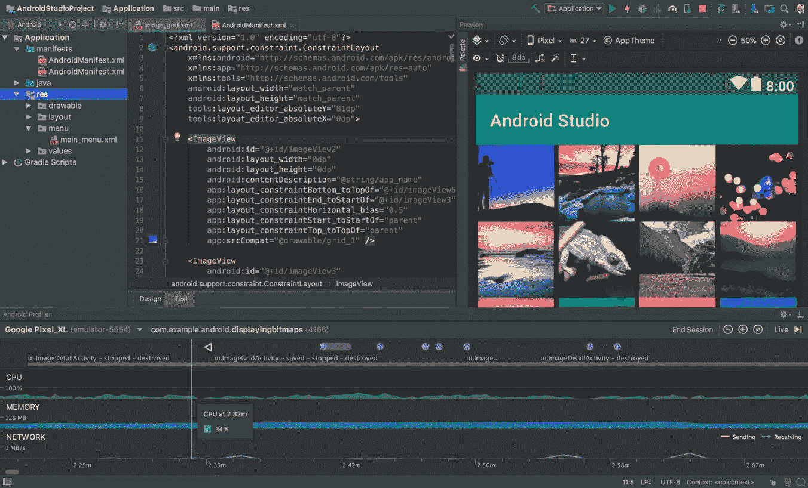
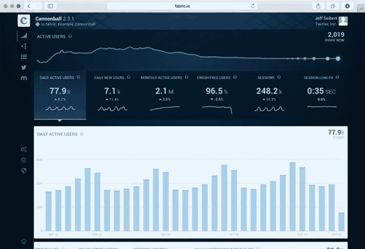
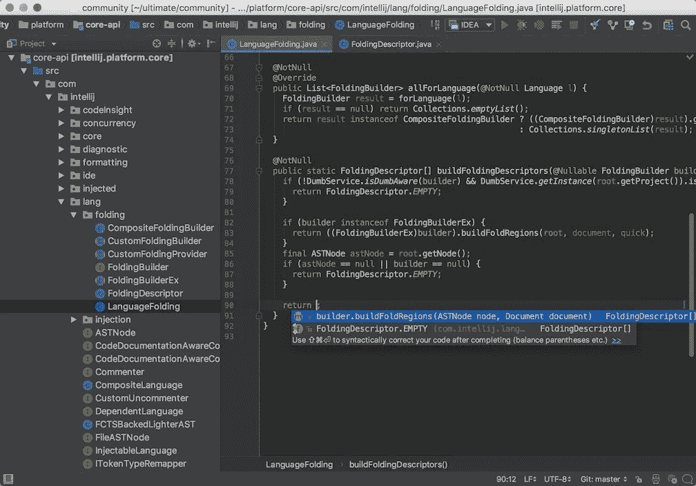

# Android 开发的 20 大工具

> 原文：<https://medium.com/hackernoon/top-20-tools-for-android-development-29bd8dcdc5af>

这是软件开发公司 iTechArt 的作家 Sydney Stone 的客座故事。

根据 [Statista](https://www.statista.com/chart/12455/number-of-apps-available-in-leading-app-stores/) 的数据，截至 2017 年 3 月，Google Play 商店有超过 280 万个安卓应用可供下载。这高于苹果应用商店的 220 万个和微软 Windows 的 66.9 万个可用应用。

鉴于目前市场上的 Android 移动设备比任何其他操作系统都多，未来对应用程序和经验丰富的 Android 应用程序开发人员的需求只会继续增加。

由于大量复杂的集成开发环境(ide)以及其他节省时间的工具和应用程序，Android 开发人员能够更快、更有效地生产所有这些应用程序。有一些 Android 开发解决方案在 Android 开发者的“最爱”列表中反复出现。

以下是目前 Android 应用程序开发中最受欢迎的 20 个工具。

# 1.安卓工作室

作为所有 Android 应用程序的官方集成开发环境， [Android Studio](https://developer.android.com/studio/index.html) 似乎总是在开发者首选工具的列表中名列前茅。

谷歌早在 2013 年就创建了 Android Studio。它取代了——或者我们应该说它黯然失色？— Eclipse Android 开发工具(ADT)作为原生 Android 应用程序开发的主要 IDE。

Android Studio 在一个易于使用的拖放界面中提供了代码编辑、调试和测试工具。它可以免费下载，不仅受到谷歌的支持，还受到一个庞大而活跃的 Android 开发者社区的支持。

# 2.安卓调试桥

Android Studio 包括 [Android Debug Bridge](https://developer.android.com/studio/command-line/adb.html) ，这是一个命令行工具或 Android 设备与其他计算机之间的通信“桥梁”，可以在开发和整个调试和 QA 过程中使用。

通过将 Android 设备连接到开发 PC 并输入一系列终端命令，开发人员能够根据需要对这两种设备进行修改。

# 3.AVD 经理

Android Studio 的另一个有用功能是 [AVD 管理器](https://developer.android.com/studio/run/managing-avds.html)，Android 虚拟设备的简称。AVD 管理器是一个仿真器，用于在计算机上运行 Android 应用程序。这使得开发人员能够使用所有类型的 Android 设备来测试不同版本、屏幕尺寸和分辨率的响应能力和性能。

# 4.黯然失色

正如我们上面提到的，在有 Android Studio 之前就有了 [Eclipse](https://eclipse.org/ide/) 。很长一段时间，Eclipse 是所有 Android 应用程序开发的官方首选 IDE。

即使 Google 不再提供对 Eclipse 的支持，许多开发人员仍然使用它来创建 Android 和其他跨平台应用程序，因为它可以很好地与许多不同的编程语言一起工作。

# 5.构造

*Crashlytics kit on Fabric platform* [*Source*](https://fabric.io/blog/introducing-fabric/)

[Fabric](https://fabric.io/kits?utm_campaign=fabric-marketing&utm_medium=natural) 是 Twitter 移动应用背后的开发平台。它为开发者提供了一套可供他们挑选的“套件”,让他们能够构建更好的移动应用。这些工具包包括从测试到营销和广告工具的一切。

谷歌于 2017 年 1 月从 Twitter 购买了 Fabric。优步、Spotify、Square、Groupon、Yelp 和更多知名公司都在开发他们的移动应用程序时使用了 Fabric。

# 6.向上流动

[FlowUp](https://flowup.io/) 允许您监控所有生产应用的性能。方便的仪表板让您跟踪您的统计数据和指标，包括 CPU 和磁盘使用情况、内存使用情况、每秒帧数、带宽等。

FlowUp 是一种基于每月订阅的 SaaS 解决方案，定价由公司的用户总数决定。

# 7.游戏制作者:工作室

对于 Android 游戏开发者来说，最受欢迎的开发工具之一就是 [GameMaker: Studio](https://www.yoyogames.com/gamemaker) 。GameMaker 提供了你用很少的代码创建 2D 游戏所需的一切。这是一个非常用户友好的应用程序，具有简单的拖放界面。

GameMaker: Studio 面向游戏开发初学者和新手。

# 8.基因运动

另一款 Android 模拟器 [Genymotion](https://www.genymotion.com/) 帮助开发者在超过 3000 种设备场景下测试和预览应用。Genymotion 在游戏开发者中很受欢迎，因为它预装了标准的 Android 图像和图形，在测试过程中非常有用。它还提供了比在实际的 Android 设备上测试应用程序更快的速度。

Genymotion 是一个跨平台的开发工具，支持许多不同的编程语言和环境。

# 9.格拉德勒

早在 2013 年，谷歌就认可 Gradle 作为 Android 应用的构建系统。

基于 Apache Maven 和 Apache Ant，Gradle 是创建涉及 Java 的大型应用程序的最流行的开发工具之一。

开发人员喜欢将 Gradle 与 Android Studio 结合使用，因为使用一行代码就可以非常容易地添加外部库。

# 10.智能理念

来自 JetBrains 的开发者，IntelliJ IDEA 是为终极程序员生产力而设计的。它非常快，并且具有开箱即用的全套开发工具。

每年 149 美元，IntelliJ IDEA 当然不便宜。但是，有一个免费的开源社区版本，完整的扩展版本对学生免费一年。

# 11.Instabug

[Instabug](https://instabug.com/) 被一些科技界最知名的公司使用，包括雅虎、PayPal、Lyft、BuzzFeed 和 Mashable，用于测试和 bug 报告。Instabug 允许 beta 测试人员和用户组在 QA 和调试过程中与开发者分享截图和详细的错误日志。

你可以注册免费试用 Instabug，然后根据团队成员的数量、应用程序和项目参与的总时间来定制价格。

# 12.LeakCanary

由 Square 背后的人开发的, [LeakCanary](https://github.com/square/leakcanary) 是一个开源的 Java 库，可以更容易地检测和纠正应用程序中的内存泄漏。无论何时发生泄漏，LeakCanary 都会立即通知您。然后，您可以利用内置的堆栈跟踪来修复问题。

GitHub 上有 LeakCanary。

# 13.敏捷型

NimbleDroid 是一个测试平台，允许你在 Google Play 上发布之前检查你完成的 Android 应用程序是否有内存泄漏、错误和其他问题。使用 NimbleDroid 有助于释放应用程序开发人员的时间，并加快整体 QA 流程，从而帮助应用程序更快上市。

Mozilla、雅虎和 Pinterest 等公司都曾使用 NimbleDroid 来测试他们的应用程序。个性化定价基于客户的特定需求和用户数量。

# 14.RAD 工作室

[RAD Studio](https://www.embarcadero.com/products/rad-studio) 是一个集成开发环境，允许您编写、编译、打包和部署[跨平台应用](https://www.altexsoft.com/blog/mobile/key-approaches-to-mobile-development-explained/?utm_source=MediumCom&utm_medium=referral)。它提供了对整个开发生命周期的支持，产生了可以重新编译和重新部署的单一源代码库。

RAD Studio 是榜单上最贵的解决方案，专业版起价 2286.00 美元。也可以免费试用。

# 15.斯特索

Stetho 是脸书创建的一款 Android 调试工具。这是一个免费的开源平台，允许访问桌面浏览器自带的 Chrome 开发者工具功能。

Stetho 具有网络检查功能，可用于图像预览、JSON 响应帮助器以及将跟踪导出为 HAR 格式。

# 16.源树

[SourceTree](https://www.sourcetreeapp.com/) 是一个免费的开源工具，允许你通过简单的 Git GUI 管理 Git 库。无需编写任何命令行，就可以清楚地看到所有的更改和分支。SourceTree 还允许您按文件、块或行存放和放弃更改。

SourceTree 兼容 Windows 和 Mac。

# 17.Unity 3D

[Unity 3D](https://unity3d.com/) 是一个跨平台的游戏开发环境，用于创建复杂的图形密集型移动游戏，例如那些包含虚拟或增强现实的游戏。

您仍然可以使用 Unity 3D 来创建更简单的基于 2D 的游戏体验，但它更常用于高级游戏开发。

# 18.虚幻引擎

另一个先进的游戏开发平台，[虚幻引擎](https://www.unrealengine.com/en-US/what-is-unreal-engine-4)是一个免费、开源、跨平台的解决方案，用于创建高级互动游戏。

虚幻引擎在游戏设计师中很受欢迎，因为它采用了*蓝图*系统，限制了大量编码的需求。具有最少开发或编码经验的设计人员可以利用虚幻引擎来创建他们自己的高级游戏体验。

# 19.带有 Xamarin 的 Visual Studio

[Visual Studio](https://www.visualstudio.com/) 是微软官方的集成开发环境，是开发者可以免费使用的工具。它支持几种不同的编程语言，当与 [Xamarin](https://www.altexsoft.com/blog/mobile/pros-and-cons-of-xamarin-vs-native/?utm_source=MediumCom&utm_medium=referral) 结合使用时，可以用来创建本地 Windows、Android 和 iOS 应用程序。

在微软传奇般的支持下，Visual Studio 是希望创建跨平台应用程序和游戏的开发人员的首选。

# 20.维索尔

[Vysor](https://www.vysor.io/) 是一款仿真器解决方案，可以让你将 Android 设备“镜像”到电脑上，这样你就可以从键盘上控制它。它还允许您在会议和演示过程中通过您的设备进行截屏播放。

Vysor 兼容所有操作系统。它不是免费的，但非常实惠，每月 2.50 美元，每年 10 美元，终身许可 40 美元。

# 最后

实际上还有数百种其他有用的工具，比如这些可用于 Android 开发的工具。基于他们开发的特定应用程序，每个开发人员对于使用什么工具和环境都有自己的个人偏好。

随着对 Android 应用程序的需求不断增长，有助于节省开发人员时间、同时有助于开发更高质量应用程序的平台和解决方案也将不断增加。

悉尼·斯通是一名自由撰稿人兼编辑。她写过各种创业公司和 B2B 技术公司，目前为 iTechArt 写作，iTechArt 是一家总部位于纽约的公司，专门从事 [*Android 开发*](https://www.itechart.com/development/mobile/android/) *和其他创业公司定制软件开发服务。*

***想为我们的博客写篇文章？阅读我们的要求和指南*** [***成为投稿人***](https://www.altexsoft.com/become-a-contributor/) ***。***

喜欢这个故事吗？鼓掌让我们知道，这样更多的人可以找到它！👏
原载于 AltexSoft 的博客:*[*Android 开发 20 大工具*](https://www.altexsoft.com/blog/engineering/top-20-tools-for-android-development/?utm_source=MediumCom&utm_medium=referral)*