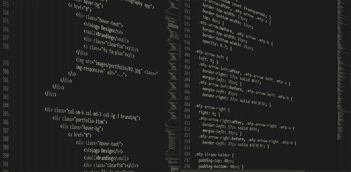
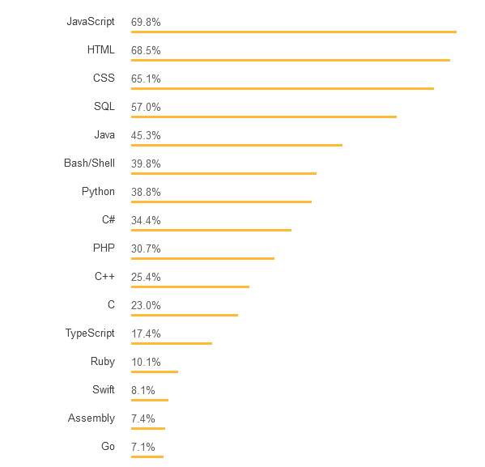
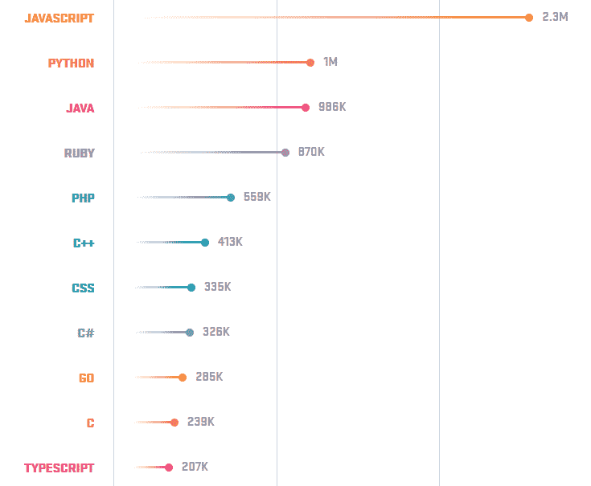
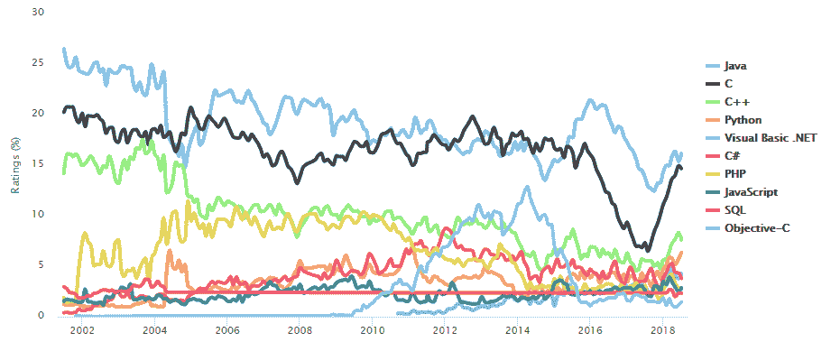
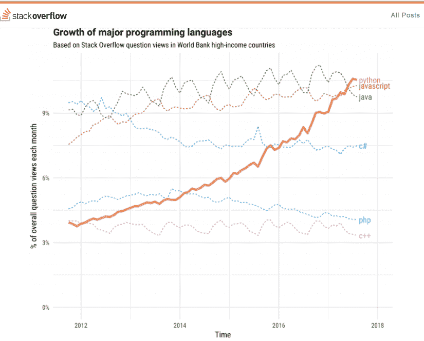

# 2018 年最受欢迎的 3 种编程语言(及其年薪)

> 原文：<https://medium.com/hackernoon/top-3-most-popular-programming-languages-in-2018-and-their-annual-salaries-51b4a7354e06>

考虑到现代[编程](https://hackernoon.com/tagged/programming)语言的广泛数量，决定选择哪一种并掌握它可能是一项艰巨的任务。

在决定“最佳”语言之前，你应该评估几个因素，包括你的个人偏好和选择。

[Bautista](https://www.liveedu.tv/bautistaaa/lm4jx-how-to-build-a-simple-slack-clone-in-firebase-and-angularjs/) ，拥有超过四年的网页开发经验，目前正在教授人们他的技能，他说“在 2018 年为你的用例选择正确的[编程语言](https://hackernoon.com/tagged/programming-language)的最好方法之一是研究技术行业正在发生的事情。”

这个行业会给你重要的趋势和信号，你可以用它们来做决定。例如，如果你知道 2018 年最赚钱的编程语言或 2018 年最受欢迎的编程语言，你可以适当调整风帆，专注于它们。

在本帖中，我们将评估一些资源，以期得出 2018 年最受欢迎的三种编程语言。

**1。** [**JavaScript**](https://hackernoon.com/tagged/javacript)

JavaScript 是一种动态编程语言，主要用于增加网站的交互性。

它通常被描绘成“初学者友好的”，这增强了它在开发人员社区中的使用。

Stack Overflow 是一个受欢迎的网站，开发人员用来分享他们的技能，通常会进行年度调查，从开发人员社区获得有用的统计数据——从他们的工资到最喜欢的技术。

2018 年 1 月，该网站调查了超过 10 万名开发者，并披露了一些有趣的统计数据。

这里是[堆栈溢出图](https://insights.stackoverflow.com/survey/2018#most-popular-technologies)，它根据编程语言的流行程度对它们进行了分类:

正如你在上面看到的，调查显示 JavaScript 是 2018 年的顶级编程语言，占 69.8%——连续第六年。

全球数百万开发者使用的代码共享网站 GitHub 也提到 JavaScript 是最常用的编程语言。在 2017 年底的一份报告中， [GitHub](https://octoverse.github.com/) 表示，其大部分用户都依赖 JavaScript 进行存储。

下面是 GitHub 图表，显示了编程语言的流行程度:

在全球范围内，Stack Overflow 调查发现 JavaScript 开发人员每年可以赚 55，000 美元。然而，在美国，使用这种语言的开发人员每年能挣 98，000 美元。

热门就业搜索网站 Indeed.com 估计，美国一名 JavaScript 开发人员的平均年收入为 110，945 美元。

**2。Java**

Java 是一种多功能的通用编程语言，用于创建跨平台的应用程序。无论您希望使用什么平台进行部署——桌面、移动或 web——Java 都能满足您的需求。

截至 2018 年 7 月，根据搜索引擎结果衡量编程语言受欢迎程度的 TIOBE 编程社区指数将 Java 列为最受欢迎的语言。

这是 TIOBE 指数的图表:

根据 Stack Overflow 调查，Java 的受欢迎程度为 45.3%，是第二好的(如果不考虑 HTML、CSS、SQL 它们主要是非独立的，对主要语言的支持语言)。

调查发现，在美国，Java 开发人员的年收入约为 10 万美元。同样，[Indeed.com](https://www.indeed.com/salaries/Java-Developer-Salaries)估计美国的 Java 开发人员平均年收入为 100，873 美元。

**3。Python**

Python 是一种强大的高级编程语言，在 2018 年越来越受欢迎。由于其通用性质，它被广泛用于各种任务，包括 web 开发、机器学习和数据分析。

Stack Overflow 发现其 38.8%的用户主要将 Python 用于他们的项目。根据该网站的调查，Python 的受欢迎程度在 2018 年超过了 c#—就像它在 2017 年超过了 PHP 一样。

在 GitHub 平台上，Python 超过 Java 成为使用第二多的编程语言，2017 年打开的 pull 请求比 2016 年多 40%。

值得一提的是，对人工智能领域的持续兴趣可能会刺激对 Python 的需求。事实上，Stack Overflow 称之为“[发展最快的](https://stackoverflow.blog/2017/09/06/incredible-growth-python/?_ga=2.199625454.1908037254.1532442133-221121599.1532442133)主要编程语言。”

下面的图表展示了 Python 令人难以置信的发展:

在全球范围内，栈溢出调查发现 Python 开发者每年赚大约 56，000 美元。在美国，[Indeed.com](https://www.indeed.com/salaries/Python-Developer-Salaries)估计他们的平均年收入为 114，811 美元。

**结束**

显然，JavaScript、Java 和 Python 是 2018 年工作中最值得学习的编程语言。

虽然调查报告可能略有不同，但排名前三的编程语言是值得学习的并包含在开发人员的工具箱中，尤其是如果你想让你的职业生涯更上一层楼的话。

你可以使用这些关于 2018 年最流行的编程语言的信息来评估你的编程技能是否符合行业趋势，以及你在开始构建新的软件系统时可以使用的语言，特别是如果你打算与其他开发者合作。

你喜欢使用哪种编程语言？为什么？

请在下面的评论区告诉我们。