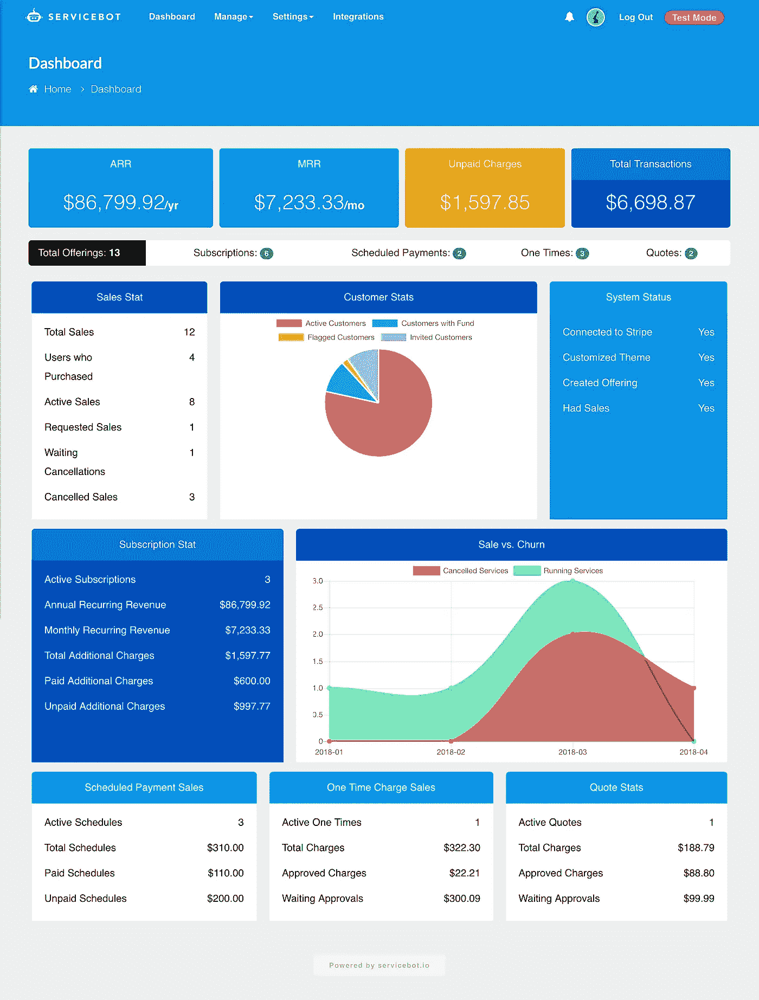
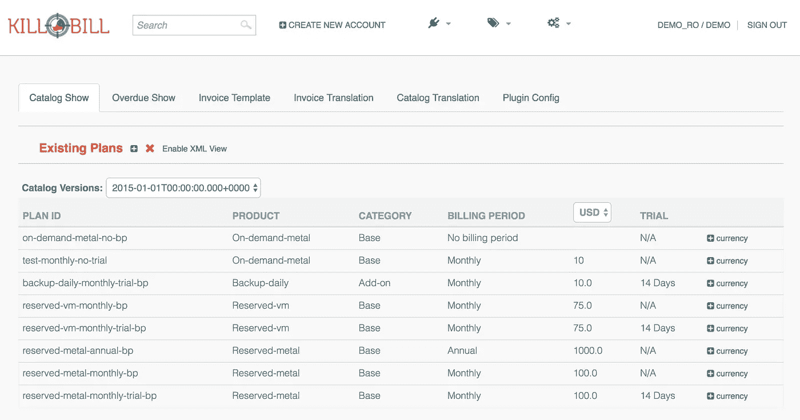
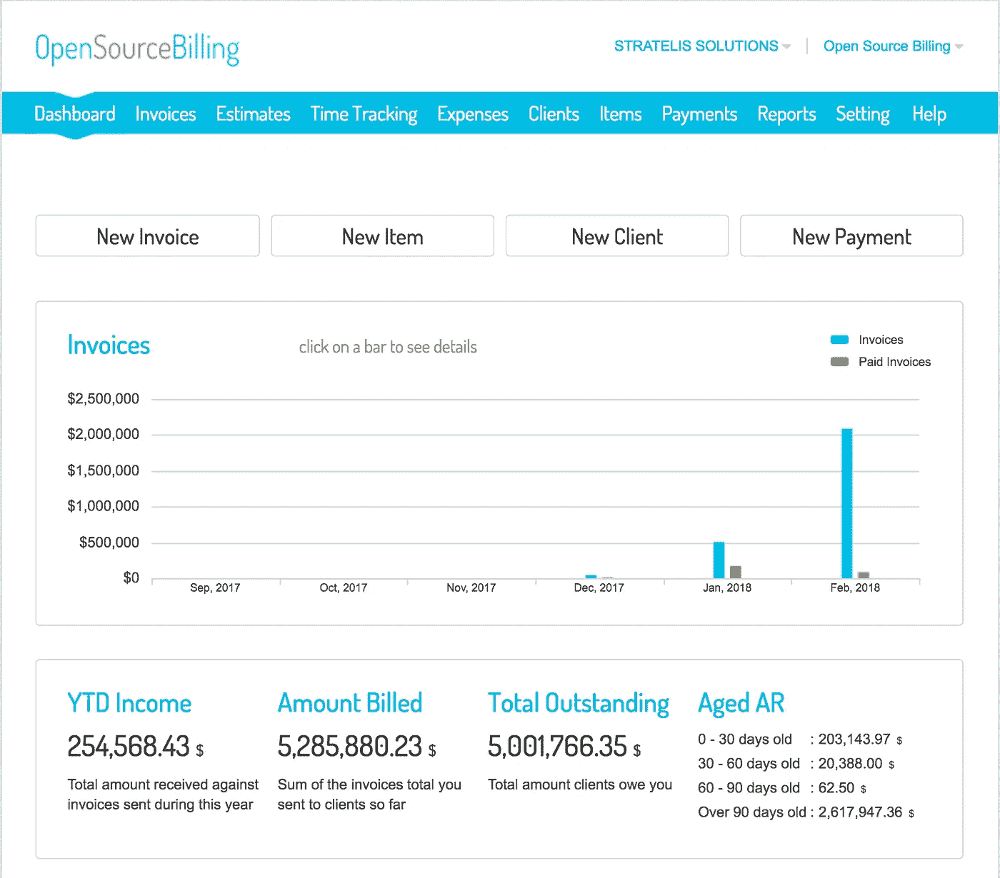

# 2018 年前三大开源订阅计费系统

> 原文：<https://medium.com/hackernoon/top-3-open-source-subscription-billing-systems-in-2018-eb9e3b8d6d0b>

我花了数年时间研究和使用开源项目来完成我的业务流程。然而，找到一个有用的订阅计费应用程序比我想象的要困难得多。所以我决定整理一份 100% [开源](https://hackernoon.com/tagged/open-source)订阅[管理](https://hackernoon.com/tagged/management)和计费自动化工具的清单。

我根据三个基本标准编制了这个列表。我只列出了去年提交的开源项目。我也只列出了带有公共 Github 库的项目。最后，我根据计费系统中的某些关键特性评估了这些应用，包括:

*   **订阅计费:**能够向客户销售定期(每日、每周、每月、每年)订阅。
*   **免费试用:**对订阅产品进行免费试用。
*   **分割定价:**能够将服务价格分割成独立的动态区间。例如，如果您有一项价值 1000 美元的服务，您希望预付 20%，一个月后付 30%，三个月后付 50%。
*   **自助服务门户:**允许客户通过自助服务门户请求订阅服务。
*   **附加产品定价:**允许附加产品追加销售订阅产品。
*   **Stripe 集成:** Stripe 是最流行的支付网关系统。对于计费系统来说，直接条带集成非常重要。
*   **集成和 API:**API 用于与现有应用程序集成，并具有用于构建插件的可扩展架构。

我们来看看吧！

# [1-服务机器人](https://github.com/service-bot/servicebot)

Servicebot dashboard

Servicebot 是市场上最新的开源订阅计费系统。开发始于 2017 年初，主要专注于自动化计费。

**试玩链接:【https://shardemo.serviceshop.io/dashboard】T22**

**试玩用户名:**[*servicebot@rhyta.com*](mailto:servicebot@rhyta.com)

**演示密码:** *演示*

**Github 链接(下载):**[https://github.com/service-bot/servicebot](https://github.com/service-bot/servicebot)

**开始日期:** 2017 年

**构建用:** Javascript。NodeJS，React，Redux，PostgreSQL 数据库。

⭐️特色 1 — **订阅计费** : ✅

⭐️特色 2 — **免费试玩** : ✅

⭐️特色 3— **分割定价** : ✅

⭐️特色 4— **自助服务门户** : ✅

⭐ ️Feature 5— **附加价格** : ✅

⭐️功能 6— **集成& API** : ✅

# 2- [基尔比尔](https://github.com/killbill/killbill)

Killbill 是我发现的第一个订阅计费管理解决方案。该平台基于 Java。Killbill 主要专注于在线处理内部订阅。管理员用户可以登录系统并添加用户、管理订阅和处理付款。

**试玩链接:**[http://demo.killbill.io/accounts](http://demo.killbill.io/accounts)

**试玩用户名:** *试玩 _ro*

**试玩密码:** *试玩 _ro*

**Github 链接(下载):**[https://github.com/killbill/killbill](https://github.com/killbill/killbill)

开始日期: 2010 年

**内置有:** Java & Ruby。MySQL 数据库。

⭐️特色 1 — **订阅计费** : ✅

⭐️专题 2 — **免费试用** : ✅

⭐️特色 3 — **分割定价** : ❌

⭐️特色 4 — **自助入口** : ❌

⭐ ️Feature 5 — **附加定价** : ❌

⭐️️功能 6 — **条纹集成:** ✅(仅通过插件)

⭐️功能 7— **集成& API** : ✅

# 3- [开源计费(OSB)](https://github.com/vteams/open-source-billing)

OpenSourceBilling 也是一个内部计费系统。这个项目比 Killbill 小，但是它有一些有用的特性。它主要针对基于项目的计费，带有时间跟踪和项目发票。

**试玩链接:**[http://demo.opensourcebilling.org/](http://demo.opensourcebilling.org/)

**试玩用户名:**[demo@osb.com](mailto:demo@osb.com)

**演示密码:<只需按签到即可。密码已经输入>**

**Github 链接(下载):**【https://github.com/vteams/open-source-billing 

**开始日期:** 2013 年

**内置:** Ruby on Rails。MySQL 数据库。

⭐️特色 1 — **订阅计费** : ✅

⭐️专题 2 — **免费试用** : ❌

⭐️特色 3 — **分割定价** : ❌

⭐️特色 4 — **自助入口** : ❌

⭐ ️Feature 5 — **附加价格** : ❌

⭐️️特色 6— **条纹集成:** ❌(但支持 PayPal)

⭐️功能 7— **集成& API** : ❌

# 结论

找到一个自动订阅计费系统完全取决于你的需求。理解开源不等于免费是很重要的。您需要托管应用程序，安装并配置它。

如果你是一个开发者，我强烈推荐使用这些开源应用来开发你的计费系统。如果你是一家需要计费解决方案的初创公司，[请与我预约](http://bit.ly/sbotconsult)，我将非常乐意帮助你制定决策。

最后，一定要启动开源项目，并赞扬那些帮助开源项目实现的了不起的开发人员。**开源才是未来**。

