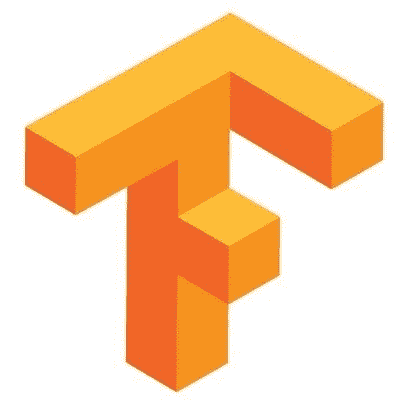
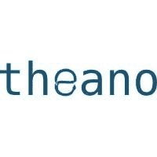
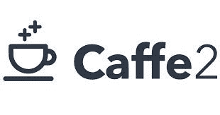
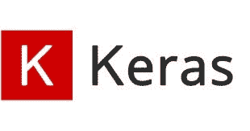

# 5 大最佳人工智能(AI)框架和库

> 原文：<https://medium.com/hackernoon/top-5-best-artificial-intelligence-ai-frameworks-and-libraries-for-ai-a6f16ce0af49>

人工智能的存在在业界已经很久了。人工智能的影响从来没有受到限制，而且，近年来它已经成为一个重要的元素。

各个领域的巨大改进，尤其是在[移动 App 开发](http://www.quytech.com/)方面，得益于各种库和框架的开发。因此，我们可以说，人工智能已经成为一个反应灵敏的信息技术领域，有很多研究正在进行。由于库和框架的实现和集成，出现了许多人工智能解决方案。

# 让我们讨论市场上人工智能的最佳框架

# 1.张量流

TensorFlow 是 Google 创建的神经网络库。此外，它是一个使用数据流图进行数值计算的开源软件。

谈到工作，它通过增强和处理不同节点的数据来学习解决任务。整个过程的重点是找到正确的解决方法。Python 编程语言中提供了张量。

除此之外，它还为开发者提供了 Python 和 C/C++语言的 API，这些 API 可以连接到开发者的软件。此外，该框架被公认为具有强大的架构。

因此，具有这种架构的框架允许在任何 CPU 或 GPU 上进行计算，无论是移动设备、台式机还是服务器。

**优势:**

该图书馆是开源的，因此可以在廉价的云环境中处理数据；

它有利于深度学习，并在模式识别中建立人工智能网络。

# 2.Theano

Theano 是一个强大的 Python 库，被认为是 TensorFlow 的有力竞争对手。各自的库透明地使用 GPU 来执行数据密集型计算。此外，它是为涉及多维数组的高效数值运算而构建的。

Theano 是 Python 语言的库和扩展，它允许科学家高效地计算数学表达式。Theano 用于支持大规模计算密集型操作，以取得丰硕成果。

这个库最好的部分是，它也是为促进快速机器学习开发而开发的。因此，它的编译器会将 Python 语言编写的数学表达式转换成 C 或 CUDA 代码。

优势:

工具包有助于神经网络的配置和学习。

极其易用，可以使用 Python 轻松编辑。

多层感知器、递归神经网络、自动编码器和卷积等的执行。

# 3.咖啡

当我们谈到 Caffe 时，用它我们可以非常容易地建立一个卷积神经网络(CNN)。最初，Caffe 框架只是为商业用途而创建的。它的主要工作是用于图像分类。当它在 GPU 上运行良好时，在操作过程中贡献巨大的速度。

它是开源的，用 C++语言编写，除此之外，它还允许用 Python 编写用户算法。因此，它为现代深度学习算法的开发和部署提供了广泛的工具包。

像天文学和机器人学这样的领域正在随着语音和图像识别的使用而发展。所提供的解决方案适用于不同的领域。高性能使 Caffe 成为所有工具中的完美工具。今天，Caffe 是用于商业用途的深度学习人工智能框架顶层的领导者。

像其他框架一样，有一些可用的学习模型已经集成到系统中，可以有效地进行人工智能和深度学习研究。

**优点:**

干净的架构，可在处理过程中即时部署。

在中央处理器和图形处理器之间切换时，它可以轻松快速地执行。

它是一个开源代码，允许开发人员控制集成，也可以根据他们的需要修改它。

# 4.克拉斯

Keras 描述了这个库，它是一个用 Python 编写的开源神经网络库。此外，它可以在更高的水平上与神经网络一起工作。

它简化了许多任务，但并不意味着像列表中的其他人一样是一个端到端的机器学习框架。

它用于递归神经网络，卷积用于 CPU 和 GPU。因此，提供了高级别的抽象，这使得神经网络的配置变得容易，而不管它位于什么框架上。关于 Keras 最好的部分是 Google 的 TensorFlow 目前支持 Keras 作为后端。

**优势:**

它易于实验实现，易于使用。

对有机器学习经验的开发者来说绝对清晰的开源代码。

# 5.CNTK

CNTK 是微软的计算网络工具包。该工具包用于使用语音识别服务的微软产品，如 Windows Cortana、Skype Translator。

CNTK 是用 C++语言开发的，可用于自动翻译和图像识别任务解析。

微软的 CNTK(计算网络工具包)是一个增强模块化的库，从而提供学习算法和模型描述。此外，它与计算网络分离的维护一起工作。

CNTK 的进程可以同时使用许多服务器。因此，CNTK 允许开发人员创建分布式神经网络，在这种情况下需要大量服务器来运行。

而且其功能性被认为接近谷歌的 TensorFlow。然而，比 TensorFlow 速度更快。

**优点:**

CNTK 支持不同的神经网络模型。

它还支持前馈、卷积、递归神经网络及其组合。

主要使用 GPU 进行计算，因此提供了线性可扩展性。

**包装完毕**

随着时间的推移，所讨论的库已被证明是不同行业中的高质量解决方案。像谷歌、雅虎、苹果和微软这样的巨头利用这些库进行深度学习和机器学习项目。事实证明，这些框架是应用程序开发市场中的最佳工具，开发者正在为他们的客户开发新的解决方案。

了解更多:[人工智能对手机 App 有什么影响？](http://www.quytech.com/blog/what-is-the-impact-of-artificial-intelligence-on-mobile-app/)

*最初发表于*[T5【www.bebee.com】](https://www.bebee.com/producer/@sidharth-garg/top-5-best-artificial-intelligence-ai-frameworks-and-libraries-for-ai)*。*