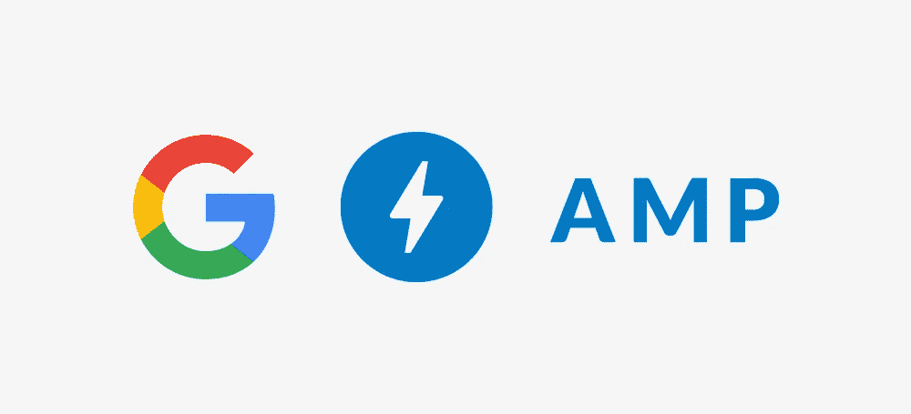

# 加速移动页面的五大业务优势(AMP)

> 原文：<https://medium.com/hackernoon/top-5-business-benefits-of-accelerated-mobile-pages-amp-1af3077783e>

**“53%的用户会放弃加载时间超过 3 秒的网站！”**
*来源:双击*

如今，全球 60%的移动连接都在 2G 网络上。即使你使用的是 3G 网络，加载一个普通的手机网页也需要 19 秒。在移动便利的世界中，用户希望结果立即(在 2 秒钟内)显示在他们的移动屏幕上。

在这里，页面加载速度是决定网站用户友好性的一个重要因素。

随着谷歌宣布网站的“移动优先索引”，它已经促使大多数企业和网站所有者寻找更好的替代方案。虽然我们中的许多人都被移动响应版本所吸引，但是简单的移动优化现有网站的方法并不能产生预期的效果。你需要更好的东西！

# 推出 AMPs，实现快速而精彩的用户体验

谷歌于 2016 年 2 月 23 日正式将 AMPs 整合到移动搜索结果中。AMP 是一个速度惊人的轻量级网页，可以在手机上即时加载。今天，它已经被所有著名的浏览器和平台所接受。AMP 支持的页面在移动搜索中显示为旋转木马，旁边有一个 thunderbolt 图标和 AMP 缩写。

AMP 和移动响应网站在功能、安装方法和提供的好处方面有很大的不同。该网站的桌面版本通常被谷歌选为标准版本，而移动和 AMP 版本则被标注为替代版本。

在速度、用户体验和跳出率方面，AMP 比响应式网站有很多好处。

# 加速移动页面的业务优势

*   **搜索引擎优化(SEO)最佳结果**

众所周知，SEO 可以成就你的事业，也可以毁掉你的事业，AMP 是 SEO 的主要贡献者。拥有一个用于内容交付的 AMP 并不能保证在搜索引擎结果页面(SERPs)中的顶级结果。然而，你的页面加载得越快，你就越有可能从合适的受众那里获得更多的点击。

你页面上的内容决定了跳出率。但是，如果一个页面似乎获得了更多的用户点击和更少的跳出率，那么谷歌将最终显示您的页面在顶部搜索结果的可靠性和有效性。而且在搜索结果中的靠前位置对新用户来说还是挺有吸引力的！

*   **提高用户参与度&保持率**

一个移动友好的网页，加载不到一秒钟，让你的观众粘在你的网站上。随着你的搜索引擎结果随着 AMPs 的改进，它增加了网站用户的数量。

即时加载选项允许操作轻松执行，您的用户可以享受在线的美好时光。所以下一次，用户会被迫访问你的页面，因为与其他门户相比，它提供了最快的结果。

*   **最大化投资回报(ROI)和转化率**

AMP 提高了广告和活动的投资回报率。AMP HTML 广告可以同时在 AMP 和非 AMP 页面上发布。因此，利用 AMP，创建登陆页面和在不同平台上投放广告所需的时间大大减少了。AMP 的精简和简单设计提供了更快的体验，并增加了转换的机会。

AMP 是 Google 的一个开源项目。它提供了构建快速页面并在一个步骤中安装它们的最简单、最具成本效益的方法。对于寻求在线优势的企业来说，AMPs 很容易适应并整合其现有的商业战略。

# 如何知道 AMP 是否适合您的企业？

AMP 适用于所有以在线转换为核心的企业。AMP 主要关注定期生成新内容的在线出版商。这些整合了 AMP 的内容页面首先出现在移动搜索结果中。

《华盛顿邮报》的广告产品和技术负责人 Jarrod Dicker 说，AMP 将点击率提高了 50%。他还说，

*“邮报每天在 AMP 上发表 1000 多篇文章，他们已经看到了实实在在的好处……我们看到平均加载时间为 400 毫秒，比我们传统的移动网站提高了 88%。这使得读者更有可能点击《华盛顿邮报》的报道，因为他们知道我们的文章会持续快速加载。*

AMP 应用的另一个突出领域是在线零售。2016 年，知名电子商务机构易贝宣布了其新的 [AMP-powered 移动购物体验](https://www.ebayinc.com/stories/blogs/tech/browse-ebay-with-style-and-speed/)。基于分析数据，他们放大了热门查询，如[无人驾驶相机](https://www.ebay.com/b/amp/Camera-Drones/179697/bn_89951)和[索尼 PlayStation](https://www.ebay.com/b/amp/Sony-PS4-Consoles/139971/bn_339810) 。到目前为止，他们已经成功地使用 AMP 组件，如侧边栏、轮播和 lightbox，创建了引人注目的电子商务体验。

# 最后的想法

对于企业来说，开发 AMP 页面是相当容易的。它可以使用现有的 HTML 技能轻松构建。AMP 基本上有三个核心组件:AMP HTML，AMP JS，AMP Cache。

虽然我们不能期望在使用 AMP 的 SERPs 中立即得到结果，但是速度绝对是一个因素。完美的移动体验是每个用户都期待并保证的。

如果你没有内部技能来放大你的网页，那么你不必担心。SayOne 拥有一支经验丰富的开发团队，他们是通过[渐进式网络应用](https://www.sayonetech.com/services/progressive-web-app-development/)和 AMPs 创建快速在线体验的先锋。凭借全球客户基础和对快速技术进步的敏锐眼光，SayOne 为商业成功构建下一代应用程序。

想要增强您的在线体验吗？[今天就和我们的专家](https://www.sayonetech.com/contact/)谈谈吧！

*最初发布于*[*https://www . sayone tech . com/blog/top-5-business-benefits-accelerated-mobile-pages-amp/*](https://www.sayonetech.com/blog/top-5-business-benefits-accelerated-mobile-pages-amp/)*。*