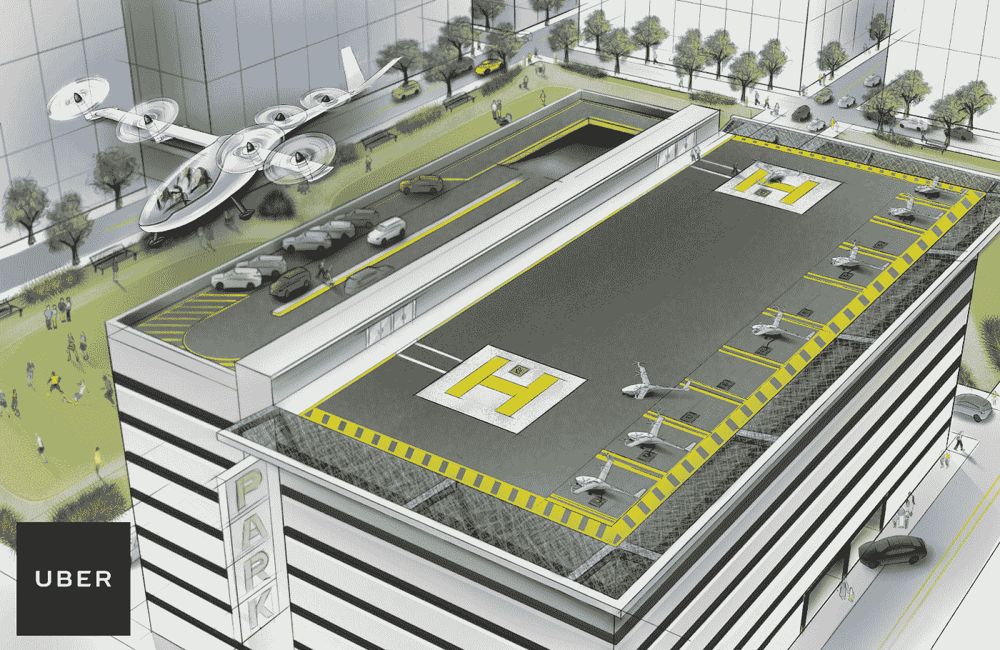
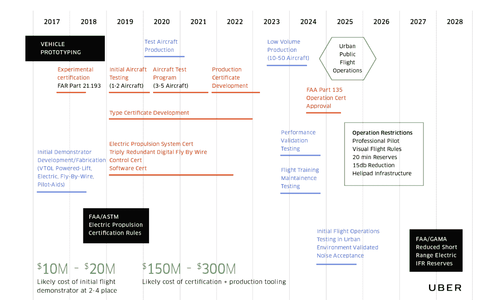

# 按需空运初创公司面临的五大挑战(以及如何克服它们)

> 原文：<https://medium.com/hackernoon/top-5-challenges-for-on-demand-air-transportation-startups-and-how-to-overcome-them-83985bed2c6c>

如果你能减少通勤时间，并利用这些时间与家人共度美好时光，你会有什么感受？这听起来像是童话故事中的场景吗？

按需航空不是梦；这一切都将成为现实，而优步似乎就在这个现实的第一页。优步正计划通过减少出行时间和有效利用出行空间来彻底改变按需生态系统。有了城市空中交通，你可以很容易地减少地面上发生的交通拥堵。

这个想法是拥有一个小型飞机网络，可以进行垂直起降(VTOL)。未来将在很大程度上依赖这一概念。此外，当您考虑基础设施需求时，您将获得优势。

垂直起降有很大的好处。在继续讨论需要考虑的障碍之前，让我们快速浏览一下。

*   垂直起降的成本优势是可能的，因为与铁路或公路运输相比，你不需要在基础设施上大量投资
*   空气拥挤程度会很低；这意味着您可以在几分钟内完成通勤
*   你不需要遵循固定的路线，从而使你的交通更加方便快捷
*   由于技术的进步，垂直起降飞机将使用电力推进，从而减少排放，减少人口和空气中的噪音
*   最终，垂直起落飞机将变得可以负担得起，并将成为常规交通工具，特别是对通勤者而言

**打破壁垒**

VTOL 生态系统由五个需要合作以实现有效运营的关键参与者组成，即监管者、车辆设计者、社区、城市和网络运营商。从今天开始，如果你的创业公司希望在不久的将来确保顺畅的航空旅行，你需要打破生态系统中存在的障碍。

让我们来看看生态系统中每个关键元素所面临的挑战，以及你的初创公司如何克服这些挑战。

# **#1 获得认证**

为了让垂直起降飞机在当前的生态系统中运行，你需要获得许可，并遵守航空当局制定的法规，即美国联邦航空局(FAA)和 EASA(欧洲航空安全局)。话虽如此，从认证的角度来看，垂直起落飞机是一种新的飞机。新飞机及其概念的认证过程相对较慢，这对航空公司来说是一个挑战。然而，有一种方法可以克服这个障碍。

克服认证障碍

*   [美国联邦航空局和 EASA 分别负责 50%和 30%的航空活动](https://www.uber.com/elevate.pdf)已经采用了基于共识的标准流程。这可以用来代替早期采用的缓慢的认证过程。除了垂直起降认证，这些机构还将通过注册 F44 来研究垂直起降动力提升飞机的发展标准
*   为了制定标准，各种利益相关者需要走到一起，他们还需要研究航空标准中现有的差距，以及这将如何影响垂直起降。
*   有实验价值证书，这是理想的垂直起降。审批过程很短，你的车辆可以在受限制的情况下在空中飞行。随着更多的飞行时间被记录下来，限制将会放松，你的飞行时间将会大大增加
*   除此之外，你需要考虑选择操作员认证和飞行员培训，以增加你快速获得认证的机会

# **#2 电池技术适合长距离行驶**

垂直起落飞机是电力推进的结果，它减少了排放，提供了一个无污染的环境，就像巴黎协定的又一个支持者一样。在这种情况下，电池是能量的来源。然而，考虑到电池的体积，它不可能在长途旅行中发挥作用。充电速度慢，导致顺风车很难支持高频次的拼车。同样，循环寿命低于 80%，这意味着电池可能需要经常更换，增加了成本。

**克服电池障碍**

*   垂直起落飞机需要考虑大型电池组，比如一架 4 人飞机大约需要 140 千瓦时的电池组和高比能。你还需要确保他们不会在低于 3C 评级放电。
*   虽然高电池组是必不可少的，但它的包装方式应该是，如果一个电池失效，其他电池可以使飞机保持在空中。应该考虑电池单元的比能量。同时，你应该尽量保持电池重量轻

# **#3 车辆效率**

虽然直升机是最接近垂直起降的，但它们的能源效率低，经济上也不可行。直升机已经被制造成具有垂直飞行焦点。具有分布式电力推进的飞机可以用于拼车目的，但是，到目前为止，还没有制造商制造出用于商业目的的这种飞机。

**克服效率障碍**

*   分布式电力推进是实现特定功率和效率以及必要的可靠性和电机紧凑性的极好方式。你可以用 DEP 增强空气动力学和控制措施。
*   有了 DEP，你可以选择大幅提高效率，克服直升机的基本限制。
*   基于 DEP 的垂直起降飞机可以达到 10 倍的效率
*   充电中心将需要为高需求提供低能量输送，以维持电价，这是这一挑战的一个重要方面

# **#4 车辆性能&可靠性**

当你选择共乘概念时，你首先要实现的是在最短的时间内获得最佳性能。您需要测量并优化请求和放弃之间的时间延迟。车辆的性能在这一措施和系统可靠性中起着重要作用，系统可靠性是需要考虑的从请求到取货的时间的量度。

**克服性能障碍&可靠性障碍**

*   要求与需求的比率在测量出行可靠性中起着重要的作用。要求接送和接送是衡量出行可靠性的标准。在请求时，还会考虑可用车辆的数量。对于一个可靠的旅程，这些因素都应该给出一个积极的。
*   天气是另一个你需要考虑的因素，当你衡量旅程的性能和可靠性时。如果有严重的天气挑战，你按时到达的机会很小。
*   你的车应该是为长途共乘旅行设计的。巡洋舰应该有更多的权力，以优化其性能。

# **#5 空中交通管制**

虽然空中交通管制系统在处理相当适度的空中交通方面非常有效，但我们谈论的是将用于通勤的垂直起降飞机。目前的系统将无法处理空中交通的指数增长。同样，大部分操作发生在高空，而垂直起落飞机将在非常低的高度操作。

**克服空中交通管制障碍**

*   新的空中交通管制系统将需要建立，以处理低空空中交通的指数增长
*   需要针对具体情况制定法规

**结论**

垂直起落飞机将在几年后投入使用。是时候塑造垂直起降的技术和拼车概念了。我们将需要解决包括电池和性能在内的障碍，以便为拼车准备好垂直起降。你准备好垂直起降了吗？

— — — — — — — — — — — — — — — — — — — — — — — — —

**简单介绍一下我:**我是 Space-O Technologies 的营销经理，在[开发像优步](https://www.spaceotechnologies.com/uber-clone-script/)这样的应用程序方面是专家。作为移动应用开发公司的一员，我大部分时间都在研究移动应用的想法和创业趋势。我是企业家和 UpWork 的定期撰稿人。如果您有任何问题，或者需要任何关于移动应用程序开发过程的帮助，请随时联系我。