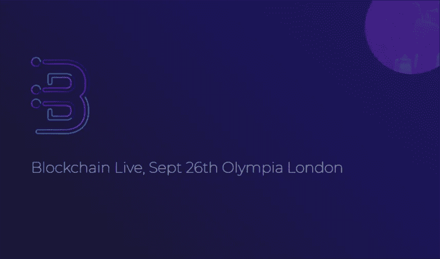
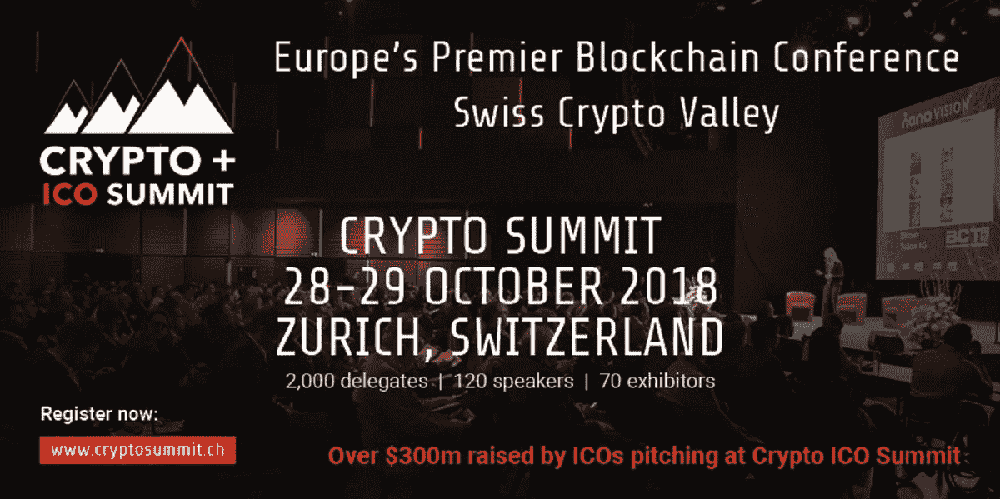
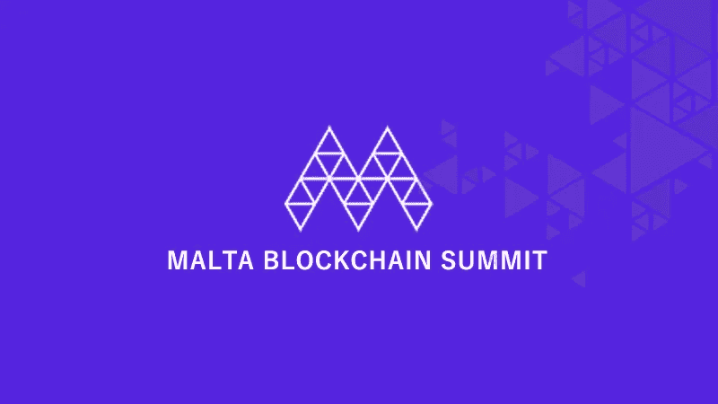
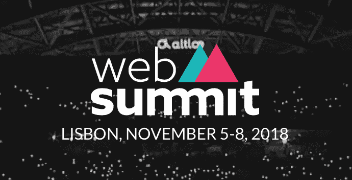
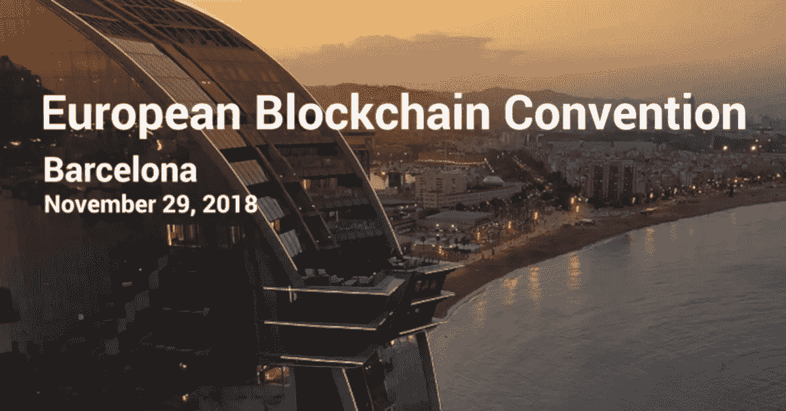

# 今年秋季欧洲五大加密会议

> 原文：<https://medium.com/hackernoon/top-5-crypto-conferences-in-europe-this-fall-b8c0f6661153>

Source: Mediacause

第四季度很快就要到了，它挤满了不容错过的区块链和加密货币活动。每年的这个时候，欧洲在创新、演讲者阵容、令人眼花缭乱的场地和原创曲目方面处于领先地位。所以，如果你认为你已经看过了今年的最佳影片，请三思。

查看今年秋季欧洲五大加密会议:

**1。区块链直播|伦敦 9 月 26 日**

Source: Newsbtc

如果你在寻找一个业界最重的击球手阵容，[区块链直播](https://blockchainlive.com/)不会让人失望。发言人包括 ConsenSys 首席执行官 Joseph Lubin、Digital Asset 的 Blythe Masters 和 smart contract 的创建者 Nick Szabo，这个为期一天的活动的唯一问题是找到时间来安排一切。

分布在九个阶段，超过 100 名演讲者，从区块链新手到最早的采用者，每个人都有一些东西。观看见解深刻的演讲，查看实际案例研究，聆听行业先驱如何让区块链在其业务中发挥作用。只是别指望之后会有派对。本次会议承诺提供内容，但网络完全取决于你。

**2。加密峰会|苏黎世 10 月 28 日至 29 日**

Source: Twitter

第三届[加密峰会](https://cryptosummit.smartvalor.com/crypto-ico-summit-zurich-switzerland-2018/)将于今年 10 月在苏黎世举行，承诺将在九个街区内举办更强大的主题演讲、小组讨论、圆桌会议和实践研讨会。到目前为止，已确认的发言人包括潘迪拉资本的乔伊·克鲁格、Outlier Ventures 的杰米·伯克和 FuturePerfect Ventures 的贾拉克·乔班普特拉。

过去在加密峰会上发言的人包括 Ledger 的 Eric Larchevêque 和公认的思想领袖 Alex Tapscott。在这个为期两天的活动中，有 2000 多名代表和 120 多名发言人，您将独家接触到业内的顶尖人物。一些讨论主题包括资产的令牌化、区块链的债券以及新技术的出现，包括物联网和人工智能。

**3。马耳他区块链峰会|马耳他 11 月 1 日至 2 日**

Source: CoinRevolution

马耳他今年成为头条新闻，成为第一个正式通过关于加密货币、ico 和 DLT 的新立法的国家。在这个小小的岛屿上，一些最具前瞻性的监管和创新思想汇聚一堂，[马耳他区块链峰会](https://maltablockchainsummit.com/)看起来将是一场极具洞察力的盛会。

聆听马耳他总理 Joseph Muscat 阁下和马耳他区块链工作组的其他主要成员。观看几场 ICO 推介和一场区块链黑客马拉松，了解区块链岛为监管和其他新兴技术的未来准备了什么。

**4。网络峰会|里斯本 11 月 5 日至 8 日**

Source: Mindus

如果你想要浮华和魅力，[网络峰会(Lisbon](https://websummit.com/) 是为你举办的活动，为期四天，紧张刺激。Web Summit 有 70，000 多名与会者和 1，200 多名发言人，理所当然地被福布斯和 Inc 出版物评为全球最大、最好的技术会议。

从约旦王后到 Pinterest 的创始人，网络峰会上除了区块链和 crypto 还有很多东西可以发现。前巴萨球员罗纳尔迪尼奥甚至将发表演讲，蒂姆·德雷珀、伊莫金·希普和安德烈·别墅·博阿斯也将发表演讲。想想科技、娱乐、体育、网络和聚会——别忘了会议。

**5。欧洲区块链大会|巴塞罗那 11 月 29 日**

Source: Coinmarketcap

如果你还在忍受网络峰会的拥挤，那么[欧洲区块链大会](http://eblockchainconvention.com/)有望成为一个更小、更私密的活动。到目前为止，已确认的发言人包括 Hyperledger 的 Marta Piekarska、Smart Valor 的 Olga Feldmeier 和 ConsenSys MD Lory Kehoe，以及欧盟议会的知名成员。

这个在巴塞罗那市中心举行的为期一天的活动提供了五个小时的交流机会，50 名优秀的演讲者，以及行业领袖、政治家、开发商、监管者、企业家和投资者的聚会。

**包装完毕**

如果你需要一个理由去旧大陆，现在你有五个了！在一些世界上最令人惊叹的环境中举行的信息丰富、精彩纷呈的活动。在雪山的背景下讨论加密投资的未来。

在里斯本多彩的街道上与名人和科技企业家交往。或者在巴塞罗那沐浴秋日的最后一缕阳光，同时建立宝贵的联系，帮助你推动行业向前发展。