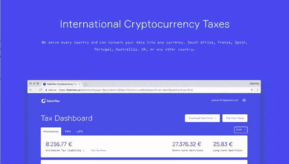
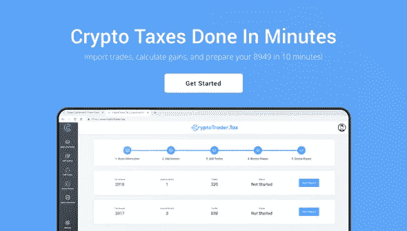
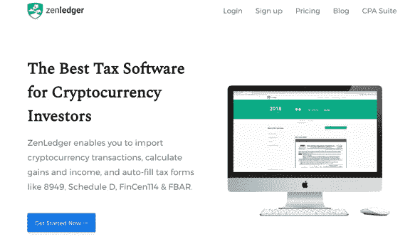
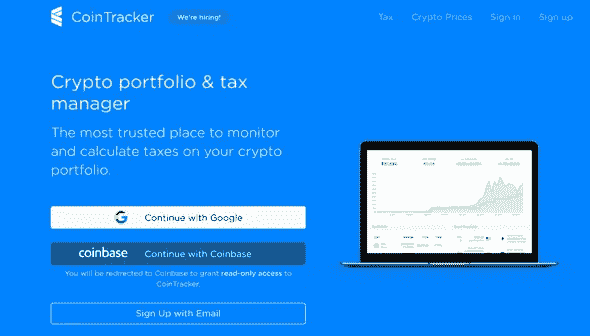

# 纳税季排名前五的加密税务软件公司

> 原文：<https://medium.com/hackernoon/top-5-crypto-tax-software-companies-for-tax-season-34fb8d68124a>

*这个故事最初发表于*[*【BlockFi.com】*](https://blockfi.com/best-crypto-tax-software?utm_source=hackernoon&utm_medium=referral)*。有关了解加密税和管理税务风险的更多信息，请访问* [*BlockFi 资源中心*](https://blockfi.com/resource-center?utm_source=hackernoon&utm_medium=referral) *。*

计算加密税是加密货币交易者面临的最大压力之一。报告加密税所需的时间取决于您拥有的硬币数量、您完成的交易数量以及您使用的交易所数量。不仅如此，每个交易所都有不同的输出来跟踪你的交易，有些根本不提供输出。你的每一笔交易都需要单独累加和记录，这是一个非常耗时的过程。

面对所有这些困惑，有一件事我们可以肯定——向美国国税局(或你所在国家的税务机关)报告你的损益比以往任何时候都更重要。最好的方法之一是通过加密货币税务软件。想想 TurboTax，但专门用于计算你的加密货币交易活动的税收敞口。这是业内排名前 5 的加密货币税务软件公司。

# **令牌税**

[https://tokentax.us/](https://tokentax.co/)

TokenTax 是报告加密货币资本收益和所得税的最简单方法之一。TokenTax 被《福布斯》评为提交加密货币税的最佳平台，是唯一支持所有主要交易所的加密税收平台。他们与所有平台直接连接，自动导入您的交易数据。对于没有进口的交易所，你只需上传一个包含你的交易数据的文件，他们的平台就会自动接收你的信息。

一旦上传了您的所有信息，TokenTax 将生成您提交加密货币税所需的所有表格。这包括表格 8949，TurboTax，FBAR，FATCA，或任何其他你可能需要的文件。

TokenTax 团队对客户服务采取亲自动手的方式，并与其客户密切合作，以确保他们的税款得到最佳和准确的计算。

# 贝尔税

[https://bear.tax/](https://bear.tax/?utm_source=hackernoon&utm_medium=referral&utm_campaign=bradmichelson)

BearTax 是计算加密税的最简单方法之一。该平台利用与超过 25 个主要交易所的集成来导入您的交易数据，以计算您的收益，并为您提供出口文件以进行纳税申报。

BearTax 平台有许多有用的特性。首先，用户界面简洁易懂。他们的“智能匹配”算法将您的取款和存款在他们支持的交易所进行匹配，并且可以在界面中轻松查看。这种匹配功能可以帮助您避免出现任何负余额，这可能会对您的税务报表的准确性产生负面影响。

此外，他们的资本收益计算的收益/损失屏幕可以轻松地审查您拥有的每项加密资产的纳税义务。该平台为您提供了一个清晰的视图，显示您购买、出售或交易所有资产的日期以及相应的纳税义务。

它们也兼容集中交易和分散交易，降低了分散交易的难度。如果交换无法连接，他们接受简单 CSV 格式的数据。

[BearTax 提供多种定价套餐](https://bear.tax/pricing.html?utm_source=hackernoon&utm_medium=referral&utm_campaign=bradmichelson)，从每年 0.99 美元到 199.99 美元不等。所有软件包都包括聊天支持、无限制交换支持、损益汇总、下载税单、查看明细数据和完整纳税年度可用性。区别在于每个包支持的事务数量，从低端的 20 个到最大包的无限个。最好的部分是，你只需付费下载税务文件。所有的计算都是免费的。它们是准备加密货币税的绝佳解决方案。

# **CryptoTrader.tax**

【https://www.cryptotrader.tax/ 

CryptoTrader.tax 帮助加密货币交易者在几分钟内计算他们的资本利得/损失敞口。他们简单的界面使你很容易导入交易，并确保你没有多缴税。

他们平台目前支持比特币基地、Bittrex、Gemini、币安和 Poloniex 交易所。在导入您的交易后，CryptoTrader 将使用全行业注册会计师和税务人员使用的先进先出方法计算您的纳税义务。一旦计算出您的税务风险，用户就可以轻松导出税务文件进行备案，包括 IRS 表格 8949 和您的加密货币收入。

此外，CryptoTrader 创建了他们所谓的审计线索，详细说明了在您的纳税申报中使用的每一个计算，以获得您的净成本基础和收益。该报告包括收入报告、短期和长期销售报告、平仓报告和完整的审计跟踪。

[CryptoTrader 提供两种定价套餐](https://www.cryptotrader.tax/pricing?utm_source=hackernoon&utm_medium=referral&utm_campaign=bradmichelson)。第一个是免费的，它提供了无限制的交易导入和无限制的报告修改。但是，您的报告不可下载，需要您根据平台提供的数据手动填写表格。或者，用户每年支付 39.99 美元，即可获得上述内容，以及可导出的 IRS 表格 8949 和审计跟踪文档。

# **曾莱杰**

【https://www.zenledger.io/ 

ZenLedger 是在一个简单的界面中计算加密税的简单方法。它们与领先的交易所集成，支持所有主要的加密和法定货币。

他们的平台可以将你的交易历史从支持的交易所快速导入到界面中，并自动为你填写税务文件。这些文件包括资本收益报告、收入报告、捐赠报告和结算报告。他们还为你和你的注册会计师或报税人提供损益表。

通过 ZenLedger 生成的所有文档都是 IRS 友好的，这意味着它们可以直接从平台进入您的纳税申报单，而不会出现问题。无论你是矿工还是临时交易员，ZenLedger 都有一个非常容易使用的平台，旨在确保你永远不会多缴税款。

ZenLedger 有三种定价选择，从每年 99 美元到 299 美元不等，包括从交换支持、税务报告到注册会计师访问平台的所有内容。主要区别在于每个包的事务数量，范围从 100 到无限。

# **CoinTracker**

[https://www.cointracker.io/](https://www.cointracker.io/?utm_source=hackernoon&utm_medium=referral&utm_campaign=bradmichelson)

CoinTracker 是一款混合加密资产追踪和税务报告软件。他们的平台会自动同步您的交易所账户或本地钱包中的资产余额和交易，提供您所有加密货币活动的最新信息。

他们的界面显示了您拥有的所有数字资产以及相关的交易历史。此外，CoinTracker 还提供了一个性能跟踪器，让您清楚地了解一段时间内您的加密投资性能。

注册 CoinTracker 非常简单，该平台允许你使用比特币基地账户登录，这是一个有趣而独特的功能。 [CoinTracker 提供四种不同的定价包](https://www.cointracker.io/tax/2018/plans?utm_source=hackernoon&utm_medium=referral&utm_campaign=bradmichelson)，价格从 49 美元到 999 美元不等，根据您需要跟踪的交易数量而有所不同。他们的所有选项包括成本基础报告(先进先出，后进先出，HIFO，ACB，股票池)，与交易所和钱包自动同步，资本收益报告，以及像 IRS 表格 8949，TurboTax 和 TaxAct 这样的导出工具。