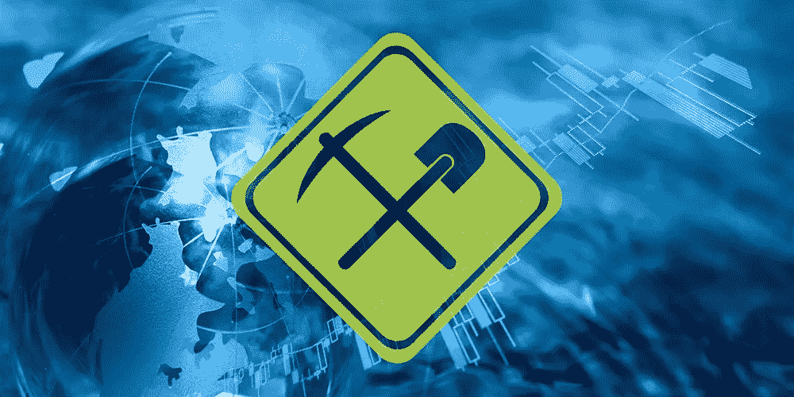
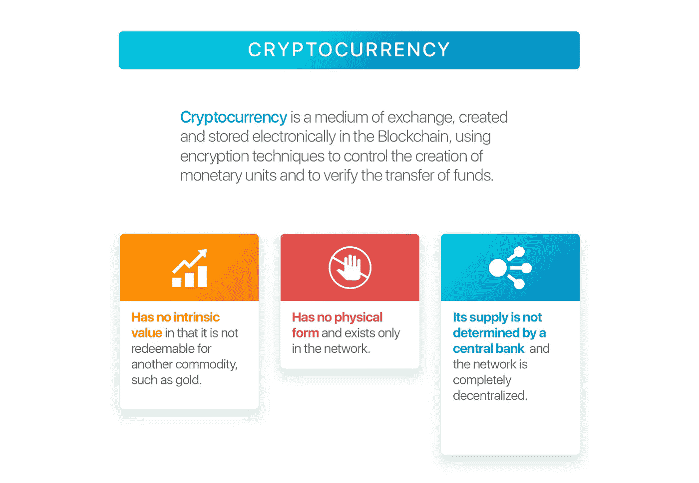
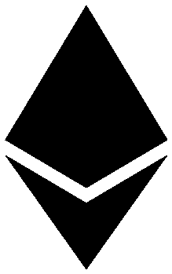
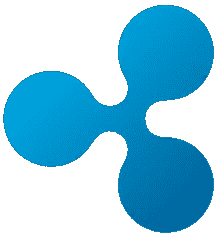
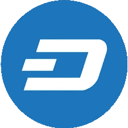
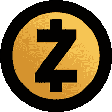
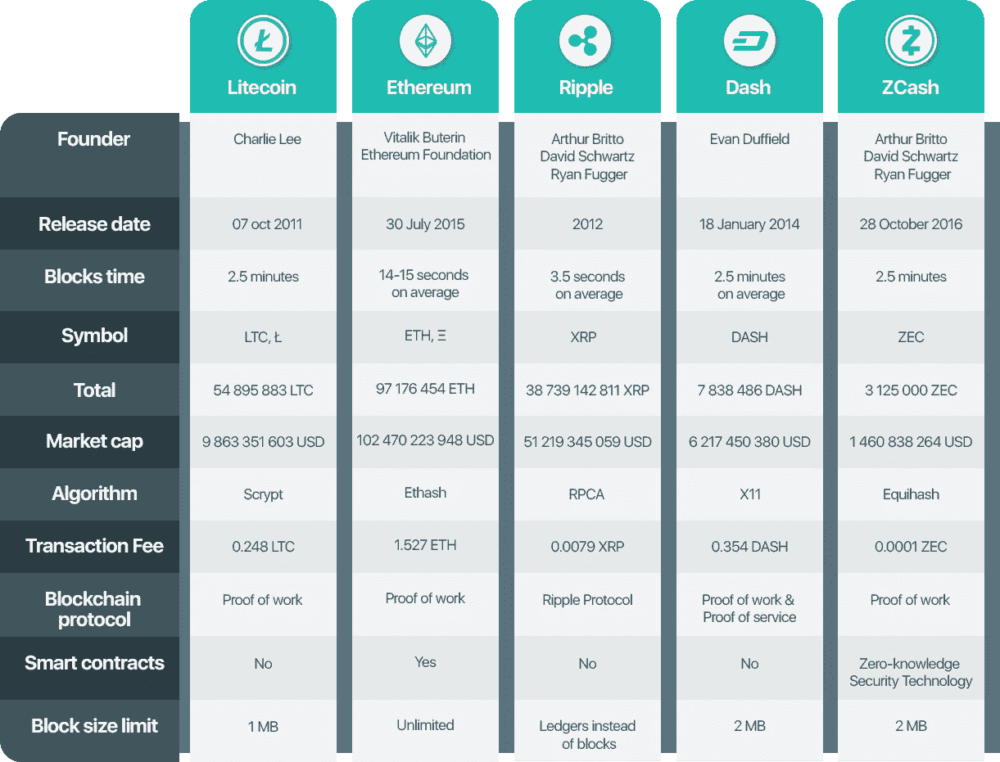

# 市值排名前五的加密货币(比特币除外)

> 原文：<https://medium.com/hackernoon/top-5-cryptocurrencies-that-are-not-bitcoins-a2be0bdf89f5>

从来没有人想到将货币数字化，并应用加密技术在全球传播这种货币的概念。但在这个快速和技术依赖的时代，一切都有可能，所以我们有许多数字货币，或者你可以说虚拟货币正在取代真实货币。

**加密货币是一种用于交换目的的数字或虚拟货币。**

所有的交易都是通过现代的计算机加密技术来保护的，这种技术被称为密码术，它包括密码的加密和解密。加密货币的基本机制是一个数据库，在这个数据库中，没有特定的密钥就不能进行任何更改，这使得每个人都可以跟踪他的所有交易和支付。

比特币是著名的加密货币之一，但还有更多的东西可以看一看，并决定是否存在更好的加密货币，这可以帮助你增加你的股份，并能够改变你的生活方式

# [莱特币](https://litecoin.org/)

## 用于支付的加密货币

在比特币流行之后，所有人都可以将他们的钱转换为不可追踪的资源，开发者开始走向加密货币的发展。在这些开发人员和程序员中，一位名叫查理·李的开发人员开始尝试，失败了，但没有放弃，并能够开发出一种加密货币，即今天众所周知的“Lite Coin”，它以可靠、智能和便宜而闻名。lite coin 最重要的特点是交易速度远远超过比特币，即 2 分钟，而不是比特币 10 分钟的周转时间。

莱特币网络与日俱增，由于莱特币的高效运行和在重要投资者圈子中的日益普及，有可能会有更多的企业家和客户将莱特币作为他们的加密货币

# [以太坊](https://www.ethereum.org/)

## 以太坊网络的加密燃料

在以太坊的使用中可以观察到更广泛版本的加密技术，因为与比特币不同，以太坊不仅可以用作货币，还可以用于构建和部署分散的应用程序，这些应用程序不需要中心来进行操作和工作。随着区块链技术被应用于以太坊的开发，以太坊在用户中很快就变得非常流行，以太坊除了数字货币之外还有许多其他应用。

在以太坊区块链，人们工作来赚取类似于比特币的以太币，但两者之间存在技术差异。整个以太坊区块链使用以太作为其货币，用于执行许多其他工作，如应用程序开发人员可以使用以太支付交易费用，也可以使用加密货币“以太”在该平台上进行交易或购买服务。

# [涟漪](https://ripple.com/xrp/)

## 用于支付的数字资产

Ripple 是当今著名的加密货币之一，正在击败比特币和 lite coin。ripple 最初是为全球的银行交易和银行汇款而设计的，但它很快在个人中流行起来，现在已经达到了顶级加密货币的级别。人们被 Ripple 吸引是因为它投资方便，不像它的替代加密货币。加密货币“Ripple”被认为比任何其他数字货币都更安全，更容易使用，许多金融机构都选择了它，这使得用户使用它更值得信赖。

ripple 网络广泛帮助个人以及机构和组织在全球范围内发送、接收和转移数字货币。投资者相信，从长远来看，加密货币将是最有益的货币之一，这种意识增加了选择 Ripple network 和其他连锁店的投资者的数量。

# [破折号](https://www.dash.org/)

## 你可以在任何地方消费的数字现金

由于其用户友好的特点，它越来越受欢迎，并宣布在世界上最顶端的加密货币。个人觉得使用 dash 进行交易很容易，因为它是用户友好的，可以在几秒钟内完成交易，或者你可以说立即完成交易。

使用 dash 作为加密货币增加了金融隐私，因为它允许其用户进行私人交易并提供管理系统，因此可以容易地实施由投票系统决定的重要改变。交易时间和交易费用对 DASH 有利，越来越多的个人被这种虚拟货币吸引。

# [ZCash](https://z.cash/)

## 网络货币

不亚于任何其他数字货币，ZCash 也因其在交易过程中提供的隐私而获得了世界的关注。ZCash 包含比特币的一些特征，但在效率和交易隐私方面要好得多。ZCash 向您提供区块链上记录和公布的所有交易和转账，以供核实，但出于隐私考虑，它不会公布汇款人或收款人的姓名。

唯一的加密货币为个人提供了屏蔽交易的机会，正在赢得投资者的信任，网络正在日益扩展。

总而言之，现代化的投资方式正在吸引越来越多的投资者和金融机构使用加密货币，这些数字货币肯定会取代乏味的本地货币系统。

娜塔莉亚·库库什金娜撰写