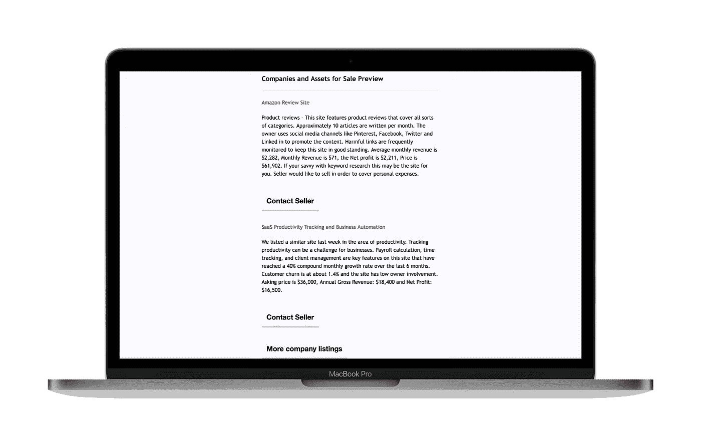

# 购买和销售在线项目的前 6 大市场

> 原文：<https://medium.com/hackernoon/top-5-marketplaces-to-buy-and-sell-side-projects-4381e481ca9d>

## 有大量的资源详细介绍了如何创建一个兼职项目，但是很少有人告诉你在哪里购买或出售兼职项目。今年我自己做了一些研究，以下是我的发现。

My post on Indie Hackers

***更新时间:2020 年 6 月**

最近，我一直在考虑出售我的一些副业项目，主要是因为我现在没有时间来维护它们，也因为我很遗憾我不能为它们付出应有的努力。因此，几周前，我开始关注专门面向买卖小型在线项目的市场。然后我在[独立黑客论坛](https://www.indiehackers.com/forum/im-looking-to-sell-some-of-my-side-projects-where-do-i-start-e5a8d6133e)和 [NoCode Slack 社区群组](https://join.slack.com/t/nocodecommunity/shared_invite/enQtMjYzNTczOTM1ODQ3LTI3OTJiNmVlMDdiZTI3Yjk0OTAxZmU4MDZlZTQ1ZWUxMWZjZTliZDc5NTJmZTZhMmQ1ZTQwZDA4NzA2ZDlmNzY)上发布了这个问题，并得到了一些我认为值得分享的好建议。

## [**转批次**](https://transferslot.com/)

TransferLot 是该街区较新的市场之一。TransferLot 的主要优势之一是它提供前 2 周的免费房源，没有交易费。此后，他们会收取 20 美元的额外两周费用，并在他们的简讯中刊登你的信息。在该平台上市的唯一标准是网站**不能**是一个电子商务平台，必须允许产生某种类型的被动收入，并有一个英文版本。

我最近给了他们两个星期的免费上市机会，收到了大约 5 个询问。买方和卖方之间的所有后续沟通都是通过电子邮件进行的，这种方式效果很好，省去了你回他们网站发信息的时间。需要注意的一点是，目前没有托管系统，买卖双方之间的任何资金转移都需要方便您自己。

## [**机会过载**](http://opportunityoverload.com/)

《机会过载》是一份每周时事通讯。他们一次性收取 10 美元的费用，以便在时事通讯中刊登。几年前，我实际上已经成功地销售了一个使用 OO 的副业项目。考虑到他们的影响力和极低的一次性费用，绝对值得一试。但是，你只能为他们的时事通讯提供一个非常简短的摘要，所以要准备好回答很多关于你的列表的问题。

我最终收到了大约 11 份询盘，其中大多数都是认真的买家。我最终把它卖给了美国的一个买家，并同意使用 [Transferwise](https://transferwise.com/) 来处理汇款，因为它对国外汇款的交易费非常低。

## [脚蹼 ](https://flippa.com/websites)

Flippa 受到了很多负面报道，主要是因为他们的高额费用(15%的成功费)以及他们在事情变糟时的客户体验。然而，Flippa 是迄今为止最大的买卖网站市场，因此流量很大。然而，由于它的大小，你需要筛选大量的垃圾来找到宝石。

Flippa 提供了大量从各种第三方网站收集的关于收入和流量的有用分析；包括， [Google](https://hackernoon.com/tagged/google) Analytics，Adsense 和 [Alexa](https://hackernoon.com/tagged/alexa) 这些普遍认为比较靠谱的。

Flippa 的主要好处之一是他们的托管服务，允许买卖双方的财务保护。这尤其适用于带有各种附加说明和条款的大额销售。

如果你正努力想出一个要价的数字，Flippa 还提供了一个方便的免费商业估价工具。

## [**通过 Shopify 进行交换**](https://exchange.shopify.com/)

想找个电商项目买还是卖？Shopify 实际上有自己的 Shopify 网站市场。

通过交换平台，商家可以列出他们的在线商店进行销售，包括直接从 Shopify 获取的流量和收入数据等信息。卖家不能编辑这些数据，这意味着你可以放心地知道你所看到的就是你所得到的。

Exchange 上的商店从现成的初创商店到成功的电子商务企业都有。因此，价格也各不相同。初级商店的价格可以低至 50 美元，而成熟的 6 位数电子商务帝国的售价可以超过 100 万美元。预计会有很多直运网站，一些收入很少或没有收入的网站在购买时要小心谨慎，因为这些网站是出了名的难以运营(相信我)。

通过该平台进行买卖是免费的，买卖可以通过 Shopify 与 escrow.com 的合作进行(费用不同)。

## [**侧投**](https://www.sideprojectors.com)

把侧投影仪想象成买卖侧项目的 craigslist。它不处理任何支付方面，而是仅仅连接所有者和购买者。因此，出售你的项目是免费的，购买网站也是免费的。同样，没有托管系统，所以在你考虑任何交易之前做好你的功课。

侧投影器提供了关于每个列表的合理数量的信息。然而，我确实注意到清单中缺少重要信息，因为提交时许多字段不是必需的。它似乎没有显示流量分析、收入、社交媒体关注或订户/会员数据。

## [1k 项目](https://www.1kprojects.com/?Sam_Dickie)

1Kprojects 是一个策划市场，在这里，开发者以低于 1000 美元的价格出售他们放弃的项目(*有一些项目的价格远远超过 1K* 🤨).正如描述所暗示的那样，你不会找到 MMR 很强的网站，甚至不会为此而推出。许多列出的网站包含很少的信息，但是你可以通过列表联系所有者。

列表的质量各不相同，从一个建立在标准主题上的基本 Wordpress 网站，声称提供一个直运平台，到一些有趣的潜在修复者，他们正在转向一个小型 MMR，并有一些合理的证明牵引力。

列表是免费的，但你需要一次性支付 19 美元的费用来解锁阅读和回复你的查询的能力。如果你想卖掉它，值得一试，如果你得到一些合理的利益，你可以考虑支付费用。该网站似乎获得了[合理的流量](http://www.siteworthtraffic.com/report/1kprojects.com)，但在撰写本文时提到它只有 1500+时事通讯订阅者。购买它完全免费。

## 其他人

*   [微采集](https://microacquire.com/)
*   [无代码交换](https://www.nocodeexchange.com/)
*   [独立制作人](https://indiemaker.co/)

## **给卖家的提示**

当出售你的副业项目时，要准备好花大量的时间回复电子邮件，询问你的上市细节。

你可能会浪费很多时间来来回回地问问题，但是，为了节省大量时间，起草一份产品关键主张和相关指标的摘要。这可以让潜在买家充分了解正在销售的商品，并防止您收到带有不必要问题的电子邮件。

看看我下面的列表，让你开始吧:

*   每月经常性收入(MMR)
*   经常性收入的百分比
*   固定成本
*   货币化方法
*   要价(包括首选付款方式和条款)
*   你为什么要卖
*   网站流量(每周/每月独立用户数)
*   社交媒体和相关的关注/参与
*   电子邮件订户和参与率
*   强大的反向链接
*   你如何获得流量到你的网站
*   当前营销渠道和相关支出
*   时事通讯订户(包括打开/点击率)
*   技术堆栈和插件
*   品牌(难以衡量)
*   维护网站花费的时间
*   它已经存在多久了
*   你的销售包括，例如，标志，电子邮件列表，域名，电子邮件地址，供应商名单，社会媒体帐户，图像等。

关于计算你的副业项目的价值——看看这个由 Pieter Levels 创建的[便捷计算器](https://howmuchismysideprojectworth.com)。 [Michael Thomas](https://twitter.com/curious_founder) 还提供了[出售其业务的深度报道](https://www.producthunt.com/stories/how-i-built-and-sold-my-company-in-18-months)，并讨论了估值流程和公式。

这不是一个详尽的列表，更具体地说是为了买卖副业而策划的。我会不断更新这个列表，所以请分享任何其他资源，我会更新。

一定要对每一个潜在的买家或卖家进行尽职调查。与这些网站上的大多数列表一样，他们的数字是夸大的，他们的一些声明是虚假的，并与销售炒作混在一起，所以要小心！根据我自己的经验，买卖时不要急于求成，总是先做好功课！

想看更多这样的内容？👉 [**查看我的个人网站，注册我的简讯**](https://www.samdickie.me) **👈**