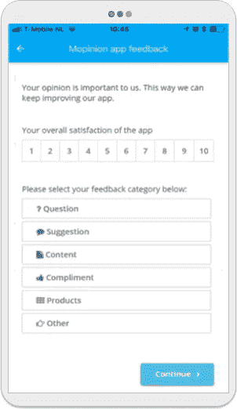
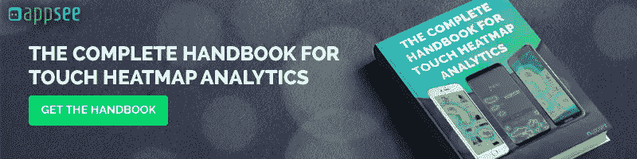

# 你应该收集应用内反馈的五大理由

> 原文：<https://medium.com/hackernoon/top-5-reasons-you-should-be-collecting-in-app-feedback-56951ce142f9>

***作者 Kees Wolters，***[***mopi nion***](https://mopinion.com/)联合创始人兼管理合伙人

对你们中的许多人来说，如今在开发移动应用程序上投入的精力可能会让你们感到惊讶。为什么要这么努力？如果设计得好，你的应用可以让你在市场份额的争夺战中占据上风。注意:这里的关键词是“如果设计得好”。不幸的是，并非市场上所有的移动应用都是如此。当然，他们完成了工作，但许多应用程序仍然缺乏用户渴望的关键功能和强大的用户体验。幸运的是，对于这些设计糟糕的移动应用程序，有一种补救方法可以帮助它们重回巅峰:应用内反馈。

**那么为什么应用内反馈如此重要呢？**

移动应用已经成为许多企业的面包和黄油。毕竟，它们可以打开新的收入渠道，让你能够提供更现代的社交媒体活动，向你介绍新的营销策略等等。

但是**伟大的应用伴随着巨大的责任**这一切都始于理解你的用户想要什么。在竞争如此激烈的移动市场，提供良好的用户体验成为了生存的关键。尤其是现在是 2018 年，开发者面临着额外的技术挑战，如[人工智能和增强现实](https://www.marketingprofs.com/chirp/2018/34746/mobile-app-development-trends-in-2018-and-beyond-infographic)。收集应用内反馈不仅能让你获得提升用户体验和应用可用性所需的洞察力，还能让你的用户对你的品牌保持忠诚。

在应用内反馈领域，最近有几项创新也值得一提。例如，现在可以通过各种不同的方式收集应用内反馈，包括 Webviews、API 和[SDK](https://mopinion.com/mopinion-releases-new-mobile-sdk-in-app-feedback/)。此外，一些反馈软件提供了视觉反馈功能，这使移动用户有机会提交屏幕截图以及他们的反馈。这对于立即识别 bug 和可用性问题非常有用！

现在，让我们来看看为什么您应该在应用内收集反馈:

1.  **帮助您提供顺畅无缝的应用内入职流程**

说到移动应用，外观并不总是一切。你可以开发商店里最好看的应用程序，但如果你的用户不知道如何使用它，他们很可能会离开，再也不会回来。事实上，研究显示 90%的下载应用程序只使用一次，然后最终被用户删除。作为一名设计师，这显然不在你的遗愿清单上。

为了防止用户放弃移动应用程序，大多数设计师都会创建一些入职流程。不熟？用户入门听起来确实如此。这是一种让你的用户“加入”——或者更好地熟悉——你的应用的方式。这包括向他们展示如何以最简单、最有效的方式完成任务并使用应用程序。

幸运的是，对于移动应用程序设计者来说，有很多方法可以做到这一点。然而，也许最受欢迎的是创建一个互动之旅，引导你的用户如何使用这个应用程序。语言学习应用程序 [Duolingo](https://blog.prototypr.io/user-onboarding-spotlight-why-duolingos-user-onboarding-is-magn%C3%ADfico-60d70637098d) 中的入职流程就是一个很好的例子。或者，你可以在空屏幕上添加提示(尚未填充数据)或尝试游戏化。例如，你可以尝试使用一个剧透，鼓励用户更频繁地使用应用程序，这样他们就会被推动去学习更多，挖掘更深。除了这些例子，还有很多其他方法可以让你的用户启动并运行。要获得更多的提示，一定要去[看看这篇文章](https://uxplanet.org/best-practices-for-onboarding-92f3a9f0b21a)。

虽然这些入门方法的主要目的是让你的用户了解你的应用并做好准备，但它们也是了解你的用户、了解他们面临的问题或确定哪些步骤对他们来说难以理解的理想机会。有了这些数据，您就可以开始采取措施来消除任何瓶颈，并开始为未来的用户改进流程。

你可以通过各种不同的方式从你的手机应用用户那里收集反馈。然而，对于用户来说，最有效的方法之一是使用基于活动的反馈。这意味着，根据用户的入职进度，你可以问他们为什么停止前进，或者(如果他们完成了入职)他们的整体体验如何。

**2。使您能够确定路线图的优先顺序**

许多企业在构建新的移动应用程序的过程中，通常在他们的路线图上有大量令人兴奋的功能，他们希望有一天能够实现。响应式设计、定制、社交媒体登录、离线功能、速度等。不管是什么，别冲动！许多开发人员倾向于超越自己，开始一次性推出所有功能。这不仅会让你的应用程序用户不知所措，还会在 UX 部门造成相当大的混乱。试着慢慢开始，边走边测试。

从收集应用内反馈中获得的洞察力将为您提供一个指示，即哪些[功能受到您的用户的高度重视](https://www.forbes.com/sites/gabrielshaoolian/2017/06/07/5-mobile-app-features-your-customers-want/4/#70f2049dd982)，哪些功能需要一点 TLC。例如，你可以尝试使用[触摸热图](https://www.appsee.com/features/touch-heatmaps?cpnid=701b0000000Wd7c&utm_source=medium&utm_medium=link&utm_campaign=guest_post_by_mopinion&utm_content=touch_heatmaps_link)来找出用户的注意力集中在哪里。这些知识还将帮助您确定整个移动路线图的优先顺序，以便您能够更好地满足甚至超越用户的期望。注意:这将因应用程序而异，取决于应用程序的上下文！

**3。帮助您(持续)监控应用内性能**

持续监控应用程序的性能至关重要，尤其是当您推出新功能或计划推出新功能时。毕竟，这是技术…事情可能会出错，如果不及时修复，用户会对你的品牌失去兴趣。摘自[麦肯锡](https://www.mckinsey.com/industries/retail/our-insights/the-three-cs-of-customer-satisfaction-consistency-consistency-consistency)。

你熟悉[精益启动方法](http://theleanstartup.com/principles)吗？根据这种方法，在构建产品(例如移动应用程序)之前应用较短的反馈周期是创建成功产品的关键。通过循环收集反馈，您可以不断测试您的应用程序的执行情况，并在以后做出必要的更改来提高性能。

**4。让您与您的应用程序用户进行更多互动(并且是实时互动)**

除了为您提供对客户旅程和用户体验的深刻见解，应用内反馈还可以为您提供更多关于用户的详细信息。例如，您可以收集用户的元数据，如人口统计数据、浏览器类型、操作系统等。这些数据可以帮助你形成人物角色。

尝试[交叉分析这些人物角色和其他类型的反馈结果](https://mopinion.com/combining-customer-profiles-with-user-feedback/)如 NPS 或 CSAT，你会惊讶地发现这些洞察力有多么强大。事实上，他们会给你机会为你的用户提供更个性化的体验。

更不用说，大多数反馈工具[会实时收集这些反馈](https://www.forbes.com/sites/baininsights/2015/12/24/the-special-sauce-of-real-time-customer-feedback/#428ef39a69eb)，这样你就可以随时准确地知道你的手机应用程序中发生了什么。

**5。这可能是一项伟大的金融投资，甚至可以帮你省钱！**

没错。最后但同样重要的是拥有应用内反馈的经济效益！毕竟，开发一个移动应用并不总是一个便宜的项目。

想想看，如果这些决策仅仅基于假设，那么添加新功能和修改现有功能的成本会非常高。通过收集直接体验过你的应用的客户的反馈，你将更好地准备对你的应用做出有意义的改变。

**总之**

这五个原因应该足以让你理解为什么收集应用内反馈如此重要，但不要忘记收集后会发生什么。最后一步是总结、分类和分析结果。这种对你错在哪里的理解(或对！)将引导您调整应用路线图，实现成功的移动应用！

