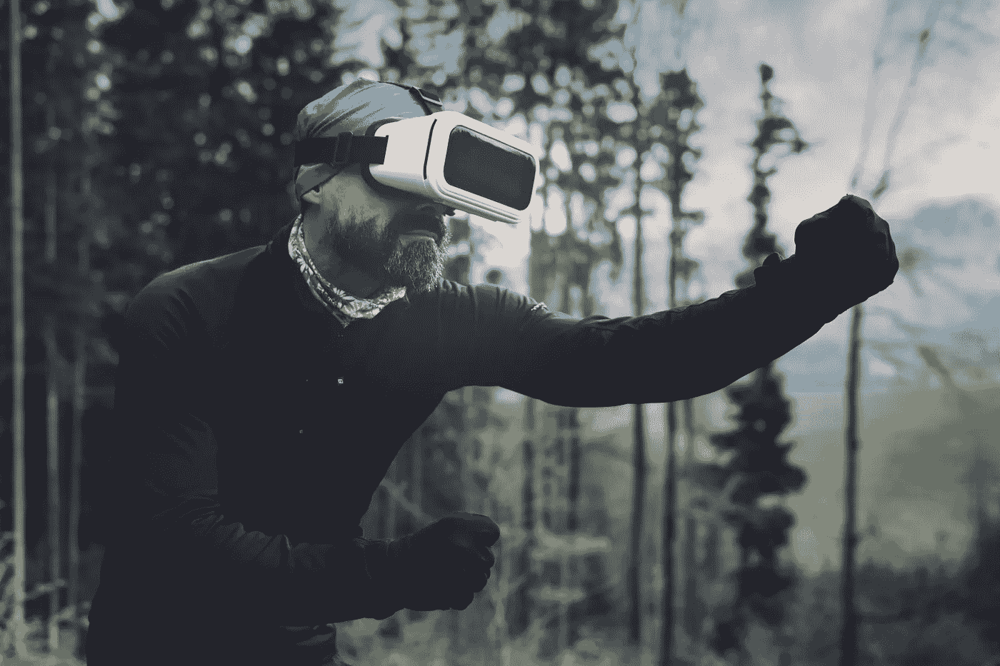
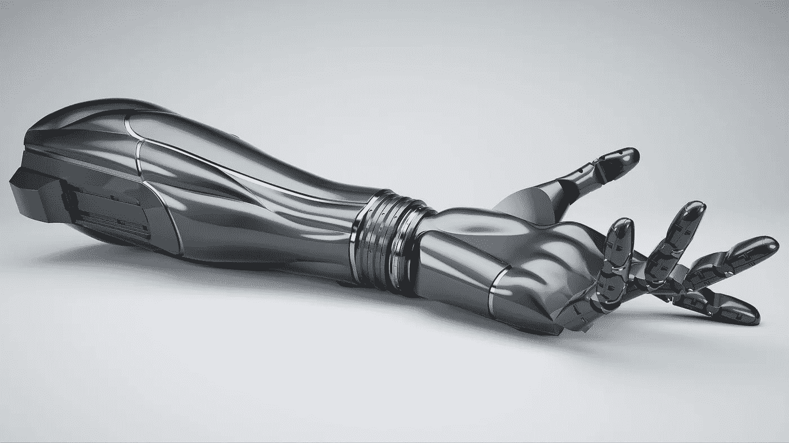
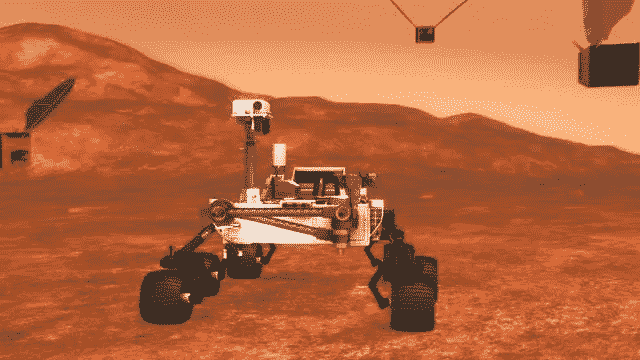
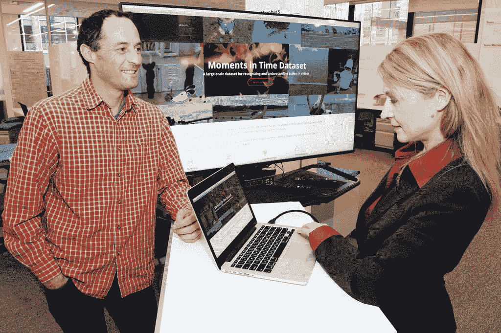
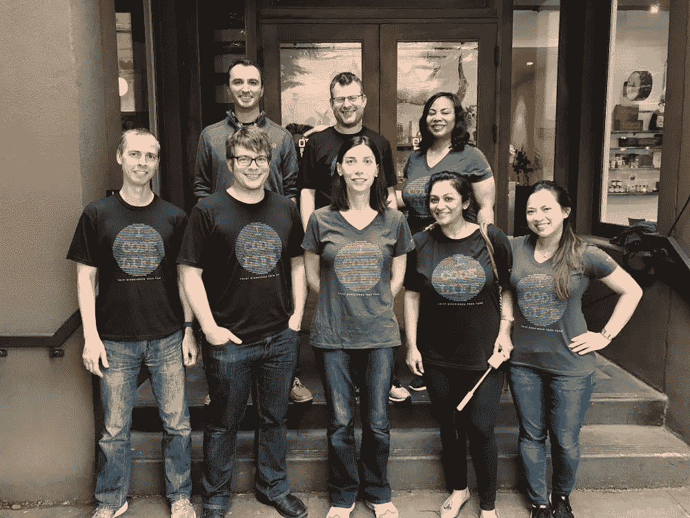
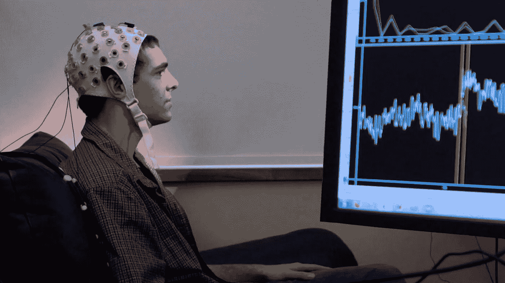

# 五大技术进步

> 原文：<https://medium.com/hackernoon/top-5-technology-advancements-725df05a6dd4>

## 策展自人工智能杂志，营销人工智能研究所，奇点中心，有趣的工程，美国宇航局。

Image Source: Pexels

## 1.仿生手臂

Image Source: Google

克里夫兰诊所与 T2 大学和 T4 大学合作，正在制造精确的假肢。

其结果是可以由脑电波直接控制的假肢的发展。但是早期版本没有解决一个巨大的问题，那就是，截肢者不知道他们的仿生手臂是干什么的，直到最近科学家找到了一种解决方法，称为动觉。由**动觉**接口支持的仿生手臂可以做比普通仿生肢体更多的事情。它可以跟踪感觉，直到关节和肌肉，以计算手臂的位置，即使没有直接的触摸反馈。动觉对于你做的每一个基本动作都是必要的，从擦背到吃爆米花，即使你的眼睛盯着电影屏幕。

首先，这个新装置通过**振动肌腱**达到 **70 到 115 赫兹**来恢复动觉。这种方式的幻觉太强烈了，给科学家留下了这样的想法:如果振动多个肌腱，即使身体没有身体运动，身体也可以最终感受到空间中复杂的手臂运动。

## 2.机器蜜蜂

Image Source: Pinterest

NASA 是不是要派蜜蜂去考察火星？

是的，但是机器人。

它们是大黄蜂大小的飞行器，翅膀像蝉一样大。3 月 30 日，美国国家航空航天局公布了派遣一群火星蜂(它的字面意思是以这颗行星命名的)背后的动机。在美国宇航局的好奇号探测车探测到低浓度甲烷气体的存在后，虽然没有人确定它是否是生物产生的，但这个项目背后的意图，即收集行星稀薄空气的痕迹似乎是可行的。

就我们在地球上使用的技术而言，**旋翼四轴飞行器**比扑翼机器人更受欢迎。设计 flappy 机器人探索火星的好处是，这将允许机器蜜蜂群以更少的能量工作，并定期返回基地充电。

此外，火星上的低重力将进一步装备 Marsbees 群，使其在地球稀薄的空气中完美运行。

## **3。时间的瞬间**

Image Source: Flickr

《时间的瞬间》是麻省理工学院-IBM 实验室正在进行的一个项目，由麻省理工学院-IBM 沃森人工智能实验室的首席研究员 Dan Gutfreund 和麻省理工学院计算机科学和人工智能实验室的首席研究科学家 Aude Olivia 共同完成。

理解**时间数据集**中的时刻，它建立在 100 万个带注释的视频流的汇编上，这些视频流记录了在短短三秒内展开的快速转变的事件。支持这项研究的事实是一个众所周知的人类特征。

对于人类来说，理解以各种形式描述的事件是一种非常简单的能力。在这种情况下，机器确实是失败的。这项研究计划的最终成果是教会机器识别不同的动作。

> 通过向深度学习算法提供大量动态视觉和听觉瞬间，来教它们识别动作。

**例如**，烹饪、开门、跑步等动作被输入深度学习算法，该算法拥有最少 2000 个视频来理解这些动作，而无需在监督下强制教授。

## 4.DNA 合成仪

Image Source: Glassdoor

根据 IDC 的研究小组，到 2025 年，世界将产生 163 zettabytes 的数字数据，导致超过 1.2 万亿部 iPhones 显示“内存已满”警告。这就是当前时代最不真实的技术发挥作用的地方，**Twist Bioscience**——一家成立五年的年轻初创公司。

Twist 的首席执行官 Emily Leproust 告诉记者，该公司现在向客户提供 10 万美元就可以在 DNA 中存储高达 12 兆字节的数据。Twist 的生产室包含 Applied Biosystems 型 DNA 合成器，该合成器配备为每天制造 4 条 DNA 链。显然，Twist 现在每天生产 300 万股。

它的技术似乎是一台喷墨打印机拼凑而成，开始的过程是将 DNA 的腺嘌呤、鸟嘌呤、胞嘧啶和胸腺嘧啶(A、G、C、T)的微小液滴从储存罐中挤出，注入 9600 个纳米孔中，每个纳米孔有一根头发丝的宽度。不可否认，合成 DNA 的巨大市场正在飞速发展。

> 人们能听到的最吸引人的词语是，Leproust 所说的**“这一个 DNA 胶囊存储的数据相当于整个脸书数据中心的数据量”**。目前，据我们所知，该团队已经编码了音乐视频，蒙特勒爵士音乐节的歌曲。

## 5.脑机接口

Image Source: YouTube

占据舞台足够空间的令人难以置信的技术进步之一是脑机接口技术。首先，将人脑与一台被认为能增强认知功能从而提高能力的机器连接起来。它仍处于早期阶段，但发展速度可能比通常预期的要快。

一位非常著名的科学家 Ray Kurzweil 认为，到 2030 年，我们将几乎已经开始通过纳米机器人将我们的大脑与互联网连接起来。因此，库兹韦尔将我们大脑的未来总结为，**“从神经系统内部提供全沉浸式虚拟现实，通过互联网提供直接的脑对脑交流，否则将极大地扩展人类的智力。”**考虑到脑机共存和运行的潜力，我们将如何利用这项技术来破译我们的意识和自我意识？

作为我们所谓的大脑内部神经化学物质引起的魔力的一种变通方法，科学家们正在通过脑电图使用**非侵入性大脑模拟**。通过创造合适的环境和因素，赠送大量的营养、虚拟现实体验和其他异想天开的意识。

***整整 6 个月没有写作*** 😌 😌 ☺️

将覆盖**技术创新**和**一切营销**向前推进。

干杯伙计们！