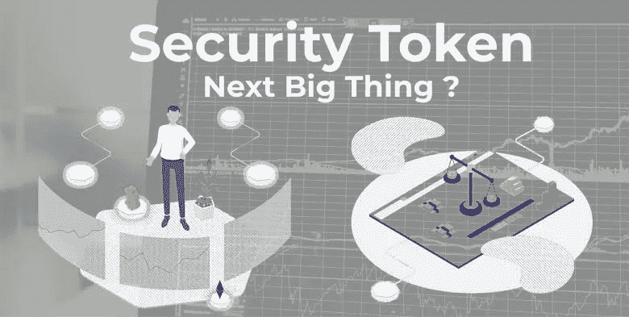
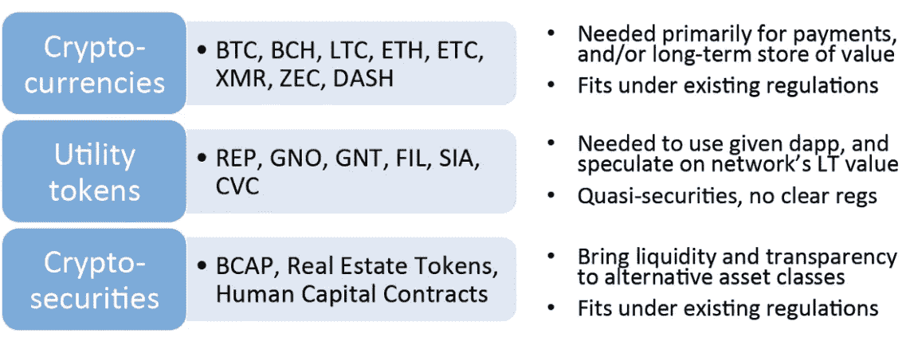
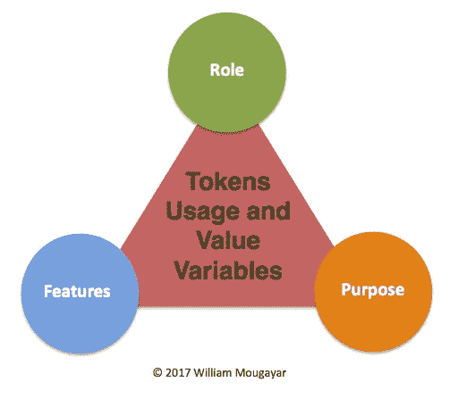
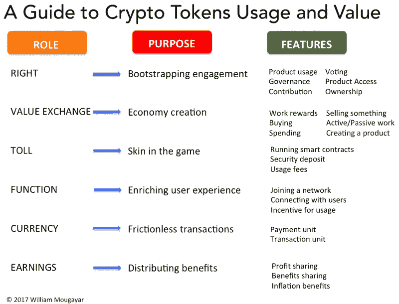
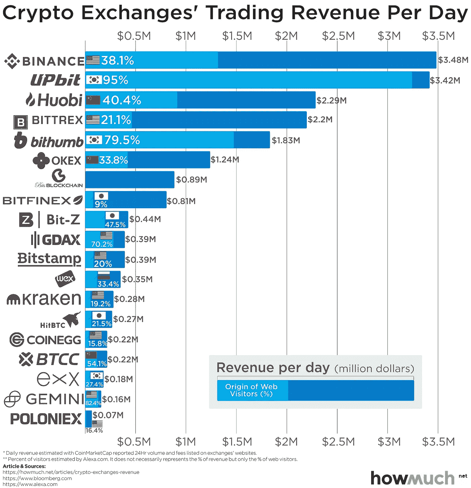

# 投资安全令牌前要注意的 5 件事

> 原文：<https://medium.com/hackernoon/top-5-things-to-look-out-for-before-investing-in-a-security-token-3d8693081010>

Photo: chainsulting.de

比特币的利率在 2017 年有所上升，并在一年内达到了 1700%的最高水平。对于 2017 年之前投资数字货币的所有人来说，这是完美的一年。有迹象表明，人们可以通过投资比特币和区块链科技获得合理的利润。然而，错过机会或投资比特币较晚的人仍然不知道他们是否能够从中获得任何利润。

有一个复杂的全球计算机系统，用于管理运行区块链技术的所有应用程序。这就是为什么大多数人发现理解它是不同的，因为他们无法将区块链与商业、赚钱和全球资金转移等方面结合起来。有许多人对投资安全代币感兴趣，但他们不知道这是否是他们的正确决定。如果你真的想投资代币，这里有几件你需要考虑的重要事情。

# 什么是安全令牌？

一个*安全令牌*的完整定义相当复杂。事实上，在证券交易系统中，*证券*在法语中被称为证券。也就是说，几乎任何可以在股票市场上买卖的股票，无论是公司股票、债券还是某种衍生品。

在加密资产的世界里，许多人犯了这样的错误:将名字与令牌联系起来，而与它们的特征没有任何联系，这通常仅仅是因为误解了股票市场认可的定义。

在这种情况下，今天有许多令牌被各种博客和记者归类为*安全令牌*。也就是说，如果我们相信这个名称，以及证券的定义，这些**【token-values】**，要么代表所有权(社会的一部分)，要么代表债务(对社会的债务)。

## 代币如何增值？

正如 William Mougayar 在他的中篇文章中指出的，代币价值有三个原则，它们是:

*   角色。
*   特征。
*   目的。

这三个被锁在一个三角形里，它们看起来像这样:

每个令牌角色都包含自己的用途和一组功能，下表对此进行了详细描述:

但这既不是第一种情况，也不是第二种情况:*安全令牌*并未赋予其持有者任何社会份额，它们也不代表对加密资产创造者的任何债务。

因此，绝大多数记者和博客作者使用的术语在技术上完全是错误的。

然而，这个名字的出现并不是完全没有原因的:事实上，在负责监管美国证券交易所的美国实体 **SEC(证券交易委员会)**的决定和评论之后，各种芯片被比作传统的*证券*。

如果你想用原来的术语，我们假设这些代币是**价值代币**。我们仍然必须建立一个定义明确的列表，列出它们的特征，以免对我们购买的东西产生误解。

在这种情况下，这些是令牌:

*   其**值取决于发出它们的人所做的工作**；
*   **不提供实现预期目标**的保证，也不提供任何**价值保证**，
*   **只要目标没有达到，往往就没有用**。
*   在发证实体的决定中不授予持证人任何权利。

这些代币证券与公司单位或债务证券没有共同的特征。称它们为**投资代币**或**投资代币**肯定会更正确，因为这通常是它们唯一的功能:把钱投入一项资产，希望它的价值以后会增加。

然而，一些国家，如美国，似乎希望对这些代币适用与传统证券相同的法律，这仍然是事实。因此，**代币价值**的名字并非完全没有意义。当一个芯片声称符合传统证券的特征时，你只需要保持高度警惕:例如，你不应该认为持有 KuCoin 股票就有权参加 KuCoin 会议。

# 1-将令牌视为代码

使用以太坊平台发行的令牌类似于导致智能合约形成的一段代码。在代码中，有一个完整的人的名单，他们的钱包地址以及他们的代币余额。在代币转移期间，代币中的余额将会改变。在智能合约存储器中，所有交易都将被记录。您必须确保您选择的令牌代码和平台是可靠和可信的。

该功能应该易于使用和理解。检查令牌的接口，因为它会给你一个完美的想法，你是否能够使用这些服务。请确保您不要投资于您无法理解的安全令牌，因为从长远来看，这将为您带来问题，并且您将无法获得您投资的服务。

# 2-令牌类型

你必须考虑的最重要的事情之一是你将得到的令牌的类型。根据[安全代币会议](https://www.securities.io/conferences/)，在商业领域，你可以通过投资代币获得两种类型的利润。有了安全代币，你就可以得到保证，你会在未来产生利润。确保您选择的安全令牌类型是有利可图的，团队肯定会分配它所产生的所有利润。

你必须注意令牌提供的服务类型。在那之后，你必须进行你自己的研究，找出这样的服务在未来是否有益，或者是否有其他可用的技术。它会给你一个关于你应该投资的安全令牌类型的完美想法。

# 3-令牌供应总量上限

确保您检查了所选代币的供应上限。你应该知道，有一些开发商不会分享令牌的供应上限。在这种情况下，你将承担巨大的风险，投资于这种类型的代币，因为如果你不产生任何利润，事情会变得混乱。如果你找不到代币的供应上限，这比你咨询代币开发商要好，因为这是你获得利润的唯一途径。

**要了解代币销售结构，请阅读本文:**

 [## 完美的代币销售结构

### 剧透警告:不存在

blog.coinbase.com](https://blog.coinbase.com/the-perfect-token-sale-structure-63c169789491) 

有一些开发商不愿意分享与供应上限相关的信息，这表明他们不可靠。这就是你不应该投资这类代币的原因。总是在获得完整信息后投资，因为这是你正在做的一项重大投资，你不能损失一大笔钱。

# 4-在交易所上市

大多数人不投资代币，因为他们想要长期利润。你应该知道，ICO 的参与通常是基于投机，他们的目标是尽快以 3 倍的价格出售他们的令牌。这就是为什么考虑上市交易所会给你一个关于代币的利率和受欢迎程度的想法。投资利率较高的代币将增加**你获得更多利润的机会**。

以及你必须检查以前的审查和评级的人已经投资于特定的令牌。它会让您了解对令牌的需求是否在增长。如果你选择的代币的需求在快速增长，你可以立即购买，因为只要需求在增长，你可以产生的利润也会增加。

# 5-代币价值

不要忘记考虑代币的价值。你不应该仅仅相信令牌开发者对未来的承诺。确保代币在市场上已经有了一些价值，之后，你应该投资它。你可以咨询不同的投资者，以清楚了解你计划投资的代币的价值。你要考虑的不仅仅是现值。你必须保证你选择的安全令牌在将来也是有利可图的。

选择一些顶级代币进行投资。这将增加你创造更多利润的机会。如果你感到困惑，并且很难选择最好的代币，那么最好的解决办法就是向专家寻求一些建议。他们会让你知道哪些类型的代币是最适合你的，以确保你能获得你长期需要的利润。请确保您明智地选择您的令牌，以获得更好的结果。