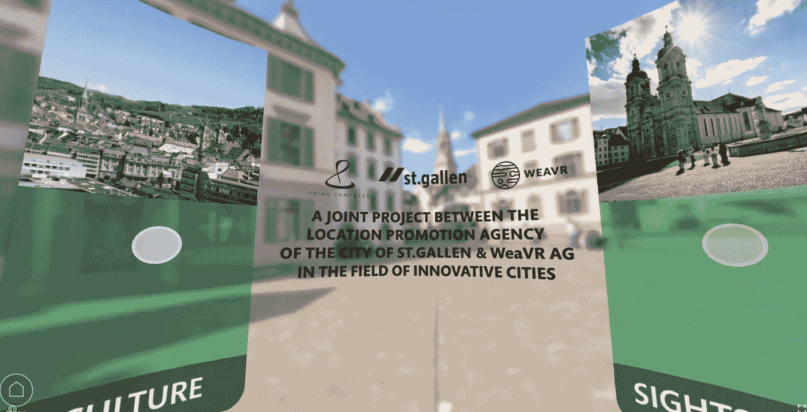
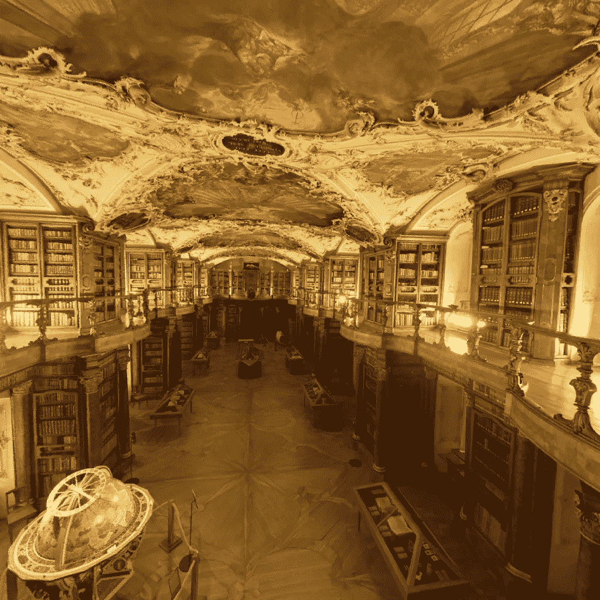
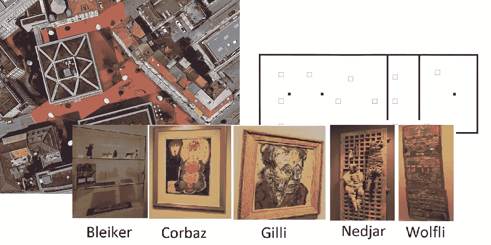
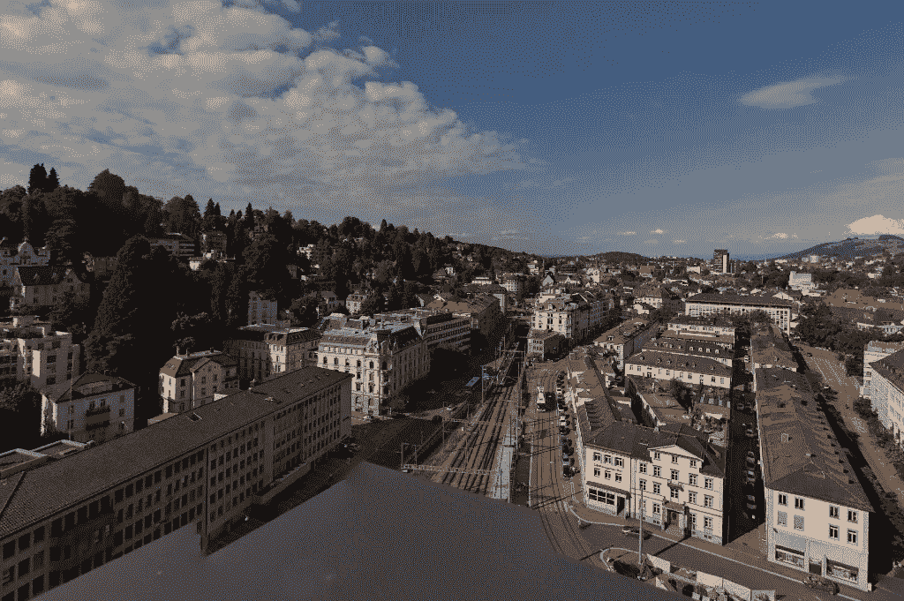
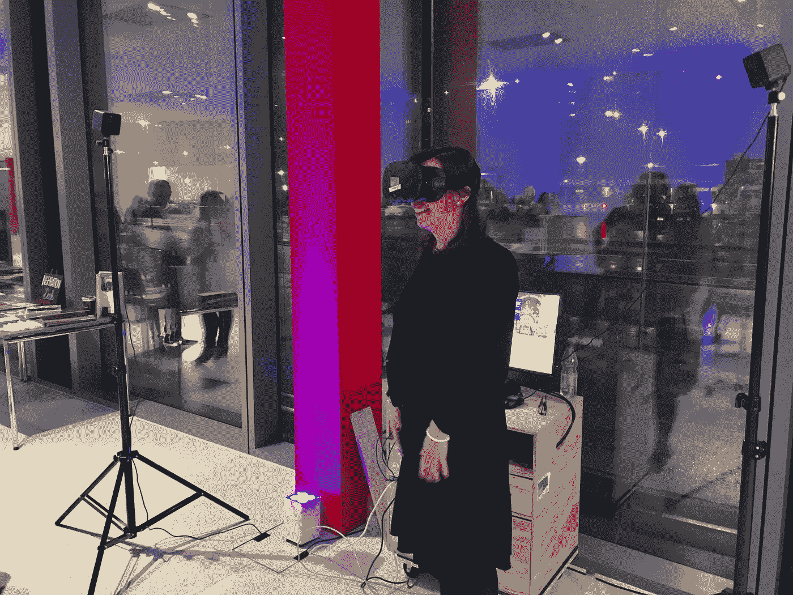

# 我们在为圣加仑市创建虚拟现实体验时学到的前 5 件事

> 原文：<https://medium.com/hackernoon/top-5-things-we-learned-while-creating-a-virtual-reality-experience-for-the-city-of-st-gallen-563e4569086e>

去年，一个有趣的项目来找我们。通过一系列的接触，我们开始在瑞士的圣加仑市进行虚拟现实体验。

Main VR experience menu as seen on a web browser

圣加仑是瑞士东北部的地区中心。它有一个被联合国教科文组织宣布为世界遗产的美丽的市中心。它是一个经济强国，有一所著名的大学和一个充满活力的文化场所，有许多博物馆。

这是一个展示我们技术的绝佳机会。我们有一个伟大的摄影师在船上，并得到了城市的支持，以获得进入城市中特殊和独特的地方。该项目现已完成，将在当地大学组织的大型活动 StartSummit 上展示。

回顾过去，我们想写下我们从这个项目中学到的经验。

# 1.走出人迹罕至的道路去寻找原始钻石

T 何[圣加伦修道院图书馆](https://weavr.space/v/f/3ab299fb-ce36-40f8-83d9-958dc5d8c6b4)是这座城市的瑰宝之一。当我们开始这个项目时，我们被告知他们已经让谷歌对主楼层进行了高分辨率的虚拟现实参观。但是当我们拍摄照片的时候，我们被提供了从一楼[拍摄建筑的可能性。它导致了一个更好的地方之旅。后来我们才知道，一楼的入口是受限制的，因此我们的镜头是独一无二的，这要感谢我们的摄影师寻找一个独特的角度来拍摄。](https://weavr.space/v/f/26cb3567-82ef-43c5-9abd-13ea6f68e506)

The Abbey Library of St. Gallen as seen from the top floor.

同样的事情也发生在这座城市山丘上的一个美丽的自然公园里。我们很幸运，在拍摄这个地方的照片时，已经下了今年的第一场雪。这变成了一次美丽而平静的经历，甚至让来自这个城市的人都感到惊讶。

# 2.尝试，直到你的观众满意为止。

在上，我们创建的一些第一版体验有导航地图，每个地点都有一组热点，供用户传送到该地点的下一个地方。我们正在将一些在房地产行业行之有效的技术应用到城市观光中。我们创建了城市区域的地图，如 [Roterplatz](https://weavr.space/v/f/52a5a925-7bbf-4d0a-9788-43c9897b304d) ，并修改了平面图功能，以适应博物馆的主题地图。

Some sample floorplans we wanted to use: Map based, Floorplan based and Artist based.

除了当我们把它展示给测试用户时，他们不知道该怎么走。我们的统计数据显示，与其他以线性方式创作的故事相比，他们更早地放弃了这些故事。一些用户回到最初的位置，以“星形”方式导航。此外，在一些博物馆里，某个作家的主要艺术作品不是放在入口处，而是放在房间的尽头，因此它们没有得到应有的重视。

最后，我们决定为大型博物馆的所有故事创建一个入口室，并为每个主要主题创建子故事。它简化了整体体验，因为从用户的角度来看只有两类操作:选择主题或查看线性 VR 体验。

# 3.基于目标客户群的群体体验。

当我们开始这个项目的时候，我们做的第一件事就是从这个城市获得需要展示的地方的数量。我们很早就意识到，仅仅将所有的故事放在前面并不是一个明智的决定，因为我们可能会让访问者迷失方向，并被选择的悖论所淹没。

> 我们必须服务的一个重要群体是已经生活在城市里的人们

这个城市的人们对他们的目标公众有很好的洞察力。很明显，我们不仅仅是在为[游客](https://weavr.space/v/w/be6a8996-826b-4746-9945-2f3036a002c7)创造体验，或者我们可以根据像[带孩子的家庭](https://weavr.space/v/w/45408d47-e75d-4a8a-8eeb-6e0484e92767)这样的群体进行分类。我们必须服务的一个重要群体是已经生活在这个城市的人，他们知道最受欢迎的景点，但希望对他们不知道存在的地方感到惊讶，如 Sitterwerk 或 Lokremise。

因此，我们创建了[内部人员类别](https://weavr.space/v/w/2cc5c7e2-9b7f-4b01-b827-f26961c62a24)，很高兴看到一些当地居民的惊讶，他们帮助我们测试最终结果，发现这些隐藏的宝石来自他们认为非常了解的城市。比如从市政厅顶层俯瞰城市的景色。

# 4:不是所有的博物馆都是平等创建的。

当我们开始这个项目时，我们认为可以重复使用我们为房地产和商业客户开发的一些展示机制。毕竟，展示一个博物馆应该和展示一个财产是一样的，是吗？

最后的答案是，要看博物馆。有些博物馆有大型的永久性展览，比如 T2 自然历史博物馆。还有一些博物馆的展览每隔几个月就会改变，比如[圣加仑美术馆](https://weavr.space/v/f/7f7da732-c64a-4fb3-9cc0-448166687dd2)。最后，你还可以在博物馆里轮流展出同一位艺术家的作品，比如专门展出艺术原画的拉格豪斯博物馆。

所以我们不得不把每个博物馆本身当作一个项目。我们花了几番周折才想出展示它们的最终方式，对永久展览的博物馆使用分类，对艺术布鲁特博物馆的内容按艺术家分组，只展示美术馆的公共区域。

# 5.尽早见面，以最终确定体验

随着展览的最后期限越来越近，我们开始几乎每天都与这座城市互通邮件。很明显，我们的进展并不像我们希望的那样，有些请求并不明确，有时我们会认为我们会修复一些东西，但却发现它们并不是客户想要的。

事实上，我们有两个不同的主要故事和每个类别的切入点没有帮助。差异的原因是，WebVR 入口点需要额外的图形元素来帮助用户导航，而 VR 体验使用的是我们的标准导航模式。

因此，我们花了整整两天的时间在现场检查每一个故事，并修复缺失的小细节。在同一个房间里，我们还可以改变客户不知道可能发生的事情，并亲身体验这些问题。我们在现场才发现的一个问题是，我们的主页缓存机制没有正确刷新。因此，虽然我们的操作员正确地执行了每一步，但客户并没有看到最终的变化。

A happy VR visitor of St.Gallen in VR at the pre launch event at the Inspiration Market

圣加仑市的 [25 项虚拟现实体验](https://weavr.space/v/w/fae57e5a-1edb-468f-a0af-512ba67c8d55)现已上线，将于 2018 年 3 月 15 日星期四在 Start Summit 活动上发布。

我们感谢这座城市将这个项目托付给我们，特别是帮助我们最终确定体验细节的团队。他们不仅有耐心，而且在他们的要求和对技术局限性的理解上也很灵活。

T[虚拟现实故事讲述的世界](http://Storytelling in virtual reality)仍处于起步阶段，所有内容创作者都在尝试寻找向用户呈现内容的最佳方式。我们希望我们的提示将有助于在虚拟现实中给观众带来惊喜的创造性思维。如果你想测试你讲故事的技巧，试试我们的[虚拟现实体验编辑器](http://weavr.space/editor.aspx)！

如果你想深入了解虚拟现实故事讲述，点击下面的订阅按钮。