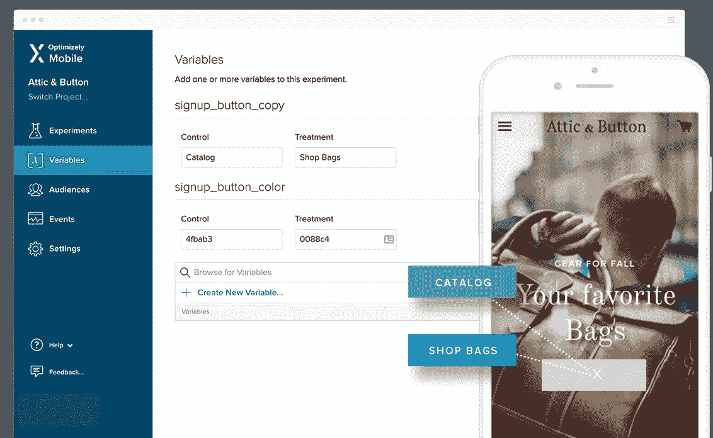
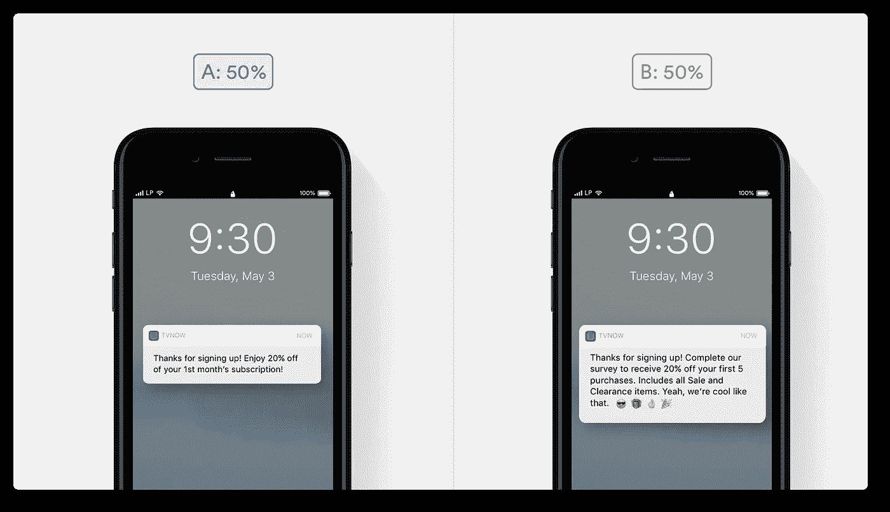
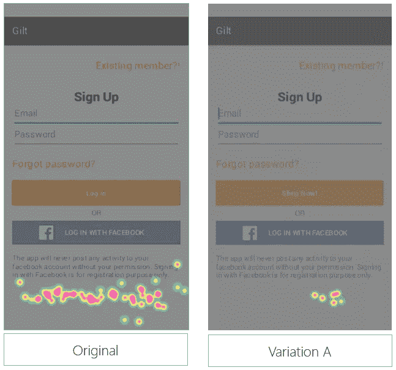
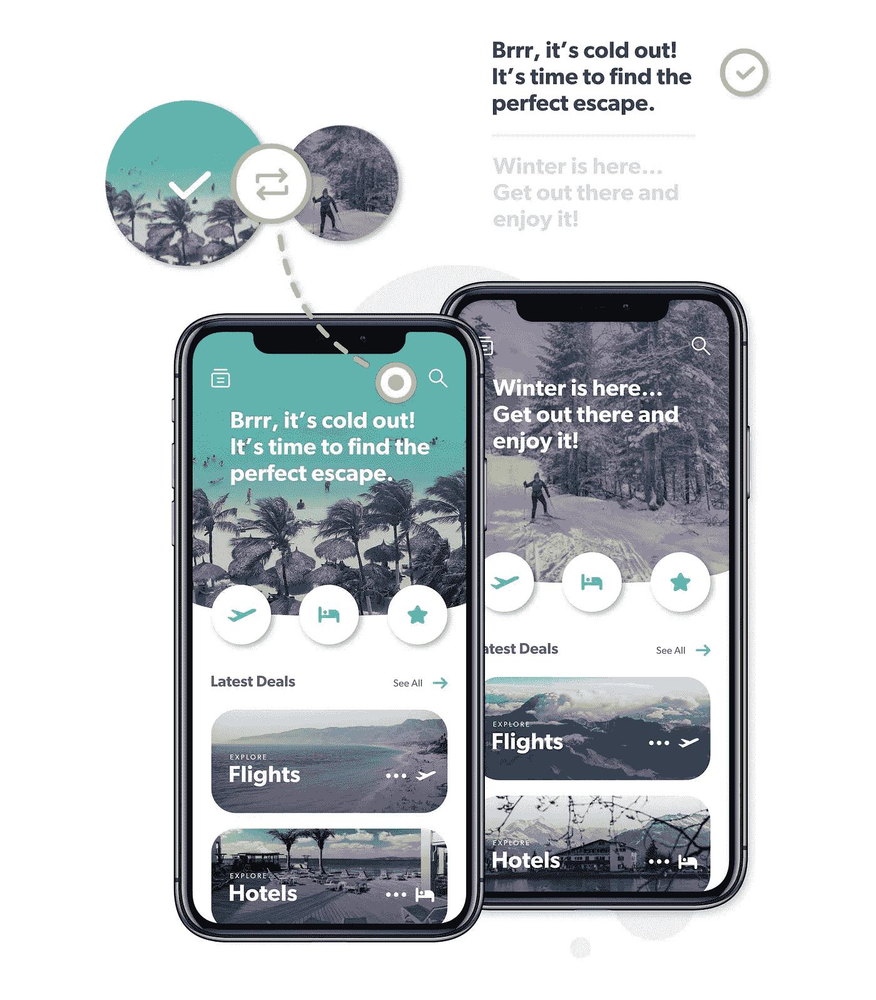
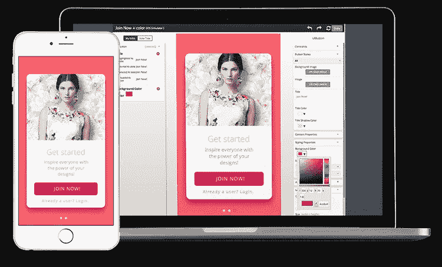

# 2018 年 A/B 测试应用的五大工具

> 原文：<https://medium.com/hackernoon/top-5-tools-to-a-b-test-your-app-in-2018-37cfda1828>

A/B 测试是每个移动应用生命周期中的关键一步。测试你的应用程序的每一个方面，了解什么是有效的，什么是无效的，这是非常必要的。我们搜索了网络，发现了各种各样的工具，但我们认为这是移动专业人员的 5 大工具，每一个都提供了独特的解决方案。

# [优化地](https://www.optimizely.com/)

Optimizely 是业内最知名的公司之一，为移动网络和移动应用提供解决方案。您可以 A/B 测试任何功能并立即进行更改，无需 app store 批准。您还可以尝试入职、功能发现和重新参与策略。如果你不确定一个新特性，你可以分阶段推出，然后快速迭代任何变化。您还可以通过高级定位向所有用户提供个性化体验。

# [利安普拉姆](https://www.leanplum.com/)

由于 Leanplum 的平台，移动专业人员在谈到为什么他们的应用程序的某个元素工作或不工作时，不再需要依赖他们的直觉。创建一个有效的测试来确保你的测试是正确的。您可以运行移动 A/B 测试，无需重新提交 app store，并立即获得见解。使用 Leanplum，您可以 A/B 测试应用内 UI(如按钮、文本、图像)、消息传递(如定时、深层链接等)和渠道(如推送通知、电子邮件和应用收件箱)。最重要的是，使用 Leanplum，您将获得的不仅仅是 A/B 测试，还有自动化洞察、时间估计器和双尾测试。

# [Appsee](https://www.appsee.com/?cpnid=701b0000000Wd7c&utm_source=medium&utm_medium=link&utm_campaign=tools_ab_test_app)

Appsee 提供了一种独特的方法，在[用户会话记录](https://www.appsee.com/features/user-recordings?utm_source=medium&utm_medium=link&utm_campaign=top_5_tools_to_ab_test&utm_content=user_recording_feature&cpnid=701b0000000Wd7c)和[触摸热图](https://www.appsee.com/features/touch-heatmaps?utm_source=medium&utm_medium=link&utm_campaign=top_5_tools_to_ab_test&utm_content=touch_heatmaps_feature&cpnid=701b0000000Wd7c)的帮助下，在**定性**水平上分析你的 A/B 测试。首先，您可以实时观看用户会话记录，并确切了解用户如何与不同的变体进行交互。一个变体比另一个更直观吗？用户导航顺畅还是困惑？您可以通过用户会话记录获得所有这些见解。然后，通过触摸热图，你可以看到用户在每个屏幕上点击和滑动的总体情况。这种对高输入和低输入区域的清晰可视化将帮助您快速识别屏幕的哪些部分受到最多和最少的关注。触摸热图也揭示了可用性问题，如无反应的手势。您可以建立一个 A/B 测试来解决手势问题，并通过触摸热图来查看您的变体是否与对照有所不同。

# [Taplytics](https://taplytics.com/)

Taplytics 为 iOS 和 Android 提供了各种[移动 A/B 测试](https://tap.tc/2XZQWOP)机会。你可以编辑应用程序的任何元素，而不必担心应用程序商店的更新。您可以使用 [Taplytics 的可视化编辑器](https://taplytics.com/product-optimization/visual-a-b-testing-editor/?utm_source=hackernoon&utm_medium=blogmention&utm_campaign=mar2019)创建无代码的 a/b 测试，或者基于代码的实验(允许您创建代码块并将其推送给特定的用户群)。这允许对入职流程、特性发现等进行实验。使用他们的功能标记工具，您可以立即或逐步推出任何功能，然后实时观察影响。您还可以 a/b 测试推送通知以重新吸引用户。测试可以基于用户行为和定制属性(您可以从第三方系统中获得)而有针对性和个性化。分析提供实时结果，您可以创建自定义目标路径来跟踪转化率。

# [优化](https://apptimize.com)

使用 Apptimize 的 A/B 测试平台，推进最困难的 UI 和 UX 目标。你有一个完全控制的可视化编辑器来进行所有你需要的修改，比如设计，改写等等。Apptimize 还允许您使用支持 Objective-C、Swift、Java、HTML5、Xamarin 和 Reactive Native 的动态变量和代码块来测试应用程序的任何元素。当您使用 Apptimize 的 A/B 测试套件时，您可以优化转换渠道，增强您的应用程序的用户体验，并提高用户的参与度。

*你试过哪些 A/B 测试工具并喜欢？下面评论。*

