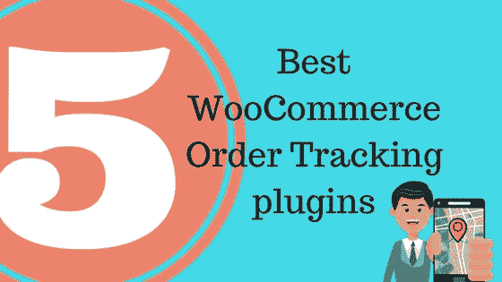
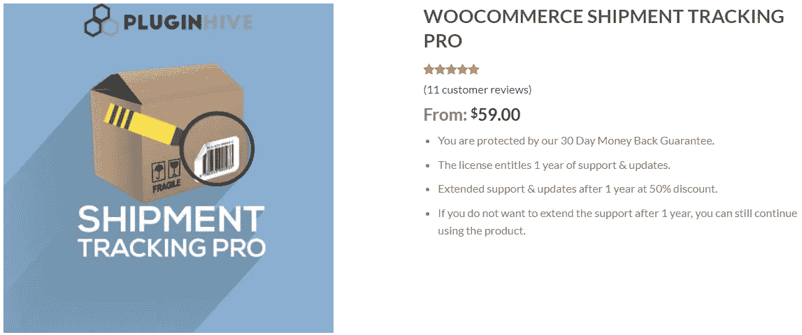
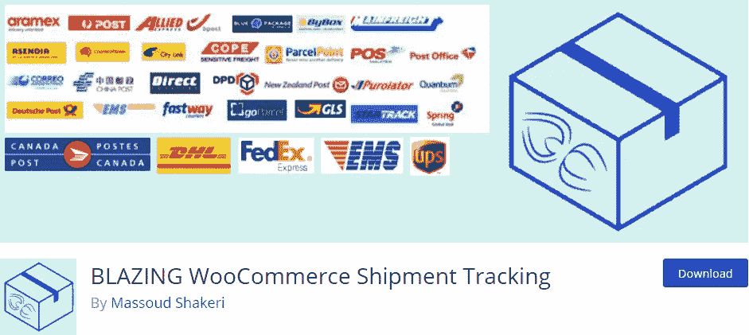
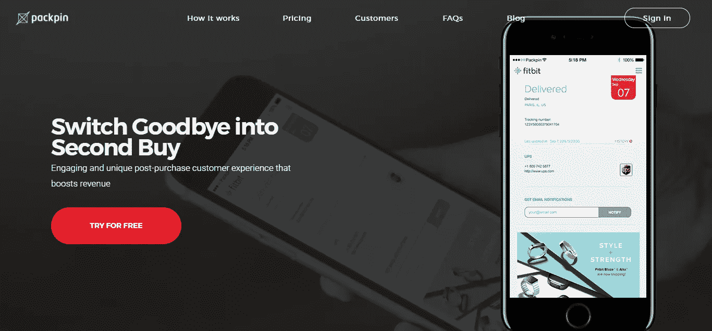
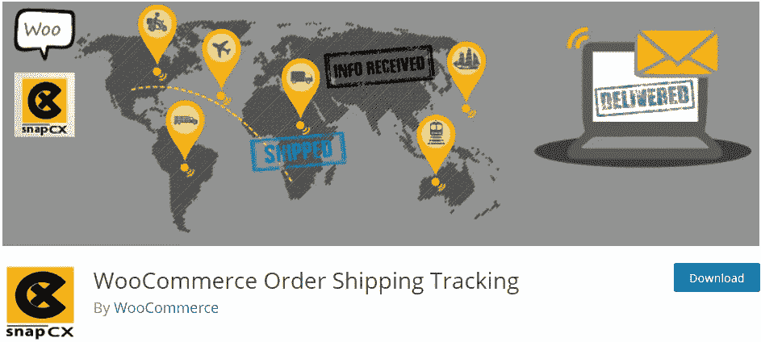

# 五大 WooCommerce 订单跟踪插件

> 原文：<https://medium.com/hackernoon/top-5-woocommerce-order-tracking-plugins-c768aff9a5b2>

WooCommerce 已经成为全世界最受欢迎的 T2 电子商务平台。全世界有超过 500，000 个网站在运行 WooCommerce，毫无疑问，它已经成为在线业务的标准。然而，人们使用 WooCommerce 的原因是它的开源特性和一个巨大的开发者社区，该社区一直在为 WooCommerce 用户提供商业解决方案。这使得与 WooCommerce 的合作变得更加容易。

在线业务的一些主要方面包括预订单履行流程，如运费计算、库存管理等。然而，大多数在线企业主没有意识到的是，订单跟踪等后续方面在电子商务网站中起着至关重要的作用。在这样一个竞争激烈的世界里，忽略一个小的因素会让企业比你更有竞争力，你不能错过这些方面。

这篇文章关注一些最好的 WooCommerce 订单跟踪插件，它们可以帮助你提升你的在线业务。

# 最佳 WooCommerce 订单跟踪插件

# 1. [WooCommerce 发货追踪 Pro](https://www.pluginhive.com/product/woocommerce-shipment-tracking-pro/)

由 PluginHive 开发的 WooCommerce 发货跟踪 pro 插件是 WooCommerce 店主可以拥有的最佳选择之一。该插件是一个易于使用的订单跟踪插件，WooCommerce 店主可以添加他们所有的运输公司名称以及跟踪网址，该插件将随时跟踪他们的货物。

这个插件提供的其他一些很酷的特性包括，

*   **运输承运商支持**

该插件为店主提供了一种简单的方法，通过在插件设置中配置运输公司来更新跟踪订单。默认情况下，插件设置中有超过 80 个预配置的运输公司。这些公司包括全球几乎所有的主要运输公司。然而，该插件提供了一种简单的方法，可以根据店主的喜好添加或删除运输公司。

*   [**直播 UPS &联邦快递跟踪**](https://www.pluginhive.com/live-ups-fedex-tracking-woocommerce-shipment-tracking/)

该插件几乎可以与所有运输公司无缝协作。然而，对于 UPS 和 FedEx 来说，这个插件将货件跟踪提升到了一个全新的水平。woo commerce Shipment Tracking Pro plugin 允许网店店主和顾客使用 [**UPS 和联邦快递实时跟踪**](https://www.pluginhive.com/live-ups-fedex-tracking-woocommerce-shipment-tracking/) 功能实时跟踪他们的订单。这样，他们可以随时随地获得订单的实时跟踪状态。

*   **订单页面上的跟踪详情**

该插件在订单页面上提供订单跟踪详细信息。店主可以手动更新跟踪细节，包括运输公司、跟踪 ID 和装运日期。店主可以从订单页面访问这些详细信息。

*   **客户跟踪详情**

woo commerce Shipment Tracking Pro plugin 还允许客户获得订单的跟踪详情。客户可以登录他们的“我的帐户”页面并选择他们的订单。跟踪细节将在同一页面上更新。

*   **通过 CSV 批量导入跟踪数据**

WooCommerce 货运跟踪专业插件处理批量跟踪数据像一个专业。使用这个插件，WooCommerce 店主可以在 CSV 文件的帮助下批量更新他们的订单。CSV 文件将包含所有订单的跟踪数据，包括订单号、跟踪 id、运输公司名称和装运日期。跟踪详情更新后，这些订单将被标记为已完成。

*   **计划从 FTP 服务器导入跟踪详细信息**

这是这个插件最令人兴奋的特性之一。WooCommerce Shipment Tracking Pro 插件允许店主从存储在 FTP 服务器上的 CSV 文件中导入跟踪细节。该插件不仅提供了一种自动化整个过程的方法，而且它允许店主定义导入再次开始的时间间隔。这样，跟踪细节将自动从 FTP 服务器的 CSV 文件中导入。

*   **自动将订单状态标记为完成**

WooCommerce 店主无需手动将订单状态更改为已完成。使用 CSV 导入或 FTP 导入更新跟踪详细信息后，该插件会自动将订单状态更改为已完成。

*   **订单完成电子邮件中的跟踪详情**

WooCommerce 发货跟踪专业插件允许店主为他们的顾客定义一个自定义的跟踪信息。此消息将显示在发送给客户的订单完成电子邮件上。该消息将包含所有跟踪细节，包括跟踪 ID 和跟踪货件的链接。

# 2.[炽烈蜘蛛追踪炽烈 WooCommerce 发货](https://blazingspider.com/plugins/blazing-woocommerce-shipment-tracking)

BLAZING WooCommerce Shipment Tracking plugin

除了 WooCommerce 货运跟踪专业版，由炽焰蜘蛛开发的炽焰 WooCommerce 货运跟踪插件也是一个很棒的 WooCommerce 订单跟踪插件。这个插件还向店主和顾客提供跟踪信息。

以下是这个火热的 WooCoommerce 货物追踪插件的一些有趣的特性。

*   **海运承运商支持**

炽热的 WooCommerce 货运跟踪插件是基于 JASON。而添加承运商，有一定的方式是店家必须遵循的，否则插件不会添加承运商。该插件支持不同的运输公司，为了成功添加运输公司，店主需要添加运输公司的 slug、运输公司的标题和跟踪 URL 等信息。那么只有插件才能正常工作。

*   **订单页面上的跟踪详情**

就像以前的插件一样，这个插件也允许店主从订单页面手动更新跟踪细节。店主可以添加跟踪细节，包括跟踪 ID、运输公司名称和发货日期，并在订单中进行更新。但是，到目前为止，还不支持自动更新跟踪详细信息或批量跟踪数据处理。

*   **订单完成电子邮件中的跟踪详情**

炽燃 WooCommerce 发货跟踪插件允许店主通过电子邮件向顾客发送跟踪细节。该插件提供了两种向客户发送跟踪信息的方式。其中之一是在订单完成电子邮件中包含跟踪细节的传统方式。然而，该插件还提供了一个选项来添加一个专用的跟踪电子邮件，其中将包含一个按钮来跟踪货物。此外，店主可以在插件设置中更改该电子邮件的模板。

# 3. [Packpin WooCommerce 发货跟踪](https://packpin.com/)

Packpin WooCommerce Shipment Tracking plugin

Packpin WooCommerce 发货跟踪是另一个有趣的插件，已经进入 WooCommerce 订单跟踪插件的前五名。该插件基于通过电子邮件向客户提供及时的跟踪更新，从而为 WooCommerce 网站带来巨大流量的想法。

下面是这个插件提供的一些有趣的特性。

*   **运输承运商支持**

Packpin WooCommerce 货物追踪插件在运输承运人方面的工作方式有所不同。它有一个基于其支持的运输公司数量的专用订阅计划。另外，如果你的运输公司不在插件支持的范围内，那么店主就没有办法添加运输公司。相反，您可以联系支持人员，要求他们将运输公司添加到受支持的公司列表中。

*   **订单页面上的跟踪详情**

Packpin WooCommerce 发货跟踪插件允许店主手动更新跟踪信息，包括订单页面上的跟踪 ID 和承运商名称。这样，店主不仅可以更新跟踪数据，而且为了他们的方便，还允许他们只从后端跟踪他们的货物。

*   **状态变更的邮件通知**

Packpin 发货跟踪插件允许店主发送电子邮件通知。发送电子邮件的想法是，这将有助于提高 WooCommerce 网站的流量。这就是为什么，插件提供了订单状态变化，预计交货日期以及跟踪历史的电子邮件通知。

*   **woo commerce 网站上显示的追踪详情**

这是迄今为止 Packpin WooCommerce 追踪插件最有趣的功能。该插件在电子邮件中提供跟踪选项。然而，追踪数据只显示在 WooCommerce 网站上。这样，如果每周有 50 个订单，那么它保证了至少这 50 个人将增加网站的流量至少 5 倍，直到他们的订单到达。

# 4. [MIMO WooCommerce 订单跟踪插件](https://wordpress.org/plugins/mimo-woocommerce-order-tracking/)

MIMO WooCommerce Order Tracking plugin

MIMO WooCommerce 订单跟踪插件是一个简单而有用的 WooCommerce 跟踪插件。该插件管理订单跟踪，并在订单状态发生变化时通知客户。

该插件包含以下一组特性，

*   **运输承运商支持**

MIMO WooCommerce 订单跟踪插件提供了一个简单的插件设置界面来添加运输承运商。通过这种方式，您可以添加一个或多个运输公司来更新订单的跟踪详情。

*   **订单页面上的跟踪详情**

该插件还支持在订单页面上添加跟踪细节。这使得店主可以手动更新订单中的跟踪号、承运商和发货日期。这样，店主可以从订单页面跟踪订单，而不是访问运输公司网站。

*   **自动将订单状态标记为完成**

另一个非常方便的特性是插件能够自动将订单标记为完成。对于大中型网站来说，这为 WooCommerce 店主节省了大量时间。

*   **订单完成电子邮件中的跟踪详情**

该插件还支持将跟踪信息添加到订单完成电子邮件中。通过这种方式，客户将收到跟踪详细信息以及到运输公司跟踪页面的链接。对于个性化，该插件为店主提供了一个添加电子邮件模板的选项，该模板将包含货物跟踪的详细信息。

# 5. [WooCommerce 订单发货跟踪插件](https://wordpress.org/plugins/ubercx-shipping-tracking/)

WooCommerce Order Shipping Tracking plugin

最后但并非最不重要的，是 WooCommerce 订单运输跟踪插件。这是一个基于订阅的插件，根据店主购买的订阅类型提供功能。这里是这个插件提供的一些特性，与订阅无关。

*   **海运承运商支持**

WooCommerce 订单运输跟踪插件支持所有主要的运输公司，如 UPS，联邦快递，美国邮政，加拿大邮政等。订阅计划根据一个运输公司或多个运输公司的 API 调用而有所不同。

*   **订单页面上的跟踪详情**

该插件的一个有趣特性是，它向店主提供了与顾客相同的视图。店主可以直接从订单页面轻松访问跟踪详情。

*   **客户“我的账户”页面上的跟踪信息**

WooCommerce 订单发货跟踪插件允许客户在客户的“我的帐户”页面上详细查看发货状态。这对于客户体验来说非常有用。

*   **包含跟踪详情的电子邮件通知**

该插件还提供在订单完成电子邮件中包含跟踪细节。该电子邮件包含详细信息，如跟踪 ID、承运人和发货日期。跟踪详情添加到订单并保存后，将立即触发此电子邮件。

# 总结…

这篇文章涵盖了一些最好的 WooCommerce 订单跟踪插件，可以促进您的业务。这些插件为店主和顾客提供了对订单跟踪信息的便捷访问。WooCommerce 店主可以根据自己的喜好选择任何一个插件。然而，这个列表中的一些插件提供了一个更复杂的跟踪 WooCommerce 订单的解决方案。因此，不同的店主可以很容易地在提到的插件之间进行选择。

然而，如果你在为你的商店决定最好的 WooCommerce 订单跟踪插件时仍然感到有点迷失，你可以看看一些理想的 WooCommerce 跟踪插件的**必备功能。**