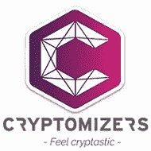

# 排名前 65 位的 STO 代理商| STO 服务提供商

> 原文：<https://medium.com/hackernoon/top-65-ico-agencies-ico-service-providers-24f64683ac29>

Top STO service agencies | STO providers

# 为推出 s to 提供服务的卓越 STO 机构的全球列表

你是否在寻找一些最好的 STO 代理机构来帮助你推出 ICO 或 STO？

我们涉足加密领域已有近 1 年半的时间，已经与许多不同的 STO 提供商建立了合作伙伴关系。在 Crypto Gang，我们的重点是提供卓越的品牌服务，其中包括徽标和品牌企业标识创建、STO 网站的设计和开发、白皮书、宣传资料、单页广告和其他视觉资产的设计。

STO 通常包括准备以下要素:

1.  STO 网站和文档的品牌和设计。
2.  为白皮书、网站、宣传资料等撰写内容。
3.  技术环境—智能合同、代币发行、投资者文件柜等。
4.  公关和营销服务——广告、公关文章、SMM、社区管理等。
5.  反洗钱 KYC 法律服务部。

通过与不同的 STO 服务提供商密切合作，我们对市场上一些表现最佳的公司有了很好的了解，他们可以为您提供一流的 STO 服务，并确保成功的融资。

我相信这些信息可能对[区块链](https://hackernoon.com/tagged/blockchain)的初创公司很有价值，他们正在寻求推出自己的 sto，所以我想在这里分享一下这些机构的名单。

但是请注意，这些机构代表了启动 STO 的不同核心专业领域。其中一些提供全面的 STO 服务，一些，如 Crypto Gang，专注于他们的主要能力。

## 全球最佳 STO 服务提供商名单——营销、公关、代币销售、法律、品牌、STO 网站、区块链。

**1。** [**区块链谷创投(BVV)**](http://bvventures.ch/) **(瑞士)|** *全服务 STO 机构，孵化器*

[***网站***](http://bvventures.ch/)***|***[***LinkedIn***](https://www.linkedin.com/company/blockchain-valley-ventures/)

**block chain Valley Ventures(BVV)**是一家瑞士风险投资公司，孵化、开发和投资区块链支持的企业。我们的专长在于区块链技术、首次公开募股(ITOs/ICOs)咨询和早期风险投资。区块链谷风险投资对区块链生态系统有着深刻的了解和洞察力，以及丰富的 ITO/ICO 经验。

**2。******(乌克兰、波兰)|** *品牌、设计、ICO/STO 网站***

**[***网站***](https://cryptogang.agency/)***|***[***领英***](https://www.linkedin.com/company/crypto-gang-agency/)**

****

**Crypto Gang**

****Crypto Gang** 是一家优质品牌代理公司，服务于科技和区块链相关业务，我们在品牌战略、企业品牌形象、网站设计和开发、白皮书设计、宣传资料、单页广告和其他视觉材料方面拥有专业知识。我们让我们的客户真正脱颖而出。我们的一些客户包括风投、ICO 和 STO 项目、区块链咨询公司、交易所等。你的品牌推广工作非常重要。这不是关于你的标志或颜色或登陆页面布局，而是关于人们听到你的项目时的情绪。作为一家数字机构的一部分，我们在过去几年里为客户创造了许多品牌。我们与线下和线上项目、初创公司和成熟企业合作过，现在我们准备好帮助你了！**

****3。**[**Ceito**](https://www.ceito.io/)**(新加坡)|** *技术环境、法律***

**[***网站***](https://www.ceito.io/)***|***[***LinkedIn***](https://www.linkedin.com/company/ceito/)**

****

**Ceito**

**Ceito 是一个集成的工作流平台，指导项目所有者完成复杂繁琐的筹资过程，以确保他们的 ICO 以安全合规的方式执行。Ceito 也是一个一站式平台，支持者可以方便地找到他们相信可以投资的项目。**

****4。** [**优先令牌**](http://ptoken.io/) **(俄罗斯)** | *全服务 ICO 代理***

**[***网站***](http://ptoken.io/)***|***[***LinkedIn***](https://www.linkedin.com/company/ptoken/)**

****

**Priority Token**

**[**优先令牌**](http://ptoken.io/) 是全球最大的 STO/IEO/ICO 顾问、咨询、营销和筹款机构之一。在过去两年中，他们与 60 多个成功的项目合作，帮助筹集了超过 5 亿美元的资金。他们在伦敦、新加坡、首尔和莫斯科设有办事处，正迅速成为首次交易所发行(IEO)和证券代币发行(STO)的潮流引领者。Priority Token 拥有一支经验丰富的国际团队，除了提供投资咨询、营销、技术和法律支持等标准服务外，还通过其广泛的全球和亚洲特定投资者网络(中国、韩国、新加坡、日本、香港等)提供独特的直接融资能力。**

****5。** [**森德咨询**](http://www.zehnderadvisory.com) **【瑞士】** | *社区管理、咨询***

**[***网站***](http://www.zehnderadvisory.com)***|***[***LinkedIn***](https://www.linkedin.com/in/yannickzehnder/)**

****

**Zehnder Advisory**

****森德咨询**为初创企业和扩大企业、ico 和 ITOs 提供营销和通信咨询，重点关注加密和令牌经济。一些服务包括营销、咨询、内容写作和社区管理。**

****6。** [**有效性实验室**](https://www.validitylabs.org/) **(瑞士)** | *技术环境***

**[***网站***](https://www.validitylabs.org/)***|***[***LinkedIn***](https://www.linkedin.com/in/andrewolke/)**

****

**Validity Labs**

****Validity Labs** 是一家总部位于瑞士的教育和培训公司，致力于开发基于区块链技术的智能合同前沿技术。我们的目标是成为瑞士及周边国家教育活动的首选提供商。
Validity Labs 是欧洲第一家与领先的学术合作伙伴合作的商业智能合同培训公司。**

****7。**[**Swisscom Bockchain**](https://blockchain.swisscom.com/)**【瑞士】** | *全业务 ICO 代理***

**[***网站***](https://blockchain.swisscom.com/)***|***[***LinkedIn***](https://www.linkedin.com/company/swisscom-blockchain/)**

****

**Swisscom Bockchain**

**Blockchian Swisscom 是 Swisscom 电信运营商的一个分支。
区块链 Swisscom 服务包括:
区块链咨询
寻找有前景的机会，学习如何开发和部署最佳解决方案。我们的专家确保您的解决方案无缝集成到您的系统中。
区块链加密基础设施
Swisscom 是瑞士最大的 IT 基础设施主机。从开发解决方案到高安全性的区块链工厂，我们可以为您的特定需求提供最佳环境。
ICO 咨询
我们构建并运营安全的分散式服务，包括交易所和智能合约，用于启动成功的首次硬币发行(ICO)。**

****8。** [**比特币瑞士**](https://bitcoinsuisse.ch/) **【瑞士】** | *全服务 ICO 代理***

**[***网站***](https://bitcoinsuisse.ch/)***|***[***LinkedIn***](https://www.linkedin.com/company/bitcoin-suisse-ag/)**

****

**Bitcoin Suisse**

****比特币瑞士**专门从事传统金融体系&银行机构之外的另类金融/非银行资产，即所谓的“去中心化金融”或“数字金融”。
我们的重点是比特币，但我们也可以在实物贵金属和其他加密领域提供&建议。我们提供金融服务，例如在金融交易中充当中介。我们还提供基于分散技术的咨询&解决方案。我们推动了一个项目，在瑞士所有大型人口中心建立比特币自动取款机(btm)。我们发行实物比特币证书。
比特币瑞士公司是您在比特币、加密货币&分散金融方面的瑞士合作伙伴！**

****9。** [**元素组**](https://elementgroup.com/) **【美国】** | *全服务 ICO 代理***

**[***网站***](https://elementgroup.com/)***|***[***LinkedIn***](https://www.linkedin.com/company/the-element-grp/)**

****

****Element Group** 是一家为数字资产资本市场提供全方位服务的咨询公司，以综合方式提供咨询、投资管理、场外交易和技术服务。
对于我们的客户:
我们执行成功的代币销售和 ico
我们在代币购买者和发行者之间牵线搭桥
我们在结构和流程方面提供思想领导
我们用技术支持市场领先的交易
我们投资大创意
我们向机构交易对手提供场外流动性**

****10。******【卢森堡、伦敦、巴黎】** | *全方位服务 ICO 机构*****

****[***网站***](https://tokeny.com/)***|***[***LinkedIn***](https://www.linkedin.com/company/tokeny/)****

********

******Tokeny** 提供了一个端到端平台来发布和管理实用工具和安全令牌。
Tokeny 还提供可持续 ICO 协议(SICOP)认证方法，以确定 ICO 是否符合道德、公平和透明市场的标准。它基于来自 IPO 行业和消费者权益的最佳实践。它为 ICO 行业提供了一个自我监管的框架。
Tokeny 的愿景是将授权投资者与塑造人类组织未来的区块链项目联系起来。****

******11。** [**区块链合作伙伴**](https://blockchainpartner.fr/) **(法国)** | *全服务 ICO 代理*****

****[***网站***](https://blockchainpartner.fr/)***|***[***LinkedIn***](https://www.linkedin.com/company/blockchainpartner/)****

********

****Blockchain Partner****

******区块链合作伙伴**是区块链科技咨询公司的法国领导者。我们的专业知识依赖于三个核心——战略、技术和法律——因此能够识别适合每个组织的区块链用例，开发技术解决方案，评估区块链项目的法律合规性，并帮助团队进行首次公开募股(ICO)。****

******12。** [**众筹**](https://www.crowdcreate.us/) **【美国】** | *营销与公关*****

****[***网站***](https://www.crowdcreate.us/)***|***[***领英***](https://www.linkedin.com/company/crowdcreate/)****

********

****根据位于加州洛杉矶的《福布斯》杂志，Crowdcreate 是排名第一的社区管理和发展机构。我们已经帮助许多排名前 100 的加密项目成长为一个有机的投资者和成员社区，在 50 多个项目中筹集了超过 1 亿美元的资金。
Crowdcreate 运营着一个最大的加密 YouTube、Twitter 影响者、开发人员和热情的加密爱好者网络，覆盖所有主要语言、时区和国家。我们了解病毒传播的算法，可以帮助您走向 ICO 图表的顶端。数字不会说谎。81%的投资者转向影响者、嗡嗡声和社区管理等社交信号来做出决策。74%的普通投资者相信社交媒体影响者会告知他们好的项目。有了 Crowdcreate，你将能够发掘新的受众，并为你的 ICO 建立信誉。****

******13。** [**AmaZix**](https://www.amazix.com/) **(丹麦)** | *社区管理*****

****[***网站***](https://www.amazix.com/)***|***[***LinkedIn***](https://www.linkedin.com/company/amazix/)****

********

****Amazix 是一群专业的密码 ICO 顾问，他们拥有专业的技术知识，擅长提供支持，并由精英管理团队领导。为基于 Bancor 或以太网的加密项目提供交钥匙服务。
每位考虑参与 ICO 的投资者都会进行尽职调查，通常是通过阅读您的白皮书和博客帖子、在线研究以及在他们选择的社交媒体渠道中提问。向成千上万的潜在投资者提供这种支持是非常耗时的，但是如果他们觉得他们的问题没有得到满意的答案，或者对你的项目没有太多的报道，他们可能会错过这个机会。
在整个 ICO 流程中，拥有强大的社区、强大的合作伙伴关系和有效的营销策略对于成功的众筹至关重要。****

******14。** [**Ceta 网**](https://ceta.network/) **【美国】** | *营销与公关*****

****[***网站***](https://ceta.network/)***|***[***LinkedIn***](https://www.linkedin.com/company/ceta-network/)****

********

****Ceta Network****

****在技术创新的前沿，区块链工业正以加速的方式不断变化和发展。Ceta 网络的使命是通过为基础良好的项目提供可见性和资本资助来促进这种发展。Ceta Network 将我们合作伙伴的区块链技术和加密数字资产推向国际舞台。****

******15。** [**影响**](http://www.affect.com/) **【美国】** | *营销与公关*****

****[***网站***](http://www.affect.com/)***|***[***LinkedIn***](https://www.linkedin.com/company/affect-inc-/)****

********

******影响**不是你一般的公关、社交媒体和营销公司。我们专注于技术、医疗保健和专业服务，将聪明人、前沿思维、创意和努力结合起来，为我们的客户提供卓越的服务并产生切实的成果。我们知道每个公司都有不同的业务目标。我们的服务可满足各种形式、规模和预算的通信需求。我们可以帮助您发起一项活动，完善您现有的计划或点燃一个创造性的火花，点燃您的整个商业战略。从项目开发到项目执行，我们专注于让客户成功的策略，然后我们衡量结果，提高标准，再衡量。****

******16。**[**Ticoon**](http://ticoon.io/)**【法国】** | *营销与公关*****

****[***网站***](http://ticoon.io/)***|***[***LinkedIn***](https://www.linkedin.com/company/ticoon/)****

********

****Ticoon****

****让我们一起创造一个有影响力和强大的营销计划，这将有助于你的 ICO 的成功。
分析推出
要让你的 ICO 成功，光有一个伟大的创意是不够的。你必须瞄准正确的受众，选择合适的渠道，并传播有影响力的信息。
感谢专门的营销顾问， **Ticoon** 将为您提供优质服务，帮助您的项目取得成功。****

******17。** [**Narwal**](https://www.narwal-pr.com/) **(瑞士)** | *营销与公关*****

****[***网站***](https://www.narwal-pr.com/)***|***[***LinkedIn***](https://www.linkedin.com/company/narwal-pr/)****

********

****Narwal 是一家全方位服务的公共关系机构，位于瑞士加密谷的中心，专注于区块链和金融科技项目。作为 Crypto Valley pioneer Lakeside Partners 和领先的通信机构 furrerhugi 之间的年轻合资企业，Narwal 结合了早期采用者的精神和超过 15 年的通信和创业经验。****

****18。[**ICOBox**](https://icobox.io/)**【俄国】** | *全服务 ICO 代理*****

****[***网站***](https://icobox.io/)***|***[***LinkedIn***](https://www.linkedin.com/company/icobox/)****

********

****ICO Box****

******ICOBox** 是第一个也是最大的新一代区块链增长推动者和业务促进者，面向寻求通过 ICO 众筹销售产品的公司。****

******19。** [**申请**](https://applicature.com/) **(乌克兰)** | *营销与公关*****

****[***网站***](https://applicature.com/)***|***[***LinkedIn***](https://www.linkedin.com/company/applicature/)****

********

******Applicature** —区块链开发机构
Applicature 致力于区块链行业的项目，涉及智能联系人的开发、研究以及区块链解决方案的部署和定制；作为区块链公司的技术顾问；以及代币销售/初始硬币发行的技术咨询。
我们是一家无国界代理机构，全天候帮助世界各地的客户。****

******20。** [**泽里昂**](https://zerion.io/) **(俄罗斯、美国)** | *技术环境*****

****[***网站***](https://zerion.io/)***|***[***LinkedIn***](https://www.linkedin.com/company/etherionlab/)****

********

****Zerion 是一家金融科技公司，擅长开发基于区块链的应用程序。我们有在以太坊区块链智能合同开发的经验，我们的重点是执行 ico。****

******22。** [**被搜索**](https://searched.io/) **【英国】** | *营销和公关*****

****[***网站***](https://searched.io/)***|***[***领英***](https://www.linkedin.com/company/searched/)****

********

******Searched** 是一家由热爱建设和创造的企业家构建的数字增长机构。我们不是独立的大机构，我们只是用我们的知识、专业技能和对业务增长的热爱，来帮助一群精选的客户在网上获得成功。
我们专注于区块链初创公司的利基市场，与 ICO、pre 和 post raise 合作，以确保短期和长期的成功增长。****

******23。** [**氩集团**](https://argongroup.com/) **【美国】** | *全服务 ICO 代理*****

****[***网站***](https://argongroup.com/)***|***[***LinkedIn***](https://www.linkedin.com/company/the-argon-group/)****

********

****Argon Group****

******Argon Group**是一家投资银行，专注于数字金融——新兴的加密货币和基于令牌的资本市场。我们为寻求筹集股本、债务和非稀释性资本的公司提供财务咨询、安置和技术服务。该集团开发技术配售解决方案，包括由高级智能合约支持的数字代币，我们通过一个名为 TokenHub.com 的数字资产配售和经纪平台运营这些代币。我们正在开发 NYCEX.com，这是一个数字资产和加密货币交易所，将处于技术和合规性的前沿。****

******24。** [**战略币**](https://strategiccoin.com/) **【美国】** | *技术环境，咨询*****

****[***网站***](https://strategiccoin.com/)***|***[***LinkedIn***](https://www.linkedin.com/company/strategic-coin/)****

********

****premier Research and Token Launch Advisory Company
**Strategic Coin**是一家领先的研究和咨询公司，为计划通过实用工具令牌发布将区块链功能集成到其业务模式中的公司提供服务。我们的客户研究报告提供了令牌使用案例和平台价值的定性和定量分析。借助战略硬币优势合作伙伴网络，我们为代币生成活动(TGEs)的预发布、全面发布和发布后阶段提供定制服务。****

******25。**[**ambi safe**](https://ambisafe.com/)**(乌克兰、俄罗斯)** | *全服务 ICO 机构*****

****[***网站***](https://ambisafe.com/)***|***[***LinkedIn***](https://www.linkedin.com/company/ambisafe/)****

********

****Ambisafe****

******Ambisafe 的**创始团队自 2010 年以来一直致力于加密货币的开发。我们的经验包括从 2010 年开发替代共识算法到 2014 年推出首款多币种钱包。如今，我们专注于发行基于以太坊的金融工具、区块链解决方案和 ICO 相关服务。****

******26。** [**令牌市场**](https://tokenmarket.net) **(直布罗陀)** | *咨询，技术环境*****

****[***网站***](https://tokenmarket.net)***|***[***LinkedIn***](https://www.linkedin.com/company/tokenmarket/)****

********

****TokenMarket****

****TokenMarket 为组织区块链代币或虚拟货币销售提供了一个平台。我们经验丰富的专业人员将市场经验、资源和数据资产相结合，创建一个成功的解决方案来安全可靠地执行您的 ICO。我们利用我们的专业知识和技术为您提供端到端的令牌创建、售前、公开销售和二级市场服务。****

******27。** [**ForkLog 咨询**](http://forklog.consulting) **(爱沙尼亚)** | *营销与公关*****

****[***网站***](http://forklog.consulting)***|***[***LinkedIn***](https://www.linkedin.com/company/forklog-consulting/)****

********

****ForkLog Consulting****

******ForkLog Consulting** 自 2015 年以来，为数字货币和分布式科技行业的企业和个人提供咨询和营销服务。我们与东欧及其他地区的监管机构和行业利益相关者保持联系，进行独家研究，并坚持采用综合方法收集和分析行业内的所有数据，以使我们的服务与市场的当前状态相关。****

******28。** [**ROQ 媒体**](http://www.roqcrypto.io) **(英国)** | *营销与公关*****

****[**T2 网站**](http://www.roqcrypto.io)***|***|[***领英***](https://www.linkedin.com/company/roqcrypto/)****

********

****ROQ Media****

******ROQ 媒体**成立于 2017 年初，由投资者支持，我们的愿景是通过为成功的首次公开募股和其他基于区块链的需求提供一站式解决方案，将梦想和想法转化为现实。这包括营销、广告、公关、智能合同、法律&合规以及所有介于两者之间的事情。我们运用一流的技术提升业务绩效，并成为 Blockchain 领域领先供应商的独家合作伙伴。****

******29。**[T21 论文](https://papers.ch) **(瑞士)** | *技术环境*****

****[***网站***](https://papers.ch)***|***[***LinkedIn*T42**](https://www.linkedin.com/company/11058234/)****

********

****Papers****

****我们是 **Papers.ch** ，一家位于恩内特巴登的年轻软件公司。我们可以利用我们的知识和经验为您提供定制和完美优化的最终产品。
我们开发移动和网络应用以及 Blockchain 解决方案，特别强调可用性和移动安全性。我们的团队充满了密码发烧友，因此我们的目标是将密码带给大众。****

******30。** [**火花塞链**](https://www.sparkchain.com/) **(美国)** | *营销与公关咨询*****

****[***网站***](https://www.sparkchain.com/) ***|领英*******

********

****Sparkchain****

****从初创公司到财富 1000 强成员， **Spark** 专注于通过公共关系和整合营销计划，帮助专注于技术和创新的公司转变品牌，为生活带来强大的叙事。
该机构的全套服务包括内容和社交开发、节目分发和其他形式的付费媒体，以及数据驱动的见解，为战略规划和衡量走向市场计划提供信息。Spark 还通过其 Sparkchain 部门为区块链和加密货币领导者提供全面的战略沟通&营销服务。从指导成功的代币销售到 ICO 后的成长型公司，Spark 已经成为这些高度专业化服务在全球的首选合作伙伴。****

******31。**[**crypto nomos**](https://cryptonomos.com/)**【俄罗斯】** | *技术环境*****

****[***网站***](https://cryptonomos.com/)***|***[***LinkedIn***](https://www.linkedin.com/company/cryptonomos/)****

********

****Cryptonomos****

******Cryptonomos** 让在一个平台上购买各种代币变得既安全又容易。****

****列出您的 ICO通过向活跃的令牌购买者提供大量用户来提高您的令牌销售:联系我们&与我们的 ICO 专家交谈；让您的 ICO 上市，接触数千名活跃的代币购买者&获得资金。****

****定制 ICO利用我们的技术，在每个阶段获得专家指导，确保您的 ICO 取得成功:ICO 前期(代币经济学—法律分析—代币持有人协议和披露— ICO 网站设计和定制)；技术(安全用户账户/钱包—安全资金收集—令牌分发—智能合同和令牌开发)；ICO
(早期支持者参与—营销和公关活动—社区渠道管理—托管)。****

****32。 [**Block 双子座**](https://www.blockgemini.com) **【阿联酋】** | *全服务 ICO 代理*****

****[***网站***](https://www.blockgemini.com)***|***[***LinkedIn***](https://www.linkedin.com/company/blockgemini/)****

********

****Block Gemini****

******Block Gemini** 是一群区块链开发人员和爱好者，他们在这一我们称之为区块链革命的技术转变上进行合作。
我们的目标是帮助全球企业创造分散化的经济，让它们能够以难以想象的方式与客户互动。我们已经在 IT 领域工作了超过 25 年，迄今为止，我们从未对任何其他软件如此感兴趣。
我们努力改变世界；区块链将被称为自互联网概念以来最重要的发展。****

******33。** [**代币代理**](https://tokenagency.com) **【美国】** | *营销与公关，咨询*****

****[***网站***](https://tokenagency.com)***|***[***LinkedIn***](https://www.linkedin.com/company/token-agency/)****

********

****Token Agency****

******Token Agency** 是区块链创业领域首屈一指的全方位服务营销和战略机构。我们的探险队员是第一批踏上这片新的未知领域的人。我们提供一个中心，从这里向外建造你们的星系。****

****34。 [**湖畔伙伴**](http://lakeside.partners/) **(瑞士)** | *孵化器*****

****[***网站***](http://lakeside.partners/)***|***[***领英***](https://www.linkedin.com/company/lakeside-partners-ag)****

********

****Lakeside Partners****

****湖畔合伙人是一群经验丰富的企业家，他们为早期公司提供资金。我们独特的投资方法使创始人能够更快地行动，保持专注并扩大他们的潜力。通过培养专家和投资者的专属网络，我们能够作为一个扩展团队来支持这些公司。****

******35。**[**bloq chain Science**](https://thebloqchain.com)**【美国】** | *技术环境*****

****[***网站***](https://thebloqchain.com)***|***[***LinkedIn***](https://www.linkedin.com/company/bloqchain/)****

********

****Bloqchain Science****

******Bloqchain Science** 使用基于区块链的分类帐、身份解决方案、自定义令牌和智能合同，在您的企业内构建安全的分散式系统。加密货币技术有助于创建在分布式数据库上工作的分散式应用，使您的业务高度移动化和安全。

bloq chain Science 提供的 AuditScience 服务:10%的 ICO 资金被黑客攻击或窃取。如果智能合同已经过审计，投资基金只考虑象征性发行。****

****36。 [**狐尾营销**](https://foxtailmarketing.com) **【美国】** | *营销与公关*****

****[***网站***](https://foxtailmarketing.com)***|***[***LinkedIn***](https://www.linkedin.com/company/foxtail-marketing/)****

********

****Foxtail Marketing****

******Foxtail Marketing** 是一家数字营销公司，为中端市场公司提供内容营销、数字营销和销售线索挖掘服务。我们创建的内容侧重于参与度和销售线索生成。我们对客户的唯一目标是提升他们的品牌，增加流量，增加收入。

我们处理从内容创建到内容分发的所有事情，然后培育由内容产生的销售线索。我们的策略为以企业对企业为中心的公司创造了可靠和可复制的潜在客户生成和转换策略。我们的工作在社交上分享得更多，更受谷歌重视，产生的结果比业内其他任何东西都好。****

****37。 [**加拿大区块链集团**](http://canadablockchaingroup.com) **(加拿大)** | *营销与公关*****

****[***网站***](http://canadablockchaingroup.com)***|***[***LinkedIn***](https://www.linkedin.com/company/canada-blockchain-group/)****

********

****Canada Blockchain Group****

******加拿大区块链集团**是一家加拿大全方位服务区块链技术公司，致力于推动创新和促进行业道德发展。我们引导你一步一步地通过 ICO 迷宫。即使你只有一个想法，也没关系，我们有地图！知道您正与一群精英专业人士一起经历这一过程，您会感到很舒服。****

******38。******【分布式团队】** | *全服务 ICO 代理*******

****[***网站***](https://coinfabric.com/)***|***[***LinkedIn***](https://www.linkedin.com/company/coinfabric/)****

********

****CoinFabric****

******CoinFabric** 是 ITOs(首次代币发行)& ICOs(首次代币发行)的全方位服务发射台，为整体战略提供建议，并通过从内容营销、付费广告和社区建设到投资者&影响者外联等各种服务来实施战略。
coin fabric 拥有各自领域的行业专家团队，能够成功帮助企业成功举办预售、PreICO &公开众筹活动。****

******39。**[**Crynet**](https://crynet.io/)**【布拉格】** | *营销与公关*****

****[***网站***](https://crynet.io/)***|***[***LinkedIn***](https://www.linkedin.com/company/crynetio/)****

********

****Crynet****

****Crynet 是一家数据驱动的广告营销公司，在为 ICO 营销提供最佳广告方面拥有丰富的经验，拥有数字、数据分析和 ICO 背景。广告形式(原生广告、视频广告、展示广告、移动广告、社交媒体广告、程序化广告)的全部幽灵允许我们制定具有高投资回报和巨大贡献的营销策略。****

******40。** [**M & K 公关**](http://mnkpr.com/) **(韩国)** | *营销与公关*****

****[***网站***](http://mnkpr.com/) ***|领英*******

********

****M&K PR****

****M & K PR 是韩国最好的公关机构之一，提供战略传播咨询、媒体关系、数字公关、营销和营销传播服务。****

****41。 [**亲密组**](http://www.theprocryptogroup.com/) **(大韩民国)** | *营销与公关*****

****[***网站***](http://www.theprocryptogroup.com/) ***|领英*******

********

****Pro-Crypto Group****

******Pro-Crypto Group** 是一家充满激情的韩国首尔(排名前 2 的 ICO 市场)成长型营销机构，提供 ICO 营销、设计和视频制作、发行出版物、公关推广、社交网络营销、社区管理营销和影响者营销。专注于每一个区块链、品牌和众筹活动的数据驱动方法，我们已经成功资助了 29 个以上的众筹活动，在两年内平均筹集了超过 6700 万美元。****

******42。**[**7 marketz**](https://7marketz.com/)**(立陶宛)** | *营销与公关*****

****[***网站***](https://7marketz.com/)***|***[***LinkedIn***](https://www.linkedin.com/company/7marketz-inc-)****

********

****7MARKETZ****

******7MARKETZ** 是一家全球金融科技营销机构，自 2010 年以来为欧洲和北美的初创公司和企业提供创意商业解决方案。在 7MARKETZ，最有激情、最有技巧的专业人士将联手创造令人振奋的营销体验！7MARKETZ 团队结合各种营销方法，引导您的 ICO 实现战略目标，应对复杂的发展挑战。我们为您的 ICO 注入我们的专业知识、全新视角和全套分析工具。****

******43。** [**MLG 区块链**](https://mlgblockchain.com/) **(加拿大)** | *技术环境*****

****[***网站***](https://mlgblockchain.com/)***|***[***LinkedIn***](https://www.linkedin.com/company/mlg-blockchain-consulting?originalSubdomain=ca)****

********

****MLG Blockchain****

****在 **MLG 区块链**我们使用区块链和智能合约技术开发下一代区块链应用。我们可以加快您的团队对您所在行业的潜在区块链应用的理解，并执行您的路线图来开发它们。****

****44。 [**弗罗里普**](https://www.froriep.com/) **(瑞士)** | *法律*****

****[***网站***](https://www.froriep.com/)***|***[***LinkedIn***](https://www.linkedin.com/company/froriep)****

********

****Froriep****

******Froriep** 于 1966 年在苏黎世成立，是瑞士领先的律师事务所之一，在苏黎世、日内瓦和楚格设有办事处，在伦敦和马德里也设有办事处，为寻求瑞士法律和税务建议的客户提供服务。****

******45。**[**MME Legal**](https://www.mme.ch/)**(瑞士)** | *Legal*****

****[***网站***](https://www.mme.ch/)***|***[***LinkedIn***](https://www.linkedin.com/company/mme-partners/)****

********

****MME Legal****

****MME 是一家创新的商业法律和税务事务所，在瑞士的两个经济中心苏黎世和楚格设有办事处。我们建议和代表公司，他们的关键人物以及商业和私人事务的私人客户。

法律|税务|合规:在这三个领域，我们提供全面、快速、高效的跨学科解决方案。我们的专家根据您的需求量身定制他们的建议，以便提供实用、经济高效的解决方案，可持续地改善您的业务—无论是在国内还是国际环境中。****

****46。 [**费希特& Co**](https://fichtelegal.com/) **(阿联酋)** | *法律*****

****[***网站***](https://fichtelegal.com/)***|***[***LinkedIn***](https://www.linkedin.com/company/fichte-&-co-legal/)****

********

****Fichte & Co****

****成立于 2005 年的费希特公司已经成为阿联酋领先的律师事务所之一，在迪拜和阿布扎比都设有办事处。在激情、专业精神以及由 30 多名本地和国际律师和法律顾问组成的敬业团队的推动下，Fichte & Co 是一支不可忽视的力量，也是法律咨询和业务支持的“首选”公司。****

******47。** [**莫里森&福斯特**](https://www.mofo.com/) **(美国)** | *法律*****

****[***网站***](https://www.mofo.com/)***|***[***LinkedIn***](https://www.linkedin.com/company/morrison-&-foerster-llp/)****

********

****Morrison & Foerster****

****莫里森&福斯特是一家拥有卓越资质的全球性公司。我们的名字代表着对客户服务的承诺，这种承诺贯穿于我们所做的一切。我们被全世界公认为在重新定义实践和行业的问题上提供创新法律建议的领导者。

莫佛律师有一个令人信服的使命:为我们的客户带来成功。客户是事务所的客户，而不是个别律师的客户。我们共同努力，为复杂和日常的法律事务寻找富有创意、商业头脑的解决方案。****

******48。** [**无畏创投**](https://intrepid.ventures/) **(新加坡)** | *全服务 ICO 代理*****

****[***网站***](https://intrepid.ventures/)***|***[***LinkedIn***](https://www.linkedin.com/company/intrepid-&-company/)****

********

****Intrepid Ventures****

******INTREPID Ventures** 是一家区块链创业工作室，设计和建立新公司。

全球分布的设计师、工程师和社会科学家团队。我们不是一家传统的公司，我们也不打算成为这样的公司。

我们与创始人和挑战者合作，帮助他们建立区块链生态系统，实现规模化、市场领先和可持续发展。****

****49。 [**贝尔金营销**](http://belkinmarketing.com/) **【香港】** | *营销与公关*****

****[***网站***](http://belkinmarketing.com/)***|***[***LinkedIn***](https://www.linkedin.com/company/belkin-marketing/)****

********

****Belkin Marketing****

******Belkin Marketing** 是一家全球数字营销机构。我们提供的服务包括市场营销、搜索和媒体战略、SMM 和体验营销。最值得一提的是，内容营销和销售线索挖掘。Belkin 营销团队于 2007 年在加州圣地亚哥成立，目前在圣地亚哥、莫斯科和香港设有三个办公室。这是一个独特的数字创作者团队，我们通过广泛的招聘流程来淘汰所有优秀的人。此外，该机构目前还与多个全球营销和零售专业品牌合作，包括 JosDeVries(荷兰)、DOING(意大利)、Think Kong(波兰)。****

****50。[**CoinMarketLaunch**](https://www.coinmarketlaunch.com/)**(奥地利)** | *营销与公关*****

****[***网站***](https://www.coinmarketlaunch.com/)***|***[***领英***](https://www.linkedin.com/company/coinmarketlaunch/)****

********

****CoinMarketLaunch****

****CoinMarketLaunch.com 是一家提供区块链咨询和 ICO 服务的加密货币公司。****

****51。 [**ICO 发布马耳他**](https://icomalta.com/) **(马耳他)** | *营销与公关，技术环境*****

****[***网站***](https://icomalta.com/)***|***[***LinkedIn***](https://www.linkedin.com/company/ico-malta/)****

********

****ICO Launch Malta****

******ICO Launch Malta** 是一个全栈 ICO 平台，为公司 ICO 流程的各个方面提供服务，从注册和税务规划，到令牌创建、智能合同开发和部署、营销和 PR，再到交易所上市。
立即联系我们，了解我们如何为您的公司部署成功的 ICO。****

******52。**[**zon to**](http://start-ico.zonto.world/)**(爱沙尼亚)** | *技术环境，咨询*****

****[***网站***](http://start-ico.zonto.world/)***|***[***LinkedIn***](https://www.linkedin.com/company/zonto-world/)****

********

****Zonto****

******ZONTO** 是一个数字生态系统，在其基础上有许多功能模块(社交网络、聊天、钱包、求职等)。).而 ZONTO 系统必不可少的一部分就是众筹平台。****

******53。**[**cube 29**](https://www.cube29.com/)**(德国)** | *营销与公关*****

****[***网站***](https://www.cube29.com/)***|***[***LinkedIn***](https://www.linkedin.com/company/cube29/)****

********

****CUBE29****

******CUBE29** 是一家提供全方位服务的 ICO 公关和营销机构，专注于帮助科技公司和初创公司推出并成功推广他们的 ICO。CUBE29 由市场营销和公关专业人士创建，他们碰巧也是区块链的爱好者，该公司的使命是为决定通过 ICO 筹集资金的公司提供专业的沟通支持。****

******54。** [**隐地公关**](https://cryptolandpr.com) **【英国】** | *营销与公关*****

****[***网站***](https://cryptolandpr.com)***|***[***LinkedIn***](https://www.linkedin.com/company/cryptoland-pr/)****

********

****Cryptoland PR****

****Cryptoland PR 是第一家专门的区块链 PR &传播机构…
我们将创新者、领军人物和游戏规则改变者与记者、分析师、博客作者&思想领袖联系起来。****

******55。**[**Icofunding**](https://icofunding.com/)**(西班牙)** | *技术环境*****

****[***网站***](https://icofunding.com/)***|***[***LinkedIn***](https://www.linkedin.com/company/icofunding/)****

********

****Icofunding****

******Icofunding** 是一个旨在简单、安全地创建初始硬币发行(ICO)的平台。此外，它还为投资者提供了适当的工具，以便控制他们的投资是否按照公司设定的目标使用。****

******56。**[**Sicos**](https://sicos.io/)**(卢森堡)** | *技术环境*****

****[***网站***](https://sicos.io/)***|***[***LinkedIn***](https://www.linkedin.com/company/sicos-lux-s-c-s/)****

********

****Sicos****

****SICOS 的目标是成为欧洲众筹活动的一站式解决方案。我们在初始硬币发行(ICO)流程的各个阶段提供战略咨询。我们通过高度称职的全球法律合作伙伴协助构建 ICO 工具；在分析代币经济学时；遵守透明度和最佳实践要求；与其他战略伙伴建立联系；和许多其他活动。SICOS 相信 ICO 项目的高水平的最佳实践，并要求他们建议的项目遵守同样的标准。****

******57。** [**万贝克斯集团**](https://vanbex.com) **(加拿大)** | *营销与公关、咨询*****

****[***网站***](https://vanbex.com)***|***[***LinkedIn***](https://www.linkedin.com/company/vanbex-group/)****

********

****The Vanbex Group****

****Vanbex 集团专门为区块链企业提供咨询、沟通和发展服务。
我们采取量身定制的方法，为我们管理的每一个客户塑造未来。我们将深刻的业务洞察力与对区块链技术如何影响现有业务基础设施和运营的深刻理解相结合。自 2013 年以来，我们一直在发展区块链和加密货币业务，在构建成功客户战略的要素方面变得非常专业:引人注目的产品使用案例、清晰的技术演示以及强大而积极参与的社区。****

******58。** [**梅尔罗斯公关**](https://www.melrosepr.com/) **【美国】** | *营销与公关*****

****[***网站***](https://www.melrosepr.com/)***|***[***LinkedIn***](https://www.linkedin.com/company/melrose-public-relations/)****

********

****Melrose PR****

****我们还年轻，渴望利用各种不断变化的媒体来讲述你们的重要故事。Melrose PR 的身份建立在我们客户的先锋原则之上，他们从不害怕撕毁剧本，投身未知领域。这也是我们在日常工作中投入的态度，我们致力于以你一直梦想的方式转变你的品牌，以及其他你从未想过的方式。****

******59。** [**CoinPoint 集团**](https://www.coinpoint.net) **(澳洲)** | *市场营销与公关*****

****[***网站***](https://www.coinpoint.net)***|***[***LinkedIn***](https://www.linkedin.com/company/coinpoint/?originalSubdomain=ph)****

********

****CoinPoint Group****

******CoinPoint** 是一家知识和服务机构，专注于满足全球各种区块链、金融科技和加密货币市场的需求。成立于 2013 年，我们在多个领域建立了强大的全球合作伙伴、供应商和客户网络，以提供所有需要的服务****

****60。[**token suite**](https://tokensuite.io)**(土耳其)** | *营销与公关*****

****[***网站***](https://tokensuite.io)***|***[***LinkedIn***](https://www.linkedin.com/company/tokensuite/)****

********

****TokenSuite****

****TokenSuite 是一家包罗万象的全球数字营销机构，主要关注区块链的初创公司和项目。TokenSuite 的团队提供全面的区块链营销解决方案，让您专注于核心业务。我们自下而上地管理您的营销活动。****

******61。** [**C6 顾问股份公司**](https://c6advisors.com/) **(瑞)** | *顾问*****

****[***网站***](https://c6advisors.com/)***|***[***LinkedIn***](https://www.linkedin.com/company/c6advisors/)****

********

****C6 Advisors AG****

****区块链和 ICO 项目的头号顾问合作伙伴是瑞士
**C6 顾问**是全面 SaaS ICO 解决方案的主要提供商，并通过我们专有的投资者配对服务创造金融机会。****

******62。** [**萨迪斯集团**](http://satisgroup.io/) **【美国】** | *技术环境、法律、市场和公关*****

****[***网站***](http://satisgroup.io/)***|***[***LinkedIn***](https://www.linkedin.com/company/satisgroup/)****

********

****Satis Group****

****Satis Group 自诩为快速变化的新资产类别中首屈一指的 ICO 咨询公司。我们行业领先的 ICO 和数字资产顾问团队拥有超过 1 亿美元的 ICO 经验。作为一家公司，我们致力于为创始团队、企业和基金提供最佳建议，帮助他们在应对日益复杂的法律和税收障碍的同时，优化 ICO 的执行。我们在加密货币社区的长期存在，以及业内最好的社交媒体营销、交易结构和管理工作之一，为我们的客户提供了一流的端到端服务。****

******63。** [**ICO 助推器**](https://icobooster.io/) **(瑞士)** | *技术环境、法务、营销、公关*****

****[***网站***](https://icobooster.io/)***|***[***LinkedIn***](https://www.linkedin.com/company/icobooster/)****

********

****ICO Booster****

******ICO Booster** 以一定的可持续成本支持最佳新兴 ICO，为他们提供必要的工具和可见性，为投资者和承销商创造真正和持久的价值。****

****我们涵盖了所有必要的服务，让你从一个商业概念的想法到一个具体的成功的初始硬币提供。由于我们的业务合作伙伴，我们定制和管理整个过程，让您的 ICO 相应地成功、安全和合规。****

****我们为在 ICO 前后运营的区块链公司提供经济高效的数字营销服务来推广加密货币。这些服务的结果更多地被视为社区参与、订户、下载和投资者。****

******64。** [**市场营销**](https://marketmegood.com) **(爱沙尼亚)** | *市场营销与公关*****

****[***网站***](https://marketmegood.com)***|***[***领英***](https://www.linkedin.com/company/marketmegood/)****

********

****MarketMeGood****

****独一无二的营销机构。MarketMeGood 是来挑战做事方式的。我们相信好的想法应该得到更多的曝光。MarketMeGood 是一家经验丰富的 ICO 营销机构，它将客户放在第一位，以卓越的想法为先导，并密切合作，以了解和找到您的 ICO 的最佳营销解决方案。他们是营销方面的专家，知道如何从领先的行业区块链新闻中获得关注。他们正在与社会影响者合作，并建立了一个庞大的邮件列表，使他们能够轻松接触到加密社区和潜在投资者。如果您有任何问题，请给我们留言，我们将立即联系您。****

****65。 [**拜占庭**](https://www.bzntm.com/) **(乌克兰)** | *全服务 ICO 机构*****

****[***网站***](https://www.bzntm.com/)***|***[***LinkedIn***](https://www.linkedin.com/company/byzantium-agency/)****

********

****Byzantium****

******Byzantium** 是一家身临其境的端到端区块链服务提供商和咨询机构。去年吸引了 152，083，636 美元。
我们用来识别自己的每一个词都反映了我们的核心价值观。
绩效导向意味着我们重视行动，而不是头衔。我们展示我们最擅长的，并期望客户也能做到最好。
身临其境意味着我们用自己的双手做工作。我们拥有第一手专业知识的专业人员与各种团队无缝融合。
端到端意味着我们在每个阶段都开发解决方案。我们帮助进行疯狂的投资，推出新产品，建立联系。
通过这种方式，我们在 2017 年筹集了 1.5 亿美元。举几个例子，我们有 Bankex-一个具有多功能智能合同的平台，建立流动性的资产证明协议，以及 NAGA Coin 一个金融市场、虚拟商品和加密货币的交易和投资工具，分别筹集了约 70，600，000 美元和 50，020，960 美元。****

****66。 [**链家**](https://chainstarter.org/) **【英国】** | *全服务 ICO 代理*****

****[***网站***](https://chainstarter.org/)***|***[***LinkedIn***](https://www.linkedin.com/in/nickayton/)****

********

****Chainstarter****

******Chainstarter** 是一个提供全方位服务、符合道德规范的区块链融资平台，提供代币销售流程的各个方面，帮助像您这样的企业家做出惊人之举。如果您正在考虑代币销售，我们将提供最全面的服务来支持 ico。****

******67。加密者(荷兰)** | *全方位服务 ICO 机构*****

****[**网站**](https://www.cryptomizers.com/)**|**[**LinkedIn**](https://www.linkedin.com/company/cryptomizers/)****

********

****Cryptomizers****

****有了**密码专家**‘欧洲经济经验以及分别在金融和市场营销、管理和组织方面的教育，我们就是那些跨越通向密码经济鸿沟的人。贵公司可以聘请我们就如何将区块链技术应用于您的日常业务提供咨询/建议。
我们为加密初创公司提供成功首次公开募股(ICO)的步骤，从“如何开始？”从“成功的投资建议”到“如何建立一个好的团队”再到“密码专家加入你的高级顾问团队”。****

****68。 [**超增长咨询**](https://hypergrowth.consulting/) **(分布式团队)** | *全服务 ICO 代理*****

****[**网站**](https://hypergrowth.consulting/) **|** [**领英**](https://www.linkedin.com/company/hypergrowth./)****

********

****Hypergrowth Consulting****

****Hypergrowth 是一家增长黑客机构，旨在加速欧洲各地的初创公司和企业。我们使用指标驱动营销将您的业务展现在合适的人面前。我们推动您的成功。成长是一个过程，我们可以帮助你理解它。从人工智能、区块链和物联网等新兴技术前沿的最新鲜的想法，到撼动传统行业的公司，我们都想黑掉你的增长。我们久经沙场的分析师、营销人员和企业家提供数据驱动、内容驱动和关注投资回报的活动，我们不喜欢浪费时间。****

****69。TokenGet(保加利亚) | *技术环境*****

****[**网站**](https://tokenget.com/)**|**[**LinkedIn**](https://www.linkedin.com/company/tokenget/?lipi=urn%3Ali%3Apage%3Ad_flagship3_messaging%3BViGGUfycR9aClZvv%2Bzo%2F0A%3D%3D)****

********

****TokenGet****

******TokenGet** 是 50+ICO 使用的最先进的 ICO 平台。我们的平台具有集成的 KYC/反洗钱、易于使用的投资者仪表板、管理仪表板、空投模块、奖金模块、联合模块、营销模块、白名单模块等功能。该平台被翻译成 19 种语言，投资者可以用 20 多种加密货币和代币进行支付。****

****70。CoinLaw(香港) | *法律*****

****[**网站**](https://coinlaw.io/) **|** [**领英**](https://www.linkedin.com/company/coinlaw/)****

********

****CoinLaw****

****Coinlaw 不仅仅是一个致力于全球区块链领域法律新闻和分析的网站。作为法律顾问，他们在 ICO 项目的所有方面的规划和执行方面提供深入的知识和专业技能。凭借在直布罗陀、马耳他、爱沙尼亚、新加坡、香港、开曼群岛和其他几个司法管辖区开展 ico 的经验，他们根据项目的性质，就在哪里开展 ico 提供公正和比较性的建议。他们还帮助客户找到正确的公司结构，准备和谈判代币销售协议，审查白皮书，ICO 条款和条件，以及所有的监管合规义务。****

******71。ScreenMixer(保加利亚)** | *解说视频*****

****[**网站**](https://www.screenmixer.com/)**|**[**LinkedIn**](https://www.linkedin.com/company/screenmixer/)****

********

****ScreenMixer****

****ScreenMixer 是一家制作公司，但我们所做的可以用四个词来概括——创意、质量、细节、讲故事。我们结合我们富有创造性的个性，为您的特定需求提供量身定制的体验。无论我们是为某人工作，还是他们为我们工作，我们都重视诚实、激情以及探索和做更多事情的愿望。我们认为自己是艺术家，只是碰巧使用视频设备来改变我们所有人的心灵、思想和习惯。作为专业人士，我们最有可能吸引你，但作为普通人，我们会让你再次光顾！****

******72。动画解说(爱尔兰)** | *解说视频*****

****[**网站**](https://animationexplainers.com/) **|** [**领英**](https://www.linkedin.com/company/animation-explainers/)****

********

****Animation Explainers****

******动画解说**通过动画的媒介传达你的想法，帮助你传达和吸引你的客户。我们的视频是将您的内容传达给目标受众的绝佳方式。动画解说将把你的世界带入生活。你有创新的想法吗？一个产品？一个 app？您希望与他人分享和传达的巧妙功能？我们将捕捉和制作您的想法，并为您的网站和社交媒体接触点定制专业视频内容。有时，我们认为快速、简单的解释正是您的客户所需要的，以便帮助他们清楚地了解您的产品/服务是如何解决问题的！我们的主要愿景是改变许多公司与粉丝互动的方式，并帮助您将品牌内容转化为您企业的商业资产。****

******73。Rohan Kale(德)** | *解说视频*****

****[**网站**](https://rkale.com/)**|**[**LinkedIn**](https://www.linkedin.com/company/rohan-kale/)****

********

****Rohan Kale****

******Rohan Kale** 即将成为 ICO Videos([www . ICO Videos . io](https://www.linkedin.com/messaging/thread/6451364562267570176/www.icovideos.io))专门帮助 ICO/sto 用视频和视频营销产生投资人。他们的行为引导旅程系统是一个结果驱动的方法，使你的商业信息“粘”在你的投资者的脑海里。****

****74。DLT 首都(德) | *全服务 ICO 代理*****

****[**网站**](https://dlt-capital.com)**|**[**LinkedIn**](https://www.linkedin.com/company/dlt-capital-gmbh/)****

********

****DLT Capital****

****由区块链专家、公司、投资者、律师、导师和教练组成的强大网络将帮助您的企业快速、可持续发展。 **DLT 资本**是初创公司在整个融资过程中的合作伙伴，将合适的机构和合作伙伴与你的企业联系起来。****

****_____________________________________****

****这份名单是由专注于加密的品牌代理公司 Crypto Gang 的 Anton Dyshkant([https://cryptogang.agency/](https://cryptogang.agency/))整理的。****

****我们的客户包括区块链和加密初创公司，以及来自瑞士、法国、新加坡、美国、澳大利亚和其他国家的加密风险基金。****

****有关我们的服务和作品组合的更多信息，请随时通过电子邮件直接联系我: [anton@cryptogang.agency](mailto:anton@cryptogang.agency)****

*****图片由 Shutterstock 提供。所有徽标均由各自公司提供。*****