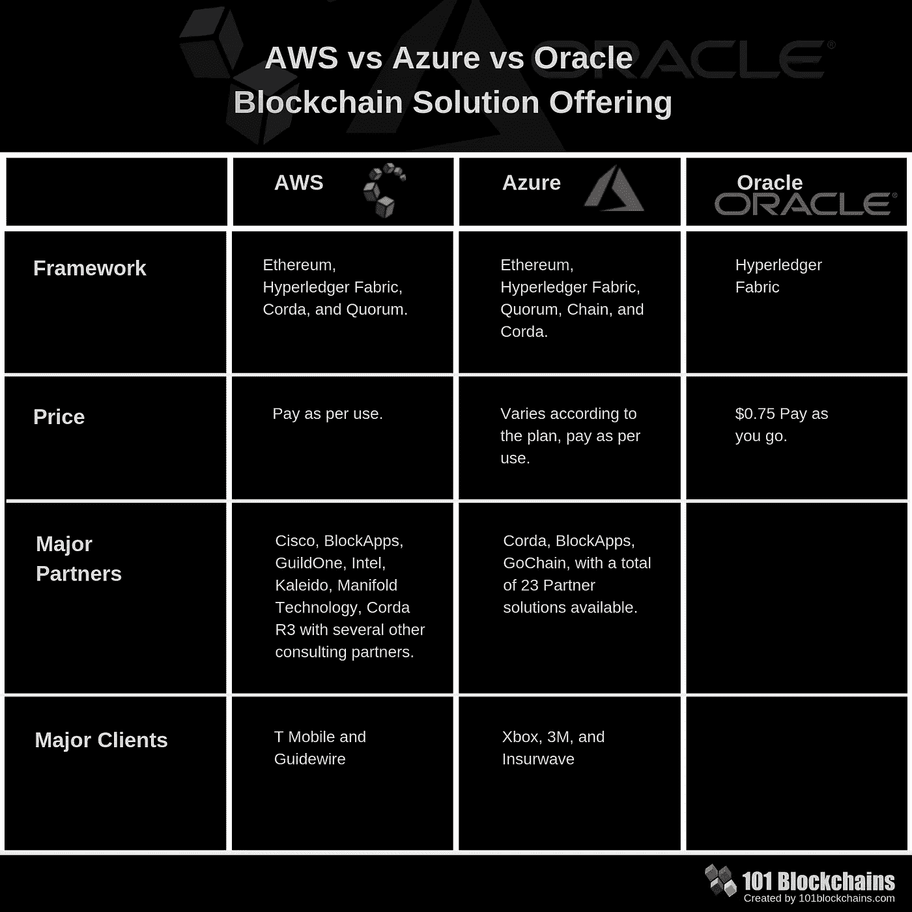
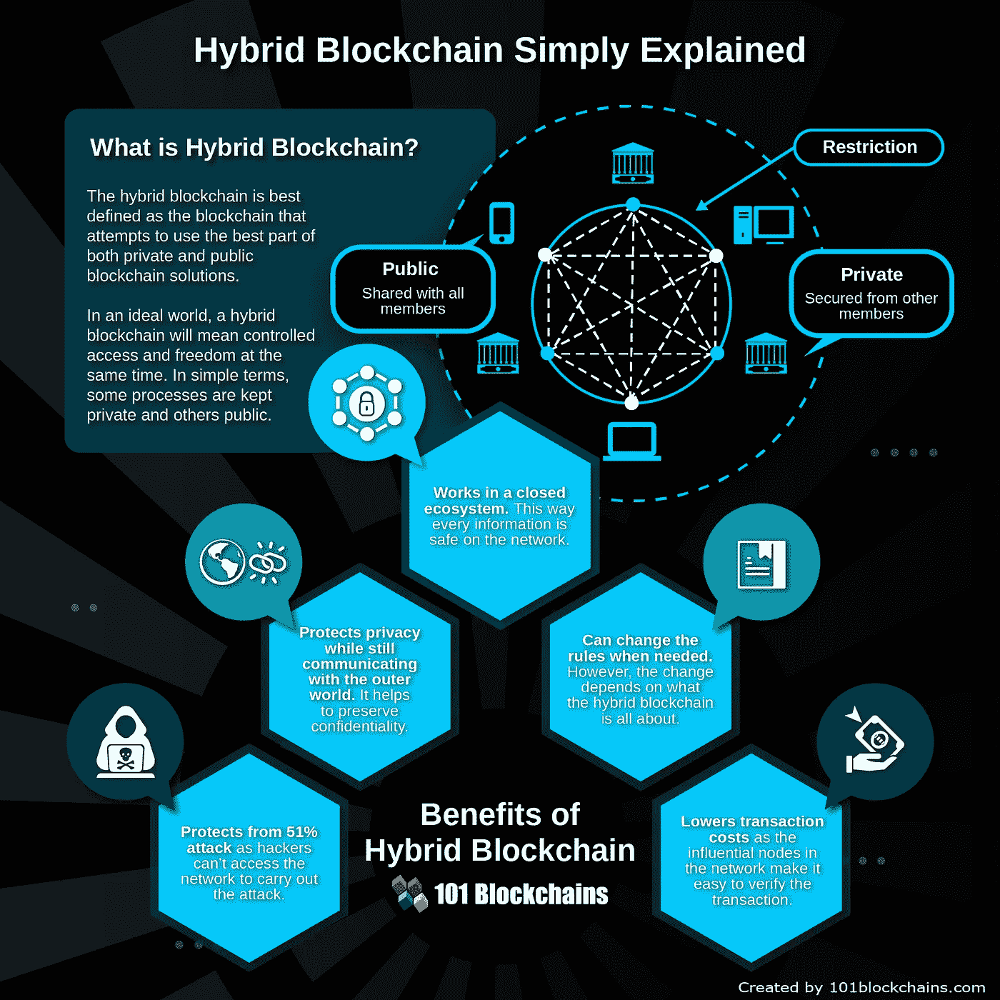
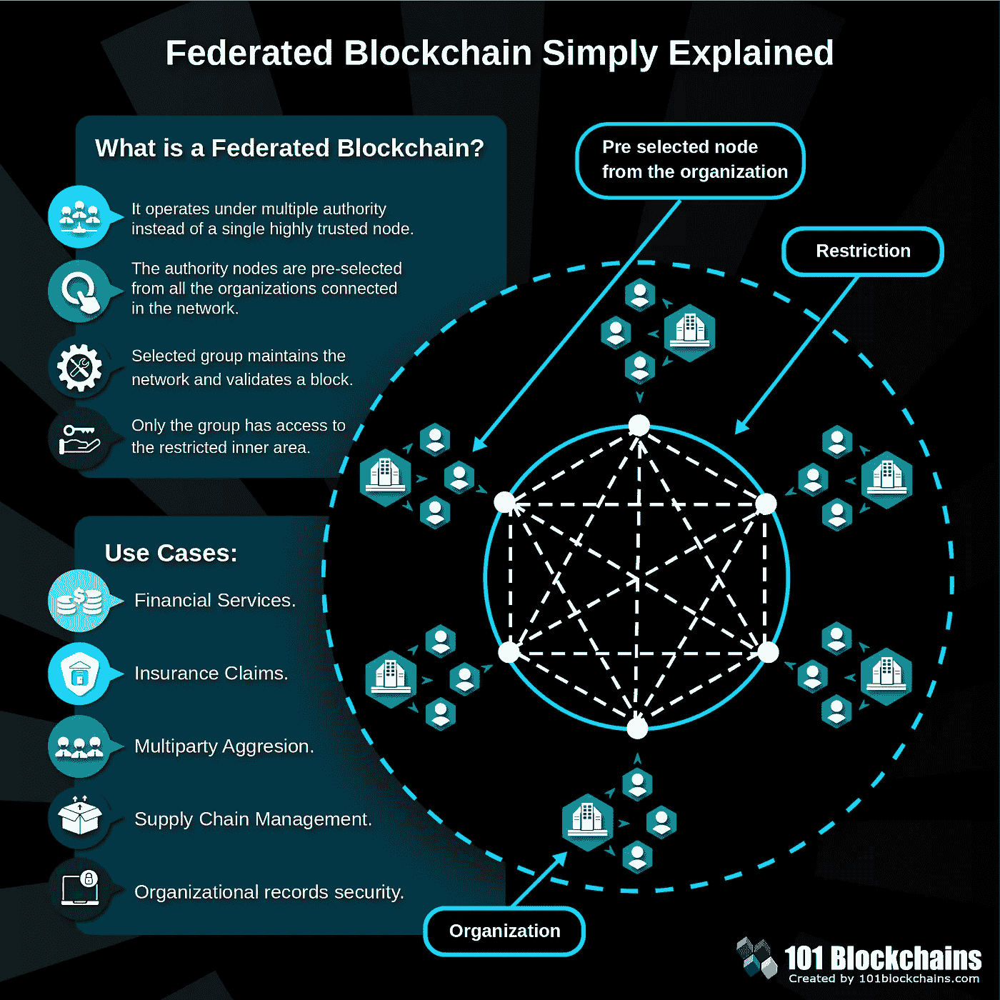
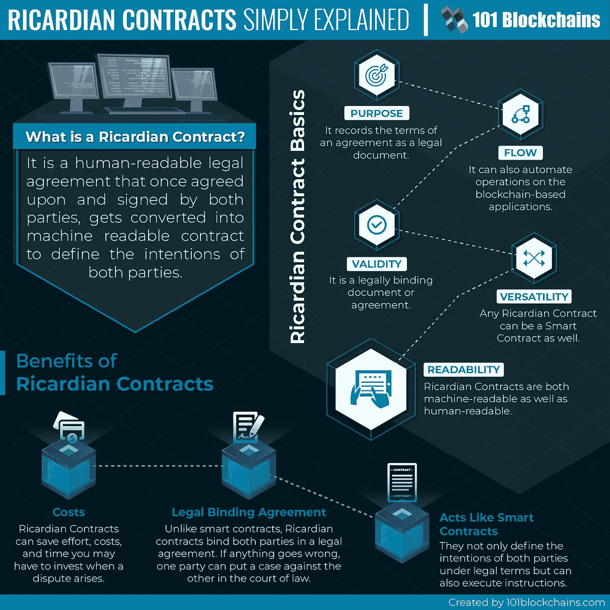
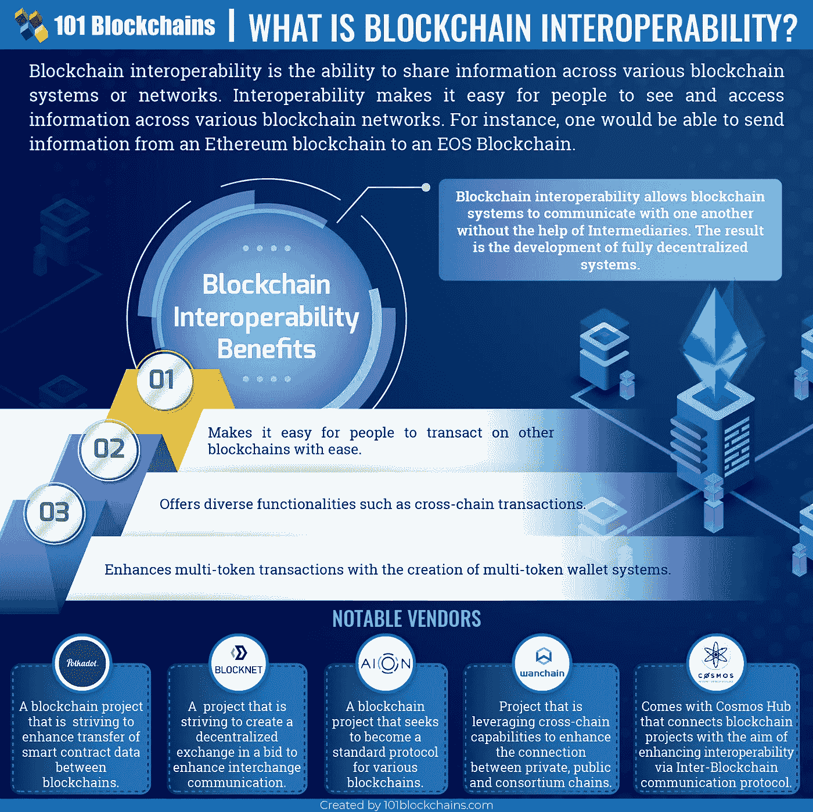
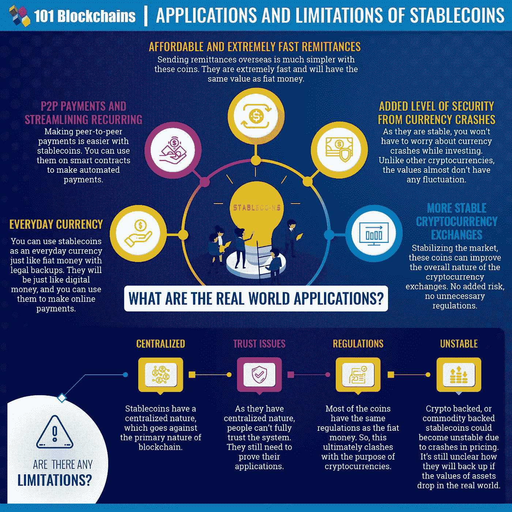
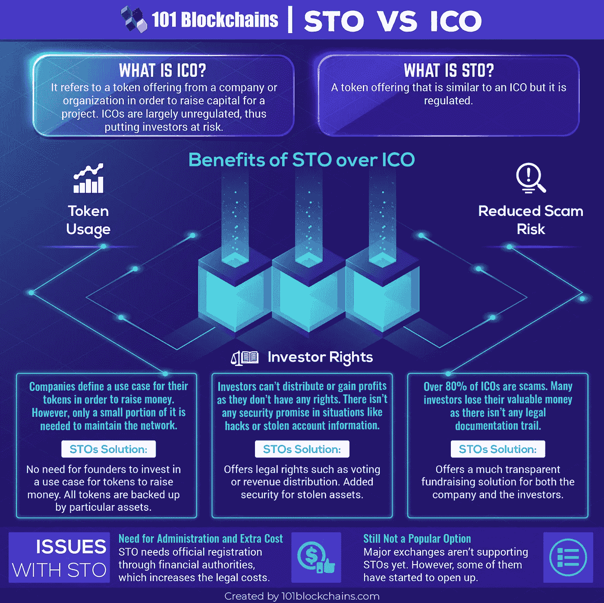
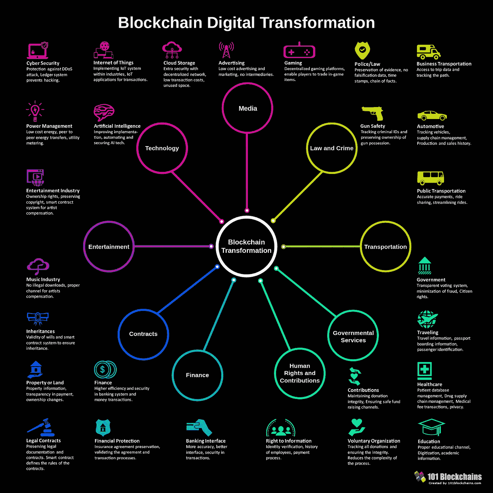

# 2019 年值得关注的 7 大区块链技术趋势

> 原文：<https://medium.com/hackernoon/top-7-blockchain-technology-trends-to-watch-in-2019-32166c3d6e56>

区块链在过去几年的发展令人惊叹。从技术角度来看，它推动了新的边界，但这并不意味着它仍处于婴儿阶段。与其他技术相比，它仍然有很多优点。

今天，我将探索 2019 年你应该注意的 7 个区块链技术趋势。这些趋势将有助于你判断在即将到来的一年里区块链会有什么样的表现。

# 2019 年值得关注的区块链趋势

# 1.区块链即服务(BaaS)

区块链无疑是 20 世纪的革命性技术之一。这是如此改变游戏规则，以至于许多创业公司和企业都在研究自己的区块链解决方案。然而，创建、维护和管理您的区块链解决方案并不总是可行的。这就是区块链即服务(BaaS)的用武之地。BaaS 是一项基于云的服务，允许客户构建自己的区块链产品，包括应用程序、智能合同，并使用其他区块链功能，而无需设置、管理或执行基于区块链的基础设施。

包括亚马逊、微软和其他公司在内的少数公司已经提供这项服务。我认为在 2019 年，[对 BaaS](https://101blockchains.com/aws-vs-azure-vs-oracle-blockchain/) 的使用将会增加。它还将使公司能够使用区块链技术，而不必担心初始投资。

[Blockchain as a Service Comparison](https://101blockchains.com/aws-vs-azure-vs-oracle-blockchain/)

# 2.混合区块链

区块链的版本很少，我认为混合动力区块链可能是 2019 年值得关注的趋势之一。混合动力的区块链是两全其美的 T4。它通过提供公共和私有区块链的最佳特性和功能来工作。例如，政府不能通过使用公共区块链来实现完全分权。然而，他们也不能在他们的一些服务中使用私人区块链，因为他们需要与人民互动。在这些情况下，混合区块链提供了一个理想的解决方案，它提供了一个可定制的解决方案，并适当利用了区块链所提供的东西，如透明性、完整性和安全性。

混合区块链的少数用例包括混合物联网、银行、供应链、企业服务等。

[Benefits of Hybrid Blockchain](https://101blockchains.com/hybrid-blockchain/)

# 3.联合区块链

[联合区块链](https://101blockchains.com/federated-blockchain/)也是普通区块链的一种进化，非常适合许多特定的用例。2019 年，我们还可以看到联邦区块链的使用增加，因为它给了私人区块链更多可定制的前景。联邦区块链类似于私人区块链，只是有一个简单的变化。许多机构可以控制区块链和预选节点，而不是由一个组织来控制。然后，选定的节点组确保该块被验证用于处理事务。

联邦区块链的一些用例包括保险索赔、金融服务、供应链管理等等。联合区块链的另一个很好的例子包括沃尔玛使用 IBM 的区块链进行食品追溯。

[Federated Blockchains](https://101blockchains.com/federated-blockchain/)

# 4.李嘉图契约

智能合约一直是自动化 dApps 的核心。然而，它们有一定的局限性，这就是李嘉图契约的用武之地。李嘉图联系人将打开合法合同的大门，该合同将被加密验证和签署。不考虑智能合约，[李嘉图合约](https://101blockchains.com/ricardian-contracts/)可以阅读，因为它使用人类可读的文本。这样，它提供了一个独特的解决方案，使人类和计算机都可以理解，而不需要任何中介或服务。

[What is a Ricardian Contract?](https://101blockchains.com/ricardian-contracts/)

# 5.区块链之间的互操作性

随着时间的推移，我们会看到新的区块链网络。这导致了提供不同速度、网络处理、用例等的新链。区块链互操作性旨在改善不同网络或区块链系统之间的信息共享。这些[跨链服务](https://101blockchains.com/blockchain-interoperability/)提高了区块链的互操作性，也使它们在日常使用中更加实用。例如，通过区块链互用性，你可以将信息从 EOS 发送到区块链以太坊。2019 年，我们将看到支持区块链互操作性的技术的改进。已经有少数厂商积极致力于使用跨链技术实现或改进区块链互操作性的目标。少数例子包括 BlockNet、Aion、WanChain 等。

[Interoperability between Blockchains](https://101blockchains.com/blockchain-interoperability/)

# 6.稳定的硬币

[稳币](https://101blockchains.com/stablecoins/)2019 年也能看到一个提升。加密货币是区块链的副产品。但是，它们是不稳定的。这就产生了稳定的硬币。不像加密货币，稳定的硬币有稳定的价格。它不受市场条件的影响，并确保始终保持稳定。你可能已经听说过系绳。这是一枚稳定的硬币。稳定币大部分是法币支持的，但还有另外一类稳定币是商品支持的，加密货币或者属于无抵押的。然而，稳定的硬币并非没有缺点。稳定的硬币运行在集中的系统和规则上。由于它们是中央集权的，投资者对它们也有信任问题。

[Applications of Stablecoins](https://101blockchains.com/stablecoins/)

# 7.安全令牌

ico 是 2017-2018 年的热门话题。但是，这是一种不受监管的从市场上抽走资金的方式。几乎 48%的 ico 都是骗局，导致投资者失去信任。满足，[安全令牌](https://101blockchains.com/security-tokens/)。这些令牌通过安全令牌产品提供，并受到监管。它保护了投资者的权利，并重新定义了公司或初创企业融资的整个过程。2017 年 ICO 的市场统计数据也显示，每个 ICO 平均筹集了 1270 万美元。总体而言，我们肯定会在 2019 年看到从 ICO 到 STO 的转变。

[STO vs ICO](https://101blockchains.com/sto-vs-ico-the-difference/)

# 结论

谈到区块链，2019 年可能会带来突破性的想法。区块链对不同垂直行业的影响没有被忽视，这就是为什么我们更看好它在 2019 年的增长。

[Blockchain Digital Transformation](https://101blockchains.com/blockchain-digital-transformation/)

那么，你觉得我在这里分享的区块链趋势怎么样？请在下面评论并告诉我们。我在听。

**免责声明:本文不应被视为，也无意提供任何投资建议。本文中的主张不构成投资建议，也不应被视为投资建议。自己做研究！*