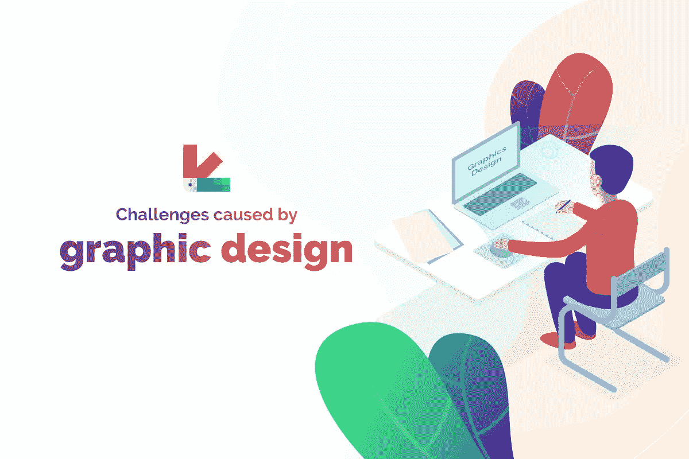

# 平面设计领域的 7 大挑战——设计师们，请注意！

> 原文：<https://medium.com/hackernoon/top-7-challenges-caused-by-graphic-design-field-designers-be-aware-f77320eb35b3>

一张图胜过千言万语——这句格言最适合平面设计。平面设计是一个通过图片、图形、插图和印刷字体与目标受众交流的过程。你可以在报纸、杂志和其他各种平台上找到平面设计在标志、品牌、设计中的普遍应用。此外，网站设计很大程度上受到图形设计的影响。这就是为什么像 [Intlum](https://www.intlum.com/) 这样的领先网站设计公司认为平面设计是网站成功的主要因素之一。

# 谁是图形设计师？

平面设计师是负责混合文本、图片、符号和设计来传达想法和信息的个人。所有这三种工具——印刷术、视觉艺术技巧和布局技巧——被结合起来，创造出对网站有影响的视觉作品。因此，平面设计师是任何公司品牌团队的重要成员。然而，平面设计经常会带来一些挑战，这使得业余和专业设计师的工作更加艰难。让我们快速看一下平面设计所面临的挑战。

# 图形设计带来的挑战

以下是设计师在平面设计领域面临的挑战。你需要找到摆脱这些挑战的最佳方式。除非你要陷入永无止境的麻烦。

# 生产过剩

由于大量围绕信息设计领域的内容定期在网上发布。令人不安的是，许多内容相互矛盾。虽然一些文献声称信息设计是最新的发明，但也有人说它来自古老的文明。这种生产过剩和信息对比的特点，在想要获取相关信息的业余爱好者和有经验的设计师中引起了混乱。

# 误解

无数错误的和误导的想法将会被制造出来，除非并且直到真正的信息在图形设计或通信设计发展上是可利用的。这种误解必将使平面设计领域的进步停滞不前。阐述上的差异将导致完全的误解和误会，这将永远无法纠正。除非有适当的清晰度，平面设计将继续提供挑战。

# 低估

公众对信息设计或平面设计领域的看法受到了打击。由于主题缺乏适当制作的正确信息，该领域正在走向一个更加停滞不前的局面。只有在真实信息可用的情况下，像数据显示和网站架构这样的概念才能以可信得多的方式得到解释。由于缺乏创作新文学的参考文本，这一领域的知识被低估了。

# 分裂

是的，来自设计领域的专业人士确实被国际信息设计协会和技术交流协会这样的受欢迎的知名组织所吸引。尽管如此，信息设计、图形设计和交流设计之间的界限还是很模糊。现在，所有的专业人士都受到同样的待遇。因此，这一领域的进一步课程设计受到阻碍。课程的缺失会阻碍这些领域的发展。

# 不足

这一行业存在着明显的不足。今天的专业人士根据他们各自公司提供给他们的东西来确定他们的职称。然而，熟练的信息设计师远离聚光灯！关于这一主题的进一步勘探可能会导致该领域的进一步发展，从而导致该领域熟练专家的短缺。仅仅因为这个原因，这个领域的专业人士将无法超越这个领域所带来的挑战。

# 记忆缺失

当话题围绕回到根源时，你会发现[网页设计](https://www.newsforpublic.com/website-designing/)专业人士缺乏记忆。由于在这个问题上缺乏足够的正式历史，这个领域的前辈们有时会误导业余爱好者，并利用他们的经验优势来控制他们。几乎没有人知道从哪里获得特定主题的深入知识，这是一个很大的麻烦。基本上，这个领域的每个人都是通过在这个领域实际工作来获得知识的，这给他们提供了经验和知识。在这个领域当然缺乏突出的学习课程，而且目前也没有很多教育机构教授平面设计。查看我们的另一个博客[图层点](https://layerpoint.com/alternatives-to-couch-tuner/)

# 挪用

在平面设计的世界里，肯定有一种盗用正在发生。营销信息图根据他们自己的意图，在网站分析方面散布虚假信息。这些信息图表试图在信息设计的特定主题上提取可靠的、先前虚假的信息，而不是呈现具有合法性的具体信息。这些信息图表的支持者们正在炫耀关于某个主题的“该做什么”和“不该做什么”的知识和经验，这些足以让这个领域的业余爱好者理解这个行业的整个情况。简而言之，可以说你在档案中找到的信息几乎没有一个是真实的。几乎所有的信息都是虚假的，是为了自己的利益而故意编造的。

# 结论

所以，以上 7 点是平面设计领域可能带来的挑战。为了成为一名平面设计师，并在这个领域发展你的职业生涯，以上是你应该从之前就知道的挑战。然而，这些挑战不应该成为你成为一名平面设计师的障碍。所以，你必须找到解决方案来克服这些挑战，让自己成为最有活力的平面设计师之一。但是如何征服这些障碍呢！嗯，你得从生活和实践经验中学习。不管你在做什么，你都必须自己学习，尤其是如果你从事平面设计的话。