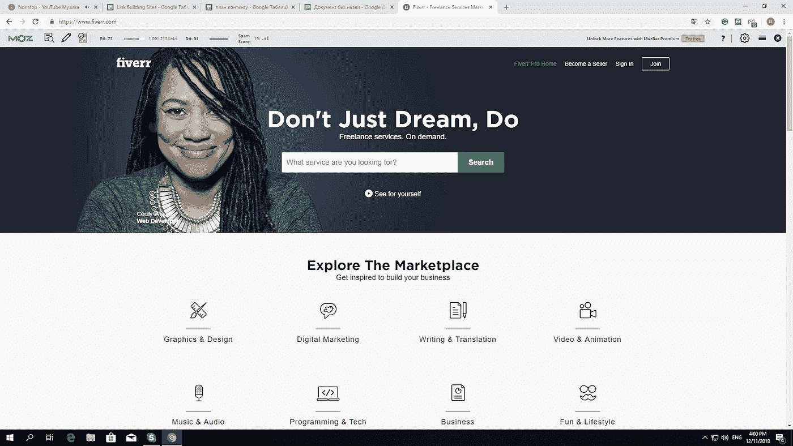
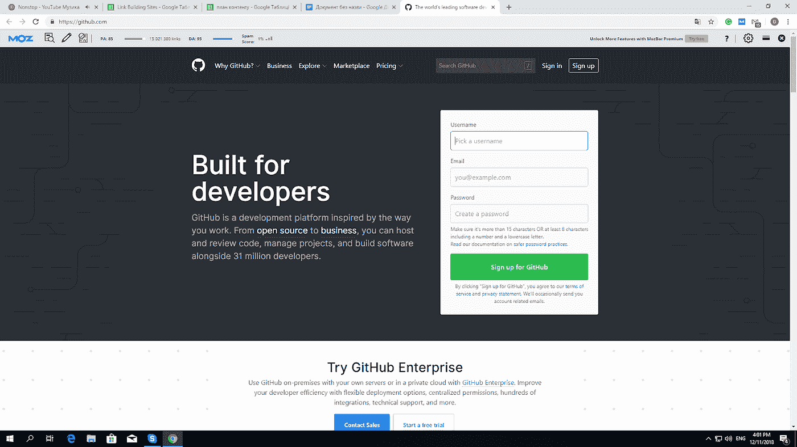
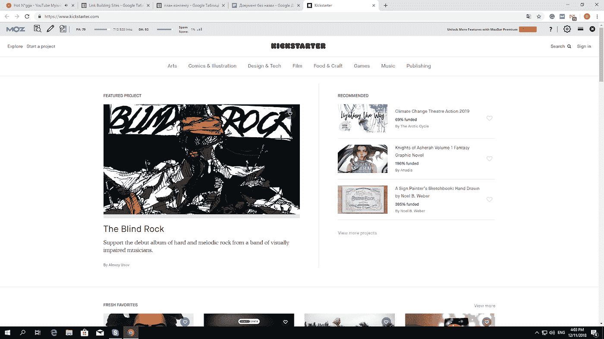
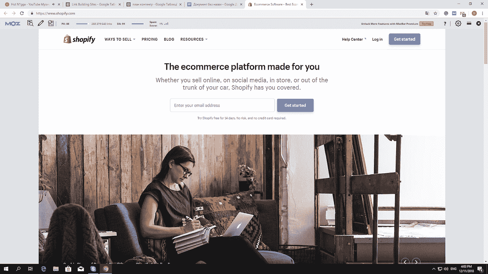
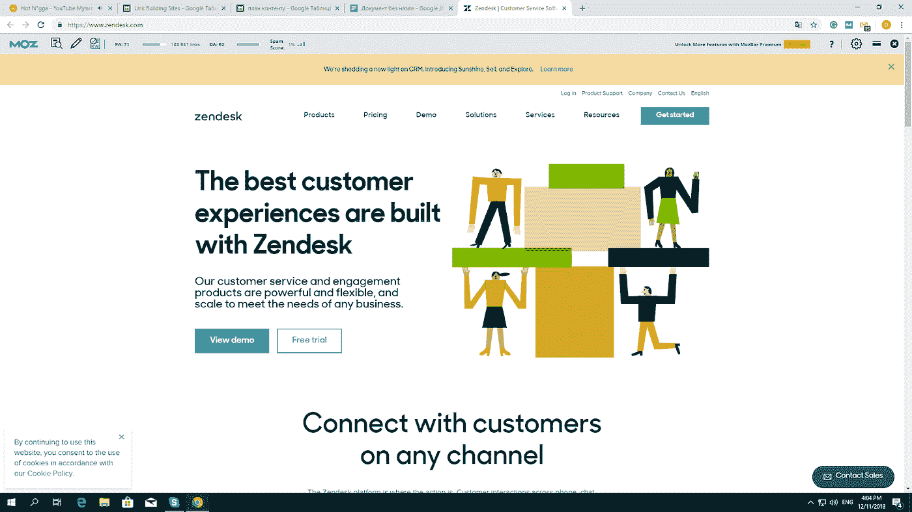
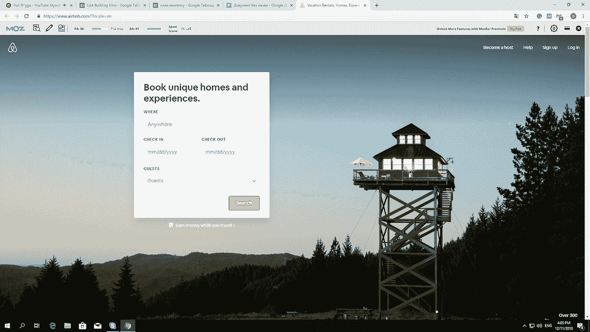
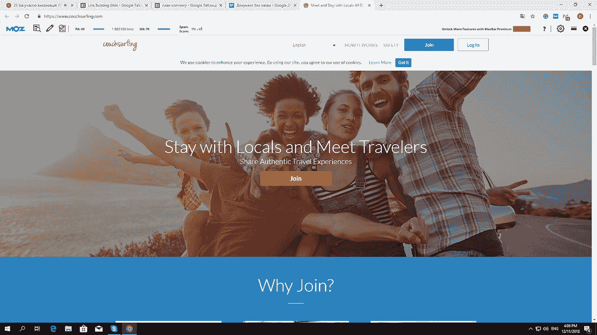

# 用 Ruby on Rails 构建的 7 大网站

> 原文：<https://medium.com/hackernoon/top-7-websites-built-with-ruby-on-rails-everyone-must-see-e5c97fe88f56>

(Photo by Carl Heyerdahl on Unsplash)

是的， [Ruby](https://hackernoon.com/tagged/ruby) on Rails (RoR)是一个真实的交易。是的，它对于建立美观实用的网站非常有用。越来越多的网页开发者和设计者意识到[这个框架的优势](https://www.toptal.com/ruby-on-rails/after-two-decades-of-programming-i-use-rails)并开始[学习](https://hackernoon.com/tagged/learning) Ruby。每天都有许多用 RoR 构建的值得注意的网络应用程序出现。你最喜欢的一些网站实际上可能正在使用 Ruby，我们将在下面展示。

我们决定收集在 Ruby on Rails 的帮助下完成的[优秀网页设计](https://conversionxl.com/blog/universal-web-design-principles/)的最佳范例。也许，他们中的一些人最终会让你相信转而使用 Ruby 是个好主意，雇佣一个优秀的 Ruby on Rails 开发团队，并使用 RoR 构建你的下一个项目。话不多说，下面是使用 Ruby 的优秀网页设计的几个例子:

*   五元
*   开源代码库
*   Kickstarter
*   购物化
*   Zendesk
*   爱彼迎（美国短租平台）
*   沙发冲浪

你惊讶吗？你不会怀疑世界上一些最流行的网站是用 Ruby 构建的吧？不仅如此，这只是使用 RoR 的顶级网站的一小部分。说到这里，让我们来详细探讨一下每一个问题。

# 五元

Fiverr 是世界上最受欢迎的演出网站之一。它有一个伟大的设计和功能。作为如此受欢迎的网络资源，网站必须完成许多复杂的任务。使用 Ruby on Rails，该网站成功地实现了所有必要的功能，并为用户提供了出色的用户体验。

# 开源代码库

[GitHub](http://github.com) 是世界第一的软件开发平台。它允许托管和管理软件项目，以方便协作和开发。显然，这是一个非常复杂的 web 应用程序。GitHub 的创建者认为 Ruby 最适合他们的想法，于是在 RoR 建立了这个网站。这个项目令人印象深刻的成功表明他们的选择是正确的。

# Kickstarter

作为世界上最受欢迎的众筹平台， [Kickstarter](https://www.kickstarter.com/) 是基于 RoR 的流行网络应用的一个很好的例子。随着每天数以千计的新众筹项目添加到网站上，数以百万计的用户有大量的数据要处理，应用程序必须完成大量的功能。与 RoR 一起构建的可靠架构为网站提供了稳定高效的运行。

# 购物化

[Shopify](https://www.shopify.com/) 是全球领先的电子商务 CMS 公司之一。它也可以被认为是目前世界上最复杂的网络应用之一。该平台托管和处理来自所有使用 Shopify 的在线商店的大量数据。这需要一个非常广泛和复杂的架构为其网络应用，RoR 成功地提供了。

# Zendesk

[Zendesk](https://www.zendesk.com/) 是全球领先的客户服务&支持软件。该公司选择用 Ruby 来建立自己的网站。它的网站可以被认为是 RoR 优秀网页设计的最佳范例之一。

# 爱彼迎（美国短租平台）

作为世界上最成功的创业公司和最受欢迎的酒店市场之一， [Airbnb](https://www.airbnb.com/) 无疑是目前世界上最漂亮的网站之一。碰巧它是用 Ruby 构建的，这再次证明了用 RoR 可以做什么。

# 沙发冲浪

就像 Airbnb 一样，其小众领域的领头羊 [Couchsurfing](https://www.couchsurfing.com/) 就是用 Ruby 打造的。该网站拥有漂亮、易用和实用的设计，可以作为任何想要使用 Ruby on Rails 构建漂亮网站的人的灵感来源。

# 结论

只要有足够的技巧和创造力，任何人都可以用 Ruby on Rails 构建一个漂亮的 web 应用程序。一些世界上最漂亮、最受欢迎的网站就是用它建立的。我们提供的最出色的例子证明了 Ruby 是构建伟大而美观的网站的绝佳选择。