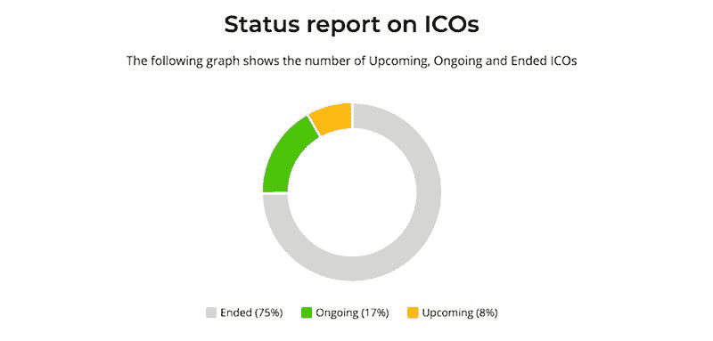
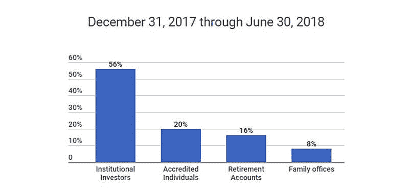

# 75 家以上的 ICO 营销机构

> 原文：<https://medium.com/hackernoon/top-75-ico-marketing-agencies-ecbebd9aac10>

**UPD 2019:这里是新的** [**2019 IEO 营销指南**](https://hackernoon.com/ieo-marketing-guide-optimal-strategies-and-the-true-cost-to-launch-an-ieo-in-2019-ecda12821d9c) **。** 推出 ICO 有许多阶段，业务需求因所处阶段而异。对于这些阶段中的每一个，我们都强调了需要哪些服务，并根据他们提供的服务将我们的前 75 名列表组织成五个主要类别:

1.  全方位服务(每个阶段)
2.  预售
3.  前 ICO
4.  后 ICO
5.  希望拥有 ICO 的企业

**买家当心—** 在 2017 年的 ICO 炒作之后，该行业看到大量代理机构进入该领域—其中许多机构对与其竞争对手相同的服务收取非常高的价格。始终确保彻底调查你选择的机构。为了您的方便，我们已经提前挑选了行业中排名前 75 位的代理商。

# 全方位服务

重点是帮助一个全新的想法变成现实。此处列出的代理机构能够提供“全套服务”，这意味着他们可以在您第一次启动业务时，通过 ICO 流程，并进入后 ICO 建议阶段来帮助您。

## [1。区块链创业工作室](https://intrepid.ventures/)

*全业务 ICO 代理*

Blockchain Venture Studio 是一个由设计师、工程师和社会科学家组成的全球分布式团队，与创始人和挑战者合作，帮助他们建立区块链生态系统，以实现规模、市场领先地位和可持续发展。

## [②**。**标记链](https://markchain.io/)

*专业从事媒体、数字营销、投资和社区建设的全方位服务机构。*

Markchain 拥有一支由知名国际顾问组成的专门团队，他们每个人在投资、营销、技术知识、编辑知识以及许多其他技能方面都有自己的专长。Markchain 从零开始开发定制的营销策略，或为已经知道他们想要什么的项目提供沟通支持指令，具有最佳的质量/价格比。最近，Markchain 的首席执行官接受了采访，讲述了他在熊市中的成功，而[被福布斯](https://www.forbes.com/sites/geraldfenech/2019/01/24/interview-achieving-success-in-blockchain-consulting-during-a-bear-market/#4f899a245f14)形容为“法国最好的密码顾问”

## [**3。**众筹](https://crowdcoinage.com/)

*白标 ICO 平台托管，KYC/反洗钱*

最安全和自动化的 ICO 平台之一。这是一个用于令牌销售的白标平台，设置只需几天时间。

## 4 HowToToken

*内容创作、白皮书开发、智能合同开发、品牌策划、公关*

推出成功 ICO 的全方位服务机构—在专为 ICO 管理而构建的平台上提供透明、公平的价格，拥有精通 ICO 每个阶段的专家，因此您可以通过一个窗口只与最好的人合作。

## [**5。**沙拉实验室](http://sale-and-ads.com/)

*全方位服务 ICO/IEO/STO 代理、业务拓展、销售管理。*

沙拉实验室。(销售和广告)是一个全方位的业务发展机构，为 ICO/IEO/STO 提供所有服务。沙拉解决方案的主要重点是面向广大受众的业务开发和销售管理。代理机构在世界各地工作，他们的经验让他们可以在任何阶段参与项目。

## [**6。flexe**](http://flexe.io/)

*社区管理和创建、公共关系和出版物、ICO 列表、空投管理、翻译、登录页面设计和创建*

Flexe 是一家全栈 ICO 营销机构，可以做从 ICO 列表到空投管理、运行电报频道等一切事情。

## [7**7。Forklog 咨询**](https://forklog.consulting/)

*ICO 营销、公关、咨询、品牌策划、市场分析、SEO*

Forklog Consulting 开发定制媒体，创建品牌内容，并为区块链、人工智能、金融科技、航空航天或其他领域的科技公司提供咨询服务。

## [**8。IBC 集团**](https://ibcgroup.io/)

*ICO 发布、区块链解决方案、资金和财务咨询*

IBC 是一家国际区块链咨询集团，覆盖 40 个国家，促进端到端的 ICO 支持，企业区块链发展，资本筹集，咨询和机构培训。

## [**9。ICOBox**](https://icobox.io/)

*全业务 ICO 代理*

ICOBox 是第一个也是最大的新一代区块链增长促进者和业务促进者，为寻求通过 ICO 众筹销售产品的公司提供服务。

## [10**。无限块技术**](https://infiniteblocktech.com/)

*全业务 ICO 代理，全业务区块链创作代理*

Infinite Block Tech 旨在通过大量应用程序(如分散令牌、智能合同、智能钱包、hyperledger 等)实现流程自动化并节省运营成本。

## [**11。奥尔尚斯基&伙伴**](https://olshansky.org/)

*全业务 ICO 代理*

“Olshansky & Partners”是俄罗斯和乌克兰在线营销和开发市场上的领先公司之一。该公司成立于 2011 年，目前在基辅拥有 120 多名员工。

## [**12。战略币**](https://strategiccoin.com/)

*区块链合并、技术开发、代币审查、代币经济学、白皮书创作*

战略硬币是一个总理公用事业令牌研究和区块链咨询公司。Strategic Coin 团队成员都是经验丰富、成就卓越的专业人士，在各种业务和行业中拥有良好的业绩记录和长期的成功经验。

## [**13。token suite LLC**](http://tokensuite.io/)

*发展、营销、交易所上市、投资者关系、咨询和合作*

TokenSuite 是一家包罗万象、基于绩效的全球数字营销机构，主要专注于区块链的初创公司和项目。

# 预售

吸引早期投资者是关键，这个类别的特点是有合适的关系来帮助你的公司迈出第一步的机构。这一类别提供的服务包括:投资者关系、咨询服务和伙伴关系咨询。

## [14**。申请**](https://applicature.com/)

*ICO 管理、Tokensale、区块链顾问*

Applicature 致力于开发智能联系人的区块链行业项目；区块链解决方案的研究、部署和定制；向区块链公司提供技术咨询；代币销售/初始硬币发行的技术咨询。

## [**15。区块链谷创投**](http://bvventures.ch/)

*全方位服务 ICO 代理、投资者管理*

区块链谷风险投资(BVV)是一家新的加速器和风险投资公司，孵化、发展和投资区块链支持的企业。

## [**16。座双子座**](https://www.blockgemini.com/)

*ICO 咨询、智能合同服务*

Block Gemini 的目标是帮助全球企业创造分散化的经济，让它们能够以难以想象的方式与客户互动。他们已经在 IT 领域工作了超过 25 年。

## [**17。加拿大区块链集团**](https://canadablockchaingroup.com/)

*ICO 开发、投资管理、资金咨询*

加拿大区块链集团是一家加拿大公司集团，专注于区块链技术在全球的开发、进步和大规模采用。他们培养创新思维、创新和突破性发明。

## [**18。chaineum**](https://www.chaineum.com)

*战略和财务咨询，象征经济学*

Chaineum Capital Partners 专注于分散经济和区块链技术，提供战略和金融建议，并与企业、投资者、家族理财室、金融赞助商、银行和政府合作。

## [**19。硬币点**](https://www.coinpoint.net/)

*营销、影响者营销、加密和区块链咨询、内容创作*

CoinPoint 提供尖端的服务和解决方案，帮助小型企业和跨国公司。

## [20**。**元素组](https://elementgroup.com/)

*ICO 咨询、要素交易、令牌化平台、资产管理、市场研究*

Element Group 是您的全球战略合作伙伴，致力于用加密经济学、数字资产和专有技术解决方案改造传统金融。

## [**21。ico crow**](https://icocrow.com/)

*交钥匙服务、策划合作、加速 ICO 上市、营销*

在 ICOcrow，ICO 的成功是团队的使命。该机构投资于高效的员工和强大的合作伙伴关系，以便为消费者提供对各方都有利的服务。

## [22**。进站口**](https://inboundjunction.com/)

*声誉管理、链接建设、博客管理、公关、内容放大、SEO、品牌引导*

Inbound Junction 创始团队来自互联网营销的早期。他们在 2006 年首次进入互联网营销领域，专注于内容营销、搜索引擎优化和联盟营销。现在，他们将这些知识和专业技能应用到客户的活动中。

## [**23。MLG 区块链**](https://mlgblockchain.com)

*全套营销、公关、社区和活动管理、投资者关系/私人销售、智能合同开发、产品设计*

MLG 区块链是一家全球性的区块链咨询和开发公司，专注于通过创造网络效应和为使用区块链和智能合约技术的下一代应用程序筹集资金来改变世界。

## [**24。纳尔瓦尔**](https://www.narwal-pr.com/)

*营销、投资者路演/活动、媒体影响者、社区管理*

Narwal 是一家全方位服务的公共关系机构，位于瑞士“加密谷”的中心，专注于区块链和金融科技项目。

## [**25。萨迪斯集团**](https://satisgroup.io/)

*代币和发行结构化、法律咨询、代币/智能合同管理、投资者外联*

Satis Group 致力于为创始团队、公司和基金提供最佳建议，帮助他们在应对日益复杂的法律和税收障碍的同时，优化 ICO 的执行。

# 前 ICO

在你考虑投资 ICO 之前，你需要做好所有的准备。这一类别的代理可以帮助制定法律法规，建立社区，并策划完美的品牌形象。此类别的专业服务包括营销、ICO 支持、社区管理和 web 开发。

## [26**。7Marketz**](https://7marketz.com/)

*ICO 营销、SEO、媒体购买、市场咨询*

7Marketz 团队从事多个项目，每天都在扩展他们的产品线，从技术解决方案到人工智能和机器学习。这使他们能够为您提供端到端的解决方案，涵盖客户旅程的每一步。

## [**27。**典故](http://allusion.io/)

*网络开发、公关、社区管理、ICO 营销*

ind 典是一家 tokensale 广告代理公司，它自动化了所有基本的营销流程，使您能够专注于您的项目，而不是被占用宝贵时间的日常事务分散注意力。

## [28**。AZ 区块链**](http://azblockchain.co/)

*定制区块链技术创作，区块链营销*

AZ Blockchain 是一家区块链精品营销公司，致力于与那些关心推出重要产品的人建立长期合作伙伴关系。

## [**29。bloq chain Science**](https://thebloqchain.com/)

*智能合约安全审计、区块链安全、GDPR 评估*

Bloqchain Science 通过使用位于区块链的 DLT、身份解决方案、自定义令牌和智能合同，在您的企业内构建安全的分散式系统。

## [**30。Ceta 网**](https://ceta.network/)

*ICO 咨询、国际公关、社区管理、付费广告、区块链解决方案*

Ceta 网络的使命是通过提供具有可见性和资本资助的基础良好的项目来促进这种发展。Ceta 网络将合作伙伴的区块链技术和加密数字资产推向国际舞台。

## [**31。CryptoDex**](https://www.cryptodex.io/)

*社区建设，代币投放咨询*

Cryptodex 建立在这样一个原则上，即区块链技术不仅正在改变我们经济和银行系统的基本结构，而且正在改变我们作为人类联系和参与的方式。随着我们进一步进入一个充分利用区块链技术的世界，创建可持续独立社区的新机会出现了。

## [32**。cube 29**](https://www.cube29.com/)

*公关、媒体关系、社区管理、数字营销、影响者外联、演讲机会*

CUBE29 是由加密货币爱好者创建的，他们碰巧也是营销和公关专业人士。伴随着糟糕的公关活动和低质量的新闻稿，他们被围绕 ico 的所有炒作所淹没。这就是为什么他们的使命是为 ICO 发布带来更成熟的技术领域所享有的同样彻底和负责任的宣传活动。

## [**33。狐尾营销**](https://foxtailmarketing.com/)

*SEO、SaaS、内容营销、ICO 营销、集客营销、销售漏斗优化* Foxtail Marketing 是由厌倦了旧的在线营销方式的在线营销老手创立的。看到坏习惯变得司空见惯，创始人知道客户应该得到更好的产品。

## [**34。ICO 多头**](https://icobulls.io/)

*白皮书、令牌组学、智能合同、网站、视频、赏金计划*

ICO Bulls 通过久经考验的交钥匙解决方案为您的 ICO 提供可衡量的结果。

## [**35。ICO 发射**马尔他](https://icomalta.com/)

*ICO 平台创建、标记、法律援助、银行、监管咨询*

ICO Launch Malta 位于马耳他，是欧盟和欧元区的正式成员，拥有优惠的税收和区块链特定的监管制度。他们的重点主要是提供与推出 ico 和安全令牌产品相关的技术服务。

## [**36。行话公关**](https://jargonpr.com/wp/)

*媒体关系、分析师关系、活动支持、产品评论、影响者营销、白皮书创作*

行话公关成立于 2009 年，该机构还在继续发展。今天，他们通过强大的 B2B 媒体关系活动来支持高增长和雄心勃勃的企业。

## [**37。关键差异媒体**](https://keydifferencemedia.com/)

*ICO 建议、内容营销、公关、影响者营销、媒体购买、转化优化*

关键差异媒体只关注 ICO 营销的关键阶段。他们在你和投资者之间架起了一座桥梁，为你提供了引入致力于你事业的潜在客户的工具。

## [**38。市场我好**](https://marketmegood.com/ico-marketing-agency/)

*营销、社区建设/管理、奖金活动、ICO 前战略*

Market Me Good 是一家经验丰富的 ICO 营销机构，它将客户放在第一位，以卓越的想法为先导，并密切合作，以了解和找到您的 ICO 的最佳营销解决方案。

## [**39。**跨市场](https://marketacross.com/)

*SEO、PR、在线声誉管理、博客管理*

MarketAcross 是一家提供全方位服务的 ICO 营销机构，专注于 ICO 的整体营销策略。他们通过内容营销、公关、影响者外联和社交推广等各种服务来实现这一目标，以建立一个庞大而忠诚的社区。

## [40**。莫作品**](https://www.moworks.com.au/ico-marketing/)

*咨询服务、IU/UX 设计师、KYC 平台整合、社区管理、奖金计划创建、公共关系、投资者关系、广告购买、路演/活动安排*

Mo Works 随时准备帮助您实现您的潜在增长。Mo Works 成立于 2013 年，是一家总部位于墨尔本的机构，影响力遍及全球。他们在这里分享他们的知识，并启动您进入加密市场。

## [**41。优先令牌**](http://ptoken.io/)

*ICO 顾问，ICO 推广*

Priority Token 是一家在英国注册的国际 ICO 咨询和推广机构，在伦敦、新加坡、莫斯科和迪拜设有办事处。

## [**42。ROQ 密码**](https://www.roqcrypto.io/)

*区块链编程、白皮书、Web 开发*

ROQ 传媒由投资者支持，成立于 2017 年初。他们的愿景是通过为成功的 ico 和其他区块链需求提供一站式解决方案，将梦想和想法变为现实。

## [43**43。Sicos**](https://sicos.io/)

*ICO 咨询*

Sicos 在 ICO 流程的各个阶段提供战略建议。他们通过高度称职的全球法律合作伙伴协助构建 ICO 工具，并分析代币经济学。

## [44**。日理万机发展**](https://www.satedev.com/)

*区块链企业解决方案、ICO 管理服务、市场营销、区块链测试和质量保证、密码交换支持、区块链培训、区块链咨询*

赛得发展是一家全球性的区块链技术服务提供商，为 10 多个国家和地区的客户提供服务。

## [45**45。瑞士电信区块链股份公司**](https://blockchain.swisscom.com/)

*代币管理，品牌战略发展*

Swisscom 是瑞士最大的 IT 基础设施主机之一。从开发解决方案到高度安全的区块链工厂，他们为您的特定需求提供了一个良好的环境。

## [46**。托马斯·雷公司**](https://www.trc.network/)

*众筹、dApp 用户采用、销售线索生成、用户获取、电子邮件营销、社交媒体广告、SEO 营销*

TRC 旨在帮助各种各样的客户实现他们的业务目标，从融资前的促销策略到分散的应用程序用户采用活动。每个活动都是定制的，以满足客户的要求。

## [47**。token get**](https://tokenget.com)

*ICO 管理、营销、完整令牌支持*

TokenGet 是一个先进、安全的 ICO 统包平台，因此您可以专注于营销、ICO 推广或寻找投资者。他们的解决方案将为您节省管理 ICO 的巨大开销，这些开销可以更好地用于开发您的产品或在活动中推销。

## [**48。WeRaise**](https://weraise.pro/)

*ICO 营销*

WeRaise 提供全周期的区块链营销活动，为您的项目提供最大的知名度和可信度。

## [**49。泽里昂**](https://zerion.io/)

*令牌平台、全球合作伙伴、投资者认证、空投托管*

Zerion 是一家金融科技初创公司，通过开发连接伟大公司和伟大投资者的技术，为经济的符号化提供动力。

## [**50。ZMEST**](http://pr-ico.com/en/index.html)

*ICO 发布平台、ICO 管理面板、法律指导、钱包管理、ICO 咨询、市场开发、公共关系、奖金活动管理、社区管理*

ZMEST 团队做了 15 年多的营销和公关。他们多样化的客户经验包括成功的 ICO 推广。全周期营销或单一解决方案——由您决定他们的哪些服务最适合您。

# 后 ICO

你的 ICO 结束了，现在怎么办？查看此类别，从专门在您的 ICO 结束后保持公司发展势头的机构寻求帮助，这些机构提供的服务包括:内容创建、法律支持或交易所上市。

## [51**。**影响](http://www.affect.com/)

*公关、社交媒体管理、营销*

Affect 的全方位服务方法跨越了公共关系、营销和社交媒体等学科，与一些机构不同，他们在接触每一个项目时都会考虑这三个方面。然而，他们最大的财富包括他们倾听、即兴发挥和适应的能力。

## [**52。AmaZix**](https://www.amazix.com/)

*社区管理和参与*

AmaZix 是一群专业的 crypto ICO 版主，他们拥有技术专长，擅长提供支持，并由一个精英管理团队领导。他们为基于 Bancor 或以太网的加密项目提供交钥匙服务。

## [**53。ambi safe**](https://ambisafe.com/)

*营销、发行和令牌管理、令牌分发、ICO 后解决方案*

Ambisafe 提供全方位的 ICO 服务，从资产发行到 ICO 后支持。在每一次活动中，他们都帮助公司建立意识并接触潜在的贡献者。每次销售结束后，他们帮助客户与他们的支持者保持联系。

## [**54。C6 顾问**](https://c6advisors.com/)

*ICO 管理、咨询、传播、众筹*

C6 顾问公司利用内部业务专业知识，参与网络连接，并应用最佳行业实践，以便为区块链初创公司建立一个整体的托管服务生态系统。

## [**55。众筹**](https://crowdcreate.us/)

*社区管理、公共关系、加密影响者、奖金活动、品牌设计、内容创作*

一些世界上最大的科技公司选择了 Crowdcreate 来筹集更多的投资者资金，并发展他们的在线社区。Crowdcreate 由经验丰富的成长型营销专家组成，他们有案例研究可以证明这一点。

## [**56。Crynet**](https://crynet.io/)

*项目审计、营销战略、法律支持、资金池和基金、技术咨询、人力资源(猎头)*

Crynet 为 ico 和区块链驱动的企业提供广泛的支持服务，如跨国法律支持、区块链开发和技术支持、支付网关加密现金、区块链人力资源、顾问支持以及跨所有社交媒体平台的社交媒体营销、Telegram 等。

## [57**。Cryptonomos**](https://cryptonomos.com/)

*ICO 服务*

Cryptonomos 使得在一个平台上购买各种代币变得安全而容易。他们还提供 ICO 服务，帮助公司创建完美的 ICO。

## [**58。现代令牌**](https://moderntoken.com/)

*咨询、内容创建、审计、智能合同创建*

Modern Token 热衷于支持创新型公司利用区块链建设未来。他们有区块链的科学家来照顾你的产品架构，从概念和设计到技术规格和 MVP 开发。

## [**59。棕榈滩营销**](https://palmbeach.io/)

*金融科技和加密货币影响者、社交媒体和社区管理*

棕榈滩营销雇佣了一个庞大的金融科技和加密货币影响者团队，他们在社交媒体网络和论坛上有一个庞大的社区。

## [**60。搜到了**](https://searched.io/blockchain-marketing-agency/)

*全频谱区块链服务、加密货币营销、公关、ICO 后支持*

Searched 拥有使用先进的 SEO、数字营销策略和开发技能从零开始发展创业公司的经验。在 ICO 结束后，他们自然会转向区块链的初创公司和 ICO，以支持它们的推出和增长。

## [**61。ticoon**](http://ticoon.io/)

*营销和社区管理*

Ticoon 致力于创建一个有影响力和授权的营销计划，这将有助于您的 ICO 取得成功。他们分析你的市场，帮助你提高机会和影响力。

## [**62。token Asia**](https://tokenasia.com/)

*营销、咨询、投资者关系、白皮书、社区管理、智能合同、安全审计、KYC/反洗钱*

Tokenasia 的主要工作是帮助客户发起完美的众筹活动，同时关注社区、活动架构、促销活动、内容管理、技术基础设施和后 ICO 战略。

## [**63。**花拳绣腿](https://tokeny.com/)

*令牌管理，ICO 平台*

Tokeny 是一家致力于提供安全的端到端平台的公司，允许在 ICO 或 STO 期间和之后销售和管理令牌。

## [**64。有效性实验室**](https://www.validitylabs.org/)

*教育服务、ICO 服务、区块链解决方案服务*

Validity Labs 是一家总部位于瑞士的教育和培训公司，专注于智能合同。他们的目标是为瑞士及周边国家的教育活动提供选择。

## [65**。van bex**](https://vanbex.com/)

*营销、代币经济学、内容创作*

Vanbex 集团专门为区块链企业提供咨询、通信和开发服务。他们采取量身定制的方法为他们管理的每个客户塑造未来。

## [66**。X10**](http://x10.agency/)

*ICO 营销、推广/公关、社区管理、后 ICO、交流*

X10 Agency 是一家提供全方位服务的营销和公关机构，为成功的 ICO 推广提供交钥匙解决方案。它们是帮助 ico 入门、吸引观众和达到硬性上限的发射台。

# 经营业务，希望拥有一个 ICO

你目前正在经营一家公司，希望推出 ICO 来拓展市场或改进产品吗？如果你有一个基于区块链的想法，但不知道如何实现它，这些机构是你最好的选择，因为他们有技能来构建你的想法，并帮助你从头开始推出 ICO。这些机构专注于智能合同创建、ICO 管理，以及更重要的区块链咨询。

## [**67。贝尔金营销**](http://belkinmarketing.com/)

*全业务 ICO 营销、内容营销*

Belkin Marketing 由 NewsBTC 的 CMO 和 Cointelegraph 的前营销主管领导。在一群在区块链社区很有名的 A 队专家的支持下，他们像一台加满油的机器一样完美地同步运转，时刻准备着。

## [**68。比特币营销团队**](https://bitcoinmarketingteam.com/)

*营销策略咨询、加密广告、传播建议、区块链& ICO SEO*

比特币营销团队是一个营销、广告和通信专业人士的集合，总部设在爱尔兰都柏林和美国旧金山。他们拥有将 B2B 和 B2C 产品和服务推向市场的良好记录。

## [**69。比特币瑞士**](https://bitcoinsuisse.ch)

*经纪、ICO 促进/咨询*

比特币瑞士专门提供传统金融系统和银行机构之外的替代金融和非银行资产。

## [70**。硬币发射器**](https://coinlauncher.io/)

*营销、付费广告、社交媒体管理、市场洞察、社区管理、影响者洞察、交易列表*

面向硬币和代币销售的 ICO 列表，带有智能营销数据，用于为 ICO 投资者创建工具，以帮助他们通过研究和决策协助管理其首次硬币发行。

## [**71。ICO 天使**](http://www.icoangels.com/)

*资助组织、消费者洞察研究、技术咨询、ICO 营销*

ICO 天使是一家专业的咨询和营销服务机构，为区块链相关项目提供 ICO 资助。

## [**72。mazee**](https://mazee.io/)

*代币经济、社区管理、ICO 咨询、奖金管理*

Mazee 是一个端到端的 ICO 社区管理和营销服务，着眼于高质量的交付。他们的重点是与团队一起制定策略，这些团队将在您的项目中与您携手合作。他们会尽全力帮助你成功。

## [**73。官方创业公司**](http://officialstartups.com/)

*战略规划、销售、ICO 支持、投资者管理*

官方创业公司是一家提供全方位服务的战略商业咨询、品牌管理和营销机构，致力于激发企业家精神，实现商业梦想。

## [**74。火花链**](https://www.sparkchain.com)

*营销策略、TGE/ICO 支持、筹款、内容开发、媒体关系、付费媒体投放、区块链开发*

Sparkchain 对自互联网以来最具颠覆性的技术有着深入和广泛的了解，通过与第一波市场领导者合作，Sparkchain 为整个全球区块链提供战略沟通和营销支持。

## [**75。TSM 全局**](https://www.tsm.global/)

*ICO 营销、筹款*

TSM 支持他们认为正确的项目，而不一定是那些在短期内利润最高的项目。

我们将继续关注市场，并随着时间的推移不断更新这份名单。为了保持最好的资源，我们欢迎任何对我们研究的补充。如果您看到遗漏了一个您认为应该在此列表中的机构(或者如果此列表中有一个您认为不属于此处的机构)，请留下评论，以便我们在审查后实施。感谢您帮助我们保持社区信息畅通！

## 关于作者:

基里尔·希洛夫——geek forge . io 和 Howtotoken.com 的创始人。采访全球 10，000 名顶尖专家，他们揭示了通往技术奇点的道路上最大的问题。加入我的**# 10k QA challenge:**[geek forge 公式](https://formula.geekforge.io/)。