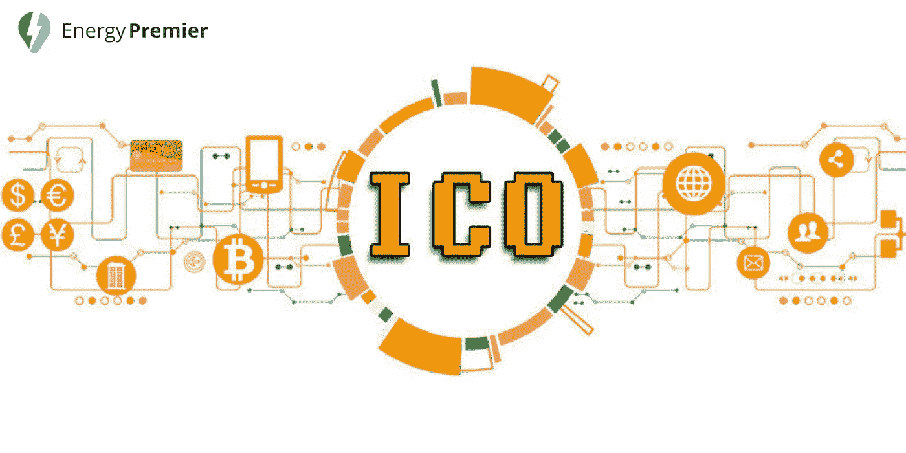

# 启动成功 ICO 的 8 大技巧

> 原文：<https://medium.com/hackernoon/top-8-tips-for-launching-a-successful-ico-15d0a4435a8>

首次公开募股(ico)已经成为初创公司通过区块链项目筹集资金的一种流行方式。据估计，去年从 ICOs 筹集的资金超过 40 亿美元！预计今年这个数字还会上升。到目前为止，已经有 30 多个 ico 获得了超过 10 亿美元的资金。我们相信这一趋势将持续下去，2018 年将成为 ico 和区块链项目更大的一年。

不可否认，ico 已经引起了许多人和公司的兴趣。可以肯定的是，由于许多成功的加密货币，如比特币或以太坊，ICO 和区块链的时代将持续很长一段时间。

**ICO(初始硬币发行)——为不同加密货币募集资金的一种不受监管的方式；公司发行加密货币的众筹销售，目的是吸引许多参与者并筹集资金。**

在过去的几个月里，每个人都在谈论 ico。你可以在许多社交媒体渠道、论坛、辩论中找到许多关于 ICO 或区块链的文章，人们也在谈论如何筹集资金并启动一个成功的 ICO 项目。**如果你期待参与 ICO 或发起一个 ICO，这里你可以找到一些实现这一目标的重要提示:**

## 准确确定你的目标

像任何其他活动或项目一样，ICO 也有自己的目标、想法和目的。如果你发起一个 ICO，你必须更多地解释你的项目及其目标。这通常通过白皮书和路线图来完成。这两份报告如果写得正确，可以吸引很多参与者。白皮书是一个文档，它详细解释了 ICO、他们想要解决的问题、他们的目标、目的、未来计划等。路线图是一份解释 ICO 活动时间表的文件，从项目开发到启动，项目的每个阶段都写在里面。

## **打造强大团队**

所有成功的 ICO 都是由专注于项目的专业人士组成的，他们拥有启动 ICO 所需的知识和经验。如果你建立了一个高素质的专业人员，对 ICO 和区块链技术感兴趣的人，致力于建立一个成功和盈利的 ICO 项目的个人，你的 ICO 将会增加。将团队成员的简历和他们的社交媒体账号放在你的网站上很重要，这样感兴趣的人可以更多地了解你的团队，从而获得对你的 ICO 更多的信心和信任。

## **准备定价方案**

你的 ICO 计划将取决于你的最终目标和期望。这个提示对你和将参与你的项目的人都非常重要。有一些准备好定价计划的基本方法:

*   **未确定的价格** —价格尚未确定，潜在参与者将因其对您的 ICO 的贡献而获得一定数量的代币。
*   **固定价格** —价格是固定的，参与者可以购买代币，但他们只能在冻结期后交易。
*   **荷兰式拍卖** —第一枚代币最贵，价格在投资期内不断下降。
*   **涨价 ICO** —参与者将为您的代币获得最优惠的价格。

## **激活所有社交媒体营销渠道**

如今，社交媒体对数字营销有着巨大的影响。在许多社交媒体渠道，如脸书、Telegram、Twitter、LinkedIn、Youtube，以及 Bitcointalk 或 Reddit 等基于加密的渠道推广和发布您的 ICO 非常重要。这种类型的推广将有助于您的项目扩展，以便更多的人可以看到和了解它。

## **撰写并发布适当的常见问题解答和帮助中心**

启动 ICO 时，有必要有一个全面的 FAQ 或帮助中心，并让任何人都可以看到。链接到你的网站，脸书，推特，电报等。因为人们总是会问同样的问题。这样你和他们更容易理解整个项目。

## **在启动之前测试您的项目**

是的，在进入 ICO 世界之前，你必须测试你的系统。你必须确保你的网站、电子邮件、白皮书、社交媒体渠道、设计等一切正常。清理所有小问题，让你的团队做好准备，能够处理所有真正的问题。

## **进行预售**

预售是在 ICO 开始之前进行的过程，它通常允许参与者购买您的代币。这种新现象对 ICO 有积极的影响，因为参与者经常获得奖金、更便宜的每张代币价格，并直接参与到你的 ICO 项目中。随着时间的推移，售前对参与者来说越来越重要，您的 ICO 最好包含一个售前阶段。

## **证明你的陈述**

如果你不能证明你的工作是通过一个有领先用户的活的和工作的产品，大多数认真的参与者不会参加你的项目。在推出 ICO 之前，学习如何展示你的目标和开发你的产品。这个技巧对于成功举办 ICO 和吸引大而认真的参与者非常有帮助。

ICO 项目和活动已经变得非常受欢迎，我们所有人都可以看到他们在过去几年中取得的成功。通过 ICO，公司能够在短时间内创造自己的产品并筹集资金。但是，成功不会在一夜之间到来，这就是为什么我们给你这些建议来准备一个好的策略，这将推动很多人和利润。

**推出成功 ICO 的一个很好的例子就是** [**能源总理**](https://medium.com/u/e338af49a57a?source=post_page-----15d0a4435a8--------------------------------) **。** Energy Premier 是一家总部位于区块链的电力交易平台，推出预售和 ICO。我们相信 Energy Premier 拥有成功 ICO 所需的一切，因为**拥有领先用户和加密专业人员团队的实时工作产品**，您可以亲自查看 [**此处**](https://tokensale.energypremier.com) :

我们还有一个**赏金计划**奖励帮助我们传播消息的人——在[**Bitcointalk**](https://bitcointalk.org/index.php?topic=3043285.0)**或 [**我们的网站**](https://tokensale.energypremier.com/bounty.pdf) 上查看**

**加入我们充满希望的 ICO，享受**能源总理**给你的所有福利！**

> **感谢您的阅读。**
> 
> **[订阅最大的电力竞价平台](https://medium.com/energy-premier-blog)随时关注我们的更新。也参与我们电报频道的讨论:[https://t.me/joinchat/Hq0j1hDxZ3eRKFNo5f7oTw](https://t.me/joinchat/Hq0j1hDxZ3eRKFNo5f7oTw)**
> 
> **在这里加入预售和众筹:[https://tokensale.energypremier.com/](https://tokensale.energypremier.com/)**

****