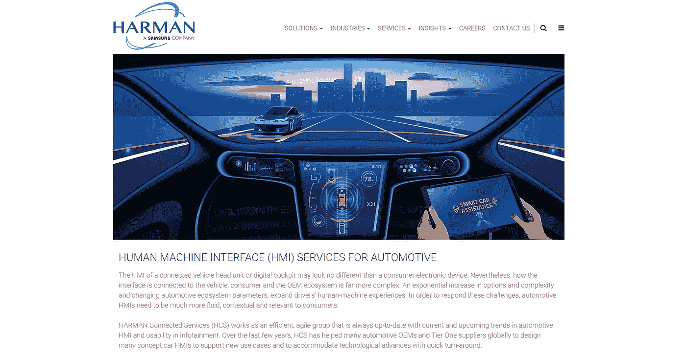
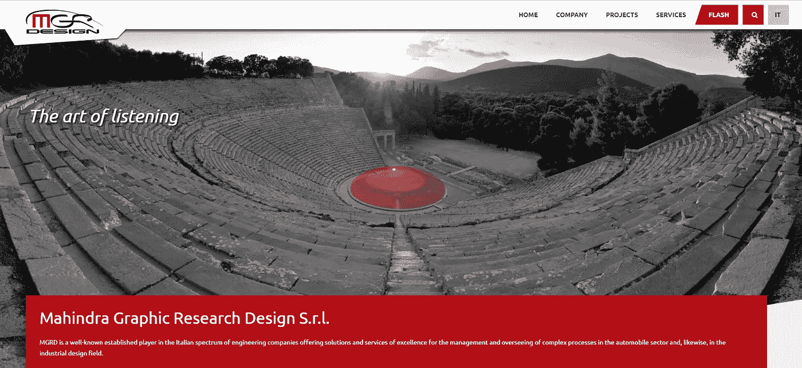
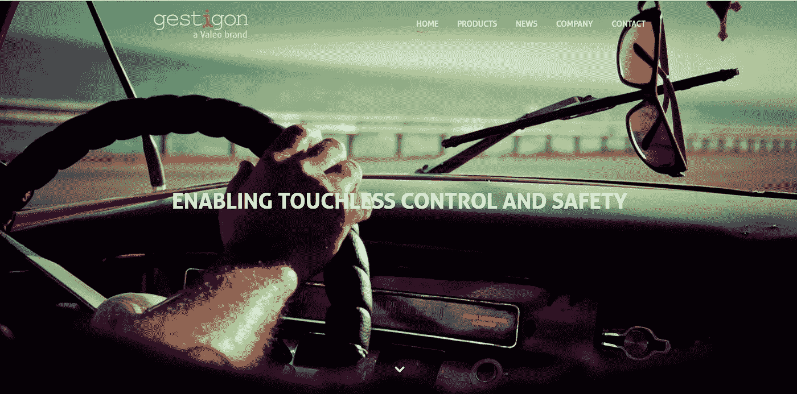
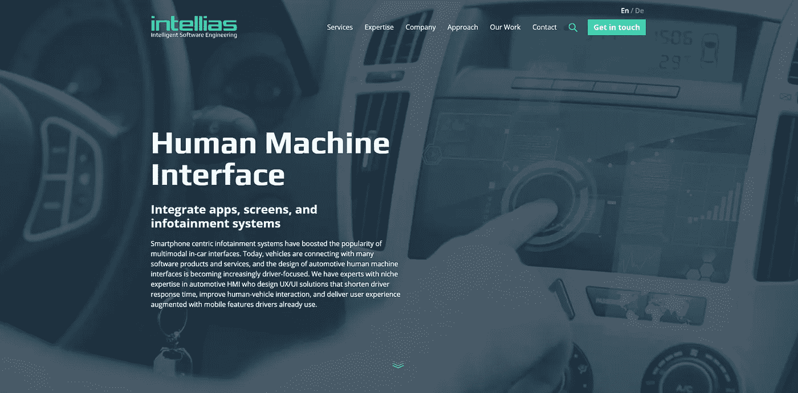
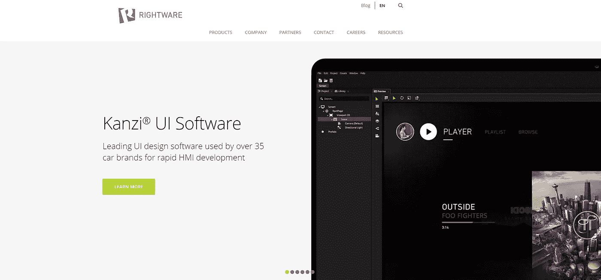
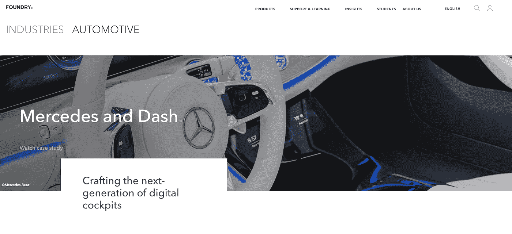
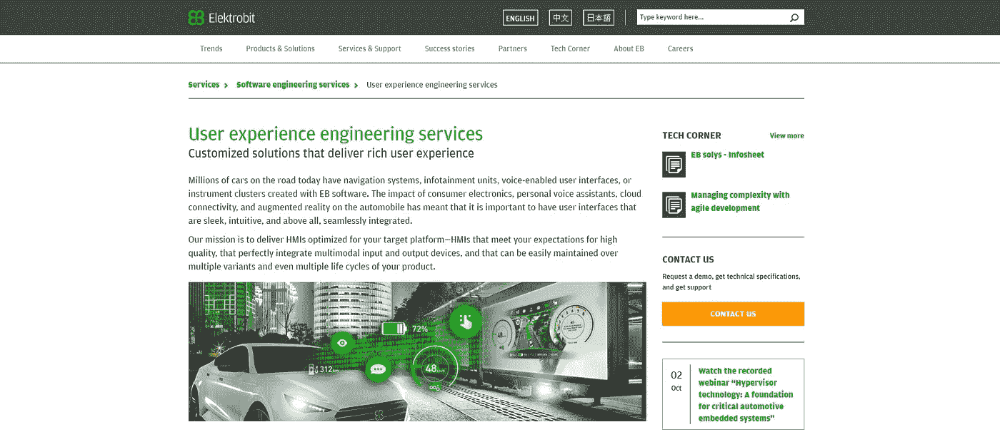
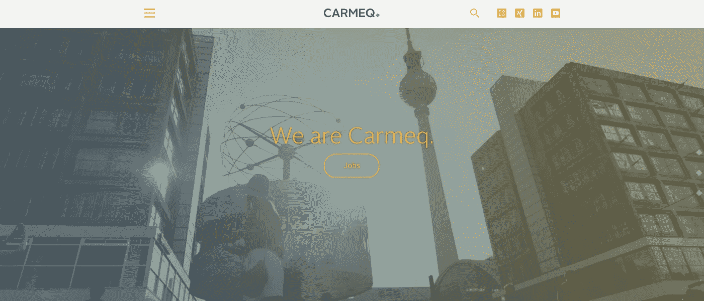
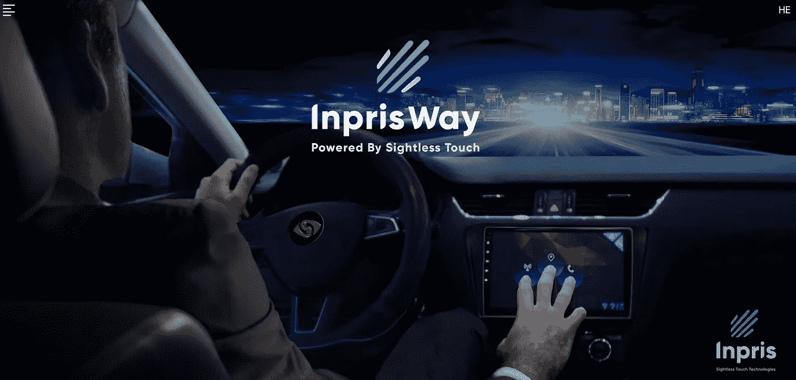

# 汽车 HMI 软件开发和设计公司前 9 名

> 原文：<https://medium.com/hackernoon/top-9-hmi-software-development-and-design-companies-for-automotive-ea27af6ef6af>

在驾驶员和无人驾驶汽车之间建立信任的需求正迫使汽车行业专注于用户体验。来自顶级人机界面设计公司的开发人员渴望让导航和信息娱乐系统对用户友好，以便它们帮助司机，而不是分散司机的注意力。

随着自动驾驶接管驾驶员的某些任务，汽车 HMI 获得了新的用途。汽车信息娱乐系统中的高级人机界面使驾驶员能够更有效地利用时间。今天，顶级 HMI 软件开发服务由 UX 和 UI 设计专家以及那些具有特定汽车专业知识的专家提供。

HMI 编程的作用越来越大，这意味着一级供应商和原始设备制造商不断在最好的 HMI 设计公司中寻找合作伙伴，以满足他们对汽车 HMI 设计和开发的需求。以下是 2018 年**汽车 HMI 软件开发公司排行榜。**

# 1.哈尔满

【harman.com 号

**地点:**美国康涅狄格州斯坦福

成立于: 1980 年

**公司规模:** 1 万人以上

作为三星的子公司，Harman 被誉为汽车行业的引领者之一，开发了顶级的联网汽车系统、视听产品、企业自动化和联网服务。哈曼的客户包括北美、欧洲和亚洲的顶级汽车制造商。该公司也是 HMI 软件开发服务的先驱供应商。

**服务和解决方案:**

*   用于汽车主机的 HMI，包括 IVI HMI、组合 HMI 和其他显示器
*   HARMAN Connected Services 与 UI 视图和数据模型的集成
*   基于原始设备制造商、一级供应商和哈曼的 UX/用户界面设计的定制 HMI 系统

**主要客户:**丰田、宝马、JBL、克莱斯勒、阿尔法·罗密欧、雷克萨斯、奔驰

# 2.经理设计

[http://www.mgrd.it/en/](http://www.mgrd.it/en/)

**地点:**都灵(意大利)

**成立于:** 1996 年

公司规模: 200+人

MGR Design 是一家被广泛认可的意大利公司，提供全方位的汽车工业设计服务。该业务将自己呈现为一个能力的统一体，为汽车创造以用户为中心的设计。该公司的核心专长是工业人机界面服务，包括信息娱乐系统的设计。MGR Design 为设计 HMI 信息娱乐系统提供全套服务。

**服务和解决方案:**

*   竞争对手造型分析和品牌形象定义
*   造型研究
*   表面铸造发展
*   初步三维全尺寸模型的铣削
*   表面开发
*   造型模型开发
*   表面发展
*   物理模型样式更新
*   表面精修和最终认证

# 3.管理

[https://www.gestigon.com/](https://www.gestigon.com/home/)

**地点:**吕贝克(德)

**成立:** 2011 年

**公司规模:** 20+人

作为法雷奥集团的一部分，Gestigon 作为以人为中心的界面开发领域最具创新性的公司之一，享有盛誉。

这家供应商在展示其内部 Cocoon 概念以满足传统和无人驾驶车辆对安全功能日益增长的需求后，获得了很多认可。Gestigon 也是全球顶级消费电子产品生产商的合作伙伴。

**服务和解决方案:**

*   基于 3D 深度数据的骨骼跟踪和手势控制的定制软件解决方案
*   通过语音和手势控制增强的无触摸界面和信息娱乐系统
*   集成车辆内部安全系统的定制解决方案

# 4.Intellias

[https://www.intellias.com/](https://www.intellias.com/human-machine-interface/?utm_source=medium.com&utm_medium=referral&utm_campaign=CM&utm_content=hmi%20companies)

**地点:**利沃夫、基辅、奥德萨(乌克兰)；柏林(德国)

**成立于:** 2002 年

公司规模: 1300 人

Intellias 是乌克兰最好的外包公司之一，专门提供 HMI 软件开发服务。该公司在汽车 HMI 设计和开发方面拥有出色的产品组合，并根据 Top Gear 的大型道路测试创建了“显著无压力的导航软件”。Intellias 提供设计 UX/UI 解决方案的汽车 HMI 专家，这些解决方案可以缩短驾驶员响应时间，改善人机交互，并提供驾驶员已经使用的移动功能增强的用户体验。去年，Intellias 被 Inc. 5000 评为欧洲最有前途、发展最快的私营公司之一。这家软件开发公司还入选了全球外包 100 强。

**服务和解决方案:**

*   将司机、车辆和基于互联网的服务结合在一起的信息娱乐软件
*   后座娱乐系统软件，包括导航、音频、视频和车内互联网
*   增强驾驶体验的平视显示器的应用设计
*   适用于组合仪表的导航软件
*   集成移动和网络导航系统的应用程序
*   基于云的语音识别服务
*   深入研究人机界面的最佳观感，将出色的设计与可用性结合起来

**主要客户:**西门子、罗氏、阿尔法利、微软、Playbuzz、诺基亚、RTL 集团、EveryMatrix、起亚

# 5.RightWare

https://www.rightware.com/

**地点:**赫尔辛基(芬兰)

**成立日期:** 2009 年

公司规模: 100+人

Rightware 为 HMI 软件开发服务提供工具。该公司的 Kanzi UI 设计产品系列包括一个令设计师满意的视觉设计工作室，一个高度优化的 3D 运行时间，以实现卓越的图形性能，以及一个创新的连接平台。该公司提供的汽车 HMI 设计和开发服务专注于增强设计人员的能力、优先考虑易用性、提高工作流程效率、实现快速原型制作、提供顶级性能以及提供跨平台支持。

**服务和解决方案:**

*   定制 HMI 开发
*   UI 创建
*   UI 逻辑
*   渲染和可视化
*   集成和部署
*   HMI 系统的本地化和国际化

**主要客户:**奥迪、Karma Automotive、Skyships Automotive Ltd、日产

# 6.铸造

[https://www.foundry.com/](https://www.foundry.com/industries/automotive)

**地点:**伦敦(英国)

**成立于:** 1996 年

公司规模: 450+人

Foundry 是提供视觉效果软件开发服务的全球领导者。他们长期从事计算机图形设计业务，最近在市场营销、广告、媒体、娱乐和游戏开发等一系列行业建立了高端视觉效果的声誉。随着半自动和全自动汽车技术的快速发展，铸造设计师也参与了高级 HMI 系统的开发。

**服务和解决方案:**

*   HMI 面板 UI 设计
*   信息娱乐系统编程和设计
*   使用 Dash 和 Modo 工具集定制 HMI 可视化渲染

**重要客户:**奔驰、谷歌

# 7.伊莱比特

[https://www.elektrobit.com/](https://www.elektrobit.com/services/software-engineering/hmi/)

地点:埃尔兰根(德国)

**成立于:** 1985 年

公司规模: 2300+人

伊莱比特是一家顶尖的软件提供商，在汽车行业的第一线已经有 30 多年的历史。该公司的软件为全球 9000 多万辆汽车中的 10 亿多台设备提供支持。作为大陆集团的子公司，伊莱比特提供广泛的标准软件产品以及支持车载软件开发整个生命周期的专业工具。复杂的 SCADA 和 HMI 软件开发服务是该公司的核心竞争力之一。

**服务和解决方案:**

*   就开发过程和**软件**架构的 HMI 特定方面提供个人咨询
*   移植 EB GUIDE 图形目标框架和语音目标框架解决方案或构建高效可用性测试设置的小型团队
*   大型团队开发涵盖图形、语音和增强现实的完整用户界面
*   经验丰富的团队开发最先进的语音用户界面，集成个人语音助理，并在嵌入式和基于云的界面之间无缝切换
*   符合 ASIL 和 SPICE 标准的开发流程

**主要客户:**福特、大众、奥迪、戴姆勒、德尔福

# 8.卡尔梅克

[http://www.carmeq.com/en/index.html](http://www.carmeq.com/en/index.html)

**地点:**柏林(德国)

**成立于:** 2002 年

公司规模: 500 人以上

在过去的十年里，Carmeq 巩固了其作为欧洲最有前途的汽车软件供应商之一的形象。该公司的使命是为创新的车辆功能提供高质量的软件，包括自有产品和为满足客户特定要求而设计的定制解决方案。Carmeq 开发商和设计师在汽车 HMI 市场拥有丰富的产品组合。

**服务和解决方案:**

*   AUTOSAR 文档标准化
*   基于数据的车辆功能
*   安全管理
*   虚拟验证测试
*   高效模块化系统开发
*   ADAS 工程与设计

**大客户:**大众汽车

# 9.因皮斯韦

[http://www.inpris.co/en/](http://www.inpris.co/en/)

地点:耶路撒冷(以色列)

**成立日期:** 2011 年

Inpris 成立于 2011 年，目标是开发一个虚拟 HMI 面板，让用户无论在哪里都可以有效地导航。Inpris 的设计师和开发人员使用模块化无视觉触摸技术，为各种技术市场提供解决方案，包括虚拟现实、智能家用电器、可穿戴设备、视频游戏，当然还有汽车。包容性是 Inpris 哲学的一个决定性原则。Inpris 虚拟键盘可供盲人和视障人士使用。加上自动驾驶技术，Inpris 虚拟屏幕将彻底改变人们对移动性和包容性的普遍看法。

**服务和解决方案:**

*   HMI 系统界面开发
*   信息娱乐的调整指向盲人和视障人士的需求
*   汽车 HMI 连接服务

**大客户:**坚石亚洲

自动驾驶汽车成为城市景观中常见部分的想法不再是幻想。无人驾驶领域的最新发展表明，完全自动驾驶的未来主要取决于最终用户的信任。高级 HMI 系统似乎是在原始设备制造商、一级供应商和司机之间建立信任的完美工具。对顶级人机界面设计公司提供的服务的需求不断增长就证明了这一点。对于任何想要在不断变化的汽车市场中找到自己位置的企业来说，与领先的人机界面服务提供商合作都是必不可少的。