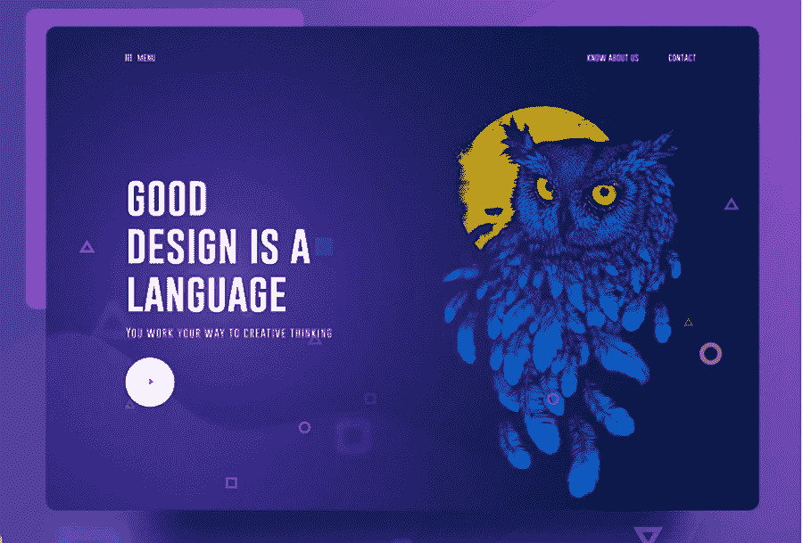

# 2018 年移动应用的 9 大 UI 设计趋势

> 原文：<https://medium.com/hackernoon/top-9-ui-design-trends-for-mobile-apps-in-2018-873cc405d5c2>

[移动应用程序用户界面设计](https://www.mockplus.com/blog/post/best-mobile-app-templates-on-android-and-ios/?r=cherry)趋势随着用户需求的变化而不断变化。然而，这并不意味着 2018 年**移动应用**的 UI 设计趋势无法预测。事实上，在仔细分析了过去几年的 UI 设计趋势和创新之后，我们可以找到一些背后的规律，并预测可能的趋势也将持续到接下来的 2018 年。因此，我们将在这里为您分享 2018 年移动应用程序的 9 大 UI 设计趋势:

# 1).重叠效应

字体、图形、颜色的重叠，不仅能让 UI 设计更加醒目、有特色，还能营造空间感。这也是为什么近年来不同移动应用程序 UI 设计元素的重叠被设计师广泛使用的原因。

而且在某些情况下，相同元素的重叠，结合阴影，也会让整个手机 app 界面设计更加奇幻，令人印象深刻。

因此，[移动应用 UX 设计](https://www.mockplus.com/blog/post/app-ux-design-techniques/?r=cherry)中不同元素的重叠也将是 2018 年的一个趋势。

# 2).颜色渐变

在过去的几年里，越来越多的设计师在他们的设计作品中采用[颜色渐变](https://www.mockplus.com/blog/post/how-to-use-color-in-ui-design/?r=cherry)，当他们试图为移动应用程序界面设计标志、按钮和背景时。为什么？答案很简单。即使你已经选择了单一的颜色，你也可以在结合颜色渐变和不同图形的同时，表现出丰富的层次感，绘制出美丽的画面。

因此，颜色渐变不仅会在整个 2017 年流行，而且会在 2018 年继续流行。

# 3).不透明

调整或设置透明度后，相同的组件可能会有不同的效果。因此，在设计手机应用程序界面时，设置不同组件的不透明度是一个很好的设计作品的方式。

此外，不同颜色或图形的透明度设置也可以为 app 界面组件创建多彩的玻璃纹理。这也是为什么设计师将这种方法广泛应用到手机应用程序的标志设计中。

总的来说，无论你如何将不透明效果添加到移动应用程序的 UI 设计作品中，设置不同组件的透明度在接下来的一年肯定会越来越受欢迎。

# 4).简单的曲线和几何图形

相比复杂多变的 UI 设计风格，越来越多的设计师在手机 app UI 设计中采用了更简单自然的设计风格。例如，与覆盖有各种颜色、图形、按钮、图片、动画和更复杂元素的手机应用程序界面相比，具有简单曲线、几何图形和按钮的手机界面可以更有效地让人们专注于手机应用程序的主要功能和特性。

因此，这种方式也将成为 2018 年的趋势。

# 5).强烈的颜色或字体对比，可读性更好

强烈的颜色或字体对比也可以帮助设计师设计出优秀的用户界面来吸引用户的注意力。例如，添加不同风格、类型、大小或顺序的字体也可以传递层次感和空间感。不同类型和风格的颜色也能形成鲜明的对比，使整个设计更加丰富多彩，引人注目。

# 6).自定义插图界面

2017 年，自定义插图在移动应用程序 UI 设计中也发挥着重要作用，也必将在 2018 年受到欢迎。具有不同风格插图的移动应用程序界面，如手绘、简单风格、剪纸风格和著名绘画风格插图，不仅可以使应用程序更加有趣和有特色，还可以赋予移动应用程序个性，并使其给应用程序用户留下更深刻的印象。

# 7).功能动画和互动

向移动 UI 界面的图标、字体、照片和按钮添加动画或交互总是会对应用程序用户产生积极影响，并给用户带来更愉快的体验。而这一趋势也将在接下来的 2018 年延续。

而且值得关注的是，丹·萨弗(Dan Saffer)首创并极力推荐的[微互动](https://www.mockplus.com/blog/post/micro-interaction-design/?r=cherry)，也将在即将到来的 2018 年被设计师们不断开发和使用。

[微交互](https://www.mockplus.com/blog/post/micro-interaction-design/?r=cherry)，意思是为手机 app 界面的一些细节增加更多的交互设计，让用户可以方便地与 app 交流，也可以很快得到反馈。这绝对是一个好的趋势，设计师应该遵循它来完成他们的移动应用程序 UI 设计。

# 8).声控界面

手机应用的声控界面简化了用户的操作。就像使用 Siri 一样，你可以通过语音命令轻松启动或登录语音激活的移动应用，而不是点击任何按钮或输入任何密码。此外，在 2017 年，大多数具有语音订购服务的移动应用程序也最终成为互联网上最受欢迎的应用程序。因此，语音激活的移动应用程序也将在 2018 年继续流行。

当然，除了语音激活界面，指纹激活界面将在未来的移动应用程序界面设计中发挥重要作用。

# 9).混合不同的趋势也将是 2018 年的一个趋势

在实际的设计案例中，设计师不会只使用上面提到的一种方法来完成他们的 app UI 设计。相反，他们往往会采用两种、三种或更多的方法，如重叠效果、颜色渐变、功能动画和颜色对比等，以获得更好的和意想不到的效果。

因此，混合移动应用程序 UI 设计的不同趋势也将是 2018 年的一个趋势。

# 包裹

**手机 app UI 设计**用户需求多复杂多变。因此，无论这些移动应用的 9 大 UI 设计趋势是否会在即将到来的 2018 年真正获得时代，作为一名 UI 设计师，你应该始终保持创新和创意，不断把握用户需求，并及时结合新的科技成果。然后，你就不难完成一个界面鲜明、用户体验良好的手机 app UI 设计了。

PS:如果你在创作 UI 设计时总是缺乏设计灵感，这里有 [9 个网站可以获取 UI 灵感](https://www.mockplus.com/blog/post/ui-inspiration/?r=cherry)！